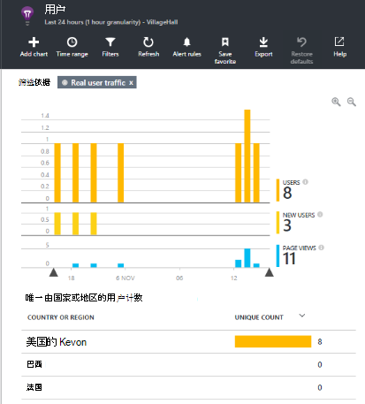

<properties 
    pageTitle="监视应用程序的见解与 SharePoint 网站" 
    description="开始监视新的应用程序，使用新的检测密钥" 
    services="application-insights" 
    documentationCenter=""
    authors="alancameronwills" 
    manager="douge"/>

<tags 
    ms.service="application-insights" 
    ms.workload="tbd" 
    ms.tgt_pltfrm="ibiza" 
    ms.devlang="na" 
    ms.topic="article" 
    ms.date="03/24/2016" 
    ms.author="awills"/>

# <a name="monitor-a-sharepoint-site-with-application-insights"></a>监视应用程序的见解与 SharePoint 网站


Visual Studio 应用程序理解监控可用性、 性能和应用程序的使用情况。 在此处，您将学习如何设置 SharePoint 网站。


## <a name="create-an-application-insights-resource"></a>创建应用程序的见解资源


在[Azure 门户](https://portal.azure.com)，创建新的应用程序理解资源。 作为应用程序类型，选择 ASP.NET。


打开刀片式服务器都将有关您的应用程序看到的性能和使用情况数据。 若要返回到它下次您登录到 Azure，您应该开始在屏幕上发现它平铺。 或者单击浏览进行查找。
    


## <a name="add-our-script-to-your-web-pages"></a>将脚本添加到您的 web 页

在快速启动获取 web 页的脚本︰


之前插入脚本&lt;头/&gt;想要跟踪的每一页的标记。 如果您的网站具有一个主页，您可以将脚本放那里。 例如，在 ASP.NET MVC 项目中，您将它置于 View\Shared\_Layout.cshtml

该脚本包含的检测项，将定向到您的应用程序理解资源的遥测数据。

### <a name="add-the-code-to-your-site-pages"></a>将代码添加到您的站点网页

#### <a name="on-the-master-page"></a>在母版页上

如果您可以编辑该网站的主页上，将提供监视站点中每一页。

签出该母版页和使用 SharePoint 设计器或任何其他编辑器编辑它。


添加代码之前</head>标记。 


#### <a name="or-on-individual-pages"></a>或在单个页面上

若要监视一组有限的页面，每个页面分别添加的脚本。 

插入 web 部件和嵌入的代码段。


## <a name="view-data-about-your-app"></a>查看有关您的应用程序的数据

重新部署您的应用程序。

返回到您应用程序刀片在[Azure 的门户](https://portal.azure.com)。

第一个事件将出现在搜索中。 


如果您期待更多的数据，请单击刷新后几秒钟。

从概述刀片式服务器，请单击**使用分析功能**来查看的用户、 会话和网页视图的图表︰


单击任何图表以查看更多详细信息-例如网页视图︰


或者用户︰





## <a name="capturing-user-id"></a>捕获用户 Id


标准的网页代码段不能捕获用户 id 从 SharePoint，但能做的小修改。


1. 从下拉列表中应用程序的见解精要复制您的应用程序检测项。 


    

2. 下面的代码段中代替 XXXX 检测键。 
3. 而不是代码段可以从门户网站的 SharePoint 应用程序中嵌入脚本。


```


<SharePoint:ScriptLink ID="ScriptLink1" name="SP.js" runat="server" localizable="false" loadafterui="true" /> 
<SharePoint:ScriptLink ID="ScriptLink2" name="SP.UserProfiles.js" runat="server" localizable="false" loadafterui="true" /> 
  
<script type="text/javascript"> 
var personProperties; 
  
// Ensure that the SP.UserProfiles.js file is loaded before the custom code runs. 
SP.SOD.executeOrDelayUntilScriptLoaded(getUserProperties, 'SP.UserProfiles.js'); 
  
function getUserProperties() { 
    // Get the current client context and PeopleManager instance. 
    var clientContext = new SP.ClientContext.get_current(); 
    var peopleManager = new SP.UserProfiles.PeopleManager(clientContext); 
     
    // Get user properties for the target user. 
    // To get the PersonProperties object for the current user, use the 
    // getMyProperties method. 
    
    personProperties = peopleManager.getMyProperties(); 
  
    // Load the PersonProperties object and send the request. 
    clientContext.load(personProperties); 
    clientContext.executeQueryAsync(onRequestSuccess, onRequestFail); 
} 
     
// This function runs if the executeQueryAsync call succeeds. 
function onRequestSuccess() { 
var appInsights=window.appInsights||function(config){
function s(config){t[config]=function(){var i=arguments;t.queue.push(function(){t[config].apply(t,i)})}}var t={config:config},r=document,f=window,e="script",o=r.createElement(e),i,u;for(o.src=config.url||"//az416426.vo.msecnd.net/scripts/a/ai.0.js",r.getElementsByTagName(e)[0].parentNode.appendChild(o),t.cookie=r.cookie,t.queue=[],i=["Event","Exception","Metric","PageView","Trace"];i.length;)s("track"+i.pop());return config.disableExceptionTracking||(i="onerror",s("_"+i),u=f[i],f[i]=function(config,r,f,e,o){var s=u&&u(config,r,f,e,o);return s!==!0&&t["_"+i](config,r,f,e,o),s}),t
    }({
        instrumentationKey:"XXXX"
    });
    window.appInsights=appInsights;
    appInsights.trackPageView(document.title,window.location.href, {User: personProperties.get_displayName()});
} 
  
// This function runs if the executeQueryAsync call fails. 
function onRequestFail(sender, args) { 
} 
</script> 


```


## <a name="next-steps"></a>下一步行动

* [Web 测试](app-insights-monitor-web-app-availability.md)，以监视站点的可用性。

* 对于其他类型的应用程序的[应用程序的见解](app-insights-overview.md)。


<!--Link references-->


 