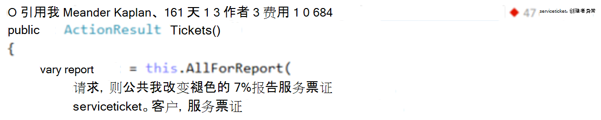
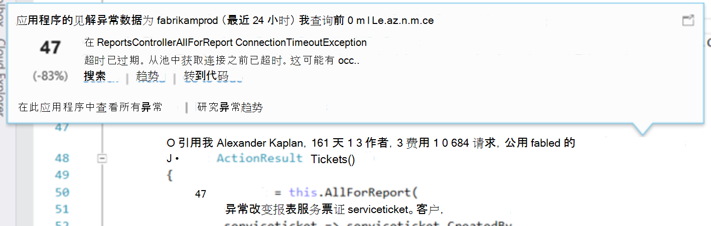
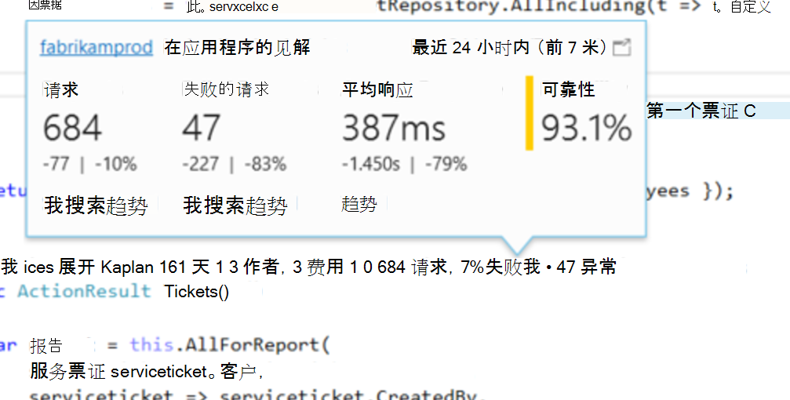
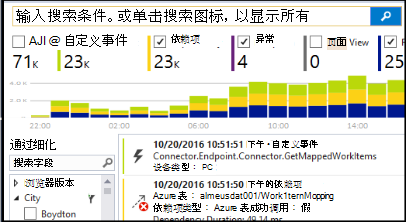
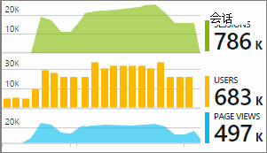

<properties 
    pageTitle="在 Visual Studio 的 CodeLens 应用程序的见解遥测 |Microsoft Azure" 
    description="快速访问您应用程序的见解请求和异常遥测与在 Visual Studio 中的 CodeLens。" 
    services="application-insights" 
    documentationCenter=".net"
    authors="numberbycolors" 
    manager="douge"/>

<tags 
    ms.service="application-insights" 
    ms.workload="tbd" 
    ms.tgt_pltfrm="ibiza" 
    ms.devlang="na" 
    ms.topic="get-started-article" 
    ms.date="08/30/2016" 
    ms.author="daviste"/>
    
# 在 Visual Studio 的 CodeLens 应用程序的见解遥测

Web 应用程序代码中的方法可以使用运行时异常有关遥测批注并请求的响应时间。 如果您在您的应用程序安装[Visual Studio 应用程序见解](app-insights-overview.md)，遥测出现在 Visual Studio 的[CodeLens](https://msdn.microsoft.com/library/dn269218.aspx) -顶部的位置您习惯于看到引用有用信息如位数函数的每个函数或对其进行编辑的最后一人的注释。

> [AZURE.NOTE] 在 CodeLens 中的应用程序理解是 Visual Studio 2015年更新 3 中提供和更新版本，或与最新版本的[开发分析工具扩展](https://visualstudiogallery.msdn.microsoft.com/82367b81-3f97-4de1-bbf1-eaf52ddc635a)。 CodeLens 是在 Visual Studio 的企业和专业版中可用。

## 在哪里可以找到应用程序理解数据

查找应用程序的见解遥测中的 web 应用程序的公用请求方法的 CodeLens 指标。 CodeLens 指标上述方法和 C# 和 Visual Basic 代码中的其他声明。 如果应用程序理解数据的方法可用，您将看到请求和异常如"100 请求，1%失败"10 例外。"指示符 单击 CodeLens 标记，有关更多详细信息。 

> [AZURE.TIP] 应用程序的见解请求和异常指标可能需要额外的几秒钟加载后出现其他 CodeLens 指示。

## CodeLens 中的异常

异常 CodeLens 指示器显示的数目从 15 个最常出现在应用程序中处理该请求提供服务的方法时，该期间的例外情况在过去 24 小时内发生的异常。

若要查看更多详细信息，请单击异常 CodeLens 指示器︰

* 相对于之前的 24 小时在最近 24 小时内从例外项的数目变化百分比
* 选择**转至代码**以导航到引发异常的函数的源代码
* 选择**搜索**查询此异常在过去 24 小时内发生的所有实例
* 选择**趋势**以查看此异常在过去 24 小时内出现趋势可视化效果
* 选择**查看此应用程序中的所有异常**来查询已在过去 24 小时内发生的所有异常
* 选择**浏览异常趋势**来查看趋势可视化效果在过去 24 小时内发生的所有异常。 

> [AZURE.TIP] 如果您在 CodeLens 中看到"0 异常"，但您知道应该有一些例外情况，请进行检查以确保在 CodeLens 中选择相应的应用程序理解资源。 若要选择另一个资源，您的项目在解决方案资源管理器中右键单击，然后选择**应用程序的见解 > 选择遥测源**。 CodeLens 只能显示 15 个大多数经常出现异常在过去的 24 小时，因此，如果异常频率最高是第 16 位或更少的应用程序中，您将看到"0 例外。" 从 ASP.NET 视图例外不会生成这些视图的控制器方法。

> [AZURE.TIP] 如果您看到"？ 需要与 Visual Studio Azure 帐户例外"在 CodeLens 中的，或已过期的 Azure 帐户凭据。 在任一情况下，单击"？ 异常"并选择**添加帐户...**以输入您的凭据。

## CodeLens 中的请求

请求 CodeLens 指示器显示的 HTTP 请求的数量已经在过去的 24 小时内，再加上那些失败的请求百分比的方法提供服务。

若要查看更多详细信息，请单击请求 CodeLens 指示器︰

* 请求数量、 失败的请求和平均响应时间以在过去 24 小时，相较于之前的 24 小时内绝对超链接和百分比变化
* 在过去 24 小时内没有不失败的请求百分比计算方法的可靠性
* 选择**搜索**的请求或请求查询所有在过去 24 小时内发生的 （失败） 请求失败
* 选择以在过去 24 小时内查看趋势可视化项请求、 请求失败或平均响应时间的**趋势**。
* 在左上角的 CodeLens 的详细信息视图的更改哪些资源是为 CodeLens 的数据源中选择的见解应用程序资源的名称。

## 下一步行动

||
|---|---
|**[使用应用程序在 Visual Studio 中的见解](app-insights-visual-studio.md)** 搜索遥测、 CodeLens 中, 查看的数据和配置应用程序的见解。 在 Visual Studio。 |
|**[添加更多数据](app-insights-asp-net-more.md)** 监视使用情况、 可用性、 依赖项、 异常。 将跟踪日志记录框架的集成。 编写自定义的遥测。 | 
|**[使用应用程序的见解门户](app-insights-dashboards.md)** 仪表板，功能强大的诊断和分析工具，通知，您的应用程序和遥测实时的依赖关系图导出。 |
