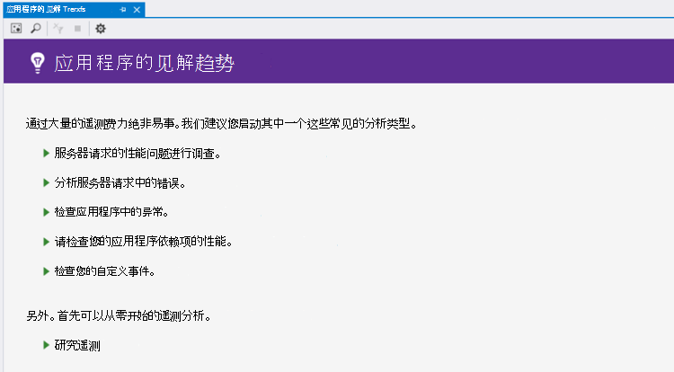
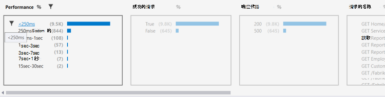
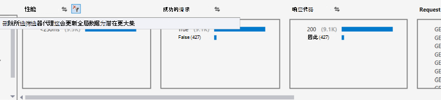
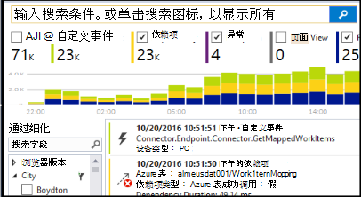
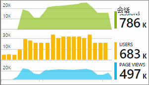

<properties 
    pageTitle="在 Visual Studio 中的趋势分析 |Microsoft Azure" 
    description="分析、 直观显示和浏览您应用程序的见解遥测在 Visual Studio 中的趋势。" 
    services="application-insights" 
    documentationCenter=".net"
    authors="numberbycolors" 
    manager="douge"/>

<tags 
    ms.service="application-insights" 
    ms.workload="tbd" 
    ms.tgt_pltfrm="ibiza" 
    ms.devlang="na" 
    ms.topic="get-started-article" 
    ms.date="10/25/2016" 
    ms.author="daviste"/>
    
# 分析在 Visual Studio 中的趋势

该应用程序的见解趋势工具形象如何应用程序重要的遥测事件随时间变化，帮助您快速确定问题和异常情况。 通过将您链接到更详细的诊断信息，趋势可以帮助您提高您的应用程序性能、 跟踪原因的异常，并发现从您的自定义事件的见解。

> [AZURE.NOTE] 应用程序的见解趋势是在 Visual Studio 2015年更新 3 和更高版本，或与[开发分析工具扩展](https://visualstudiogallery.msdn.microsoft.com/82367b81-3f97-4de1-bbf1-eaf52ddc635a)版本 5.209 或更高版本。

## 打开应用程序的见解趋势

若要打开应用程序的见解趋势窗口︰

* 应用程序的见解工具栏按钮，然后选择**研究遥测趋势**，或
* 从项目上下文菜单中选择**应用程序的见解 > 浏览遥测趋势**，或
* 从 Visual Studio 菜单栏中，选择**视图 > 其他窗口 > 应用程序见解趋势**。

您可能会看到提示选择一个资源。 单击**选择资源**，登录 Azure 的预订，然后从要分析遥测趋势列表中选择应用程序理解资源。

## 选择趋势分析

开始通过选择五种常见的趋势分析，过去 24 小时内从每个分析数据之一︰

* **调查性能问题与您的服务器的请求**对您的服务请求的响应时间分组
* **服务器请求中的分析错误**的对您的服务请求的 HTTP 响应代码分组
* **检查应用程序中的异常**的异常从您的服务，按异常类型分组
* **检查应用程序的依赖项的性能**-由您的服务调用的服务响应时间的分组
* **检查您的自定义事件**的自定义事件设置了您的服务，按事件类型分组。

这些预构建的分析以后从左上角的趋势窗口**查看常见的遥测分析**按钮不可用。

## 直观地显示在您的应用程序中的趋势

应用程序的见解趋势从您的应用程序的遥测创建时间系列可视化效果。 每个时间系列可视化显示遥测，经过一些时间范围由该遥测，一个属性进行分组的一种。 例如，您可能要查看服务器请求，它们产生的最后的 24 小时内各国分组。 在此示例中，每个气泡图上可视化将在一个小时内表示对某些国家/地区的服务器请求的计数。

使用窗口顶部的控件调整查看哪些类型的遥测。 首先，选择您感兴趣的遥测类型︰

* **遥测类型**-服务器请求、 异常、 depdendencies，或自定义事件
* **时间范围内**的任意位置从过去的 3 天内到最后的 30 分钟内
* **Group By** -异常类型、 问题 ID、 国家/地区和更多。

然后，单击**分析遥测**运行查询。

在可视化效果中的气泡之间导航︰

* 单击以选择气泡图底部的窗口中，汇总只在特定的时间段内发生的事件的筛选器更新
* 双击以导航到搜索工具并查看所有个别遥测事件发生在该时间段内的气泡
* 按住 Ctrl 键单击气泡以取消选择它在可视化效果中。

> [AZURE.TIP] 趋势和搜索工具协同工作以帮助您查明之间成千上万的遥测事件服务中的问题的原因。 例如，如果您的客户请注意您的应用程序的一天下午正在响应能力，开始与趋势。 请求对您的服务在过去的几个小时，按响应时间分组进行分析。 查看是否有超大的慢速请求的群集。 然后双击该气泡进入搜索工具，对这些请求事件筛选。 从搜索中，可以浏览这些请求的内容并定位到要解决该问题所涉及的代码。

## 筛选器

了解更多特定趋势与筛选器控件窗口的底部。 若要应用筛选器，请单击其名称。 您可以快速切换之间不同的筛选器，以发现可能隐藏在您遥测某个特定维度的趋势。 如果在一个维度中，类似的异常类型的筛选器将应用其它维度中的筛选器保持可点击，即使他们看起来灰显。 取消-应用一个筛选器，请再次单击它。 按住 Ctrl 键单击要选择同一维度中的多个筛选器。

如果您要应用多个筛选器？ 

1. 将应用第一个筛选器。 
2. 第一个筛选器的维度的名称，请单击**应用所选的筛选器并再次查询**按钮。 这将重新查询您遥测数据只与第一个筛选器匹配的事件。 
3. 应用第二个筛选器。 
4. 重复此过程以查找在您遥测的特定子集的趋势。 例如，服务器请求命名为"获取家庭/索引" _，_来自德国_和_接收 500 响应代码。 

取消-应用这些筛选器之一，请单击维度**中删除选定的筛选器并再次查询**按钮。

## 发现异常现象

该趋势工具可以突出显示事件的反常与同一时间系列中的其它气泡的泡沫。 在视图类型下拉列表中选择**中的计数时间桶 （突出显示异常）**或**百分比中的时间桶 （突出显示异常）**。 红色的气泡是反常的。 异常情况定义为气泡与计数/百分比超过 2.1 倍标准偏差计数/百分比在过去发生的两个时间段 （如果您正在查看的最后 24 个小时，等 48 小时。）。

> [AZURE.TIP] 突出显示异常的时序的小气泡，否则可能看上去在寻找离群值非常有用同样大小。  

## 下一步行动

||
|---|---
|**[使用应用程序在 Visual Studio 中的见解](app-insights-visual-studio.md)** 搜索遥测、 CodeLens 中, 查看的数据和配置应用程序的见解。 在 Visual Studio。 |
|**[添加更多数据](app-insights-asp-net-more.md)** 监视使用情况、 可用性、 依赖项、 异常。 将跟踪日志记录框架的集成。 编写自定义的遥测。 | 
|**[使用应用程序的见解门户](app-insights-dashboards.md)** 仪表板，功能强大的诊断和分析工具，通知，您的应用程序和遥测实时的依赖关系图导出。 |
