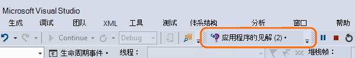
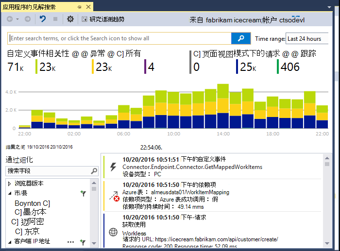
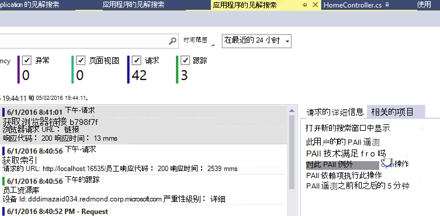
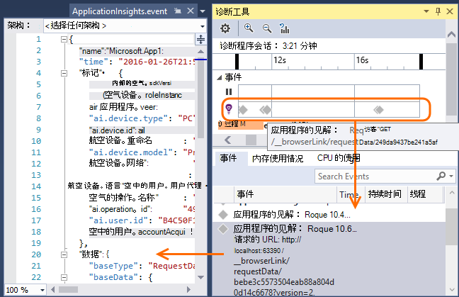
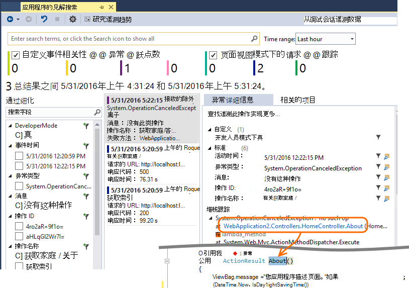
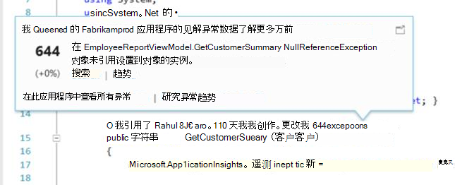

<properties 
    pageTitle="使用 Visual Studio 应用程序深入" 
    description="性能分析和诊断过程中调试并投入生产。" 
    services="application-insights" 
    documentationCenter=".net"
    authors="alancameronwills" 
    manager="douge"/>

<tags 
    ms.service="application-insights" 
    ms.workload="tbd" 
    ms.tgt_pltfrm="ibiza" 
    ms.devlang="na" 
    ms.topic="get-started-article" 
    ms.date="06/21/2016" 
    ms.author="awills"/>

# 使用应用程序在 Visual Studio 中的见解

在 Visual Studio （2015年及更高版本），可以分析性能和诊断问题进行调试和在生产中，使用从[Visual Studio 应用程序理解](app-insights-overview.md)的遥测。

如果您还没有[在您的应用程序中的已安装应用程序见解](app-insights-asp-net.md)，现在就做。

## 调试项目

F5 以运行应用程序并尝试一下︰ 打开不同的页面来生成某些遥测。

在 Visual Studio 中，您将看到已记录的事件数。

单击此按钮可打开诊断搜索。 

## 诊断搜索

搜索窗口显示已记录的事件。 （如果您登录到 Azure 设置应用程序的见解时，您可以在门户网站中搜索相同的事件。）

自由文本搜索事件中的任何字段的工作方式。 例如，搜索页的 URL 的一部分或客户端城市; 如属性的值或在跟踪日志中的特定文字。

单击要查看其详细的属性的任何事件。

您还可以打开相关项选项卡来帮助诊断失败的请求或异常。

## 诊断中心

诊断中心 （Visual Studio 2015年或更高版本） 显示它生成的应用程序理解服务器遥测。 即使您选择只安装 SDK，而无需将其连接到 Azure 的门户网站中的资源，这有效。

## 例外情况

如果可以[设置监视异常](app-insights-asp-net-exceptions.md)，异常报表将显示在搜索窗口中。 

单击以获取堆栈跟踪的异常。 如果在 Visual Studio 中打开该应用程序的代码，您可以单击通过从堆栈跟踪到相关的代码行。

此外，在上述每个方法的代码镜头行，您将看到在过去的 24 小时记录的应用程序理解的例外情况次数。

## 本地监控

（从 Visual Studio 2015年更新 2）如果您还没有配置 SDK （以便在 ApplicationInsights.config 中没有没有检测键） 将遥测发送到应用程序的见解门户诊断程序窗口将显示从最新的调试会话的遥测。 

这是可取的如果已发布您的应用程序的早期版本。 您不希望从您的调试会话来从已发布的应用程序应用程序信息门户上遥测与混的遥测。

如果您有您想要调试发送遥测到门户网站之前某些[自定义遥测](app-insights-api-custom-events-metrics.md)，则也可以有用。

* *首先，我完全可以配置应用程序发送到门户的遥测的见解。但现在我想要查看仅在 Visual Studio 中的遥测数据。*

 * 在搜索窗口设置，就可以搜索本地诊断程序，即使您的应用程序发送到门户的遥测。
 * 若要停止正在发送到门户的遥测，注释掉行`<instrumentationkey>...`ApplicationInsights.config 中。 当您准备再次发送到门户的遥测时，请取消注释。

## 趋势

趋势是直观显示您的应用程序随着时间的推移的行为方式的工具。 

从应用程序的见解工具栏按钮或见解搜索应用程序窗口中选择**探索遥测趋势**。 请选择一个入门的五种常见查询。 您可以分析不同数据集基于遥测类型、 时间范围以及其他属性。 

来发现数据中的异常，请选择"视图类型"下拉列表下的异常选项之一。 在窗口的底部的筛选选项使得容易关注您遥测的特定子集。

[有关详细的趋势信息](app-insights-visual-studio-trends.md)。

## 下一步是什么？

||
|---|---
|**[添加更多数据](app-insights-asp-net-more.md)** 监视使用情况、 可用性、 依赖项、 异常。 将跟踪日志记录框架的集成。 编写自定义的遥测。 | 
|**[使用应用程序的见解门户](app-insights-dashboards.md)** 仪表板，功能强大的诊断和分析工具，通知，您的应用程序和遥测实时的依赖关系图导出。 |

 
