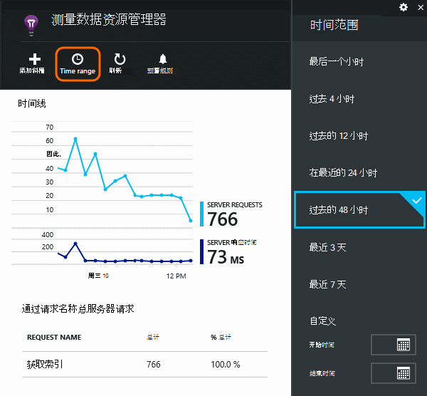
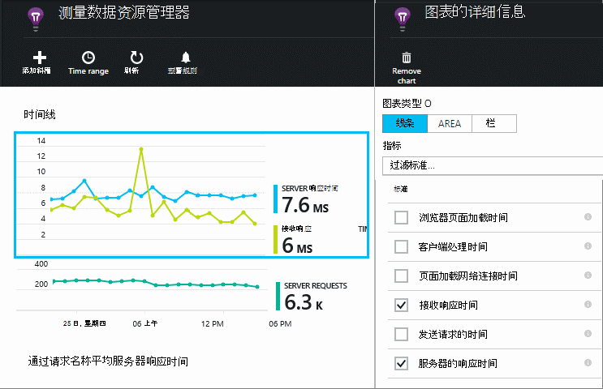
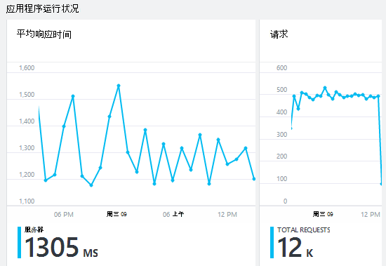
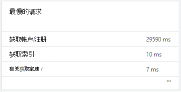
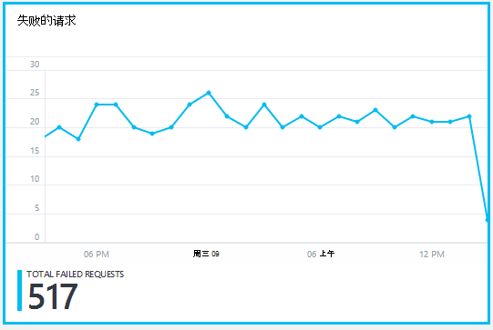
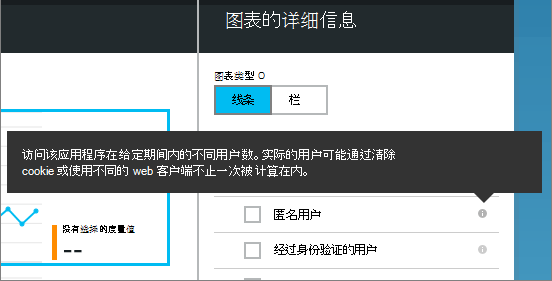
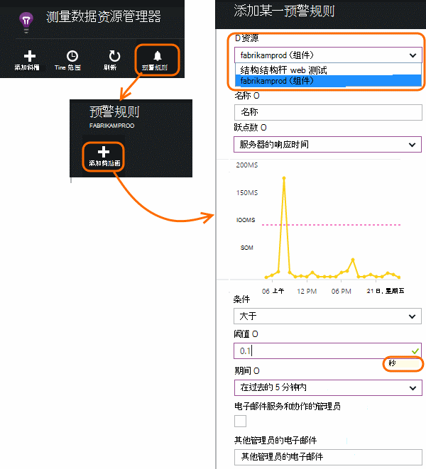

<properties 
    pageTitle="监视应用程序的运行状况和使用应用程序的见解" 
    description="开始使用应用程序的见解。 分析使用情况、 可用性和内部部署或 Microsoft Azure 应用程序的性能。" 
    services="application-insights" 
    documentationCenter=""
    authors="alancameronwills" 
    manager="douge"/>

<tags 
    ms.service="application-insights" 
    ms.workload="tbd" 
    ms.tgt_pltfrm="ibiza" 
    ms.devlang="na" 
    ms.topic="article" 
    ms.date="11/25/2015" 
    ms.author="awills"/>
 
# 在 web 应用程序的监视性能

*在预览是应用程序的见解。*

请确保您的应用程序的执行，并找出快速的任何故障。 [应用程序的见解][start]将告诉您有关的任何性能问题和异常，并帮助您查找和诊断根本原因。

Java 和 ASP.NET web 应用程序和服务，WCF 服务可以监视应用程序的见解。 它们可以是托管后端，虚拟机，或作为 Microsoft Azure 网站。 

在客户端，应用程序的见解可以从 web 页和各种设备，包括 iOS，Android 和 Windows 应用商店应用程序的遥测。

## 设置性能监视

如果您没有添加应用程序深入到您的项目 （即，如果没有 ApplicationInsights.config），选择以下任一方面着手︰

* [ASP.NET web 应用程序](app-insights-asp-net.md)
 * [添加异常监视](app-insights-asp-net-exceptions.md)
 * [添加依赖项监视](app-insights-monitor-performance-live-website-now.md)
* [J2EE web 应用程序](app-insights-java-get-started.md)
 * [添加依赖项监视](app-insights-java-agent.md)

## 探索的性能指标

在[Azure 的门户网站](https://portal.azure.com)，浏览到您为您的应用程序设置的应用程序理解资源。 概述刀片式服务器显示基本性能数据︰

单击以查看更多详细信息，并查看结果更长一段的任何图表。 例如，单击请求拼贴，然后选择时间范围︰

单击图表以选择其显示，或添加一个新图表并选择其度量标准的指标︰

> [AZURE.NOTE] **取消选中所有度量值**以查看可用的完整内容。 指标分为组;当选中组中的任何成员时，只有其他组的成员，就会出现。

## 什么？ 它究竟意味着 性能拼贴和报告

有了大量可以获得的性能指标。 让我们启动与刀片式服务器应用程序在默认情况下显示。

### 请求

在指定的时间接收到的 HTTP 请求的数量。 与其他报告以查看您的应用程序负载的行为方式上的结果进行比较，各不相同。

HTTP 请求包含所有的 GET 或 POST 请求的页、 数据和图像。

单击该图块可以获得特定 Url 的计数。

### 平均响应时间

输入您的应用程序和要返回的响应的 web 请求之间的时间间隔来衡量。

这些点显示移动平均。 如果有大量的请求，有可能是一些无明显峰值平均偏差或 dip 的关系图中。

寻找不寻常的高峰期。 一般情况下，预计上升与高峰值在请求的响应时间。 如果上升过多，您的应用程序可能会碰到资源限制如 CPU 或使用的服务的容量。

单击该图块可以获得特定 Url 的时间。

### 最慢的请求

显示哪些请求可能需要性能调优。

### 失败的请求

请求，引发未捕获的异常数。

单击方块查看特定故障的详细信息，然后选择要查看其详细信息的单个请求。 

代表性样本的失败仍然保留单独检查。

### 其他指标

若要查看其他指标可以显示，请单击关系图，然后取消选择所有指标以查看完整的可用的设置。 单击 (i) 若要查看每个指标的定义。

选择任何指标，将禁用其他不能出现在同一个图表。

## 设置警报

通知电子邮件的任何指标的异常值，添加通知。 您可以选择将电子邮件发送给帐户管理员或特定的电子邮件地址。

设置其他属性之前的资源。 如果想要性能和使用情况指标设置警报，则不要选择 web 测试资源。

请注意，您需要输入的临界值的单位。

*我看不到添加通知按钮。* -这是一组对其具有只读访问权限的帐户吗？ 请与帐户管理员联系。

## 诊断问题

下面是用于查找和诊断性能问题的一些提示︰

* 设置[web 测试][availability]如果您的 web 站点出现故障或不正确的或速度缓慢的响应通知。 
* 比较与其他指标故障或响应较慢问题相关加载请求计数。
* [插入和搜索跟踪语句][diagnostic]在您的代码以帮助查明问题。

## 下一步行动

[Web 测试][ availability] -web 请求发送到您的应用程序，以定期间隔从世界各地。

[捕获并搜索诊断跟踪][ diagnostic] -插入跟踪调用和筛查结果，以查明问题。

[使用情况跟踪][ usage] -了解人们如何使用您的应用程序。

[故障排除][ qna] -和常见问题解答

## 视频

[AZURE.VIDEO performance-monitoring-application-insights]

<!--Link references-->

[availability]: app-insights-monitor-web-app-availability.md
[diagnostic]: app-insights-diagnostic-search.md
[greenbrown]: app-insights-asp-net.md
[qna]: app-insights-troubleshoot-faq.md
[redfield]: app-insights-monitor-performance-live-website-now.md
[start]: app-insights-overview.md
[usage]: app-insights-web-track-usage.md

 
