<properties 
    pageTitle="Web 应用程序与应用程序的见解的使用率分析" 
    description="Web 应用程序与应用程序的见解的使用率分析的概述" 
    services="application-insights" 
    documentationCenter=""
    authors="alancameronwills" 
    manager="douge"/>

<tags 
    ms.service="application-insights" 
    ms.workload="tbd" 
    ms.tgt_pltfrm="ibiza" 
    ms.devlang="na" 
    ms.topic="article" 
    ms.date="06/12/2016" 
    ms.author="awills"/>
 
# <a name="usage-analysis-for-web-applications-with-application-insights"></a>Web 应用程序与应用程序的见解的使用率分析

知道人们如何使用您的应用程序允许您开发重点，最重要的方案，并深入了解他们发现更容易或更难实现的目标。 

Visual Studio 应用程序见解提供了两个级别的使用情况跟踪︰

* **用户、 会话和页面查看数据**的提供开箱即用。  
* **自定义遥测**-您[编写的代码][api]跟踪您的用户通过您的应用程序的用户体验。 

## <a name="setting-up"></a>设置

在[Azure 门户](https://portal.azure.com)打开应用程序理解资源单击空的浏览器页面加载图表，请按照安装说明进行操作。

[了解更多信息](app-insights-javascript.md) 


## <a name="how-popular-is-my-web-application"></a>欢迎程度是我的 web 应用程序？

登录到[Azure 的门户网站][portal]，浏览到您应用程序的资源，然后单击使用情况︰

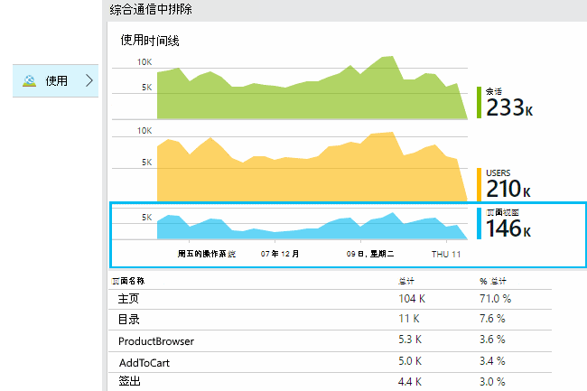

* **用户︰**图表的时间范围的不同活动用户数。 
* **会话︰**活动会话的计数
* **网页视图**对 trackPageView()，通常在每个网页上一次调用的调用进行计数。

单击以查看更多详细信息的图表。 请注意，您可以更改图表的时间范围。

### <a name="where-do-my-users-live"></a>我的用户居住在什么位置？

从使用刀片式服务器，请单击用户图表的详细信息，请参阅︰

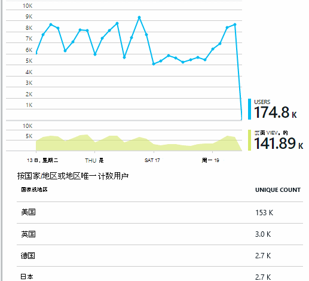
 
### <a name="what-browsers-or-operating-systems-do-they-use"></a>他们使用何种浏览器或操作系统？

按属性如浏览器、 操作系统或城市的数据进行分组 （段）︰

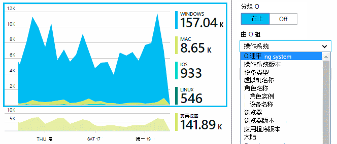


## <a name="sessions"></a>会话

会话是应用程序的深入见解，努力相关联的每个遥测事件-例如请求、 页面视图、 异常或自定义事件您代码您自己的特定用户会话中的基本概念。 

丰富的上下文信息，需要收集每个会话，如设备特征、 地理位置、 操作系统等。

如果检测客户端和服务器 ([ASP.NET] [greenbrown]或[J2EE][java])、 Sdk 将传播客户端与服务器之间的会话 id，以便可以将两侧的事件关联起来。

当[诊断问题][diagnostic]，您可以找到所有与会话中出现问题，包括所有的请求，以及任何事件，异常或已记录的跟踪相关的遥测数据。

会话提供良好如设备、 操作系统或位置的上下文中的受欢迎程度的措施。 通过显示按照设备的会话数，例如，可以更准确的频率该设备用于您的应用程序，比通过盘点网页视图计数。 这是问题的一个非常有用的输入要会审的任何特定于设备。


#### <a name="whats-a-session"></a>什么是会话？

会话表示单个用户和应用程序之间遇到。 最简单的形式中会话与用户启动该应用程序将启动并完成用户离开应用程序时。 对于 web 应用程序，默认情况下，会话将终止 30 分钟，或后 24 小时的活动。 

通过编辑的代码段，您可以修改这些默认值︰

    <script type="text/javascript">
        var appInsights= ... { ... }({
            instrumentationKey: "...",
            sessionRenewalMs: 3600000,
            sessionExpirationMs: 172800000
        });

* `sessionRenewalMs`︰ 以毫秒为单位，过期会话由于用户的非活动时间时间。 默认︰ 30 分钟。
* `sessionExpirationMs`: 最大的会话长度 （以毫秒为单位）。 如果在此时间之后，用户将保持活动状态，计另一会话。 默认值︰ 24 小时。

**会话持续时间**是一个[规格，] [ metrics] ，用于记录之间的会话的第一个和最后一个遥测项目的时间范围。 （它并不包括超时）。

在特定的时间间隔中的**会话数**被指某些活动与此时间间隔内的唯一会话数。 当上周的看一个长的时间范围，例如每日会话数时，这是通常相当于的会话总数。 

但是，当研究如每小时颗粒较短的时间范围内，跨多个小时的长时间的会话将会话处于活动状态的每个小时计数。 

## <a name="users-and-user-counts"></a>用户和用户计数


每个用户会话都使用唯一的用户 id 相关联。 

默认情况下，通过放置一个 cookie 来标识用户。 使用多个浏览器或设备的用户将会不止一次计数。 （但请参见[身份验证的用户](#authenticated-users)）


在一定间隔的**用户计数**度量定义为唯一用户数与录制活动在此间隔内。 因此，具有长会话的用户可能考虑多次，以便颗粒小于一个小时左右，设置的时间范围。

**新用户**计算此时间间隔内发生的第一个会话的应用程序的用户。 如果使用 cookie 的用户计数的默认方法，那么这也将包括的用户谁已清除 cookie，或者谁正在使用新的设备或浏览器第一次访问您的应用程序。
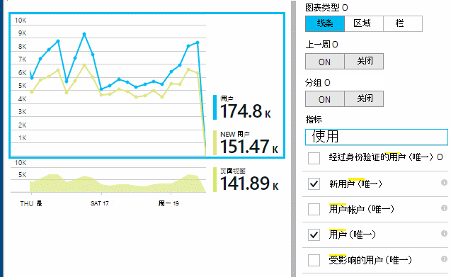

### <a name="authenticated-users"></a>经过身份验证的用户

如果您的 web 应用程序允许用户签入，您可以更准确计数提供唯一用户标识符的应用程序的见解。 它不必将他们的姓名或在您的应用程序中使用相同的 id。 只要您的应用程序确定用户后，使用以下代码︰


*在客户端 JavaScript*

      appInsights.setAuthenticatedUserContext(userId);

如果您的应用程序将用户帐户，还可以传递该帐户的标识符。 

      appInsights.setAuthenticatedUserContext(userId, accountId);

用户和帐户 id 不能包含空格或字符`,;=|`


在[测量数据资源管理器](app-insights-metrics-explorer.md)，您可以创建**经过身份验证的用户**和**客户**的图表。 

## <a name="synthetic-traffic"></a>综合通信

综合通讯包括可用性和负载测试、 搜索引擎爬网程序和其他代理的请求。 

应用程序的见解尝试努力来自动确定和分类综合通信并将其适当地标记。 在大多数情况下，合成流量不调用 JavaScript SDK，，以便从用户和会话计算中排除此活动。 

但是，对于理解应用程序[的 web 测试][availability]、 用户 id 将自动设置基于 POP 位置和会话 id 基于测试运行 id 设置。 默认报告、 综合通信筛选后，默认情况下，将排除这些用户和会话。 但是，包括综合通信时，它可能会导致少量增加总体用户和会话计数。
 
## <a name="page-usage"></a>页使用情况

页上单击查看图表，以获取更放大版本与您最常用页的细目分类︰


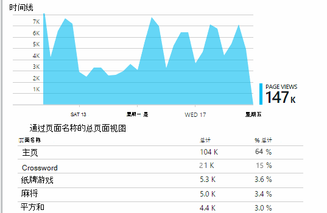
 
上面的例子中是从游戏网站。 从中我们可以立即看到:

* 在过去一周中，并不能提高使用率。 也许我们应该考虑搜索引擎优化？
* 许多较少人看到游戏页面，而不是主页。 为什么我们的主页上不吸引人玩游戏
* Crossword 是最受欢迎的游戏。 我们应该会优先考虑新的想法和那里改进。

## <a name="custom-tracking"></a>自定义跟踪

让我们假设，而不是在单独的 web 页中实现每个游戏，决定对其进行重构到相同的单页面应用程序中，所有与大多数 web 页中的编码与 Javascript 功能。 这使用户可以快速切换之间一场比赛，另一台，或者甚至在一个页面上有几个游戏。 

但您仍希望应用程序理解以便登录的次数每个游戏，以打开与相同的方式当在单独的 web 页上一样。 这很简单︰ 只需插入您要打开新的页面的记录的 JavaScript 遥测模块调用︰

    appInsights.trackPageView(game.Name);

## <a name="custom-events"></a>自定义事件

编写自定义的遥测记录特定事件。 尤其是在单页面应用程序中，您需要知道用户执行特定操作或实现某些目标的频率︰ 

    appInsights.trackEvent("GameEnd");

例如，登录点击的链接︰

    <a href="target.htm" onclick="appInsights.trackEvent('linkClick');return true;">my link</a>


## <a name="view-counts-of-custom-events"></a>视图的自定义事件计数

打开标准资源管理器并添加一个图表，以显示事件。 按名称分类︰


## <a name="drill-into-specific-events"></a>深入到特定事件

若要更好地理解典型的会话会如何，可能要专注于特定的用户会话，其中包含特定类型的事件。 

在此示例中，我们编写代码"NoGame"，如果在用户注销而不实际启动游戏，则调用一个自定义事件。 为什么用户会做的？ 也许如果我们深入到某些特定的事件，我们将得到一条线索。 

从应用程序接收到的自定义事件概述刀片式服务器上的名称列出︰


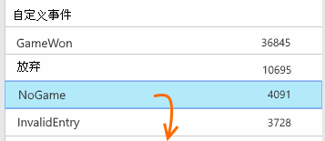
 
单击通过自己感兴趣的事件并选择新的特定事件︰


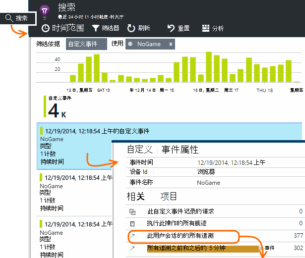
 
让我们看一下所有的遥测数据为该特定的 NoGame 事件发生的会话。 


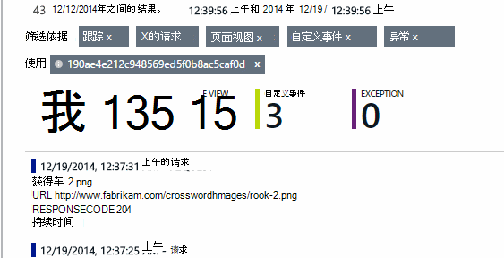
 
没有无例外，因此并禁止该用户播放一些故障。
 
我们可以筛选出所有类型的网页视图以外的遥测此会话︰


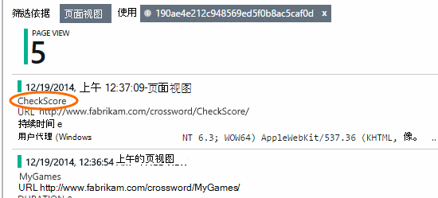
 
然后，现在我们可以看到，此用户记录只是为了检查最新的成绩。 也许我们应该考虑开发容易地做到这一点的用户情景。 （和此特定情景中出现时，我们应实现报告自定义事件）。

## <a name="filter-search-and-segment-your-data-with-properties"></a>筛选、 搜索和分类属性数据
您可以将任意标记和数字值附加到事件。
 

*在客户端 JavaScript*

```JavaScript

    appInsights.trackEvent("WinGame",
        // String properties:
        {Game: currentGame.name, Difficulty: currentGame.difficulty},
        // Numeric measurements:
        {Score: currentGame.score, Opponents: currentGame.opponentCount}
    );
```

*C# 在服务器上*

```C#

    // Set up some properties:
    var properties = new Dictionary <string, string> 
        {{"game", currentGame.Name}, {"difficulty", currentGame.Difficulty}};
    var measurements = new Dictionary <string, double>
        {{"Score", currentGame.Score}, {"Opponents", currentGame.OpponentCount}};

    // Send the event:
    telemetry.TrackEvent("WinGame", properties, measurements);
```

*VB 在服务器*

```VB

    ' Set up some properties:
    Dim properties = New Dictionary (Of String, String)
    properties.Add("game", currentGame.Name)
    properties.Add("difficulty", currentGame.Difficulty)

    Dim measurements = New Dictionary (Of String, Double)
    measurements.Add("Score", currentGame.Score)
    measurements.Add("Opponents", currentGame.OpponentCount)

    ' Send the event:
    telemetry.TrackEvent("WinGame", properties, measurements)
```

将属性附加到网页视图中，以相同的方式︰

*在客户端 JavaScript*

```JS

    appInsights.trackPageView("Win", 
        url,
        {Game: currentGame.Name}, 
        {Score: currentGame.Score});
```

在诊断搜索中，通过单击事件的个别事件通过查看属性。


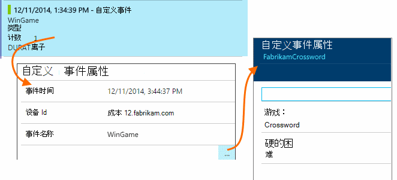
 
使用搜索字段来查看具有特定属性值的事件。


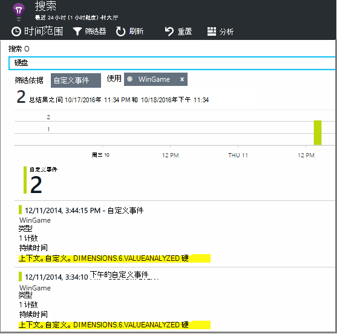


## <a name="a--b-testing"></a>A |B 测试

如果您不知道哪个特征的变量，该变量将会更成功，释放它们，让每个可访问其他用户。 衡量成功的每一个，然后再到统一的版本。

对于这种技术，将不同的标记附加到发送的每个版本的应用程序的所有遥测。 通过在活动 TelemetryContext 中定义属性，可以执行的。 这些默认属性将添加到每个遥测应用程序发送的消息-而不仅仅是您自定义的消息，但同样的标准遥测数据。 

在应用程序的见解门户中，然后可以为筛选器和组 （段） 上的标记，以比较不同版本的数据。

*C# 在服务器上*

```C#

    using Microsoft.ApplicationInsights.DataContracts;

    var context = new TelemetryContext();
    context.Properties["Game"] = currentGame.Name;
    var telemetry = new TelemetryClient(context);
    // Now all telemetry will automatically be sent with the context property:
    telemetry.TrackEvent("WinGame");
```

*VB 在服务器*

```VB

    Dim context = New TelemetryContext
    context.Properties("Game") = currentGame.Name
    Dim telemetry = New TelemetryClient(context)
    ' Now all telemetry will automatically be sent with the context property:
    telemetry.TrackEvent("WinGame")
```

个别遥测可以重写默认值。

这样所有的新 TelemetryClients 自动使用您的上下文，您可以设置的通用的初始值设定项。

```C#


    // Telemetry initializer class
    public class MyTelemetryInitializer : ITelemetryInitializer
    {
        public void Initialize (ITelemetry telemetry)
        {
            telemetry.Properties["AppVersion"] = "v2.1";
        }
    }
```

在 Global.asax.cs 如应用程序初始值设定项︰

```C#

    protected void Application_Start()
    {
        // ...
        TelemetryConfiguration.Active.TelemetryInitializers
        .Add(new MyTelemetryInitializer());
    }
```


## <a name="build---measure---learn"></a>生成的度量值的了解

当您使用分析时，它将成为的组成部分开发周期的-不只是想要帮助解决问题。 以下是一些提示︰

* 确定应用程序的关键指标。 是否希望尽可能多的用户，尽可能还是更愿意使用少量非常满意的用户？ 若要最大限度地亲临或销售吗？
* 测量每个情景的计划。 草绘新用户情景或功能或更新现有的计划总是考虑将如何衡量成功的更改时。 在编码开始之前询问"什么效果将这对我们的衡量标准，是否它的工作原理吗？ 应该我们跟踪所有新活动？"
和当然，实时功能时，请确保查看分析并对结果进行操作。 
* 关键指标与其他指标。 例如，如果添加"收藏夹"功能时，您想要知道频率用户添加收藏夹。 但它可能是更有趣，要知道频率会返回到收藏夹。 并且，最重要的是，不要使用收藏夹的客户最终购买更多的产品？
* 加那利测试。 设置使您可以将新的功能仅对某些用户可见的功能开关。 使用应用程序的见解来查看是否正在使用新的功能在您所提出的方法。 进行调整，然后将其释放更多的人。
* 请与您的用户 ！ 分析是不够的但维护良好的客户关系的补充。


## <a name="references"></a>引用

* [使用 API 的概述][api]
* [JavaScript API 参考](https://github.com/Microsoft/ApplicationInsights-JS/blob/master/API-reference.md)

## <a name="video"></a>视频

> [AZURE.VIDEO usage-monitoring-application-insights]


<!--Link references-->

[api]: app-insights-api-custom-events-metrics.md
[availability]: app-insights-monitor-web-app-availability.md
[client]: app-insights-javascript.md
[diagnostic]: app-insights-diagnostic-search.md
[greenbrown]: app-insights-asp-net.md
[java]: app-insights-java-get-started.md
[metrics]: app-insights-metrics-explorer.md
[portal]: http://portal.azure.com/
[windows]: app-insights-windows-get-started.md

 
