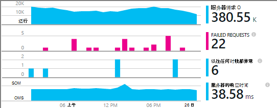
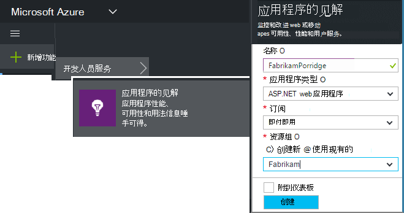
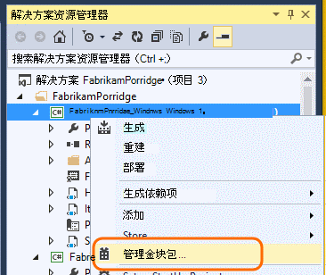
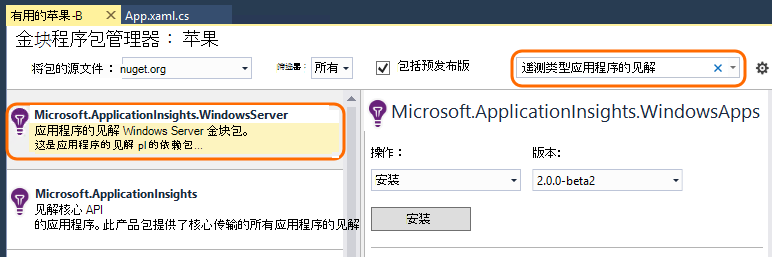
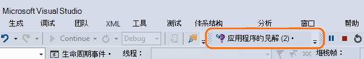
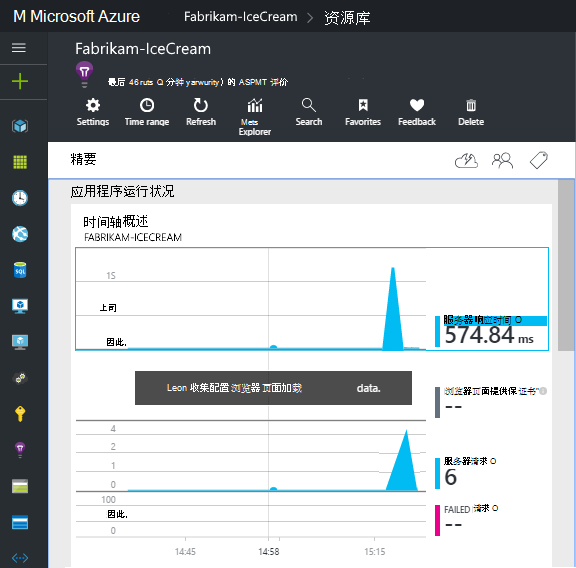
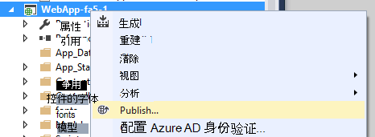

<properties
    pageTitle="见解的 Windows 服务应用程序和辅助角色 |Microsoft Azure"
    description="将应用程序的见解 SDK 手动添加到您的 ASP.NET 应用程序利用率、 可用性和性能分析。"
    services="application-insights"
    documentationCenter=".net"
    authors="alancameronwills"
    manager="douge"/>

<tags
    ms.service="application-insights"
    ms.workload="tbd"
    ms.tgt_pltfrm="ibiza"
    ms.devlang="na"
    ms.topic="get-started-article"
    ms.date="08/30/2016"
    ms.author="awills"/>

# 手动配置 ASP.NET 4 应用程序的应用程序的见解

*在预览是应用程序的见解。*

[AZURE.INCLUDE [app-insights-selector-get-started](../../includes/app-insights-selector-get-started.md)]

您可以手动配置[Visual Studio 应用程序见解](app-insights-overview.md)来监视 Windows 服务、 辅助角色和其他 ASP.NET 应用程序。 对于 web 应用程序，手动配置是[自动安装](app-insights-asp-net.md)的 Visual Studio 提供一种替代方法。

应用程序的见解可帮助您诊断问题并监视性能和实时应用程序中的使用情况。

#### 在开始之前

你需要：

* 对[Microsoft Azure](http://azure.com)的订阅。 如果您的团队或组织有订阅了 Azure，所有者可以将您添加到它，使用您的[Microsoft 客户](http://live.com)。
* 2013 或更高版本的 Visual Studio。

## 1.创建一个应用程序的见解资源

登录到[Azure 的门户网站](https://portal.azure.com/)，并创建新的应用程序理解资源。 作为应用程序类型，选择 ASP.NET。

Azure 中的[资源](app-insights-resources-roles-access-control.md)是一种服务的一个实例。 此资源是将分析并向您显示从您的应用程序的遥测。

选择的应用程序类型设置默认内容资源刀片和属性[测量数据资源管理器](app-insights-metrics-explorer.md)中可见。

#### 复制检测密钥

键标识的资源，并将它很快在中安装 SDK 后，可将数据定向到该资源。

您所做来创建新的资源的步骤是开始监视任何应用程序的好方法。 现在可以将数据发送给它。

## 2.安装 SDK 应用程序中

安装和配置应用程序的见解 SDK 取决于您正在使用的平台。 对于 ASP.NET 应用程序中，可以很容易。

1. 在 Visual Studio 中，编辑 web 应用程序项目的 NuGet 程序包。

    

2. 为 Web 应用程序中安装应用程序深入 SDK。

    

    *是否可以使用其他程序包？*

    是的。 如果您只想使用 API 来发送自己遥测中选择核心 API (Microsoft.ApplicationInsights)。 Windows 服务器软件包自动包括核心 API 以及大量的性能计数器集合和依赖项监视等其他程序包。 

#### 若要升级到未来的 SDK 版本

我们不时地发布新版本的 SDK。

若要升级到[新版本的 SDK](https://github.com/Microsoft/ApplicationInsights-dotnet-server/releases/)，打开再次 NuGet 程序包管理器和筛选器在已安装的软件包。 选择**Microsoft.ApplicationInsights.Web** ，然后选择**升级**。

如果您对 ApplicationInsights.config 所做的任何自定义，请升级，并随后将所做的更改合并到新版本之前保存一份。

## 3.发送遥测

**如果您安装了唯一核心 API 软件包︰**

* 设置检测键在代码中，例如`main()`: 

    `TelemetryConfiguration.Active.InstrumentationKey = "`*您的密钥*`";` 

* [编写您自己使用 API 的遥测](app-insights-api-custom-events-metrics.md#ikey)。

**如果安装了其他应用程序的见解程序包，**可以如果您愿意，可以使用.config 文件设置检测项︰

* 编辑 ApplicationInsights.config (它被添加的 NuGet 安装)。 插入结束标记之前，紧挨此︰

    `<InstrumentationKey>`*复制检测键*`</InstrumentationKey>`

* 确保 ApplicationInsights.config 在解决方案资源管理器中的属性被设置为**生成操作复制到输出目录的内容 = = 副本**。

## 运行您的项目

使用**f5 键**来运行您的应用程序并尝试一下︰ 打开不同的页面来生成某些遥测。

在 Visual Studio 中，您将看到已发送的事件计数。

## 查看您遥测

返回到[Azure 的门户网站](https://portal.azure.com/)，并浏览到您的应用程序理解资源。

查找概述图表中的数据。 首先，您将看到一个或两个点。 例如︰

单击通过任何图表以查看更详细的指标。 [了解有关指标。](app-insights-web-monitor-performance.md)

#### 没有数据？

* 使用该应用程序，以便它会生成一些遥测打开不同的页面。
* 打开[搜索](app-insights-diagnostic-search.md)方块，查看单个事件。 有时它需要事件有点时间，通过指标管道获得更长的时间。
* 等待几秒钟，然后单击**刷新**。 图表会定期刷新自己，但可以如果您等待某些数据显示手动刷新。
* 请参阅[疑难解答](app-insights-troubleshoot-faq.md)。

## 发布您的应用程序

现在将应用程序部署到您的服务器或 Azure 并观察积累的数据。

在调试模式下运行时，遥测通过管道，可以更快，这样，您应该看到在几秒钟内显示的数据。 在发布配置您的应用程序部署时，数据积累速度更慢。

#### 在没有数据发布到您的服务器？

在您的服务器的防火墙打开这些端口用于出站通讯︰

+ `dc.services.visualstudio.com:443`
+ `f5.services.visualstudio.com:443`

#### 在生成服务器上的问题吗？

请参阅[故障排除该项](app-insights-asp-net-troubleshoot-no-data.md#NuGetBuild)。

> [AZURE.NOTE]如果您的应用程序生成了大量遥测 (并且您正在使用 ASP.NET SDK 版本 2.0.0-beta3 或更高版本)，自适应采样模块会自动减少量由发送仅代表事件的一部分发送到门户网站。 但是，与同一个请求相关的事件将选择或取消选择作为一个组中，以便您可以找到相关事件之间。 
> [关于采样](app-insights-sampling.md)。

## 下一步行动

* [添加更多的遥测](app-insights-asp-net-more.md)获取应用程序的完整的 360 度视图。

