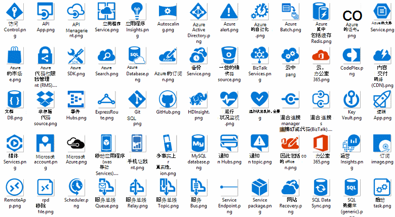

<properties 
    pageTitle="在 Microsoft Azure 应用程序体系结构 |Microsoft Azure" 
    description="介绍了通用设计模式的体系结构概述" 
    services="" 
    documentationCenter="" 
    authors="Rboucher" 
    manager="jwhit" 
    editor="mattshel"/>

<tags 
    ms.service="multiple" 
    ms.workload="na" 
    ms.tgt_pltfrm="na" 
    ms.devlang="na" 
    ms.topic="article" 
    ms.date="09/13/2016" 
    ms.author="robb"/>

#在 Microsoft Azure 应用程序体系结构
构建使用 Microsoft Azure 应用程序的资源。 这包括帮助您绘制关系图，以直观地描述了软件系统的工具。 

##设计模式海报

Microsoft 模式和实践已经发布了书[云设计模式](http://msdn.microsoft.com/library/dn568099.aspx)也可在 MSDN 和 PDF 下载。 此外，还有大格式海报使用其中列出的所有模式。 

##Microsoft 认证课程的体系结构

Microsoft 创建支持 Microsoft 认证考试 70-534 体系结构课程。 [适用于 EDX.ORG 的免费](https://www.edx.org/course/architecting-microsoft-azure-solutions-microsoft-dev205x)的。  它使用[3D 蓝图 Visio 模板](#3d-blueprint-visio-template)。 

##Microsoft 的解决方案

Microsoft 发布了一套高级别[的解决方案体系结构](http://aka.ms/azblueprints)显示如何生成特定类型的使用 Microsoft 产品的系统。 

以前，Microsoft 发布了一套显示示例体系结构蓝图。 那些已由上文所述的解决方案体系结构和蓝图链接已经被重定向，使之指向它们。 如果您需要访问前面的蓝图材料由于某种原因，请发电子邮件[CnESymbols@microsoft.com](mailto:CnESymbols@microsoft.com)在您的请求。   

蓝图和解决方案体系结构关系图使用[云以及企业符号集](#Drawing-symbol-and-icon-sets)的部分。   

##3D 蓝图 Visio 模板

在非 Microsoft 工具最初创建的 3D 版本的[Microsoft 体系结构蓝图](http://aka.ms/azblueprints)现在不起作用。 Visio 2013 （及更高版本） 模板附带上 2015 年 8 月 5 日[在 EDX.ORG 上分发体系结构 Microsoft 认证课程](#microsoft-architecture-certification-course)的一部分。

该模板还有课程之外。 

- [查看视频培训](http://aka.ms/3dBlueprintTemplateVideo)第一，因此，您知道它能做什么   
- 下载[Microsoft 3d 蓝图 Visio 模板](http://aka.ms/3DBlueprintTemplate)
- 下载的[云和企业符号](#drawing-symbol-and-icon-sets)与 3D 模板一起使用。 

电子邮件地址与我们联系[CnESymbols@microsoft.com](mailto:CnESymbols@microsoft.com)的特定问题没有回答的培训资料，或提供反馈。 模板已不再发展，但仍然有用和相关因为它可以使用任何 PNG 或[云和企业符号](#drawing-symbol-and-icon-sets)，这都将更新。  

##图形符号和图标集 

[查看 Visio 和培训视频的符号](http://aka.ms/CnESymbolsVideo)，然后[下载云并企业符号集](http://aka.ms/CnESymbols)来帮助您创建技术资料，描述了 Azure、 Windows 服务器和 SQL Server 的详细信息。 如果简介册训练用户如何使用 Microsoft 产品，可以使用体系结构关系图、 培训资料、 演示文稿、 数据表、 infographics、 白皮书和甚至第三方书籍中的符号。 但是，它们并不适合在用户界面中使用。

CnE 符号是 Visio，SVG 和 PNG 格式。 如何轻松地使用附加说明在 PowerPoint 中使用符号包含在集中。 

符号集附带每季度一次，并发布新的服务更新。 

Microsoft Office 和相关的技术的其他符号可在[Microsoft Office Visio 模具](http://www.microsoft.com/en-us/download/details.aspx?id=35772)中，但不适于像是 CnE 的体系结构图。   

**的反馈︰**如果您使用过 CnE 符号，填写简短 5 问题[调查](http://aka.ms/azuresymbolssurveyv2)或电子邮件地址与我们联系[CnESymbols@microsoft.com](mailto:CnESymbols@microsoft.com)的具体问题和事项。 我们想要知道您的想法，包括积极的反馈，以便我们能够继续投入其中的时间。 

##体系结构 Infographics

Microsoft 发布了多个体系结构相关海报/infographics。 它们包括[构建真实的云应用程序](https://azure.microsoft.com/documentation/infographics/building-real-world-cloud-apps/)和[云服务使用的缩放比例](https://azure.microsoft.com/documentation/infographics/cloud-services/)。 

