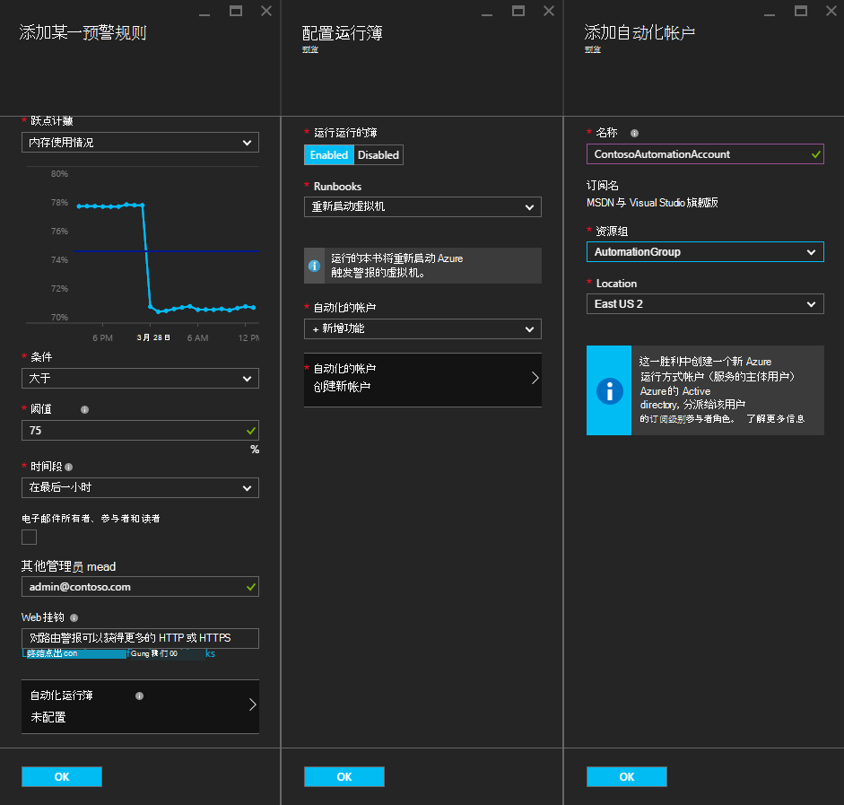

<properties
    pageTitle=" 修正与自动化运行手册的 Azure VM 警报 |Microsoft Azure"
    description="本文演示如何使用 Azure 自动化运行手册集成 Azure 虚拟机的通知，并自动修正问题"
    services="automation"
    documentationCenter=""
    authors="mgoedtel"
    manager="jwhit"
    editor="tysonn" />    
<tags
    ms.service="automation"
    ms.devlang="na"
    ms.topic="article"
    ms.tgt_pltfrm="na"
    ms.workload="infrastructure-services"
    ms.date="06/14/2016"
    ms.author="csand;magoedte" />

# <a name="azure-automation-scenario---remediate-azure-vm-alerts"></a>Azure 的自动化方案的修正 Azure VM 警报

Azure 自动化和 Azure 虚拟机已经发布了一项新功能使您能够配置虚拟机 (VM) 警报运行自动化运行手册。 这一新功能允许您自动执行虚拟机的警报，例如重新启动或停止虚拟机响应标准的补救措施。

以前，在 VM 创建预警规则的过程中我们能够[指定自动化 webhook](https://azure.microsoft.com/blog/using-azure-automation-to-take-actions-on-azure-alerts/) runbook 运行 runbook 时触发预警。 不过，这需要您要执行的工作创建 runbook，创建的 runbook，webhook，然后复制和粘贴预警规则创建过程的 webhook。 此新版本中，过程会更容易，因为您可以直接 runbook 从列表中选择警报规则创建的过程，您可以选择自动将运行 runbook 或轻松地创建一个帐户的帐户。

在本文中，我们将介绍设置 Azure VM 预警和配置触发警报时运行自动化 runbook 是多么容易。 示例方案包括重新启动 VM 的内存使用量超过一定阈值由于内存泄漏，与 VM 上的应用程序时或在 CPU 用户时间过去小时已低于 1%，未被使用时，则停止虚拟机。 我们还将介绍如何服务主体自动化帐户中自动的创建简化了 Azure 警报修正中运行手册的使用。

## <a name="create-an-alert-on-a-vm"></a>在虚拟机上创建警报

执行以下步骤来配置警报启动 runbook 时已履行了其阈值。

>[AZURE.NOTE] 此发行版中，我们只支持 V2 的虚拟机，并支持将很快添加虚拟机的经典。  

1. 登录到 Azure 的门户，单击**虚拟机**。  
2. 选择一种您的虚拟机。  虚拟机的仪表板刀片将出现并与其右侧**设置**刀片式服务器。  
3. 从**设置**刀片式服务器，在监控部分下选择**预警规则**。
4. 在**预警规则**刀片式服务器，单击**添加通知**。

这样就**将预警规则添加**刀片式服务器，可以在此配置警报的条件，并在一个或所有这些选项之间进行选择︰ 将电子邮件发送给某人，请使用 webhook 来转发到另一个系统，通知和/或运行自动化 runbook 响应尝试修正该问题。

## <a name="configure-a-runbook"></a>配置 runbook

若要配置以满足虚拟机报警阈值时，运行 runbook，选择**自动化 Runbook**。 在**配置 runbook**刀片式服务器，您可以选择运行 runbook 和自动化帐户以运行 runbook。



>[AZURE.NOTE] 对于此版本可以选择从三种运行手册服务提供 – 重新启动 VM、 停止虚拟机或删除虚拟机 （删除）。  能够选择其他运行手册或自己运行手册中的一个将可在未来的版本中。


选择三个可用运行手册之一后，**自动化帐户**下拉列表将显示，您可以选择 runbook 将作为运行自动化客户。 运行手册需要在 Azure 订阅[自动化帐户](automation-security-overview.md)的上下文中运行。 您可以选择自动帐户已经创建，也可以让为您创建一个新的自动化帐户。

提供了运行手册到 Azure 使用服务主体进行身份验证。 如果您选择在某个现有自动化客户运行 runbook，我们将自动创建服务主体为您。 如果您选择创建一个新的自动化帐户，然后我们会自动创建此帐户和服务主体。 在这两种情况下，两个资产还将创建自动化的帐户 – 中名为**AzureRunAsCertificate**的证书资产和一个名为**AzureRunAsConnection**的连接资源。 运行手册将使用**AzureRunAsConnection**身份验证使用 Azure 为了执行针对 VM 的管理操作。

>[AZURE.NOTE] 服务主体订阅范围内创建并分配参与者角色。 此角色被必需的帐户必须有权运行自动化运行手册管理 Azure 的虚拟机。  创建自动化客户和/或服务的主要是一次性事件。 一旦创建了它们，您可以使用该帐户运行其他 Azure VM 警报运行手册。

当您单击**确定**配置警报，如果您选择创建一个新的自动化帐户，则会创建以及服务主体。  这可能需要几秒钟才能完成。  


配置完成后，您将看到 runbook 出现在**预警规则中添加**刀片式服务器的名称。


单击**确定**中**添加某一预警规则**刀片和预警规则将被创建并激活虚拟机是否处于运行状态。

### <a name="enable-or-disable-a-runbook"></a>启用或禁用 runbook

如果您有配置警报的 runbook，可以禁用它而不删除 runbook 配置。 这使您可以保持运行的通知可能测试一些预警规则，然后以后重新启用 runbook。

## <a name="create-a-runbook-that-works-with-an-azure-alert"></a>创建使用 Azure 警报 runbook

当您选择 runbook 作为 Azure 预警规则的一部分时，runbook 需要逻辑来管理警报传递给它的数据中。  在预警规则中配置 runbook，webhook 会为创建 runbook;该 webhook 然后用于触发警报每次启动 runbook。  实际调用启动 runbook 是 webhook url 的 HTTP POST 请求。 POST 请求的主体包含一个 JSON 格式对象，该对象包含与此警报相关的有用的属性。  您可以看到下面，警报数据包含如 subscriptionID、 resourceGroupName、 资源名称，以及资源类型的详细信息。

### <a name="example-of-alert-data"></a>报警数据的示例
```
{
    "WebhookName": "AzureAlertTest",
    "RequestBody": "{
    \"status\":\"Activated\",
    \"context\": {
        \"id\":\"/subscriptions/<subscriptionId>/resourceGroups/MyResourceGroup/providers/microsoft.insights/alertrules/AlertTest\",
        \"name\":\"AlertTest\",
        \"description\":\"\",
        \"condition\": {
            \"metricName\":\"CPU percentage guest OS\",
            \"metricUnit\":\"Percent\",
            \"metricValue\":\"4.26337916666667\",
            \"threshold\":\"1\",
            \"windowSize\":\"60\",
            \"timeAggregation\":\"Average\",
            \"operator\":\"GreaterThan\"},
        \"subscriptionId\":\<subscriptionID> \",
        \"resourceGroupName\":\"TestResourceGroup\",
        \"timestamp\":\"2016-04-24T23:19:50.1440170Z\",
        \"resourceName\":\"TestVM\",
        \"resourceType\":\"microsoft.compute/virtualmachines\",
        \"resourceRegion\":\"westus\",
        \"resourceId\":\"/subscriptions/<subscriptionId>/resourceGroups/TestResourceGroup/providers/Microsoft.Compute/virtualMachines/TestVM\",
        \"portalLink\":\"https://portal.azure.com/#resource/subscriptions/<subscriptionId>/resourceGroups/TestResourceGroup/providers/Microsoft.Compute/virtualMachines/TestVM\"
        },
    \"properties\":{}
    }",
    "RequestHeader": {
        "Connection": "Keep-Alive",
        "Host": "<webhookURL>"
    }
}
```

当自动化 webhook 服务收到 HTTP POST 时提取的警报数据并将其传递给 runbook WebhookData runbook 输入参数中。  下面是显示了如何使用 WebhookData 参数和提取的警报数据并使用它来管理 Azure 触发警报的资源示例 runbook。

### <a name="example-runbook"></a>Runbook 示例

```
#  This runbook will restart an ARM (V2) VM in response to an Azure VM alert.

[OutputType("PSAzureOperationResponse")]

param ( [object] $WebhookData )

if ($WebhookData)
{
    # Get the data object from WebhookData
    $WebhookBody = (ConvertFrom-Json -InputObject $WebhookData.RequestBody)

    # Assure that the alert status is 'Activated' (alert condition went from false to true)
    # and not 'Resolved' (alert condition went from true to false)
    if ($WebhookBody.status -eq "Activated")
    {
        # Get the info needed to identify the VM
        $AlertContext = [object] $WebhookBody.context
        $ResourceName = $AlertContext.resourceName
        $ResourceType = $AlertContext.resourceType
        $ResourceGroupName = $AlertContext.resourceGroupName
        $SubId = $AlertContext.subscriptionId

        # Assure that this is the expected resource type
        Write-Verbose "ResourceType: $ResourceType"
        if ($ResourceType -eq "microsoft.compute/virtualmachines")
        {
            # This is an ARM (V2) VM

            # Authenticate to Azure with service principal and certificate
            $ConnectionAssetName = "AzureRunAsConnection"
            $Conn = Get-AutomationConnection -Name $ConnectionAssetName
            if ($Conn -eq $null) {
                throw "Could not retrieve connection asset: $ConnectionAssetName. Check that this asset exists in the Automation account."
            }
            Add-AzureRMAccount -ServicePrincipal -Tenant $Conn.TenantID -ApplicationId $Conn.ApplicationID -CertificateThumbprint $Conn.CertificateThumbprint | Write-Verbose
            Set-AzureRmContext -SubscriptionId $SubId -ErrorAction Stop | Write-Verbose

            # Restart the VM
            Restart-AzureRmVM -Name $ResourceName -ResourceGroupName $ResourceGroupName
        } else {
            Write-Error "$ResourceType is not a supported resource type for this runbook."
        }
    } else {
        # The alert status was not 'Activated' so no action taken
        Write-Verbose ("No action taken. Alert status: " + $WebhookBody.status)
    }
} else {
    Write-Error "This runbook is meant to be started from an Azure alert only."
}
```

## <a name="summary"></a>摘要

在 Azure VM 配置警报时，现在可以轻松地配置自动化 runbook 当触发警报时自动执行的补救行动的能力。 对于此版本，您可以选择从运行手册重新启动、 停止或删除虚拟机根据预警方案。 这仅仅是个开始的使您可以控制触发警报时将自动执行的操作 （通知，故障排除，修正） 的方案。

## <a name="next-steps"></a>下一步行动

- 要开始使用图形化的运行手册，请参阅[我的第一个图形 runbook](automation-first-runbook-graphical.md)
- 若要开始使用 PowerShell 工作流运行手册，请参阅[我第一个 PowerShell 流 runbook](automation-first-runbook-textual.md)
- 若要了解有关 runbook 类型，它们的优点和限制的详细信息，请参阅[Azure 自动化 runbook 类型](automation-runbook-types.md)
