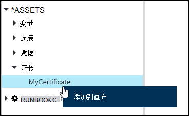
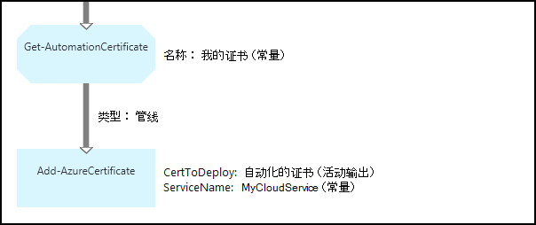

<properties 
   pageTitle="证书在 Azure 自动化资产 |Microsoft Azure"
   description="证书可以存储安全地在 Azure 自动化以便他们可以访问运行手册或 DSC 对 Azure 和第三方资源进行身份验证的配置。  本文介绍了证书以及如何使用这些文本和图形创作中的详细信息。"
   services="automation"
   documentationCenter=""
   authors="mgoedtel"
   manager="stevenka"
   editor="tysonn" />
<tags 
   ms.service="automation"
   ms.devlang="na"
   ms.topic="article"
   ms.tgt_pltfrm="na"
   ms.workload="infrastructure-services"
   ms.date="02/23/2016"
   ms.author="magoedte;bwren" />

# 在 Azure 自动化证书资产

证书可以存储安全地在 Azure 自动化以便他们可以通过运行手册或使用**Get AutomationCertificate**活动的 DSC 配置。 这使您得以创建运行手册和 DSC 配置证书用于身份验证，或将它们添加到 Azure 或第三方资源。

>[AZURE.NOTE] 在 Azure 自动化的安全资产包括凭据、 证书、 连接和加密的变量。 这些资产都得到加密并存储在每个自动化帐户使用唯一的密钥生成 Azure 自动化。 此密钥是由主证书加密并存储在 Azure 自动化。 之前存储安全资产，自动化帐户密钥进行解密使用该母版的证书，然后用来加密该资产。

## Windows PowerShell Cmdlet

下表中的 cmdlet 用于创建和管理自动化的证书与 Windows PowerShell 的资产。 他们寄送为[Azure PowerShell 模块](../powershell-install-configure.md)可供使用自动化运行手册和 DSC 配置中的一部分。

|Cmdlet|说明|
|:---|:---|
|[获得 AzureAutomationCertificate](http://msdn.microsoft.com/library/dn913765.aspx)|检索证书的有关信息。 您只能从 Get AutomationCertificate 活动中检索证书本身。|
|[新 AzureAutomationCertificate](http://msdn.microsoft.com/library/dn913764.aspx)|将一个新证书导入到 Azure 自动化。|
|[删除-AzureAutomationCertificate](http://msdn.microsoft.com/library/dn913773.aspx)|从 Azure 自动化删除一个证书。|
|[组-AzureAutomationCertificate](http://msdn.microsoft.com/library/dn913763.aspx)|设置包括上载证书文件和设置的密码.pfx 现有证书的属性。|

## 若要访问证书的活动

下表中的活动用于访问为 runbook 或 DSC 配置的证书。

|活动|说明|
|:---|:---|
|获得 AutomationCertificate|获取要在 runbook 或 DSC 配置中使用的证书。|

>[AZURE.NOTE] 您应该避免使用变量获取 AutomationCertificate 因为这可以增加发现运行手册或 DSC 配置之间的依赖关系的复杂性，并在设计时证书资产 – 名称参数中。

## 创建新证书

当您创建新的证书时，一个.cer 或.pfx 文件上载到 Azure 自动化。 如果标记为可导出的证书，然后您可以将其转移从 Azure 自动化证书存储区。 如果不是可导出的然后它只能用于签名 runbook 或 DSC 配置中。

### 若要使用 Azure 的传统门户创建一个新证书

1. 从自动化您的帐户，请单击窗口顶部的**资产**。
1. 在窗口的底部，单击**添加设置**。
1. 单击**添加凭据**。
2. 在**凭据类型**下拉列表中，选择**证书**。
3. 在**名称**框中键入证书的名称，然后单击向右箭头。
4. 浏览一个.cer 或.pfx 文件。  如果您选择一个.pfx 文件，指定密码和是否应允许它被导出。
1. 单击复选标记以将证书文件上载和保存新的证书资产。

### 若要使用 Azure 门户创建一个新证书

1. 从自动化您的帐户，单击以打开刀片式服务器**资产**的**资产**部分。
1. 单击以打开刀片式服务器**证书**的**证书**部分。
1. 单击顶部的刀片式服务器**添加证书**。
2. 在**名称**框中键入证书的名称。
2. 单击**上载证书文件**浏览.cer 或.pfx 文件下的**选择文件**。  如果您选择一个.pfx 文件，指定密码和是否应允许它被导出。
1. 单击**创建**以保存新的证书资产。

### 若要使用 Windows PowerShell 创建新证书

下面的示例命令显示如何创建一个新的自动化证书，并将其标记为可导出。 导入现有的.pfx 文件。

    $certName = 'MyCertificate'
    $certPath = '.\MyCert.pfx'
    $certPwd = ConvertTo-SecureString -String 'P@$$w0rd' -AsPlainText -Force
    
    New-AzureAutomationCertificate -AutomationAccountName "MyAutomationAccount" -Name $certName -Path $certPath –Password $certPwd -Exportable

## 使用证书

您必须使用**Get AutomationCertificate**活动使用的证书。 由于它返回证书资产，但该证书的信息，不能使用[Get AzureAutomationCertificate](http://msdn.microsoft.com/library/dn913765.aspx) cmdlet。

### 文本的 runbook 示例

下面的代码示例演示如何将证书添加到 runbook 中的云服务。 在此示例中，从加密的自动化变量获得密码。

    $serviceName = 'MyCloudService'
    $cert = Get-AutomationCertificate -Name 'MyCertificate'
    $certPwd = Get-AutomationVariable –Name 'MyCertPassword'
    Add-AzureCertificate -ServiceName $serviceName -CertToDeploy $cert

### Runbook 图形示例

您添加到图形 runbook 上的证书在图形化编辑器的库窗格中右键单击并选择**添加到画布** **Get AutomationCertificate** 。

下图显示了一种图形化的 runbook 中使用的证书。  这是同样的示例上面显示了从文本 runbook 向云服务中添加证书。  

此示例使用**UseConnectionObject**参数设置为用于对服务进行身份验证的连接对象**发送 TwilioSMS**活动。  由于序列链接将返回一个集合，包含一个对象的连接参数不期望必须在此处使用[管道链接](automation-graphical-authoring-intro.md#links-and-workflow)。

## 请参见

- [图形创作中的链接](automation-graphical-authoring-intro.md#links-and-workflow) 
