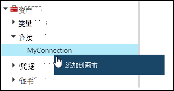
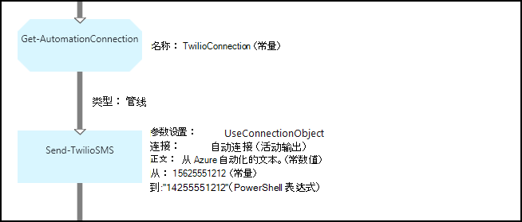
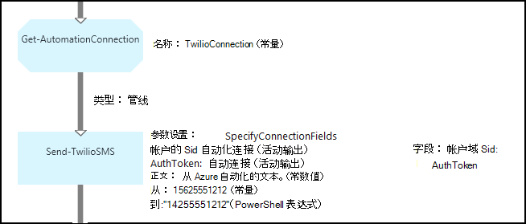

<properties 
   pageTitle="在 Azure 自动化连接资产 |Microsoft Azure"
   description="在 Azure 自动化连接资产包含从 runbook 或 DSC 配置连接到外部服务或应用程序所需的信息。 本文介绍连接以及如何使用这些文本和图形创作中的详细的信息。"
   services="automation"
   documentationCenter=""
   authors="bwren"
   manager="stevenka"
   editor="tysonn" />
<tags 
   ms.service="automation"
   ms.devlang="na"
   ms.topic="article"
   ms.tgt_pltfrm="na"
   ms.workload="infrastructure-services"
   ms.date="01/27/2016"
   ms.author="bwren" />

# 在 Azure 自动化连接资产

自动化连接资产包含从 runbook 或 DSC 配置连接到外部服务或应用程序所需的信息。 这可能包括所需的身份验证，如用户名和密码以及连接信息，例如 URL 或端口信息。 连接的值保持所有连接到特定的应用程序在一个资产而不是创建多个变量的属性。 用户可以编辑这些值连接在一起，并可以传递给 runbook 或单个参数中的 DSC 配置连接的名称。 在 runbook 或与**获取 AutomationConnection**活动的 DSC 配置，可访问连接的属性。

当您创建连接时，您必须指定*连接类型*。 连接类型是定义一组属性的模板。 连接定义其连接类型中定义的每个属性的值。 添加到 Azure 自动化集成模块中或使用[Azure 自动化 API](http://msdn.microsoft.com/library/azure/mt163818.aspx)创建的连接类型。 当您创建连接时才可用的唯一连接类型那些安装在您的自动化帐户中。

>[AZURE.NOTE] 在 Azure 自动化的安全资产包括凭据、 证书、 连接和加密的变量。 这些资产都得到加密并存储在每个自动化帐户使用唯一的密钥生成 Azure 自动化。 此密钥是由主证书加密并存储在 Azure 自动化。 之前存储安全资产，自动化帐户密钥进行解密使用该母版的证书，然后用来加密该资产。

## Windows PowerShell Cmdlet

下表中的 cmdlet 用于创建和管理自动化与 Windows PowerShell 的连接。 他们寄送为[Azure PowerShell 模块](../powershell-install-configure.md)可供使用自动化运行手册和 DSC 配置中的一部分。

|Cmdlet|说明|
|:---|:---|
|[获得 AzureAutomationConnection](http://msdn.microsoft.com/library/dn921828.aspx)|检索连接。 包括一个哈希表的连接字段的值。|
|[新 AzureAutomationConnection](http://msdn.microsoft.com/library/dn921825.aspx)|创建新的连接。|
|[删除 AzureAutomationConnection](http://msdn.microsoft.com/library/dn921827.aspx)|删除现有的连接。|
|[一组 AzureAutomationConnectionFieldValue](http://msdn.microsoft.com/library/dn921826.aspx)|设置的现有连接的特定字段的值。|

## 活动

下表中的活动用于访问在 runbook 或 DSC 配置连接。

|活动|说明|
|---|---|
|获得 AutomationConnection|获取要使用的连接。 返回哈希表的连接属性。|

>[AZURE.NOTE] 您应该避免使用变量**AutomationConnection Get-**因为这会使运行手册或 DSC 配置和连接资产之间发现的依赖关系复杂化在设计时 – 名称参数中。

## 创建新连接

### 若要使用 Azure 的传统门户创建一个新的连接

1. 从自动化您的帐户，请单击窗口顶部的**资产**。
1. 在窗口的底部，单击**添加设置**。
1. 单击**添加连接**。
2. 在**连接类型**下拉列表中选择您想要创建的连接的类型。  向导将显示该特定类型的属性。
1. 完成该向导，请单击该复选框以保存新的连接。

### 若要使用 Azure 门户创建一个新的连接

1. 从自动化您的帐户，单击以打开刀片式服务器**资产**的**资产**部分。
1. 单击要打开**的连接**刀片式服务器的**连接**部件。
1. 单击顶部的刀片式服务器**添加连接**。
2. 在**类型**下拉列表中选择您想要创建的连接的类型。 该窗体将显示为该特定类型的属性。
1. 完成窗体并单击**创建**以保存新的连接。

### 若要使用 Windows PowerShell 创建新连接

与使用[New AzureAutomationConnection](http://msdn.microsoft.com/library/dn921825.aspx) cmdlet 的 Windows PowerShell 创建新连接。 此 cmdlet 具有名为**ConnectionFieldValues** ，需要为每个连接类型所定义的属性定义的值[的哈希表](http://technet.microsoft.com/library/hh847780.aspx)的参数。

[Twilio](http://www.twilio.com)是一种电话服务，使您可以发送和接收文本消息的下面的示例命令创建一个新连接。  该示例集成模块中包含 Twilio 连接类型是在[脚本中心](http://gallery.technet.microsoft.com/scriptcenter/Twilio-PowerShell-Module-8a8bfef8)中可用。  此连接类型定义帐户的 SID，而且授权令牌，以验证您的帐户连接到 Twilio 时所需的属性。  您必须[下载本模块](http://gallery.technet.microsoft.com/scriptcenter/Twilio-PowerShell-Module-8a8bfef8)并将其安装在此代码示例来处理您的自动化帐户。

    $AccountSid = "DAf5fed830c6f8fac3235c5b9d58ed7ac5"
    $AuthToken  = "17d4dadfce74153d5853725143c52fd1"
    $FieldValues = @{"AccountSid" = $AccountSid;"AuthToken"=$AuthToken}

    New-AzureAutomationConnection -AutomationAccountName "MyAutomationAccount" -Name "TwilioConnection" -ConnectionTypeName "Twilio" -ConnectionFieldValues $FieldValues

## 使用 runbook 或 DSC 配置中的连接

检索在 runbook 或使用**Get AutomationConnection** cmdlet 的 DSC 配置的连接。  此活动检索的连接中的其他字段的值，并将它们作为一个[哈希表](http://go.microsoft.com/fwlink/?LinkID=324844)然后用 DSC 配置的 runbook 中的适当命令返回。

### 文本的 runbook 示例
下面的示例命令显示如何使用上面的示例中的 Twilio 连接从 runbook 发送文本消息。  在此处使用发送 TwilioSMS 活动有两个参数集，每一个使用不同的方法，向 Twilio 服务进行身份验证。  用户使用的连接对象和另一个帐户的 SID 和授权令牌使用单个参数。  此示例显示了这两种方法。

    $Con = Get-AutomationConnection -Name "TwilioConnection"
    $NumTo = "14255551212"
    $NumFrom = "15625551212"
    $Body = "Text from Azure Automation."

    #Send text with connection object.
    Send-TwilioSMS -Connection $Con -From $NumFrom -To $NumTo -Body $Body

    #Send text with connection properties.
    Send-TwilioSMS -AccountSid $Con.AccountSid -AuthToken $Con.AuthToken -From $NumFrom -To $NumTo -Body $Body

### Runbook 图形示例

在图形化编辑器的连接在库窗格中右键单击并选择**添加到画布**，可以向图形 runbook 添加**Get AutomationConnection**活动。

下面的图像显示在图形化的 runbook 中使用连接的示例。  这是同样的示例发送文本消息使用从文本的 runbook Twilio 如上所示。  此示例使用**UseConnectionObject**参数设置为用于对服务进行身份验证的连接对象**发送 TwilioSMS**活动。  这里使用[管道链接](automation-graphical-authoring-intro.md#links-and-workflow)是因为连接参数需要单个对象。

PowerShell 表达式用于而不是常量的值**为**参数中的值是该参数需要字符串数组的值类型，以便您可以发送给多个号码的原因。  一个 PowerShell 表达式，使您可以提供单个值或数组。

下图显示了同一个与上面的示例，但使用**SpecifyConnectionFields**参数设置的要求而不是用于身份验证的连接对象分别指定帐户和 AuthToken 参数。  在这种情况下，而不是对象本身指定的连接字段。  

## 相关的文章

- [图形创作中的链接](automation-graphical-authoring-intro.md#links-and-workflow)
 
