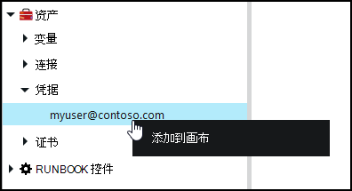
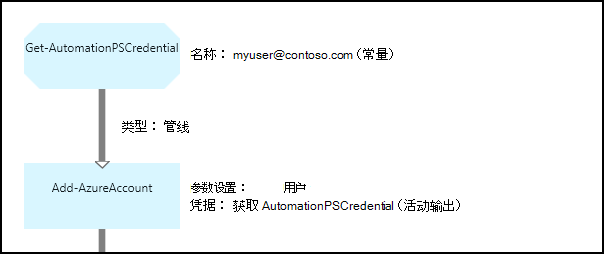

<properties 
   pageTitle="凭据在 Azure 自动化资产 |Microsoft Azure"
   description="在 Azure 自动化的凭据资产包含可用于对由 runbook 或 DSC 配置访问的资源进行身份验证的安全凭据。 本文介绍如何创建凭据资产和在 runbook 或 DSC 配置中使用它们。"
   services="automation"
   documentationCenter=""
   authors="mgoedtel"
   manager="jwhit"
   editor="tysonn" />
<tags 
   ms.service="automation"
   ms.devlang="na"
   ms.topic="article"
   ms.tgt_pltfrm="na"
   ms.workload="infrastructure-services"
   ms.date="06/09/2016"
   ms.author="bwren" />

# 凭据在 Azure 自动化中的资产

自动化的凭据资产持有一个[PSCredential](http://msdn.microsoft.com/library/system.management.automation.pscredential)对象，该对象包含安全凭据，例如用户名和密码。 运行手册和 DSC 配置可以使用 cmdlet 的接受一个 PSCredential 对象，进行身份验证，或他们可能提取用户名和密码要为某些应用程序或需要进行身份验证的服务提供的 PSCredential 对象。 凭据属性 Azure 自动化中安全地存储，可使用[Get AutomationPSCredential](http://msdn.microsoft.com/library/system.management.automation.pscredential.aspx)活动的 DSC 配置的 runbook 中。

>[AZURE.NOTE] 在 Azure 自动化的安全资产包括凭据、 证书、 连接和加密的变量。 这些资产都得到加密并存储在每个自动化帐户使用唯一的密钥生成 Azure 自动化。 此密钥是由主证书加密并存储在 Azure 自动化。 之前存储安全资产，自动化帐户密钥进行解密使用该母版的证书，然后用来加密该资产。 

## Windows PowerShell cmdlet

下表中的 cmdlet 用于创建和管理自动化凭据资产与 Windows PowerShell。  他们寄送为[Azure PowerShell 模块](../powershell-install-configure.md)可供使用自动化运行手册和 DSC 配置中的一部分。

|Cmdlet|说明|
|:---|:---|
|[获得 AzureAutomationCredential](http://msdn.microsoft.com/library/dn913781.aspx)|检索有关凭据资产信息。 只能从**Get AutomationPSCredential**活动中检索凭据本身。|
|[新 AzureAutomationCredential](http://msdn.microsoft.com/library/azure/jj554330.aspx)|创建新的自动化证书。|
|[删除-AzureAutomationCredential](http://msdn.microsoft.com/library/azure/jj554330.aspx)|删除可自动化的凭据。|
|[组-AzureAutomationCredential](http://msdn.microsoft.com/library/azure/jj554330.aspx)|设置现有的自动化凭据属性。|

## Runbook 活动

下表中的活动用于访问中 runbook 和 DSC 配置的凭据。

|活动|说明|
|:---|:---|
|获得 AutomationPSCredential|获取要在 runbook 或 DSC 配置中使用的凭据。 返回一个[System.Management.Automation.PSCredential](http://msdn.microsoft.com/library/system.management.automation.pscredential)对象。|

>[AZURE.NOTE] 您应该避免使用变量获取 AutomationPSCredential 因为这可以增加发现运行手册或 DSC 配置之间的依赖关系的复杂性并在设计时凭据资产 – 名称参数中。

## 创建新的凭据资产

### 若要使用 Azure 的传统门户网站创建新的凭据资产

1. 从自动化您的帐户，请单击窗口顶部的**资产**。
1. 在窗口的底部，单击**添加设置**。
1. 单击**添加凭据**。
2. 在**凭据类型**下拉列表中选择**PowerShell 凭据**。
1. 完成该向导，请单击该复选框以保存新的凭据。

### 若要使用 Azure 门户创建新的凭据资产

1. 从自动化您的帐户，单击以打开刀片式服务器**资产**的**资产**部分。
1. 单击要打开刀片式服务器**的凭据**的**凭据**部件。
1. 单击顶部的刀片式服务器**添加凭据**。
1. 完成窗体并单击**创建**以保存新的凭据。

### 若要使用 Windows PowerShell 创建新的凭据资产

下面的示例命令显示如何创建新的自动化证书。 PSCredential 对象是首次创建的名称和密码，然后用于创建凭据资产。 或者，您可以使用**获取凭据**cmdlet 系统会提示您键入用户名和密码。

    $user = "MyDomain\MyUser"
    $pw = ConvertTo-SecureString "PassWord!" -AsPlainText -Force
    $cred = New-Object –TypeName System.Management.Automation.PSCredential –ArgumentList $user, $pw
    New-AzureAutomationCredential -AutomationAccountName "MyAutomationAccount" -Name "MyCredential" -Value $cred

## 使用 PowerShell 凭据

检索为 runbook 或与**获取 AutomationPSCredential**活动的 DSC 配置凭据资产。 这将返回一个[PSCredential 对象](http://msdn.microsoft.com/library/system.management.automation.pscredential.aspx)，您可以使用活动或需要一个 PSCredential 参数的 cmdlet。 此外可以检索要使用单独的凭据对象的属性。 对象具有属性的用户名和密码安全，也可以使用**GetNetworkCredential**方法来返回一个[NetworkCredential](http://msdn.microsoft.com/library/system.net.networkcredential.aspx)对象，该对象将提供版本不安全的密码。

### 文本的 runbook 示例

下面的示例命令显示如何在 runbook 中使用 PowerShell 凭据。 在此示例中，检索凭据和其用户名和密码赋给变量。

    $myCredential = Get-AutomationPSCredential -Name 'MyCredential'
    $userName = $myCredential.UserName
    $securePassword = $myCredential.Password
    $password = $myCredential.GetNetworkCredential().Password

### Runbook 图形示例

您添加到图形 runbook 上的凭据在图形化编辑器的库窗格中右键单击并选择**添加到画布** **Get AutomationPSCredential**活动。

下面的图像显示在图形 runbook 使用凭据的示例。  在这种情况下，它是被用来提供 runbook Azure 资源的身份验证[使用 Azure AD 用户帐户进行身份验证运行手册](automation-sec-configure-aduser-account.md)中所述。  第一个活动检索有权访问的 Azure 订阅的凭据。  然后，**添加 AzureAccount**活动使用此凭据来提供身份验证之后，它任何活动的。  由于**Get AutomationPSCredential**需要一个对象，这里是[管道链接](automation-graphical-authoring-intro.md#links-and-workflow)。  

## 用 DSC PowerShell 凭据
Azure 自动化中的 DSC 配置可以引用凭据资产使用**Get AutomationPSCredential**，凭据资产可以还传递中通过参数，如果需要。 有关详细信息，请参阅[在 Azure 自动化 DSC 的编译配置](automation-dsc-compile.md#credential-assets)。

## 下一步行动

- 若要了解有关链接图形创作中的详细信息，请参阅[图形创作中的链接](automation-graphical-authoring-intro.md#links-and-workflow)
- 要了解与自动化的不同身份验证方法，请参阅[Azure 自动化安全](automation-security-overview.md)
- 要开始使用图形化的运行手册，请参阅[我的第一个图形 runbook](automation-first-runbook-graphical.md)
- 若要开始使用 PowerShell 工作流运行手册，请参阅[我第一个 PowerShell 流 runbook](automation-first-runbook-textual.md) 

 
