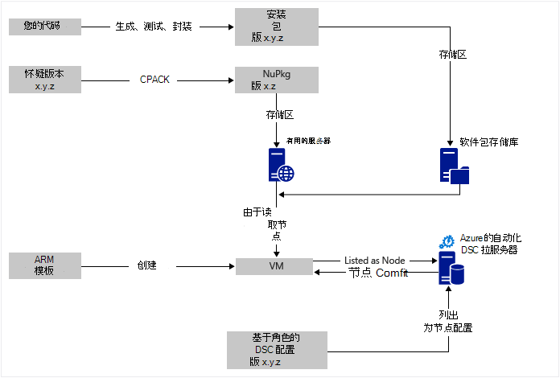
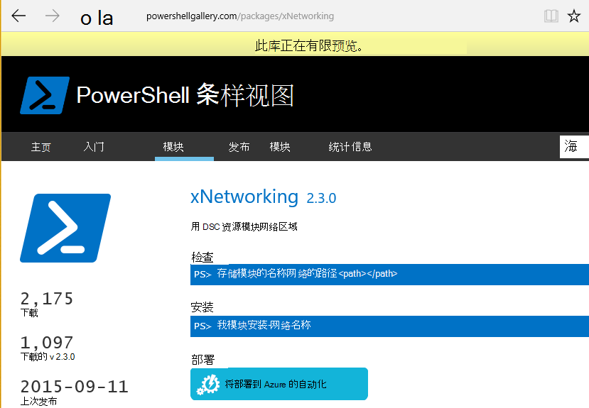

<properties
   pageTitle="与 Chocolatey azure 自动化 DSC 连续部署 |Microsoft Azure"
   description="DevOps 连续部署使用 Azure 自动化 DSC 和 Chocolatey 软件包管理器。  与完整的 JSON ARM 模板和 PowerShell 源的示例。"
   services="automation"
   documentationCenter=""
   authors="sebastus"
   manager="stevenka"
   editor=""/>

<tags
   ms.service="automation"
   ms.devlang="na"
   ms.topic="article"
   ms.tgt_pltfrm="vm-windows"
   ms.workload="na"
   ms.date="08/08/2016"
   ms.author="golive"/>

# 用法示例︰ 连续部署到使用自动化 DSC 和 Chocolatey 的虚拟机

在 DevOps 的世界有很多工具，以帮助持续集成管线中不同的时间点。  Azure 自动化所需状态配置 (DSC) 是欢迎新成员 DevOps 的团队可以使用的选项。  这篇文章演示了如何设置连续部署 (CD) 上的 Windows 计算机。  您可以轻松扩展角色 （网站，例如），然后从其他角色还包括根据需要尽可能多的 Windows 计算机的技术。

## 在高级别

发生在这里，不少，但幸运的是它可以分为两个主要过程︰ 

  - 编写的代码和测试它，然后创建和发布系统的主要和次要版本的安装程序包。 
  - 创建和管理虚拟机，将安装程序包中执行该代码。  

一旦这两个这些核心流程都在的地方，是一个短的步骤，以自动更新创建和部署新版本时，在任何特定的虚拟机上运行的包。

## 组件概述

程序包管理器如[apt get](https://en.wikipedia.org/wiki/Advanced_Packaging_Tool)是非常熟知在 Linux 世界中，但没有这么多在 Windows 环境中。  [Chocolatey](https://chocolatey.org/)是这样一回事，和 Scott Hanselman[博客](http://www.hanselman.com/blog/IsTheWindowsUserReadyForAptget.aspx)主题是极好的介绍。  简而言之，Chocolatey 允许您从中央资料库中的包的包安装到 Windows 系统中使用命令行。  您可以创建和管理自己的存储库，并 Chocolatey 可以从任意数量的存储库，您将指定安装软件包。

所需状态配置 (DSC) （[概述](https://technet.microsoft.com/library/dn249912.aspx)） 是一个 PowerShell 工具，使您能够声明所需的计算机配置。  例如，您可以说，"我想要安装的 Chocolatey、 希望安装 IIS、 我需要打开端口 80，希望 1.0.0 版的我的网站安装。"  DSC 本地配置管理器 (LCM) 实现该配置。 DSC 拉服务器保存为您的计算机的配置存储库。 每台计算机上的 LCM 周期性检查其配置是否与已存储的配置匹配。 它可以报告状态，或试图将计算机恢复到与已存储配置的对齐方式。 您可以编辑上拉服务器以使计算机或一组计算机进入配置已更改对齐方式的存储的配置。

Azure 自动化是使您能够自动使用运行手册、 节点、 凭据、 资源和资产，如时间表和全局变量的各种任务的 Microsoft Azure 中的托管的服务。 Azure 自动化 DSC 扩展此自动化功能 — 包括 PowerShell DSC 的工具。  这是很好的[概述](automation-dsc-overview.md)。

DSC 资源是代码的具有特定的功能，如管理网络，活动目录或 SQL Server 模块。  Chocolatey 的 DSC 资源知道如何访问 （及其他） 的 NuGet 服务器，下载软件包，安装程序包，等等。  还有很多其他 DSC 资源[PowerShell 库](http://www.powershellgallery.com/packages?q=dsc+resources&prerelease=&sortOrder=package-title)中。  这些模块 （由您） 安装到 Azure 自动化 DSC 拉服务器使它们可由您的配置。

ARM 模板提供声明性的方式来生成您的基础架构的网络、 子网、 网络安全等内容，并且路由时，负载平衡器、 Nic、 Vm，等。  下面是[文章](../resource-manager-deployment-model.md)比较 ARM 部署模型 （声明性） 与 Azure 服务管理 （ASM 或经典） 部署模型 （要求）。  和有关核心资源提供程序、 计算、 存储和网络的其他[文章](../virtual-machines/virtual-machines-windows-compare-deployment-models.md)。

ARM 模板的一个主要功能是向 VM 安装 VM 扩展，因为它提供的能力。  VM 扩展具有特定的功能，如运行自定义脚本，安装防病毒软件，或运行 DSC 配置脚本。  有许多其他类型的 VM 扩展。

## 图示的周围快速旅行

从顶部开始，您编写代码，构建和测试，然后创建安装程序包。  Chocolatey 可以处理各种类型的安装软件包，例如 MSI，MSU，ZIP。  并且具有 Chocolatey 的本机功能不完全由它进行实际安装 PowerShell 的全部功能。  将包放到地方到达 – 软件包存储库。  此用法示例使用公用文件夹中的 Azure blob 存储帐户，但它可以是任何地方。  Chocolatey 本身可与配合使用 NuGet 服务器和其它几个包元数据的管理。  [本文](https://github.com/chocolatey/choco/wiki/How-To-Host-Feed)描述的选项。  此用法示例使用 NuGet。  Nuspec 是有关您的软件包的元数据。  Nuspec 的是"编译"成 NuPkg 的 NuGet 服务器中存储。  当您配置请求包的名称，并引用 NuGet 服务器时，Chocolatey （现在在 VM) DSC 资源获取包，并将其安装为您。  您还可以请求包的特定版本。

在底部左边的图片，没有一个 Azure 资源管理器 (ARM) 的模板。  在此用法的示例中，VM 扩展为一个节点注册 Azure 自动化 DSC 拉服务器 （即，请求服务器） 与 VM。  配置存储在请求服务器。  实际上，它将存储两次︰ 一次以纯文本格式和编译 MOF 文件 （对于那些了解这类事情。） 在门户中，MOF 是"节点配置"（而不是简单地"配置"）。  它是使该节点就会知道它的配置与节点相关联的项目。  以下详细说明如何分配到的节点的节点配置。

大概已经在做的顶部或大部分在位。  创建 nuspec、 编译并将其存储在 NuGet 服务器是小事情。  和您正在管理的虚拟机。  对连续部署采取下一步需要设置请求服务器 （一次），注册您的节点 （一次），并创建和 （最初） 存储的配置那里。  随着包的升级和部署到存储库，然后请求服务器 （根据需要重复） 中刷新配置和节点配置。

如果不开始 ARM 模板时，也是确定。  有旨在帮助您注册您的 Vm 与拉服务器和所有其余的 PowerShell cmdlet。 有关详细信息，请参阅这篇文章︰[管理 — 通过 Azure 自动化 DSC 的服务机](automation-dsc-onboarding.md)

## 步骤 1︰ 设置请求服务器和自动化帐户

在经过身份验证的 (添加 AzureRmAccount) PowerShell 命令行︰ 虽然拉服务器设置 （可能需要几分钟时间）

    New-AzureRmResourceGroup –Name MY-AUTOMATION-RG –Location MY-RG-LOCATION-IN-QUOTES
    New-AzureRmAutomationAccount –ResourceGroupName MY-AUTOMATION-RG –Location MY-RG-LOCATION-IN-QUOTES –Name MY-AUTOMATION-ACCOUNT 

可以将您的自动化帐户放入任何以下地区 （也称为位置）︰ 东亚美国 2、 美国中部南部、 美国 Gov 弗吉尼亚、 西欧、 东南亚、 日本东、 中央印度和澳大利亚东南部。

## 步骤 2: VM 扩展调整到 ARM 的模板

VM 登记 （使用 PowerShell DSC VM 扩展） 此[Azure 快速启动模板](https://github.com/Azure/azure-quickstart-templates/tree/master/dsc-extension-azure-automation-pullserver)中提供的详细信息。  这一步的 DSC 节点列表中拉服务器中注册新的虚拟机。  此登记的一部分指定要应用到的节点的节点配置。  此节点的配置并不一定因此很确定的第 4 步，这是首次，尚存在拉服务器中。  但这里在步骤 2 中您需要决定了节点的名称和配置的名称。  在使用此示例中，该节点是 isvbox 和配置是 ISVBoxConfig。  因此，（要在 DeploymentTemplate.json 中指定） 的节点配置名称为 ISVBoxConfig.isvbox。  

## 步骤 3︰ 添加到请求服务器所需的 DSC 资源

PowerShell 库将检测到 Azure 自动化帐户安装 DSC 资源。  导航到该资源，单击"部署到 Azure 自动化"按钮。

最近添加到 Azure 门户网站的另一种方法可以引入新的模块或更新现有模块。 通过自动化客户资源、 资产拼贴，和最后模块拼贴，请单击。  浏览库图标可以查看库中的模块的列表、 深入查看详细信息并最终导入到您的自动化帐户。 这是保持您的模块不时地最新的一个好办法。 而且，导入功能会检查以确保没有任何获取同步的其他模块的依赖项。

或者，没有手动方法。  用于 Windows 计算机的 PowerShell 集成模块的文件夹结构是 Azure 自动化所需的文件夹结构稍有不同。  这就要求对您来说稍作调整。  但并不困难，并且它是一次完成每个资源 （除非您想要在将来升级它。 有关创作 PowerShell 集成模块的详细信息，请参阅这篇文章︰[创作的 Azure 自动化的集成模块](https://azure.microsoft.com/blog/authoring-integration-modules-for-azure-automation/)

-   安装本模块所需在您的工作站上，如下所示︰
    -   安装[Windows 管理框架、 v5](http://aka.ms/wmf5latest) （不需要 Windows 10）
    -   `Install-Module –Name MODULE-NAME`< — 获取从 PowerShell 库模块 
-   复制的模块文件夹`c:\Program Files\WindowsPowerShell\Modules\MODULE-NAME`到一个临时文件夹 
-   从主文件夹中删除示例和文档 
-   压缩主文件夹，该文件夹完全相同命名 ZIP 文件 
-   将 ZIP 文件放入一个可到达的 HTTP 位置，如 blob 存储在 Azure 存储帐户中。
-   运行此 PowerShell:

        New-AzureRmAutomationModule `
            -ResourceGroupName MY-AUTOMATION-RG -AutomationAccountName MY-AUTOMATION-ACCOUNT `
            -Name MODULE-NAME –ContentLink "https://STORAGE-URI/CONTAINERNAME/MODULE-NAME.zip"
        

CChoco 和 xNetworking，包含的示例执行这些步骤。 请参阅[备注](#notes)为 cChoco 的特殊处理。

## 步骤 4︰ 添加到请求服务器节点配置

没有什么特别之处第一次导入请求服务器并编译您的配置。  所有后续导入/编译具有相同配置的完全一样。  在确认正确配置文件--包括您的程序包的新版本更新软件包并需要推到生产的每次执行此步骤。  下面是配置文件并且 PowerShell:

ISVBoxConfig.ps1:

    Configuration ISVBoxConfig 
    { 
        Import-DscResource -ModuleName cChoco 
        Import-DscResource -ModuleName xNetworking
    
        Node "isvbox" {   
    
            cChocoInstaller installChoco 
            { 
                InstallDir = "C:\choco" 
            }
    
            WindowsFeature installIIS 
            { 
                Ensure="Present" 
                Name="Web-Server" 
            }
    
            xFirewall WebFirewallRule 
            { 
                Direction = "Inbound" 
                Name = "Web-Server-TCP-In" 
                DisplayName = "Web Server (TCP-In)" 
                Description = "IIS allow incoming web site traffic." 
                DisplayGroup = "IIS Incoming Traffic" 
                State = "Enabled" 
                Access = "Allow" 
                Protocol = "TCP" 
                LocalPort = "80" 
                Ensure = "Present" 
            }
    
            cChocoPackageInstaller trivialWeb 
            {            
                Name = "trivialweb" 
                Version = "1.0.0" 
                Source = “MY-NUGET-V2-SERVER-ADDRESS” 
                DependsOn = "[cChocoInstaller]installChoco", 
                "[WindowsFeature]installIIS" 
            } 
        }    
    }

新的 ConfigurationScript.ps1:

    Import-AzureRmAutomationDscConfiguration ` 
        -ResourceGroupName MY-AUTOMATION-RG –AutomationAccountName MY-AUTOMATION-ACCOUNT ` 
        -SourcePath C:\temp\AzureAutomationDsc\ISVBoxConfig.ps1 ` 
        -Published –Force
    
    $jobData = Start-AzureRmAutomationDscCompilationJob ` 
        -ResourceGroupName MY-AUTOMATION-RG –AutomationAccountName MY-AUTOMATION-ACCOUNT ` 
        -ConfigurationName ISVBoxConfig 
    
    $compilationJobId = $jobData.Id
    
    Get-AzureRmAutomationDscCompilationJob ` 
        -ResourceGroupName MY-AUTOMATION-RG –AutomationAccountName MY-AUTOMATION-ACCOUNT ` 
        -Id $compilationJobId

这些步骤将导致新的节点配置命名为"ISVBoxConfig.isvbox"，被放置在服务器上拉。  节点配置名称为"configurationName.nodeName"建立。

## 步骤 5︰ 创建和维护包元数据

将放入软件包存储库中的每个程序包，您需要对它进行描述 nuspec。  该 nuspec 必须被编译并且 NuGet 服务器中存储。 此过程介绍[此处](http://docs.nuget.org/create/creating-and-publishing-a-package)。  您可以使用 MyGet.org 作为 NuGet 服务器。  它们销售这项服务，但免费的 SKU 初学者。  在 NuGet.org 中，您可以找到安装您自己的 NuGet 服务器专用程序包的说明。

## 步骤 6︰ 将组合在一起

对于部署，每次的版本通过 QA 和被批准创建包，nuspec 和 nupkg 更新和部署到 NuGet 服务器。  此外，必须更新配置 (上面的步骤 4)，同意新的版本号。  它必须发送到请求服务器并编译。  从那一刻开始，这取决于取决于拉更新并将其安装该配置的 Vm。  每个更新很简单-只是一条线或 PowerShell 的两个。  在 Visual Studio 的团队服务，其中一些被封装进链接在一起以生成的生成任务。  本[文章](https://www.visualstudio.com/en-us/docs/alm-devops-feature-index#continuous-delivery)提供了更多详细信息。  [GitHub repo](https://github.com/Microsoft/vso-agent-tasks)此详细介绍了各种可用的生成任务。

## 备注

此用法示例开始从 Azure 库一般 Windows Server 2012 R2 图像从一个虚拟机。  可以从任何存储映像启动，然后从那里用 DSC 配置调整。  但是，将内置的配置更改为图像是比动态更新使用 DSC 的配置要困难得多。

您不必使用 ARM 模板和 VM 扩展您的虚拟机中使用这种技术。  和您的 Vm 不一定要在 Azure 受光盘管理上。  只需是安装 Chocolatey，LCM 配置 VM 上，所以它知道拉服务器所在。  

当然，当您更新一个正在生产的虚拟机上的包，您需要采取轮换该 VM 时已安装该更新。  这如何变化很大。  例如，使用 Azure 负载平衡器后面的 VM，您可以添加自定义探测。  更新的 VM，时有返回 400 探测器终结点。  有必要使这种更改调整可能会在您的配置，可以调整，可切换到更新完成后返回 200。

本例中使用的完整源是在 GitHub 上的[此 Visual Studio 项目](https://github.com/sebastus/ARM/tree/master/CDIaaSVM)中。

##相关的文章##

- [Azure 自动化 DSC 概述](自动化的 dsc-overview.md)
- [Azure 自动化 DSC cmdlet](https://msdn.microsoft.com/library/mt244122.aspx)
- [管理 — 通过 Azure 自动化 DSC 的板载计算机](自动化的 dsc-onboarding.md)
