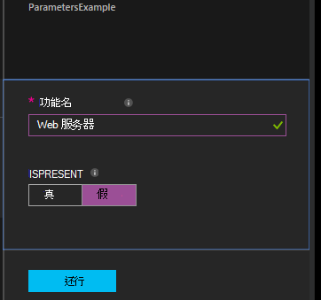

<properties 
   pageTitle="编译在 Azure 自动化 DSC 配置 |Microsoft Azure" 
   description="两种方法进行编译所需状态配置 (DSC) 配置概述︰ 在 Azure 的门户中，并使用 Windows PowerShell。 " 
   services="automation" 
   documentationCenter="na" 
   authors="coreyp-at-msft" 
   manager="stevenka" 
   editor="tysonn"/>

<tags
   ms.service="automation"
   ms.devlang="na"
   ms.topic="article"
   ms.tgt_pltfrm="powershell"
   ms.workload="na" 
   ms.date="01/25/2016"
   ms.author="coreyp"/>
   
#编译在 Azure 自动化 DSC 的配置#

您可以编译所需状态配置 (DSC) 配置与 Azure 自动化的两种方式︰ 在 Azure 的门户中，并使用 Windows PowerShell。 下表将帮助您确定何时使用哪种方法根据每个特征︰ 

###Azure 预览门户###
- 最简单的方法，通过交互式的用户界面
- 窗体中提供简单的参数值
- 轻松跟踪作业状态
- 使用 Azure 的登录身份验证的访问

###Windows PowerShell###
- 从命令行中使用 Windows PowerShell cmdlet 调用
- 可以包含在多个步骤的自动化解决方案
- 提供简单和复杂的参数值
- 跟踪工作状态
- 支持 PowerShell cmdlet 所需的客户端
- 通过配置数据
- 编译使用凭据的配置

一旦决定编译方法，您可以按照下面开始编译的相应过程。

##编译使用 Azure 门户的 DSC 配置##

1.  从自动化您的帐户，单击**配置**。
2.  单击要打开其刀片式服务器的配置。
3.  单击**编译**。
4.  如果配置不了任何参数，将提示您确认是否要对其进行编译。 如果配置参数，**编译配置**刀片式服务器将打开，以便您可以提供参数值。 参数，请参阅下面的<a href="#basic-parameters">**基本参数**</a>部分，以获得详细信息。
5.  **搜集作业**刀片式服务器打开，以便您可以跟踪编译作业的状态和它导致被放置在 Azure 自动化 DSC 拉服务器节点配置 （MOF 配置文档）。

##编译使用 Windows PowerShell 的 DSC 配置##

您可以使用[`Start-AzureRmAutomationDscCompilationJob`](https://msdn.microsoft.com/library/mt244118.aspx)开始使用 Windows PowerShell 进行编译。 下面的代码示例启动一个名为**SampleConfig**的 DSC 配置的编译。

    Start-AzureRmAutomationDscCompilationJob -ResourceGroupName "MyResourceGroup" -AutomationAccountName "MyAutomationAccount" -ConfigurationName "SampleConfig" 
 
`Start-AzureRmAutomationDscCompilationJob`返回编译作业对象，该对象可用于跟踪其状态。 然后，可以使用与此编译作业对象[`Get-AzureRmAutomationDscCompilationJob`](https://msdn.microsoft.com/library/mt244120.aspx)来确定编译作业的状态和[`Get-AzureRmAutomationDscCompilationJobOutput`](https://msdn.microsoft.com/library/mt244103.aspx)来查看其流 （输出）。 下面的代码示例启动**SampleConfig**配置的编译时，将等待，直到它已完成，并显示其流。
    
    $CompilationJob = Start-AzureRmAutomationDscCompilationJob -ResourceGroupName "MyResourceGroup" -AutomationAccountName "MyAutomationAccount" -ConfigurationName "SampleConfig"
    
    while($CompilationJob.EndTime –eq $null -and $CompilationJob.Exception –eq $null)           
    {
        $CompilationJob = $CompilationJob | Get-AzureRmAutomationDscCompilationJob
        Start-Sleep -Seconds 3
    }
    
    $CompilationJob | Get-AzureRmAutomationDscCompilationJobOutput –Stream Any 

##基本参数##

在 DSC 配置，包括参数类型和属性中的参数声明工作 Azure 自动化运行手册一样。 请参阅[启动了 Azure 自动化 runbook](automation-starting-a-runbook.md)了解更多关于 runbook 参数。

下面的示例使用两个参数调用**功能名**和**IsPresent**，以确定在**ParametersExample.sample**节点配置中，在编译期间生成的属性的值。

    Configuration ParametersExample
    {
        param(
            [Parameter(Mandatory=$true)]
    
            [string] $FeatureName,
    
            [Parameter(Mandatory=$true)]
            [boolean] $IsPresent
        )
    
        $EnsureString = "Present"
        if($IsPresent -eq $false)
        {
            $EnsureString = "Absent"
        }
    
        Node "sample"
        {
            WindowsFeature ($FeatureName + "Feature")
            {
                Ensure = $EnsureString
                Name = $FeatureName
            }
        }
    }

您可以编译使用基本参数，在 Azure 自动化 DSC 门户中，或使用 Azure PowerShell 的 DSC 配置︰

###门户网站###

在门户中，可以单击**编译**后输入参数值。

###PowerShell###

PowerShell 需要在[哈希表](http://technet.microsoft.com/library/hh847780.aspx)在其中密钥相匹配的参数名和值等于参数值的参数。

    $Parameters = @{
            "FeatureName" = "Web-Server"
            "IsPresent" = $False
    }
    
    
    Start-AzureRmAutomationDscCompilationJob -ResourceGroupName "MyResourceGroup" -AutomationAccountName "MyAutomationAccount" -ConfigurationName "ParametersExample" -Parameters $Parameters 
    

将 PSCredentials 作为参数传递的信息，请参阅<a href="#credential-assets">**凭据资产**</a>下面。

##配置数据##

**配置数据**可以单独从任何环境特定配置时使用 PowerShell DSC 的结构配置。 [将"内容"与分离 PowerShell DSC 在"位置"](http://blogs.msdn.com/b/powershell/archive/2014/01/09/continuous-deployment-using-dsc-with-minimal-change.aspx)以了解有关**配置数据**的详细信息，请参阅。

>[AZURE.NOTE] 在编译使用 Azure PowerShell 的 Azure 自动化 DSC 中但不是在 Azure 的门户时，您可以使用**配置数据**。

下面的示例 DSC 配置通过**$ConfigurationData**和**$AllNodes**关键字使用**配置数据**。 此外需要为此示例[**xWebAdministration**模块](https://www.powershellgallery.com/packages/xWebAdministration/)︰

     Configuration ConfigurationDataSample
     {
        Import-DscResource -ModuleName xWebAdministration -Name MSFT_xWebsite
    
        Write-Verbose $ConfigurationData.NonNodeData.SomeMessage 
    
        Node $AllNodes.Where{$_.Role -eq "WebServer"}.NodeName
        {
            xWebsite Site
            {
                Name = $Node.SiteName
                PhysicalPath = $Node.SiteContents
                Ensure   = "Present"
            }
        }
    }

您可以编译 PowerShell 的 DSC 配置之上。 PowerShell 下面两个节点配置向服务器中添加 Azure 自动化 DSC 拉︰ **ConfigurationDataSample.MyVM1**和**ConfigurationDataSample.MyVM3**:

    $ConfigData = @{
        AllNodes = @(
            @{
                NodeName = "MyVM1"
                Role = "WebServer"
            },
            @{
                NodeName = "MyVM2"
                Role = "SQLServer"
            },
            @{
                NodeName = "MyVM3"
                Role = "WebServer"
    
            }
    
        )
    
        NonNodeData = @{
            SomeMessage = "I love Azure Automation DSC!"
    
        }
    
    } 
    
    Start-AzureRmAutomationDscCompilationJob -ResourceGroupName "MyResourceGroup" -AutomationAccountName "MyAutomationAccount" -ConfigurationName "ConfigurationDataSample" -ConfigurationData $ConfigData

##资产##

资产的引用是相同的在 Azure 自动化 DSC 配置和运行手册。 请参阅下面的详细信息︰

- [证书](automation-certificates.md)
- [连接](automation-connections.md)
- [凭据](automation-credentials.md)
- [变量](automation-variables.md)

###凭据的资产###
Azure 自动化中的 DSC 配置可以引用凭据资产使用**Get AzureRmAutomationCredential**，凭据资产可以还传递中通过参数，如果需要。 如果配置采用**PSCredential**类型的参数，则需要为该参数的值，而不是 PSCredential 对象传递 Azure 自动化凭据资产的字符串名称。 在幕后，将检索和传递给配置具有该名称的 Azure 自动化凭据资产。

保持凭据中节点的配置 （MOF 配置文档） 安全需要加密节点配置 MOF 文件中的凭据。 Azure 自动化进一步采取这一步并加密整个 MOF 文件。 但是，目前您必须告知 PowerShell DSC 也没关系的凭据以纯文本格式输出节点配置 MOF 在生成期间，因为 PowerShell DSC 不知道后通过搜集作业的生成过程将 Azure 自动化加密整个 MOF 文件。

您可以说 PowerShell DSC 它是正确的凭据将以纯文本格式生成的节点配置使用<a href="#configurationdata">**配置数据**</a>的 Mof 中其输出。 您应该能通过`PSDscAllowPlainTextPassword = $true`通过为每个节点数据块的名称将出现在 DSC 配置并使用凭据的**配置数据**。

下面的示例演示使用自动化凭据资产的 DSC 配置。

    Configuration CredentialSample
    {
       $Cred = Get-AzureRmAutomationCredential -Name "SomeCredentialAsset"
    
        Node $AllNodes.NodeName
        { 
            File ExampleFile
            { 
                SourcePath = "\\Server\share\path\file.ext" 
                DestinationPath = "C:\destinationPath" 
                Credential = $Cred 
            }
        }
    }

您可以编译 PowerShell 的 DSC 配置之上。 PowerShell 下面两个节点配置向服务器中添加 Azure 自动化 DSC 拉︰ **CredentialSample.MyVM1**和**CredentialSample.MyVM2**。

    $ConfigData = @{
        AllNodes = @(
            @{
                NodeName = "*"
                PSDscAllowPlainTextPassword = $True
            },
            @{
                NodeName = "MyVM1"
            },
            @{
                NodeName = "MyVM2"
            }
        )
    }
    
    Start-AzureRmAutomationDscCompilationJob -ResourceGroupName "MyResourceGroup" -AutomationAccountName "MyAutomationAccount" -ConfigurationName "CredentialSample" -ConfigurationData $ConfigData
