<properties
   pageTitle="Azure 自动化 DSC 入门"
   description="解释和在 Azure 自动化所需状态配置 (DSC) 的最常见任务的示例"
   services="automation" 
   documentationCenter="na" 
   authors="eslesar" 
   manager="dongill" 
   editor="tysonn"/>

<tags
   ms.service="automation"
   ms.devlang="na"
   ms.topic="article"
   ms.tgt_pltfrm="powershell"
   ms.workload="na" 
   ms.date="06/06/2016"
   ms.author="magoedte;eslesar"/>
   

# <a name="getting-started-with-azure-automation-dsc"></a>Azure 自动化 DSC 入门

本主题说明如何使用 Azure 自动化所需状态配置 (DSC)，如创建、 导入和编译配置板载计算机管理，和查看报表的最常见任务。 什么是 Azure 自动化 DSC 的概述，请参阅[Azure 自动化 DSC 概述](automation-dsc-overview.md)。 DSC 的文档，请参阅[Windows PowerShell 所需状态配置概述](https://msdn.microsoft.com/PowerShell/dsc/overview)。

本主题提供如何使用 Azure 自动化 DSC 的分步指南。 如果您希望已经不在本主题中描述的步骤设置环境示例，您可以使用[以下的 ARM 模板](https://github.com/azureautomation/automation-packs/tree/master/102-sample-automation-setup)。 此模板将设置为已完成的 Azure 自动化 DSC 环境，包括由 Azure 自动化 DSC Azure VM。
 
## <a name="prerequisites"></a>系统必备组件

若要完成此主题中的示例，具备以下条件︰

- Azure 自动化科目。 有关创建 Azure 自动化运行方式帐户的说明，请参阅[Azure 帐户运行](automation-sec-configure-azure-runas-account.md)。
- Azure 资源管理器虚拟机 （不典型） 运行 Windows Server 2008 R2 或更高版本。 创建虚拟机的说明，请参阅[创建第一个 Windows 虚拟机在 Azure 门户](../virtual-machines/virtual-machines-windows-hero-tutorial.md)

## <a name="creating-a-dsc-configuration"></a>创建 DSC 配置

我们将创建简单的[DSC 配置](https://msdn.microsoft.com/powershell/dsc/configurations)，以确保存在或缺少的**Web 服务器**Windows 功能 (IIS)，具体取决于您将节点的分配。

1. 启动 Windows PowerShell ISE （或任意文本编辑器）。

2. 键入以下文本︰

    ```powershell
    configuration TestConfig
    {
        Node WebServer
        {
            WindowsFeature IIS
            {
                Ensure               = 'Present'
                Name                 = 'Web-Server'
                IncludeAllSubFeature = $true

            }
        }

        Node NotWebServer
        {
            WindowsFeature IIS
            {
                Ensure               = 'Absent'
                Name                 = 'Web-Server'

            }
        }
        }
    ```
3. 将文件保存为`TestConfig.ps1`。

此配置在每个节点块， [WindowsFeature 资源](https://msdn.microsoft.com/powershell/dsc/windowsfeatureresource)，确保的存在或缺乏**Web 服务器**功能调用一个资源。

## <a name="importing-a-configuration-into-azure-automation"></a>将配置导入到 Azure 自动化

接下来，我们会将配置导入自动化帐户。

1. 登录到[Azure 的门户](https://portal.azure.com)。

2. 单击中心菜单上的**所有资源**和自动化帐户的名称。

3. 在**自动化帐户**刀片式服务器，请单击**DSC 配置**。

4. 在**DSC 配置**刀片式服务器，单击**添加配置**。

5. 在**导入配置**刀片式服务器，浏览到`TestConfig.ps1`在您的计算机上的文件。
    
    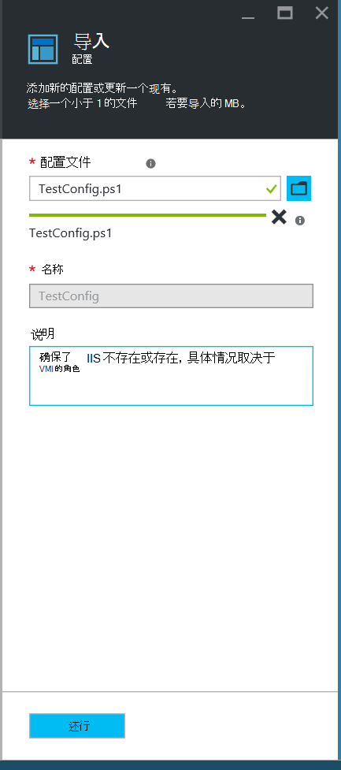
    

6. 单击**确定**。

## <a name="viewing-a-configuration-in-azure-automation"></a>在 Azure 自动化中查看配置

在导入配置之后，可以在 Azure 的门户网站来查看它。

1. 登录到[Azure 的门户](https://portal.azure.com)。

2. 单击中心菜单上的**所有资源**和自动化帐户的名称。

3. 在**自动化帐户**刀片式服务器，请单击**DSC 配置**

4. 在**DSC 配置**刀片式服务器，请单击**TestConfig** （这是您在前面的过程中导入配置的名称）。

5. 在**TestConfig 配置**刀片式服务器，单击**查看配置数据源**。

    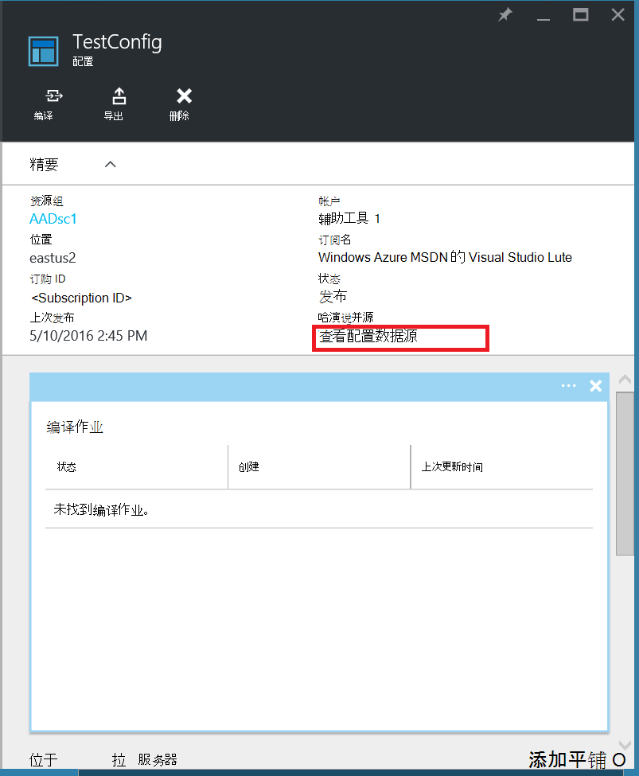
    
    一个**TestConfig 配置源**叶片将打开并显示配置的 PowerShell 代码。
    
## <a name="compiling-a-configuration-in-azure-automation"></a>编译在 Azure 自动化配置

应用到一个节点上的所需的状态之前，必须编译成一个或多个节点的配置 （MOF 文档），并放置在自动化 DSC 拉出服务器上定义该状态的 DSC 配置。 编译在 Azure 自动化 DSC 的配置的详细说明，请参见[编译中 Azure 自动化 DSC 的配置](automation-dsc-compile.md)。 有关编译配置的详细信息，请参阅[DSC 配置](https://msdn.microsoft.com/PowerShell/DSC/configurations)。

1. 登录到[Azure 的门户](https://portal.azure.com)。

2. 单击中心菜单上的**所有资源**和自动化帐户的名称。

3. 在**自动化帐户**刀片式服务器，请单击**DSC 配置**

4. 在**DSC 配置**刀片式服务器，请单击**TestConfig** （以前导入的配置的名称）。

5. 在**TestConfig 配置**刀片式服务器，单击**编译**，然后单击**是**。 这将启动一个编译作业。
    
    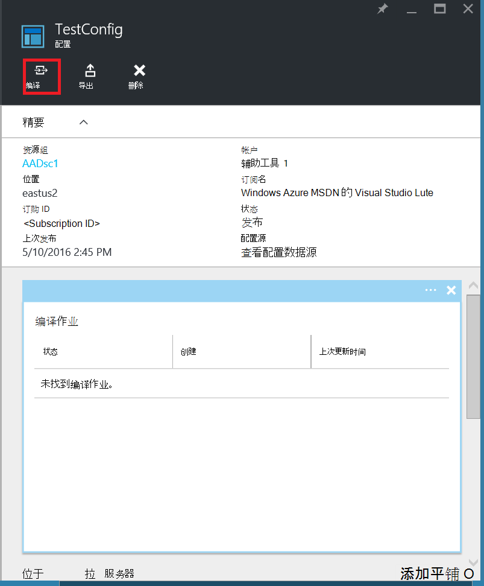
    
> [AZURE.NOTE] 当您编译在 Azure 自动化配置时，自动到拉服务器部署任何创建的节点配置 Mof。

## <a name="viewing-a-compilation-job"></a>查看编译作业

在开始编译后，您可以**配置**刀片式服务器中**的编译作业**拼贴中查看它。 **编译作业**平铺显示当前正在运行，完成，并且失败的作业。 当您打开一个编译作业叶片时，它显示了有关作业包括任何遇到错误或警告的信息，日志配置和编译中使用输入的参数。

1. 登录到[Azure 的门户](https://portal.azure.com)。

2. 单击中心菜单上的**所有资源**和自动化帐户的名称。

3. 在**自动化帐户**刀片式服务器，请单击**DSC 配置**。

4. 在**DSC 配置**刀片式服务器，请单击**TestConfig** （以前导入的配置的名称）。

5. 在**编译作业**图块上的**TestConfig 配置**刀片式服务器，请单击任何列出的作业上。 **搜集作业**刀片式服务器将打开，并标记为编译作业的开始日期。

    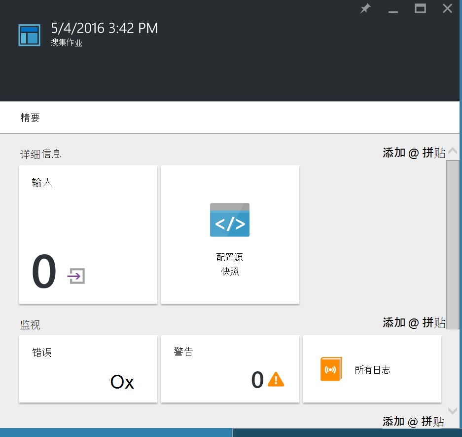
  
6. 单击**编译作业**刀片式服务器以查看更多有关该作业的详细信息在任何倾斜。

## <a name="viewing-node-configurations"></a>查看节点的配置

成功完成编译作业创建一个或多个新的节点配置。 节点配置是 MOF 文档请求服务器，准备拉和应用一个或多个节点的部署。 **DSC 节点配置**刀片式服务器中自动帐户中，您可以查看节点的配置。 节点配置有一个名称与窗体*配置名*。*节点名称*。

1. 登录到[Azure 的门户](https://portal.azure.com)。

2. 单击中心菜单上的**所有资源**和自动化帐户的名称。

3. 在**自动化帐户**刀片式服务器，请单击**DSC 节点的配置**。

    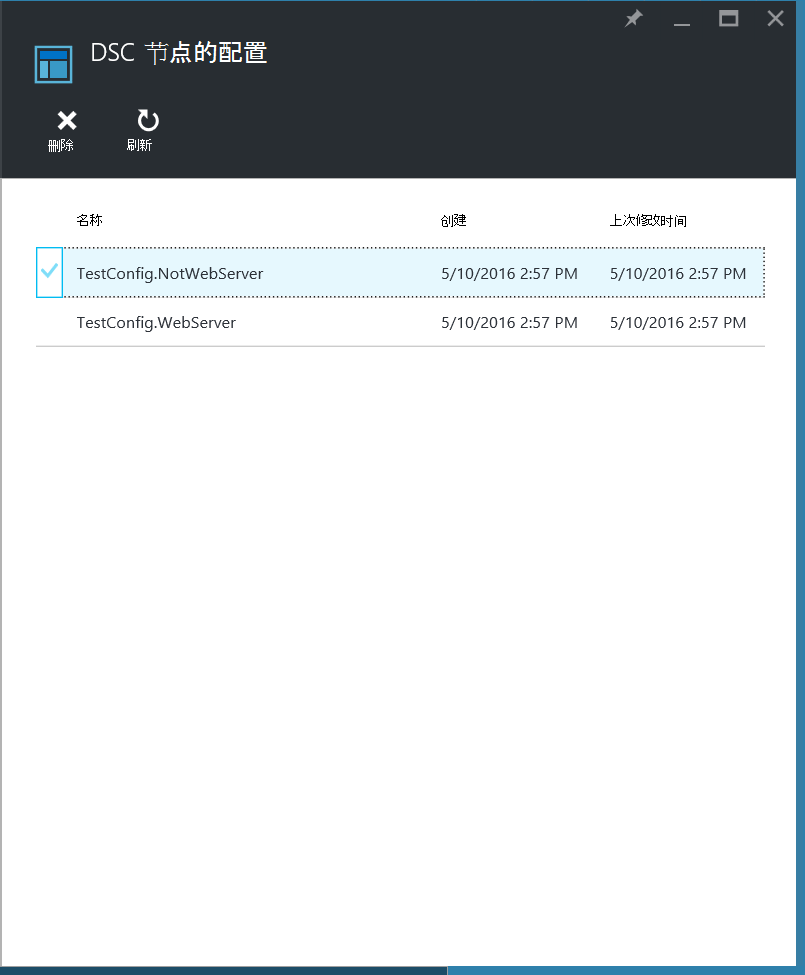
    
## <a name="onboarding-an-azure-vm-for-management-with-azure-automation-dsc"></a>服务管理与 Azure 自动化 DSC Azure VM

Azure 自动化 DSC 可用于管理 Azure Vm （包括经典和资源管理器）、 内部部署的虚拟机，Linux 机、 AWS Vm 和内部的物理计算机。 在本主题中，我们将介绍如何板载只有 Azure 资源管理器虚拟机。 有关板载其他类型的计算机，请参阅[管理 — 通过 Azure 自动化 DSC 的服务机](automation-dsc-onboarding.md)。

### <a name="to-onboard-an-azure-resource-manager-vm-for-management-by-azure-automation-dsc"></a>到板载的 Azure 自动化 DSC 管理 Azure 资源管理器虚拟机

1. 登录到[Azure 的门户](https://portal.azure.com)。

2. 单击中心菜单上的**所有资源**和自动化帐户的名称。

3. 在**自动化帐户**刀片式服务器，请单击**DSC 节点**。

4. 在**DSC 节点**刀片式服务器，请单击**添加 Azure VM**。

    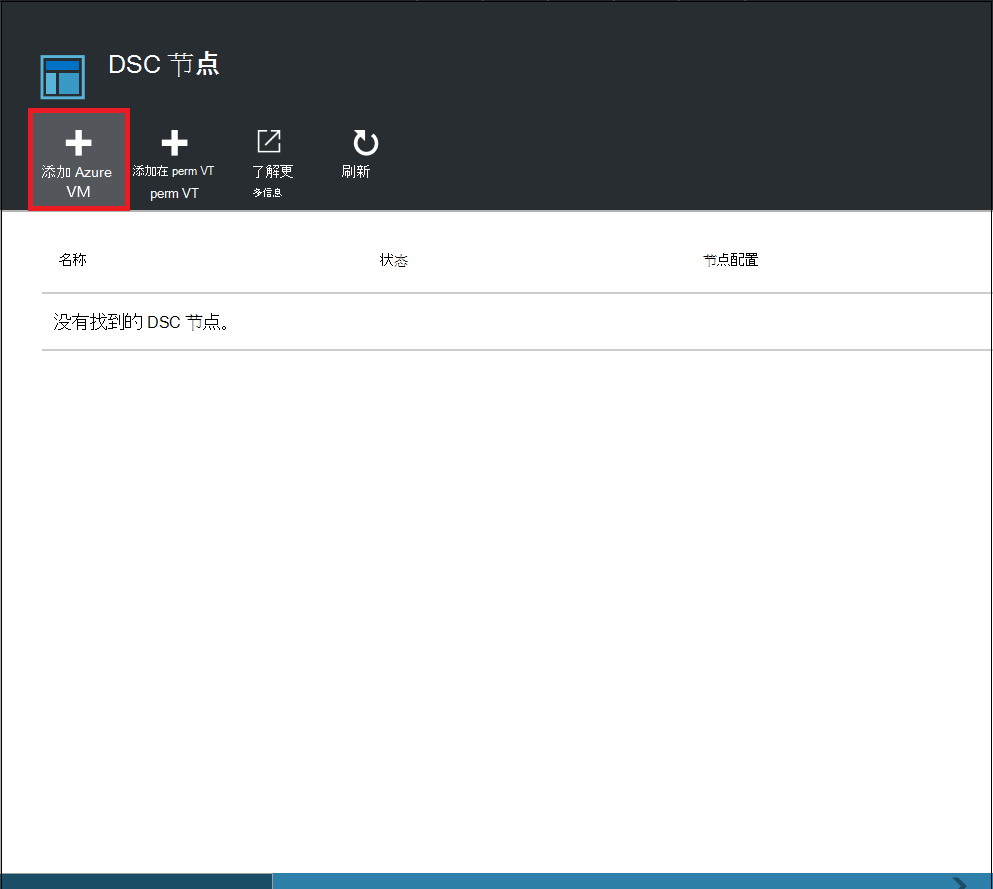

5. 在**添加 Azure Vm**刀片式服务器，单击**选择到板载的虚拟机**。

6. **选择虚拟机**刀片中, 选择虚拟的机所需到板载，然后单击**确定**。

    >[AZURE.IMPORTANT] 这必须是运行 Windows Server 2008 R2 Azure 资源管理器虚拟机或更高版本。
    
7. 在**添加 Azure Vm**刀片式服务器，请单击**配置注册数据**。

8. 在**注册**刀片式服务器，输入您想要应用到的**节点配置名称**框中 VM 的节点配置的名称。 这必须完全匹配的自动化帐户中节点配置的名称。 在这里提供一个名称是可选的。 您可以更改分配的节点配置板载节点之后。
**如果需要重新启动节点**，请检查，然后单击**确定**。
    
    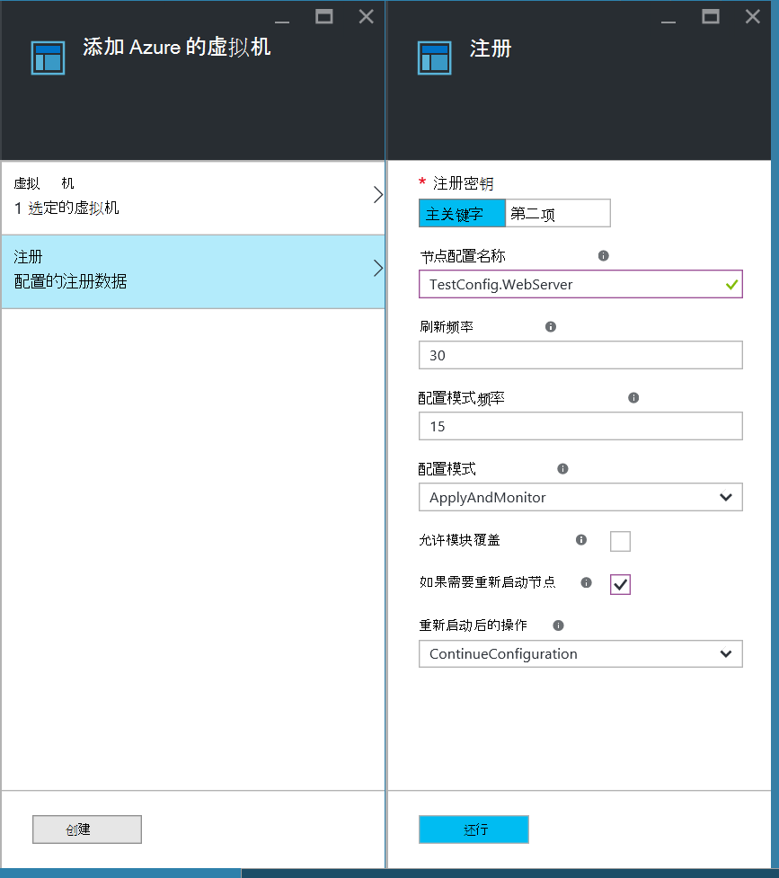
    
    所指定的节点配置将按**配置模式频率**，由指定的时间间隔应用于虚拟机和虚拟机将检查节点配置**刷新的频率**所指定的时间间隔更新。 有关如何使用这些值的详细信息，请参阅[配置本地配置管理器](https://msdn.microsoft.com/PowerShell/DSC/metaConfig)。
    
9. 在**添加 Azure Vm**刀片式服务器，请单击**创建**。

Azure 将启动板载 VM 的过程。 完成时，虚拟机将出现在**DSC 节点**刀片式服务器自动化帐户中。

## <a name="viewing-the-list-of-dsc-nodes"></a>查看 DSC 节点的列表

您可以查看已被 onboarded 在**DSC 节点**刀片式服务器中自动帐户管理的所有计算机的列表。

1. 登录到[Azure 的门户](https://portal.azure.com)。

2. 单击中心菜单上的**所有资源**和自动化帐户的名称。

3. 在**自动化帐户**刀片式服务器，请单击**DSC 节点**。

## <a name="viewing-reports-for-dsc-nodes"></a>查看报表的 DSC 节点

Azure 自动化 DSC 执行一致性检查在受控节点上，每个时间节点发送回请求服务器状态报告。 该节点刀片上，您可以查看这些报告。

1. 登录到[Azure 的门户](https://portal.azure.com)。

2. 单击中心菜单上的**所有资源**和自动化帐户的名称。

3. 在**自动化帐户**刀片式服务器，请单击**DSC 节点**。

4. 在**报告**界面上单击列表中的报告。

    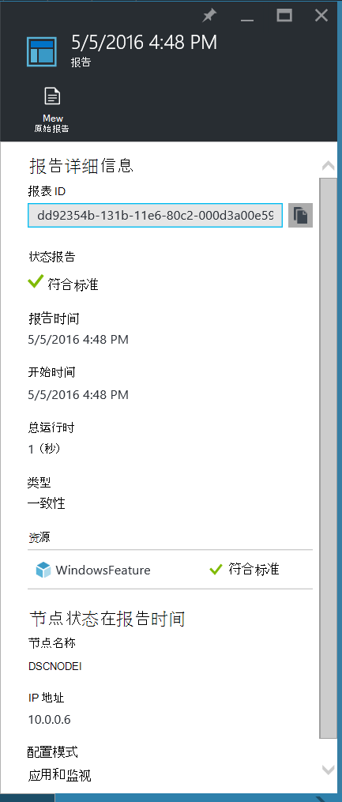

在刀片式服务器的单个报表，您可以看到相应的一致性检查的以下状态信息︰

- 状态报告 — — 该节点是"符合标准"配置为"失败"，还是 （如果该节点是在**applyandmonitor**模式下和机器不在所需的状态），则节点是"不符合"。
- 一致性检查开始时间。
- 总运行一致性检查。
- 一致性检查的类型。
- 所有错误，包括错误代码和错误消息。 
- 在配置和 （节点是否为该资源所需的状态中） 每个资源的状态使用任何 DSC 资源 — — 您可以单击每个资源以获取该资源的更多详细的信息。
- 名称、 IP 地址和节点的配置模式。

您还可以单击**查看原始报表**以查看该节点将发送到服务器的实际数据。 有关使用该数据的详细信息，请参阅[使用 DSC 报表服务器](https://msdn.microsoft.com/powershell/dsc/reportserver)。

可能需要一段时间后节点是 onboarded 第一个报表才可用。 您可能需要等待 30 分钟的第一个报告后板载节点。

## <a name="reassigning-a-node-to-a-different-node-configuration"></a>重新分配到不同的节点配置的节点

您可以指定要使用不同的节点配置与最初分配的节点。

1. 登录到[Azure 的门户](https://portal.azure.com)。

2. 单击中心菜单上的**所有资源**和自动化帐户的名称。

3. 在**自动化帐户**刀片式服务器，请单击**DSC 节点**。

4. 在**DSC 节点**刀片式服务器，请单击要重新分配的节点的名称。

5. 在该节点刀片式服务器，单击**分配的节点**。

    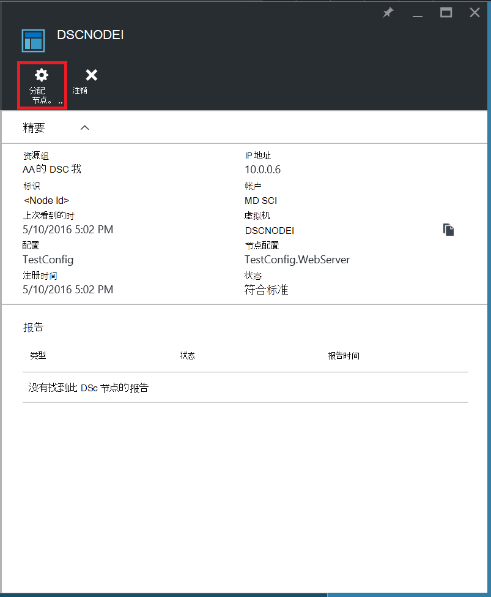

6. **分配节点配置**刀片式服务器，选择您要分配的节点的节点配置，然后单击**确定**。

    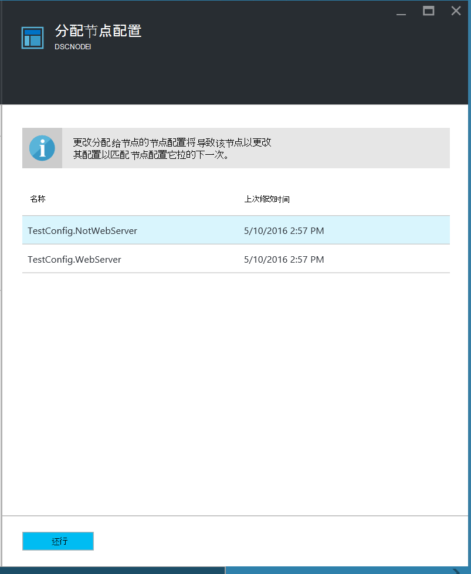
    
## <a name="unregistering-a-node"></a>取消注册节点

如果您不再希望通过 Azure 自动化 DSC 进行管理的节点，您可以注销它的机会。

1. 登录到[Azure 的门户](https://portal.azure.com)。

2. 单击中心菜单上的**所有资源**和自动化帐户的名称。

3. 在**自动化帐户**刀片式服务器，请单击**DSC 节点**。

4. **DSC 节点**刀片式服务器，请单击您想要取消注册的节点的名称。

5. 在该节点刀片式服务器，单击**注销**。

    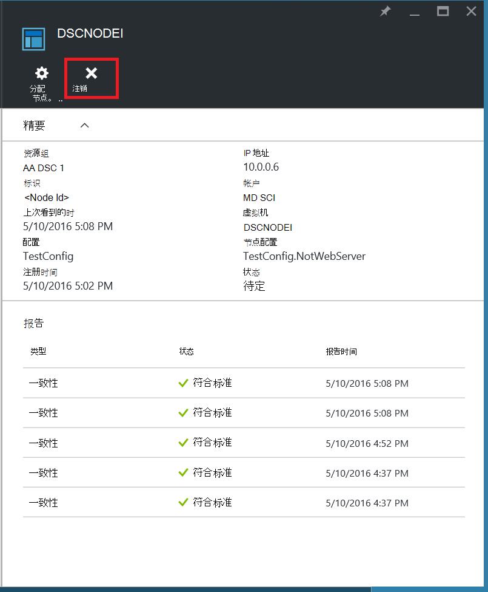

## <a name="related-articles"></a>相关的文章
* [Azure 自动化 DSC 概述](automation-dsc-overview.md)
* [通过 Azure 自动化 DSC 管理服务机](automation-dsc-onboarding.md)
* [Windows PowerShell 所需状态配置概述](https://msdn.microsoft.com/powershell/dsc/overview)
* [Azure 自动化 DSC cmdlet](https://msdn.microsoft.com/library/mt244122.aspx)
* [Azure 自动化 DSC 定价](https://azure.microsoft.com/pricing/details/automation/)

