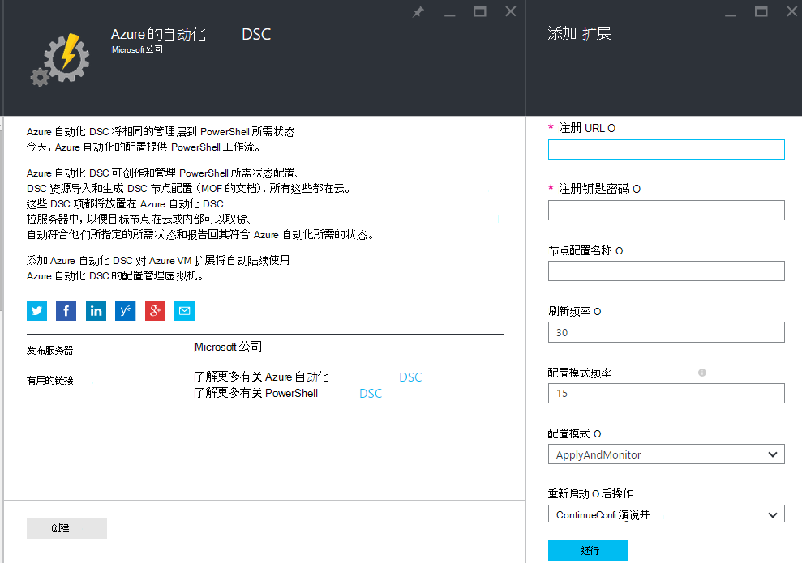
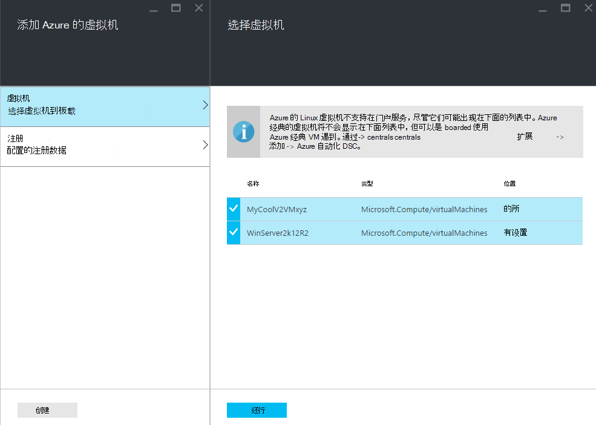
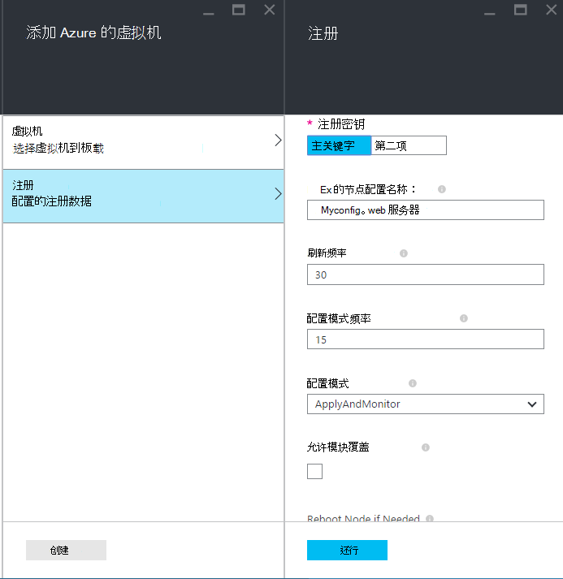
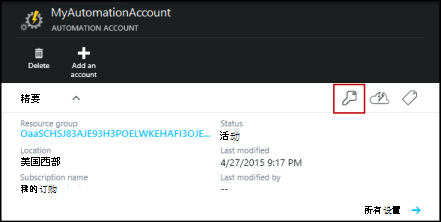
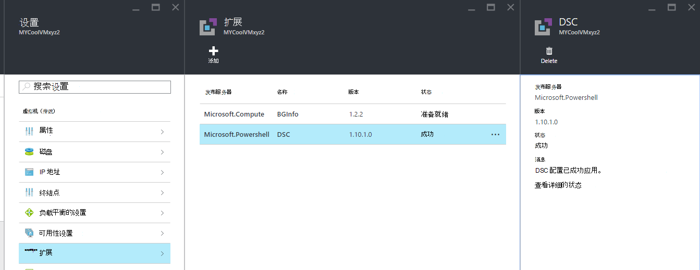

<properties 
   pageTitle="板载物理和虚拟机的管理 — 通过 Azure 自动化 DSC |Microsoft Azure" 
   description="如何设置用于管理 Azure 自动化 DSC 与机" 
   services="automation" 
   documentationCenter="dev-center-name" 
   authors="coreyp-at-msft" 
   manager="stevenka" 
   editor="tysonn"/>

<tags
   ms.service="automation"
   ms.devlang="NA"
   ms.topic="article"
   ms.tgt_pltfrm="powershell"
   ms.workload="TBD" 
   ms.date="04/22/2016"
   ms.author="coreyp"/>

# 通过 Azure 自动化 DSC 管理服务机

## 为什么管理 Azure 自动化 DSC 的计算机？

如[PowerShell 所需状态配置](https://technet.microsoft.com/library/dn249912.aspx)，Azure 自动化所需状态配置任何云或内部数据中心中是 DSC 节点 （物理机和虚拟机） 的简单但功能强大，配置管理服务。 它使可扩展性各地成千上万台机器的快速而轻松地从一个集中、 安全的位置。 您可以轻松地板载计算机，它们声明的配置和查看报表显示每个计算机的分配的法规遵从性到您指定的所需状态。 DSC 是 Azure 自动化 DSC 管理层 Azure 自动化管理层是什么 PowerShell 脚本编写。 换句话说，Azure 自动化可帮助您管理 PowerShell 脚本一样，它还有助于您管理 DSC 配置。 若要了解有关使用 Azure 自动化 DSC 的优点的详细信息，请参阅[Azure 自动化 DSC 概述](automation-dsc-overview.md)。 

Azure 自动化 DSC 可以用于管理各种不同的计算机︰

*    Azure 的虚拟机 （传统）
*    Azure 的虚拟机
*    Amazon Web 服务 (AWS) 虚拟机
*    物理/虚拟 Windows 机器上部署或非 Azure/AWS 云中
*    物理/虚拟 Linux 机器内部，在 Azure，或非 Azure 的云

此外，如果不准备从云管理计算机配置，可以还作为仅报告终结点使用 Azure 自动化 DSC。 这使您可以设置通过 DSC 场所 （强制） 所需的配置和查看节点符合 Azure 自动化中所需状态的丰富报告的详细信息。

以下部分概述如何板载每种类型的计算机添加到 Azure 自动化 DSC。

## Azure 的虚拟机 （传统）

使用 Azure 自动化 DSC，可以轻松地板载 Azure 虚拟机 （经典） 使用 Azure 的门户网站或 PowerShell 的配置管理。 决窍，并且无需管理员进行远程虚拟机进入，Azure VM 所需状态配置扩展注册 Azure 自动化 DSC VM。 由于 Azure VM 所需状态配置扩展异步运行跟踪其进度或疑难解答步骤它下面的[**故障排除 Azure 虚拟机的服务**](#troubleshooting-azure-virtual-machine-onboarding)部分中提供。

### Azure 门户

在[Azure 的门户](http://portal.azure.com/)中，单击**浏览** -> **（传统） 的虚拟机**。 选择所需到板载 Windows 虚拟机。 虚拟机的仪表板刀片式服务器，请单击**所有设置** -> **扩展** -> **添加** -> **Azure 自动化 DSC** -> **创建**。 输入所需的用例、 自动化帐户的注册密钥和注册 URL 和可选节点配置分配给 VM 的[PowerShell DSC 本地配置管理器的值](https://msdn.microsoft.com/powershell/dsc/metaconfig4)。

要查找注册 URL 和自动化的关键帐户到板载计算机，请参阅下面的[**安全注册**](#secure-registration)部分。

### PowerShell

    # log in to both Azure Service Management and Azure Resource Manager
    Add-AzureAccount
    Add-AzureRmAccount
    
    # fill in correct values for your VM/Automation account here
    $VMName = ""
    $ServiceName = ""
    $AutomationAccountName = ""
    $AutomationAccountResourceGroup = ""

    # fill in the name of a Node Configuration in Azure Automation DSC, for this VM to conform to
    $NodeConfigName = ""

    # get Azure Automation DSC registration info
    $Account = Get-AzureRmAutomationAccount -ResourceGroupName $AutomationAccountResourceGroup -Name $AutomationAccountName
    $RegistrationInfo = $Account | Get-AzureRmAutomationRegistrationInfo

    # use the DSC extension to onboard the VM for management with Azure Automation DSC
    $VM = Get-AzureVM -Name $VMName -ServiceName $ServiceName
    
    $PublicConfiguration = ConvertTo-Json -Depth 8 @{
      SasToken = ""
      ModulesUrl = "https://eus2oaasibizamarketprod1.blob.core.windows.net/automationdscpreview/RegistrationMetaConfigV2.zip"
      ConfigurationFunction = "RegistrationMetaConfigV2.ps1\RegistrationMetaConfigV2"

    # update these PowerShell DSC Local Configuration Manager defaults if they do not match your use case.
    # See https://technet.microsoft.com/library/dn249922.aspx?f=255&MSPPError=-2147217396 for more details
     Properties = @{
        RegistrationKey = @{
          UserName = 'notused'
          Password = 'PrivateSettingsRef:RegistrationKey'
        }
        RegistrationUrl = $RegistrationInfo.Endpoint
        NodeConfigurationName = $NodeConfigName
        ConfigurationMode = "ApplyAndMonitor"
        ConfigurationModeFrequencyMins = 15
        RefreshFrequencyMins = 30
        RebootNodeIfNeeded = $False
        ActionAfterReboot = "ContinueConfiguration"
        AllowModuleOverwrite = $False
      }
    }

    $PrivateConfiguration = ConvertTo-Json -Depth 8 @{
      Items = @{
         RegistrationKey = $RegistrationInfo.PrimaryKey
      }
    }
    
    $VM = Set-AzureVMExtension `
     -VM $vm `
     -Publisher Microsoft.Powershell `
     -ExtensionName DSC `
     -Version 2.19 `
     -PublicConfiguration $PublicConfiguration `
     -PrivateConfiguration $PrivateConfiguration `
     -ForceUpdate

    $VM | Update-AzureVM

## Azure 的虚拟机

Azure 自动化 DSC 可以轻松板载 Azure 的虚拟机的配置管理，使用 Azure 门户、 Azure 资源管理器模板或 PowerShell。 决窍，并且无需管理员进行远程虚拟机进入，Azure VM 所需状态配置扩展注册 Azure 自动化 DSC VM。 由于 Azure VM 所需状态配置扩展异步运行跟踪其进度或疑难解答步骤它下面的[**故障排除 Azure 虚拟机的服务**](#troubleshooting-azure-virtual-machine-onboarding)部分中提供。

### Azure 门户

在[Azure 的门户网站](https://portal.azure.com/)中，导航到 Azure 自动化帐户放置到板载的虚拟机。 在自动化帐户仪表板，请单击**DSC 节点** -> **添加 Azure VM**。

在**选择虚拟机到板载**请选择一个或多个 Azure 虚拟机到板载。

在**配置注册数据**，输入[PowerShell DSC 本地配置管理器的值](https://msdn.microsoft.com/powershell/dsc/metaconfig4)和所需的使用案例中，可以选择节点配置分配给 VM。

 
### Azure 的资源管理器模板

可以部署 azure 的虚拟机和 onboarded 到 Azure 自动化 DSC 通过 Azure 资源管理器模板。 请参阅[配置通过 DSC 扩展和 Azure 自动化 DSC VM](https://azure.microsoft.com/documentation/templates/dsc-extension-azure-automation-pullserver/)模板示例 Azure 自动化 DSC 对现有虚拟机，onboards。 要查找注册密钥和采取注册 URL 作为输入此模板中，请参阅下面的[**安全注册**](#secure-registration)部分。

### PowerShell

在 Azure 门户 PowerShell 通过板载的虚拟机可用于[登记 AzureRmAutomationDscNode](https://msdn.microsoft.com/library/mt603833.aspx) cmdlet。

## Amazon Web 服务 (AWS) 虚拟机

您可以轻松地板载 Amazon Web 服务虚拟机通过使用 AWS DSC Toolkit Azure 自动化 DSC 的配置管理。 您可以了解更多有关工具包[此处](https://blogs.msdn.microsoft.com/powershell/2016/04/20/aws-dsc-toolkit/)。

## 物理/虚拟 Windows 机器上部署或非 Azure/AWS 云中

内部部署 Windows 计算机和 Windows 计算机中 （例如，Amazon Web 服务） 的非 Azure 云也可以到 Azure 自动化 DSC，onboarded，只要它们具有出站访问互联网，通过几个简单步骤︰

1. 请确保要到 Azure 自动化 DSC 板载计算机上安装最新版本的[WMF 5](http://aka.ms/wmf5latest) 。
2. 按照部分[**生成 DSC metaconfigurations**](#generating-dsc-metaconfigurations)下面生成文件夹包含所需的 DSC metaconfigurations 中的说明进行操作。
3. 希望到板载计算机到远程应用 PowerShell DSC metaconfiguration。 **从运行此命令的计算机必须具有[WMF 5](http://aka.ms/wmf5latest)安装最新版本**︰

    `Set-DscLocalConfigurationManager -Path C:\Users\joe\Desktop\DscMetaConfigs -ComputerName MyServer1, MyServer2`

4. 如果您不能远程应用 PowerShell DSC metaconfigurations，复制到每台计算机上的步骤 2 中到板载的 metaconfigurations 文件夹。 然后到板载的每台计算机上本地调用**一组 DscLocalConfigurationManager** 。
5. 使用 Azure 门户或 cmdlet，检查，到板载计算机现在显示为 DSC 节点注册 Azure 自动化帐户中。

## 物理/虚拟 Linux 机器内部，在 Azure，或非 Azure 的云

内部部署 Linux 机器、 在 Azure，Linux 机器和非 Azure 群中的 Linux 机器也可以到 Azure 自动化 DSC，onboarded，只要它们具有出站访问互联网，通过几个简单步骤︰

1. 请确保要到 Azure 自动化 DSC 板载计算机上安装最新版本的[DSC Linux 代理](http://www.microsoft.com/download/details.aspx?id=49150)。

2. 如果[PowerShell DSC 本地配置管理器的默认值](https://msdn.microsoft.com/powershell/dsc/metaconfig4)匹配您的使用情况，并希望到板载计算机等，它们**都**从拉出，并报告给 Azure 自动化 DSC:

    *    在板载到 Azure 自动化 DSC 对每个 Linux 计算机上，使用 Register.py 板载使用 PowerShell DSC 本地配置管理器的默认值︰

        `/opt/microsoft/dsc/Scripts/Register.py <Automation account registration key> <Automation account registration URL>`

    *    若要查找自动化帐户注册密钥和注册 URL，请参阅下面的[**安全注册**](#secure-registration)部分。

    如果 PowerShell DSC 本地配置管理器默认值******不**匹配您的用例，或希望到板载计算机以便它们只报告到 Azure 自动化 DSC，但从它不要不拉配置或 PowerShell 模块，请按照步骤 3 到 6。 否则，请继续第 6 步。

3.  请按照下面来生成包含所需的 DSC metaconfigurations 文件夹[**生成 DSC metaconfigurations**](#generating-dsc-metaconfigurations)部分中的说明进行操作。
4.  希望到板载计算机到远程应用 PowerShell DSC metaconfiguration:
        
        $SecurePass = ConvertTo-SecureString -String "<root password>" -AsPlainText -Force
        $Cred = New-Object System.Management.Automation.PSCredential "root", $SecurePass
        $Opt = New-CimSessionOption -UseSsl -SkipCACheck -SkipCNCheck -SkipRevocationCheck

        # need a CimSession for each Linux machine to onboard
        
        $Session = New-CimSession -Credential $Cred -ComputerName <your Linux machine> -Port 5986 -Authentication basic -SessionOption $Opt
        
        Set-DscLocalConfigurationManager -CimSession $Session –Path C:\Users\joe\Desktop\DscMetaConfigs
    
从运行此命令的计算机必须具有[WMF 5](http://aka.ms/wmf5latest)安装最新版本。

5.  如果您不能远程应用 PowerShell DSC metaconfigurations 的板载，每个 Linux 计算机复制 metaconfiguration 从在步骤 5 中的 Linux 计算机上的文件夹对应于该计算机。 然后调用`SetDscLocalConfigurationManager.py`本地每个 Linux 计算机上所需到 Azure 自动化 DSC 对板载︰

    `/opt/microsoft/dsc/Scripts/SetDscLocalConfigurationManager.py –configurationmof <path to metaconfiguration file>`

6.  使用 Azure 门户或 cmdlet，检查，到板载计算机现在显示为 DSC 节点注册 Azure 自动化帐户中。

##生成的 DSC metaconfigurations
对一般板载任何计算机到 Azure 自动化 DSC，DSC metaconfiguration 可以是生成的在应用时，在计算机从拉和/或报告给 Azure 自动化 DSC 告诉 DSC 代理。 可以使用 PowerShell DSC 配置或 Azure 自动化 PowerShell cmdlet 生成 Azure 自动化 DSC 的 DSC metaconfigurations。

**注意︰**DSC metaconfigurations 包含机密信息，需要到板载自动化的计算机帐户的管理。 请确保正确地保护任何 DSC metaconfigurations 创建，或者在使用后将其删除。

###使用 DSC 配置
1.  在您的本地环境中的计算机打开 PowerShell ISE 作为管理员。 计算机必须拥有[WMF 5](http://aka.ms/wmf5latest)安装最新版本。

2.  复制本地下面的脚本。 此脚本包含用于创建 metaconfigurations 和一个命令以启动 metaconfiguration 创建了 PowerShell DSC 配置。
    
        # The DSC configuration that will generate metaconfigurations
        [DscLocalConfigurationManager()]
        Configuration DscMetaConfigs 
        { 
            param 
            ( 
                [Parameter(Mandatory=$True)] 
                [String]$RegistrationUrl,
         
                [Parameter(Mandatory=$True)] 
                [String]$RegistrationKey,

                [Parameter(Mandatory=$True)] 
                [String[]]$ComputerName,

                [Int]$RefreshFrequencyMins = 30, 
            
                [Int]$ConfigurationModeFrequencyMins = 15, 
            
                [String]$ConfigurationMode = "ApplyAndMonitor", 
            
                [String]$NodeConfigurationName,

                [Boolean]$RebootNodeIfNeeded= $False,

                [String]$ActionAfterReboot = "ContinueConfiguration",

                [Boolean]$AllowModuleOverwrite = $False,

                [Boolean]$ReportOnly
            )

    
            if(!$NodeConfigurationName -or $NodeConfigurationName -eq "") 
            { 
                $ConfigurationNames = $null 
            } 
            else 
            { 
                $ConfigurationNames = @($NodeConfigurationName) 
            }

            if($ReportOnly)
            {
               $RefreshMode = "PUSH"
            }
            else
            {
               $RefreshMode = "PULL"
            }

            Node $ComputerName
            {

                Settings 
                { 
                    RefreshFrequencyMins = $RefreshFrequencyMins 
                    RefreshMode = $RefreshMode 
                    ConfigurationMode = $ConfigurationMode 
                    AllowModuleOverwrite = $AllowModuleOverwrite 
                    RebootNodeIfNeeded = $RebootNodeIfNeeded 
                    ActionAfterReboot = $ActionAfterReboot 
                    ConfigurationModeFrequencyMins = $ConfigurationModeFrequencyMins 
                }

                if(!$ReportOnly)
                {
                   ConfigurationRepositoryWeb AzureAutomationDSC 
                    { 
                        ServerUrl = $RegistrationUrl 
                        RegistrationKey = $RegistrationKey 
                        ConfigurationNames = $ConfigurationNames 
                    }

                    ResourceRepositoryWeb AzureAutomationDSC 
                    { 
                       ServerUrl = $RegistrationUrl 
                       RegistrationKey = $RegistrationKey 
                    }
                }

                ReportServerWeb AzureAutomationDSC 
                { 
                    ServerUrl = $RegistrationUrl 
                    RegistrationKey = $RegistrationKey 
                }
            } 
        }
        
        # Create the metaconfigurations
        # TODO: edit the below as needed for your use case
        $Params = @{
             RegistrationUrl = '<fill me in>';
             RegistrationKey = '<fill me in>';
             ComputerName = @('<some VM to onboard>', '<some other VM to onboard>');
             NodeConfigurationName = 'SimpleConfig.webserver';
             RefreshFrequencyMins = 30;
             ConfigurationModeFrequencyMins = 15;
             RebootNodeIfNeeded = $False;
             AllowModuleOverwrite = $False;
             ConfigurationMode = 'ApplyAndMonitor';
             ActionAfterReboot = 'ContinueConfiguration';
             ReportOnly = $False;  # Set to $True to have machines only report to AA DSC but not pull from it
        }
        
        # Use PowerShell splatting to pass parameters to the DSC configuration being invoked
        # For more info about splatting, run: Get-Help -Name about_Splatting
        DscMetaConfigs @Params

3.  自动化您的帐户，以及到板载计算机的名称填充的注册密钥和 URL。 所有其他参数都是可选的。 若要查找自动化帐户注册密钥和注册 URL，请参阅下面的[**安全注册**](#secure-registration)部分。

4.  如果您想报告到 Azure 自动化 DSC，DSC 状态信息，但不纳入配置或 PowerShell 模块的计算机，请**ReportOnly**参数设置为 true。

5.  运行该脚本。 现在应该已经在工作目录中，名为**DscMetaConfigs**的文件夹包含到板载计算机 PowerShell DSC metaconfigurations。

###使用 Azure 自动化 cmdlet
如果 PowerShell DSC 本地配置管理器的默认值匹配您的使用情况，并希望到板载计算机以便它们都从拉出，并报告给 Azure 自动化 DSC，Azure 自动化 cmdlet 提供生成所需的 DSC metaconfigurations 的简化的方法︰

1.  在您的本地环境中的计算机中打开 PowerShell 控制台或以管理员身份 PowerShell ISE。

2.  连接到 Azure 资源管理器使用**添加 AzureRmAccount**

3.  从要到板载节点的自动化到板载下载所需的计算机 PowerShell DSC metaconfigurations:

        # Define the parameters for Get-AzureRmAutomationDscOnboardingMetaconfig using PowerShell Splatting
        $Params = @{
            ResourceGroupName = 'ContosoResources'; # The name of the ARM Resource Group that contains your Azure Automation Account
            AutomationAccountName = 'ContosoAutomation'; # The name of the Azure Automation Account where you want a node on-boarded to
            ComputerName = @('web01', 'web02', 'sql01'); # The names of the computers that the meta configuration will be generated for
            OutputFolder = "$env:UserProfile\Desktop\";
        }
        
        # Use PowerShell splatting to pass parameters to the Azure Automation cmdlet being invoked
        # For more info about splatting, run: Get-Help -Name about_Splatting
        Get-AzureRmAutomationDscOnboardingMetaconfig @Params

您现在应该拥有一个名为***DscMetaConfigs***，包含到板载计算机 PowerShell DSC metaconfigurations 文件夹。

##安全注册

机器安全板载可以到 Azure 自动化客户通过 WMF 5 DSC 注册协议，它允许对 （包括 Azure 自动化 DSC） PowerShell DSC V2 拉或报表服务器进行身份验证的 DSC 节点。 该节点注册到一个**注册 URL**，使用**注册密钥**进行身份验证的服务器。 在注册期间，DSC 节点和 DSC 拉/报告服务器协商此节点可用于身份验证到服务器后注册的唯一证书。 此过程可以防止从模拟一个另一个，例如，如果一个节点受到威胁和恶意行为的 onboarded 节点。 注册后的注册密钥不用于身份验证，并从该节点中删除。

您可以在 Azure 预览门户**管理密钥**刀片式服务器从 DSC 注册协议所需的信息。 通过单击自动化帐户的**精要**面板上的钥匙图标打开此刀片。

*    注册 URL 是管理密钥刀片式服务器中的 URL 字段。
*    注册密钥管理密钥刀片式服务器中是主键访问或辅助的访问键。 可以使用任意密钥。

为了增加安全性，自动化客户的主要和次要访问键可以重新生成 （在**管理密钥**刀片式服务器） 上的任何时候以防止将来的节点注册使用以前的密钥。

##故障排除 Azure 虚拟机服务

Azure 自动化 DSC 可以轻松板载 Azure Windows 虚拟机的配置管理。 在后台，Azure VM 所需状态配置扩展用于注册 Azure 自动化 DSC VM。 由于 Azure VM 所需状态配置扩展以异步方式运行，跟踪其进度和解决其执行可能重要。 

>[AZURE.NOTE] 板载 Azure 自动化 DSC 使用 Azure VM 所需状态配置扩展到 Azure Windows VM 的任何方法可能长达节点以显示在 Azure 自动化中注册为一个小时。 这是因为 Windows 管理框架 5.0 在 Azure VM DSC 扩展，是需要到板载 VM 安装到 Azure 自动化 DSC VM。

要解决或查看 Azure VM 所需状态配置扩展的状态，在 Azure 门户导航到虚拟机正在 onboarded，然后单击->**所有设置** -> **扩展** -> **DSC**。 有关详细信息，您可以单击**查看详细的状态**。

## 证书过期和注册

作为在 Azure 自动化 DSC DSC 节点注册计算机之后, 有多种原因，您可能需要在以后重新注册该节点︰

* 注册后，每个节点自动协商唯一的证书进行身份验证，将在一年后到期。 目前，PowerShell DSC 注册协议无法自动续订证书，他们即将到期，因此需要一年的时间后重新注册节点时。 前重新注册，请确保每个节点正在运行 Windows 管理框架 5.0 RTM。 如果节点的身份验证证书已过期，并且没有注册该节点，该节点将不能与 Azure 自动化通信和将被标记为 Unresponsive。 注册执行 90 天或更少从证书有效期，或证书的过期时间，随时会导致正在生成和使用的新证书。

* 若要更改任何设置在初始注册的节点，如 ConfigurationMode 的[PowerShell DSC 本地配置管理器的值](https://msdn.microsoft.com/powershell/dsc/metaconfig4)。 目前，这些 DSC 代理值只能通过注册更改。 这个例外就是分配给节点的节点配置--这可以直接更改在 Azure 自动化 DSC。

注册可以注册该节点开始，使用本文档中所述的服务任何的方法相同的方式执行。 不需要重新注册它之前注销从 Azure 自动化 DSC 的节点。

## 相关的文章
* [Azure 自动化 DSC 概述](automation-dsc-overview.md)
* [Azure 自动化 DSC cmdlet](https://msdn.microsoft.com/library/mt244122.aspx)
* [Azure 自动化 DSC 定价](https://azure.microsoft.com/pricing/details/automation/)

