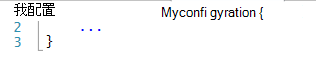
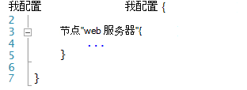
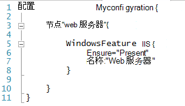
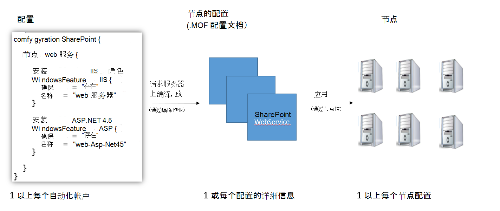
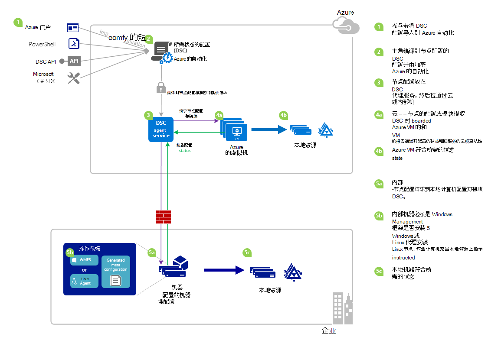

<properties 
   pageTitle="Azure 自动化 DSC 概述 |Microsoft Azure" 
   description="概述的 Azure 自动化所需状态配置 (DSC)、 其条款和已知的问题" 
   services="automation" 
   documentationCenter="dev-center-name" 
   authors="coreyp-at-msft" 
   manager="stevenka" 
   editor="tysonn"
   keywords="powershell dsc、 所需的状态配置、 powershell dsc azure"/>

<tags
   ms.service="automation"
   ms.devlang="NA"
   ms.topic="article"
   ms.tgt_pltfrm="powershell"
   ms.workload="TBD" 
   ms.date="05/10/2016"
   ms.author="magoedte;coreyp"/>

# Azure 自动化 DSC 概述 #

##Azure 自动化 DSC 是什么？##
部署和维护所需的服务器和应用程序资源状态可以是乏味而且容易出错。 使用 Azure 自动化所需状态配置 (DSC)，可以以一致的方式部署、 可靠地监视和自动更新所有 IT 资源，在规模较大的云所需的状态。 基于 PowerShell DSC，自动化 DSC 可以调整计算机配置与使用 Windows 或 Linux，某个特定状态跨物理机和虚拟机 (Vm) 和云或内部。 您可以启用连续统一的控制与的 IT 服务提供和轻松地管理跨您的异构混合 IT 环境的快速变化。

Azure 自动化 DSC 生成 PowerShell DSC，以提供更方便的配置管理经验中引入的基础之上。 Azure 自动化 DSC [PowerShell 所需状态配置](https://msdn.microsoft.com/powershell/dsc/overview)为随着 Azure 自动化提供了 PowerShell 今天脚本，带来了相同的管理层。

Azure 自动化 DSC[创作和管理 PowerShell 所需状态配置](https://technet.microsoft.com/library/dn249918.aspx)，允许您导入[DSC 的资源](https://technet.microsoft.com/library/dn282125.aspx)，并生成 DSC 节点配置 （MOF 的文档），所有这些都在云。 这些 DSC 项都将放置在 Azure 自动化[DSC 拉服务器](https://technet.microsoft.com/library/dn249913.aspx)中，以便目标节点 （如物理机和虚拟机） 在云或内部可以取货、 自动符合他们所指定的所需状态和报告回其符合 Azure 自动化所需的状态。

更喜欢观看与阅读？ 看看下面视频从五月 2015，首次宣布推出 Azure 自动化 DSC。 **注意︰**时的概念和讨论在该视频中的生命周期是正确的因为这段视频录制 Azure 自动化 DSC 已有了很多进展。 它现已可用，在 Azure 的门户中，有一个更全面的用户界面并支持许多其他功能。

> [AZURE.VIDEO microsoft-ignite-2015-heterogeneous-configuration-management-using-microsoft-azure-automation]

## Azure 自动化 DSC 条款 ##
### 配置 ###
PowerShell DSC 引入了一个新的概念，称为配置。 配置允许您通过 PowerShell 语法定义您的环境所需的状态。 若要使用 DSC 配置您的环境，首先定义 Windows PowerShell 脚本块使用配置关键字，然后其后应跟一个标识符，然后用大括号 （{}） 来分隔块。

在配置块内部，您可以定义指定所需的配置应该是您环境中的节点 （计算机） 的一组配置完全相同的节点配置块。 这种方法，节点配置表示为一个或多个节点，采用"角色"。 节点配置块开头的节点关键字。 按照此关键字的角色，可以是变量或表达式的名称。 在角色名称之后，使用大括号 {} 来分隔节点配置块。

 
在节点配置块中，可以定义资源块配置特定的 DSC 资源。 资源块开头的资源，跟您想指定块，然后花括号 {} 来分隔块的标识符的名称。

有关更详细的配置关键字的信息，请参阅︰[了解配置关键字所需状态配置中](http://blogs.msdn.com/b/powershell/archive/2013/11/05/understanding-configuration-keyword-in-desired-state-configuration.aspx "所需状态配置中了解配置关键字")

运行 （编译） DSC 配置将生成一个或多个 DSC 节点配置 （MOF 的文档），它们是 DSC 节点应用为符合所需的状态。

Azure 自动化 DSC 可以导入，作者，以及编译 DSC 配置在 Azure 自动化，类似于如何运行手册可以被导入，编写的并开始在 Azure 自动化。

>[AZURE.IMPORTANT] 一种配置应包含具有相同名称的配置，在 Azure 自动化 DSC 的只有一个配置块。 

###节点配置###

DSC 配置编译时，根据在配置中的节点块生成一个或多个节点的配置。 节点配置等同为"MOF"或"配置文档"（如果您熟悉这些 PS DSC 术语），并表示"角色"，如 web 服务器或工作人员，所需的一个或多个节点应该承担，或检查有针对法规遵从性的状态。 在 Azure 自动化 DSC 的节点配置名称的"配置 Name.NodeConfigurationBlockName"的形式。

PS DSC 节点的节点的配置，它们应该制定通过 DSC 推或拉的方法意识。 Azure 自动化 DSC 依赖 DSC 拉取法，其中节点请求节点的配置将从 Azure 自动化 DSC 拉服务器。 因为节点对 Azure 自动化 DSC 进行请求，节点可以是防火墙之后，可以将所有入站端口封闭等。他们只需要出站 Internet 访问权限 （直接或通过代理服务器）。

###节点###

DSC 节点是由 DSC 其配置的任何计算机。 这可能是 Windows 或 Linux Azure VM 内部部署虚拟机 / 物理主机或另一个公共云中的机器。 节点制定管理节点的配置会变得和维护遵守所需的状态，它们定义了，而且还可以回报表服务器的配置状态和法规遵从性和所需状态报告。

Azure 自动化 DSC 轻松的 Azure 自动化 DSC 的管理节点的服务，并允许更改分配给每个节点服务器端，因此节点检查服务器上的说明将承担不同的角色并更改其配置和符合性状态的下一次它应报告对匹配的节点配置。

###资源###
DSC 资源是可用于定义 Windows PowerShell 所需状态配置 (DSC) 配置的构建基块。 DSC 附带了一组内置的资源，如文件和文件夹、 服务器的功能和角色、 注册表设置、 环境变量和服务和流程。 若要了解有关内置 DSC 资源以及如何使用它们的完整列表，请参阅[内置 Windows PowerShell 所需状态配置资源](https://technet.microsoft.com/library/dn249921.aspx)。

DSC 资源也导入作为 PowerShell 模块以扩展的一套内置的 DSC 资源的一部分。 如果该节点为了制定一个节点配置中包含对这些资源的引用，将由 DSC 节点从 DSC 拉服务器，拉非默认资源。 若要了解如何创建自定义的资源，请参阅[构建自定义 Windows PowerShell 所需状态配置资源](https://technet.microsoft.com/library/dn249927.aspx)。

Azure 自动化 DSC 随 DSC 资源统一的内置 PS DSC 也一样。 可以通过导入包含资源到 Azure 自动化 PowerShell 模块到 Azure 自动化 DSC 中添加更多资源。

###搜集作业###
在 Azure 自动化 DSC 编译作业是编译的实例配置，以创建一个或多个节点的配置。 不同之处在于，他们实际上并不执行任何任务，除了若要创建节点的配置，它们是类似于 Azure 自动化 runbook 作业。 编译作业创建的所有节点配置自动放置在 Azure 自动化 DSC 请求服务器上，并覆盖以前版本的节点配置，知道它们的存在对于这种配置。 生成编译作业的节点配置的名称"ConfigurationName.NodeConfigurationBlockName"的形式。 例如，编译下面配置会产生名为"MyConfiguration.webserver"的单节点配置

>[AZURE.NOTE] 就像运行手册，可以发布配置。 这与将 DSC 项放置到 Azure 自动化 DSC 拉服务器无关。 编译作业导致 DSC 项目放置在 Azure 自动化 DSC 请求服务器上。 "发布"Azure 自动化中的详细信息，请参阅[发布 Runbook](https://msdn.microsoft.com/library/dn903765.aspx)。

##Azure 自动化 DSC 生命周期##
从空自动化客户去一组托管正确配置的节点包括一组用于定义车削成节点配置和服务节点到 Azure 自动化 DSC 和对这些节点配置这些配置的配置过程。 下图说明了 Azure 自动化 DSC 生命周期︰

下图说明在生命周期的 DSC 详细的分步过程。 它包括了不同的方式配置导入并应用于 Azure 自动化中所需的内部计算机以支持 DSC 和不同组件之间的交互组件的节点。 

     

##陷阱 / 已知问题︰##

- 当升级到 WMF 5 RTM，如果计算机已注册为在 Azure 自动化 DSC 的节点，请注销它的机会从 Azure 自动化 DSC 和 WMF 5 RTM 在升级后重新注册。

- 这一次 azure 自动化 DSC 不支持部分或复合 DSC 配置。 但是，DSC 复合资源可以导入并在本地 PowerShell，启用配置重复使用中就像使用 Azure 自动化 DSC 配置中。

- 必须能够与 Azure 自动化通信的 windows PowerShell DSC 代理安装最新版本的 WMF 5。 对于 Linux 能够与 Azure 自动化通信必须安装最新版本的 Linux 的 PowerShell DSC 代理。

- 传统的 PowerShell DSC 拉服务器预计模块迅速放在格式中提取服务器**ModuleName_Version.zip"**。 Azure 的自动化要求 PowerShell 模块将导入的**ModuleName.zip**形式的名称。 将模块导入到 Azure 自动化所需的集成模块格式查看[此日志](https://azure.microsoft.com/blog/2014/12/15/authoring-integration-modules-for-azure-automation/)以获取详细信息。 

- PowerShell 模块导入到 Azure 自动化不能包含.doc 或.docx 文件。 DSC 资源包含某些 PowerShell 模块包含这些文件，为了帮助。 从模块中导入到 Azure 自动化之前，应该删除这些文件。

- 当使用 Azure 自动化帐户，第一次注册节点或更改节点映射到不同的节点配置服务器端时，其状态将兼容，即使该节点的状态不是真正符合现在映射到的节点配置。 该节点执行其第一个拉，并发送注册或更改节点配置映射后的第一份报告之后，节点状态可以信任。

- 当服务管理 — 通过使用任何一种我们直接服务方法的 Azure 自动化 DSC 的 Azure Windows 虚拟机，它可能长达 VM 中 Azure 自动化 DSC 节点的形式显示的一个小时。 这是因为 Windows 管理框架 5.0 在 Azure VM DSC 扩展，是需要到板载 VM 安装到 Azure 自动化 DSC VM。

- 注册后，每个节点自动协商唯一的证书进行身份验证，将在一年后到期。 到目前为止，PowerShell DSC 注册协议无法自动续订证书时他们即将到期，因此需要一年的时间后重新注册的节点。 前重新注册，请确保每个节点正在运行 Windows 管理框架 5.0 RTM。 如果节点的身份验证证书已过期，并且没有注册该节点，该节点将不能与 Azure 自动化通信和将被标记为 Unresponsive。 注册与最初注册节点相同的方式执行。 注册执行 90 天或更少从证书有效期，或证书的过期时间，随时会导致正在生成和使用的新证书。

- 当升级到 WMF 5 RTM，如果计算机已注册为在 Azure 自动化 DSC 的节点，请注销它的机会从 Azure 自动化 DSC 和 WMF 5 RTM 在升级后重新注册。 在重新注册之前, 删除 $env:windir\system32\configuration\DSCEngineCache.mof 文件。

- 如果 WMF 5 RTM 安装在 WMF 5 生产预览，PowerShell DSC cmdlet 可能无法工作。 若要解决此问题，请在 （以管理员身份运行） 提升 PowerShell 会话中运行以下命令︰`mofcomp $env:windir\system32\wbem\DscCoreConfProv.mof`
 

##相关的文章##

- [管理 — 通过 Azure 自动化 DSC 的板载计算机](../automation/automation-dsc-onboarding.md)
- [在 Azure 自动化 DSC 编译配置](../automation/automation-dsc-compile.md)
- [Azure 自动化 DSC cmdlet](https://msdn.microsoft.com/library/mt244122.aspx)
- [Azure 自动化 DSC 定价](https://azure.microsoft.com/pricing/details/automation/)
- [为 IaaS Vm 使用 Azure 自动化 DSC 的连续部署和 Chocolatey](自动化的 dsc-cd-chocolatey.md)
