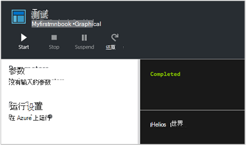
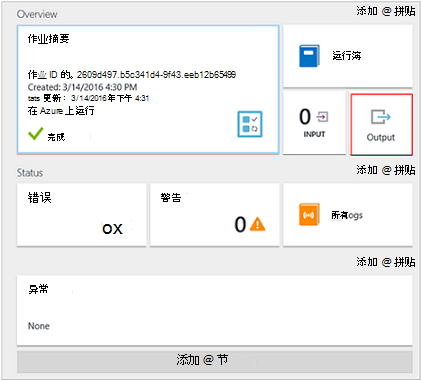

<properties
    pageTitle="我 Azure 自动化中的第一个图形 runbook |Microsoft Azure"
    description="引导您完成创建、 测试和发布的简单图形 runbook 的教程。"
    services="automation"
    documentationCenter=""
    authors="mgoedtel"
    manager="jwhit"
    editor=""
    keywords="runbook，runbook 模板、 runbook 自动化，azure runbook"/>
<tags
    ms.service="automation"
    ms.workload="tbd"
    ms.tgt_pltfrm="na"
    ms.devlang="na"
    ms.topic="get-started-article"
    ms.date="07/06/2016"
    ms.author="magoedte;bwren"/>

# <a name="my-first-graphical-runbook"></a>我的第一个图形 runbook

> [AZURE.SELECTOR] - [图形化](automation-first-runbook-graphical.md) - [PowerShell](automation-first-runbook-textual-PowerShell.md) - [PowerShell 工作流](automation-first-runbook-textual.md)

本教程将引导您完成创建的[图形 runbook](automation-runbook-types.md#graphical-runbooks) Azure 自动化中。  我们将从简单的 runbook，我们将测试并发布，同时我们解释如何跟踪 runbook 作业的状态开始。  然后我们将修改 runbook 实际管理 Azure 的资源，在这种情况下启动 Azure 的虚拟机。  我们然后将 runbook 更可靠的方式将 runbook 参数和条件链接。

## <a name="prerequisites"></a>系统必备组件

若要完成本教程，您需要。

-   Azure 的订阅。  如果您没有一个，您可以[激活您的 MSDN 订户权益](https://azure.microsoft.com/pricing/member-offers/msdn-benefits-details/)或<a href="/pricing/free-account/" target="_blank">[注册免费的帐户](https://azure.microsoft.com/free/)。
-   [Azure 帐户运行](automation-sec-configure-azure-runas-account.md)保持 runbook 和 Azure 的资源进行身份验证。  此帐户必须有权启动和停止虚拟机。
-   Azure 的虚拟机。  我们将停止并启动该计算机，因此它不应是生产。


## <a name="step-1---create-new-runbook"></a>步骤 1-创建新 runbook

我们首先创建输出文本*Hello World*简单 runbook。

1.  在 Azure 门户中，打开您自动化的帐户。  
    自动化帐户页面使此帐户中快速查看的资源。  您应该已经有些资产。  这些大多数都是自动被纳入一个新的自动化帐户模块。  此外应具有凭据资产所述[先决条件](#prerequisites)。
2.  单击打开列表运行手册，**运行手册**方块。<br> 
3.  通过单击**添加 runbook**按钮，然后**创建新的 runbook**上创建新的 runbook。
4.  *MyFirstRunbook 图形*的名称为 runbook。
5.  在这种情况下，我们将创建[图形化的 runbook](automation-graphical-authoring-intro.md)是**Runbook**类型︰ 选择**图形**。<br> <br>
6.  单击**创建**以创建 runbook 并打开图形编辑器。

## <a name="step-2---add-activities-to-the-runbook"></a>步骤 2-将活动添加到 runbook

在编辑器的左侧库控件允许您选择要添加到您的 runbook 的活动。  我们将添加**写入输出**用于从 runbook 的文本输出。

1.  控件中的库，请单击搜索文本框中的输**写输出**。  搜索结果将显示下方。 <br> 
2.  向下滚动到列表的底部。  您可以右键单击**写入输出**并选择**添加到画布**或旁边 cmdlet 椭圆上单击，然后选择**添加到画布**。
3.  单击画布上的**输出写入**活动。  这将打开可用于配置该活动配置控制刀片。
4.  该**标签**默认名称的 cmdlet，但我们可以将其更改为某个更加友好。 将其更改为*写 Hello World 输出*。
5.  单击要为该 cmdlet 的参数提供值的**参数**。  
    一些 cmdlet 具有多个参数集，然后您需要选择您将使用。 在这种情况下，**写入输出**有只有一个参数集，因此您无需选择一个。 <br> 
6.  选择**InputObject**参数。  这是我们将在其中指定要发送到输出流的文本的参数。
7.  在**数据源**下拉列表中选择**PowerShell 表达式**。  **数据源**下拉列表提供用于填充参数值的不同来源。  
    从这种源如另一个活动、 自动化资产或 PowerShell 表达式，您可以使用输出。  在这种情况下，我们只是想要输出的文本*Hello World*。 我们可以使用 PowerShell 表达式，指定一个字符串。
8.  在**表达式**框中，键入*"Hello World"* ，然后单击**确定**两次，以返回到绘图画布。<br> 
9.  通过单击**保存**保存 runbook。<br> 

## <a name="step-3---test-the-runbook"></a>第 3 步 – 测试 runbook

我们发布了 runbook，以使其可在生产环境中之前，我们希望其进行测试以确保它运行正常。  Runbook 测试时，运行其**草稿**版本，并以交互方式查看相应的输出。

1.  单击**测试窗格中**打开测试刀片式服务器。<br> 
2.  单击**启动**以启动测试。  这应该是唯一已启用的选项。
3.  将创建一个[runbook 作业](automation-runbook-execution.md)，其状态显示在窗格中。  
    作业状态将开始为*排队*，指示它等待 runbook 工作在云环境中变得可用。  它会再移到*开始*时工作人员声称该作业，然后*运行*runbook 实际启动运行时。  
4.  Runbook 作业完成时将显示其输出。 在我们的例子中，我们看到*Hello World*。<br> 
5.  关闭测试刀片式服务器返回到画布上。

## <a name="step-4---publish-and-start-the-runbook"></a>步骤 4-发布和启动 runbook

我们刚刚创建的 runbook 仍处于草稿模式。 我们需要发布它，我们才能在生产环境中运行它。  当 runbook 发布时，您覆盖现有的已发布版本的草稿版本。  在我们的例子中，我们已发布版本还没有因为我们刚刚创建的 runbook。

1.  **发布**发布 runbook 单击，然后单击**是**时出现提示。<br> 
2.  如果您向左滚动以查看**运行手册**刀片式服务器中的 runbook，它将显示**已发布**的**创作状态**。
3.  滚动到右侧以查看**MyFirstRunbook**的刀片式服务器。  
    顶部的选项使我们能够启动 runbook，它在将来某一时间开始安排或创建[webhook](automation-webhooks.md) ，以便可以启动通过 HTTP 调用。
4.  我们只想开始 runbook 因此**开始**单击，然后单击**是**时出现提示。<br> 
5.  我们刚刚创建的 runbook 作业打开作业刀片式服务器。  我们可以关闭此刀片式服务器，但在这种情况下我们将使它打开以便我们可以观察到该作业的进度。
6.  作业状态所示**作业摘要**，与我们看到的在我们测试的 runbook 时的状态相匹配。<br> 
7.  一旦 runbook 状态显示*已完成*时，单击**输出**。 打开**输出**刀片式服务器，，我们可以看到我们的*Hello World*窗格中。<br>   
8.  关闭输出刀片式服务器。
9.  单击要打开 runbook 作业流刀片式服务器的**所有日志**。  我们将仅仅显示*Hello World*输出流，但这可以显示 runbook 作业如冗余和错误的其他流，如果 runbook 写入它们。<br> 
10. 关闭刀片式服务器的所有日志和作业刀片式服务器返回到 MyFirstRunbook 刀片式服务器。
11. 单击以打开此 runbook 的作业刀片式服务器的**作业**。  这将列出所有此 runbook 创建的作业。 我们应该只能看到一个作业列出由于我们仅运行此作业一次。<br> 
12. 您可以单击此作业打开我们时，我们开始 runbook 查看同一工作窗格上。  这使您可以按时间顺序返回并查看为特定 runbook 创建的任何作业的详细信息。

## <a name="step-5---create-variable-assets"></a>在第 5 步-创建变量的资产

我们已经测试并发布我们的 runbook，但到目前为止，它不执行任何操作非常有用。 我们想要它管理 Azure 的资源。  我们配置 runbook 进行身份验证之前，我们将创建一个变量来保存订阅 ID 和引用它，我们设置下面的步骤 6 中进行身份验证的活动之后。  包含订阅上下文的引用使您可以轻松地处理多个订阅。  继续之前，请从导航窗格中的订阅选项从复制订阅 ID。  

1. 在自动化客户刀片式服务器，请单击**资产**平铺和**资产**刀片式服务器已打开。
2. 在资产刀片式服务器，请单击**变量**图块上。
3. 在变量刀片式服务器，单击**添加变量**。<br>
4. 在新变量刀片式服务器，在**名称**框中，输入**AzureSubscriptionId** ，然后在**值**框中输入您的订购 id。  让*字符串***类型**和默认值进行**加密**。  
5. 单击**创建**以创建变量。  


## <a name="step-6---add-authentication-to-manage-azure-resources"></a>第 6 步-添加身份验证管理 Azure 的资源

现在，我们有一个变量来保存我们的订阅 ID，我们可以配置我们的 runbook 与[前提条件](#prerequisites)中引用的运行方式凭据进行身份验证。  我们做到这一点将 Azure 运行方式连接**资产**和**添加 AzureRMAccount** cmdlet 添加到画布上。  

1.  通过单击**编辑**MyFirstRunbook 刀片式服务器上打开图形编辑器。<br> 
2.  我们不再需要**编写 Hello World 输出**，因此右键单击文档并选择**删除**。
3.  在库控件中，展开**连接**并选择**添加到画布**将**AzureRunAsConnection**添加到画布上。
4.  在画布上，选择**AzureRunAsConnection**和配置控件窗格中**获取运行作为连接**在文本框中键入**标签**。  这就是连接 
5.  在库控件中，在搜索文本框中键入**添加 AzureRmAccount** 。
6.  将**添加 AzureRmAccount**添加到画布上。<br> 
7.  将鼠标悬停在**获取运行作为连接**直到该形状的底部将出现一个圆圈。 单击圆，将箭头拖到**添加 AzureRmAccount**。  您刚才创建的箭头是*链接*的。  Runbook 将以**获取运行作为连接**开始，然后再运行**添加 AzureRmAccount**。<br> 
8.  在画布上，选择**添加 AzureRmAccount** ，然后在配置控制中的**标签**文本框窗格类型**登录到 Azure** 。
9.  单击**参数**和刀片出现活动参数配置。 
10.  **添加 AzureRmAccount**具有多个参数集，因此我们需要选择一个之前，我们可以提供参数值。  单击**参数设置**，然后选择**ServicePrincipalCertificate**参数集。 
11.  一旦您选择的参数集，这些参数显示活动参数配置刀片式服务器中。  单击**APPLICATIONID**。<br> 
12.  参数值刀片式服务器，在**数据源**中选择**活动输出**和获取运行作为从选择**的连接的列表中，在**域路径**文本框键入**ApplicationId**，**然后单击**确定**。  我们指定域路径的属性的名称，因为活动输出具有多个属性的对象。
13.  单击**CERTIFICATETHUMBPRINT**，并在参数值刀片式服务器，选择**活动输出**的**数据源**。  从**域路径**文本框类型**CertificateThumbprint**，在列表中选择**获取运行作为连接**，然后单击**确定**。 
14.  单击**SERVICEPRINCIPAL**，在参数值刀片式服务器，选择**ConstantValue**的**数据源**，单击该选项**，则返回 True**，然后单击**确定**。
15.  单击**TENANTID**，并在参数值刀片式服务器，选择**活动输出**的**数据源**。  从**域路径**文本框类型**TenantId**，在列表中选择**获取运行作为连接**，然后单击**确定**两次。  
16.  控件中的库，在搜索文本框中键入**一组 AzureRmContext** 。
17.  将**集 AzureRmContext**添加到画布上。
18.  在画布上，选择**设置 AzureRmContext** ，然后在配置控制中的**标签**文本框窗格类型**指定订阅 Id** 。
19.  单击**参数**和刀片出现活动参数配置。 
20. **集 AzureRmContext**有多个参数集，因此我们需要选择一个之前，我们可以提供参数值。  单击**参数设置**，然后选择**SubscriptionId**参数集。  
21.  一旦您选择的参数集，这些参数显示活动参数配置刀片式服务器中。  单击**SubscriptionID**
22.  参数值刀片式服务器，在为**数据源**中选择**变量的资产**并从列表中选择**AzureSubscriptionId** ，然后单击**确定**两次。   
23.  将鼠标悬停在**登录到 Azure**直到该形状的底部将出现一个圆圈。 单击圆，将箭头拖到**指定订阅 Id**。


您 runbook 应该在此时显示如下︰ <br>

## <a name="step-7---add-activity-to-start-a-virtual-machine"></a>第 7 步-添加活动以启动虚拟机

我们现在将添加一个**开始 AzureRmVM**活动启动虚拟机。  您可以在 Azure 的订阅中，选取任何虚拟机，现在我们可以将 cmdlet 名的硬。

1. 在库控件中，在搜索文本框中键入**开始 AzureRm** 。
2. 将**开始 AzureRmVM**添加到画布然后单击并拖动它下方**指定订阅 Id**。
3. 将鼠标悬停在**指定订阅 Id**之前在该形状的底部将出现一个圆圈。  单击圆，将箭头拖到**开始 AzureRmVM**。 
4.  选择**开始-AzureRmVM**。  单击**参数**和**参数设置**，查看**启动 AzureRmVM**集。  选择**ResourceGroupNameParameterSetName**参数集。 请注意， **ResourceGroupName**和**名称**下一步有惊叹号它们。  这表明它们是必需的参数。  另外请注意两者预期的字符串值。
5.  选择**名称**。  选择**数据源**和类型名称用双引号引起来，我们将开始使用此 runbook 虚拟机**PowerShell 表达式**。  单击**确定**。<br>
6.  选择**ResourceGroupName**。 使用**PowerShell 表达式**的**数据源**和类型用双引号括起来的资源组的名称。  单击**确定**。<br> 
8.  单击测试窗格，以便我们可以测试 runbook。
9.  单击**启动**以启动测试。  一旦它完成，请检查启动虚拟机。

您 runbook 应该在此时显示如下︰ <br>

## <a name="step-8---add-additional-input-parameters-to-the-runbook"></a>步骤 8-runbook 中添加额外的输入的参数

我们 runbook 当前启动虚拟机中**启动 AzureRmVM** cmdlet，我们指定的资源组，但我们 runbook 会更有用，如果我们无法同时进行指定启动 runbook 时。  现在，我们将添加输入的参数 runbook，以提供该功能。

1. 通过在**MyFirstRunbook**窗格上单击**编辑**打开图形编辑器。
2. 单击**输入和输出**，然后**添加输入**Runbook 输入参数窗格中打开。<br> 
3. 指定**名称**为*VMName* 。  使*字符串***类型**，但将**强制**更改为*是*。  单击**确定**。
4. 创建名为*ResourceGroupName*的第二个必填字段输入的参数，然后单击**确定**以关闭**输入和输出**窗格。<br> 
5. 选择**开始 AzureRmVM**活动，然后单击**参数**。
6. 将**数据源**更改为**Runbook 输入****名称**，然后选择**VMName**。<br>
7. 将**数据源**更改为**Runbook 输入** **ResourceGroupName** ，然后选择**ResourceGroupName**。<br> 
8. 保存 runbook 并打开测试窗格。  请注意，您现在可以将测试中使用的两个输入变量提供值。
9. 关闭测试窗格。
10. 单击**发布**来发布新版本的 runbook。
11. 停止在上一步中启动虚拟机。
12. 单击**启动**以启动 runbook。  **VMName**和**ResourceGroupName**中输入您要启动虚拟机。<br> 
13. Runbook 完成后，检查启动虚拟机。

## <a name="step-9---create-a-conditional-link"></a>第 9 步-创建条件链接

我们现在将修改 runbook，以便它只能尝试如果尚未启动，则启动该虚拟机。  我们将会向虚拟机器的实例级别状态 runbook 加上**获取 AzureRmVM** cmdlet 来执行此操作。 然后，我们将添加使用 PowerShell 代码，以确定是否正在运行或已停止的虚拟机状态的代码段调用**获取状态**的 PowerShell 工作流代码模块。  如果停止当前正在运行状态，**获取状态**模块从一个条件链接才会运行**开始 AzureRmVM** 。  最后，我们将输出一条消息，通知您是否已成功启动 VM 或不使用 PowerShell 输出写入 cmdlet。

1. 在图形编辑器中打开**MyFirstRunbook** 。
2. 通过对其单击，然后按*Delete*键来删除**指定订阅 Id**和**开始 AzureRmVM**之间的链接。
3. 在库控件中，在搜索文本框中键入**获取 AzureRm** 。
4. 将**获取 AzureRmVM**添加到画布上。
5. **获得 AzureRmVM**选择，然后选择**设置参数**来**获取 AzureRmVM**查看设置。  选择**GetVirtualMachineInResourceGroupNameParamSet**参数集。  请注意， **ResourceGroupName**和**名称**下一步有惊叹号它们。  这表明它们是必需的参数。  另外请注意两者预期的字符串值。
6. 在**数据源**的**名称**，选择**输入 Runbook** ，然后选择**VMName**。  单击**确定**。
7. 在**ResourceGroupName**的**数据源**，下方选择**输入 Runbook** ，然后选择**ResourceGroupName**。  单击**确定**。
8. 在**状态****数据源**，选择**常量值**，然后单击上**真**。  单击**确定**。  
9. 从**指定的订阅 Id**创建的链接，**获取 AzureRmVM**到。
10. 控件中的库，展开**Runbook 控件**，并将**代码**添加到画布上。  
11. 创建从**Get AzureRmVM**到**代码**的链接。  
12. 单击**代码**和配置窗格中更改标签为**获取状态**。
13. 选择**代码**参数和**代码编辑器**刀片式服务器出现。  
14. 在代码编辑器中，粘贴下面的代码段︰

     ```
     $StatusesJson = $ActivityOutput['Get-AzureRmVM'].StatusesText 
     $Statuses = ConvertFrom-Json $StatusesJson 
     $StatusOut ="" 
     foreach ($Status in $Statuses){ 
     if($Status.Code -eq "Powerstate/running"){$StatusOut = "running"} 
     elseif ($Status.Code -eq "Powerstate/deallocated") {$StatusOut = "stopped"} 
     } 
     $StatusOut 
     ```

15. 创建从**获取状态**到**开始 AzureRmVM**的链接。<br>   
16. 选择链接，然后在配置窗格中更改**应用条件**为**是**。   请注意该链接将变成一条虚线，表示是否条件将解析为才会运行目标活动真。  
17. **条件表达式**中，请键入*$ActivityOutput [获取状态] eq"停止"*。  现在**开始 AzureRmVM**才会运行如果停止虚拟机。
18. 在库控件中，展开**Cmdlet**和**Microsoft.PowerShell.Utility**。
19. 两次**写入输出**添加到画布上。<br> 
20. 在第一个**写入输出**控件，单击**参数**并将**标签**中的值更改为*通知 VM 启动*。
21. 对于**InputObject**，**数据源**更改**PowerShell 表达式**和*"成功启动 $VMName。"*表达式中的类型。
22. 在**写入输出**第二个控件中，单击**参数**并将**标签**中的值更改为*通知 VM 启动失败*
23. 对于**InputObject**， **PowerShell 表达式**和类型在表达式*"$VMName 可能无法启动。"*中更改**数据源**。
24. 从**开始 AzureRmVM**创建的链接，**通知 VM 启动**和**通知 VM 启动失败**。
25. 选择链接到**通知 VM 启动**和更改**应用条件**为**True**。
26. **条件表达式**中，请键入*$ActivityOutput [' 开始-AzureRmVM]。IsSuccessStatusCode-eq $true*。  现在此写入输出控件才会运行如果成功启动虚拟机。
27. 选择**通知 VM 启动失败**的链接，并更改**应用条件**为**True**。
28. **条件表达式**中，请键入*$ActivityOutput [' 开始-AzureRmVM]。IsSuccessStatusCode ne $true*。  此写入输出控件现在才会运行该虚拟机未成功启动。
29. 保存 runbook 并打开测试窗格。
30. 从 runbook 开始停止，虚拟机和开始时间。

## <a name="next-steps"></a>下一步行动

-   有关图形创作的详细信息，请参阅[图形创作在 Azure 自动化](automation-graphical-authoring-intro.md)
-   若要开始使用 PowerShell 运行手册，请参阅[我第一个 PowerShell runbook](automation-first-runbook-textual-powershell.md)
-   若要开始使用 PowerShell 工作流运行手册，请参阅[我第一个 PowerShell 流 runbook](automation-first-runbook-textual.md)
