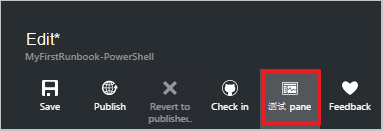

<properties
    pageTitle="在 Azure 自动化我第一个 PowerShell runbook |Microsoft Azure"
    description="引导您完成创建、 测试和发布的简单的 PowerShell runbook 的教程。"
    services="automation"
    documentationCenter=""
    authors="mgoedtel"
    manager="jwhit"
    editor=""
    keywords="azure powershell，powershell 脚本教程，powershell 自动化"/>
<tags
    ms.service="automation"
    ms.workload="tbd"
    ms.tgt_pltfrm="na"
    ms.devlang="na"
    ms.topic="get-started-article"
    ms.date="07/19/2016"
    ms.author="magoedte;sngun"/>

# <a name="my-first-powershell-runbook"></a>我第一个 PowerShell runbook

> [AZURE.SELECTOR] - [图形化](automation-first-runbook-graphical.md) - [PowerShell](automation-first-runbook-textual-PowerShell.md) - [PowerShell 工作流](automation-first-runbook-textual.md)  

本教程将引导您完成创建[PowerShell runbook](automation-runbook-types.md#powershell-runbooks) Azure 自动化中。 我们将从简单的 runbook，我们将测试并发布，同时我们解释如何跟踪 runbook 作业的状态开始。 然后我们将修改 runbook 实际管理 Azure 的资源，在这种情况下启动 Azure 的虚拟机。 我们然后将 runbook 更可靠加上 runbook 参数。

## <a name="prerequisites"></a>系统必备组件

若要完成本教程，您需要。

-   Azure 的订阅。 如果您没有一个，您可以[激活您的 MSDN 订户权益](https://azure.microsoft.com/pricing/member-offers/msdn-benefits-details/)或<a href="/pricing/free-account/" target="_blank">[注册免费的帐户](https://azure.microsoft.com/free/)。
-   [自动化客户](automation-security-overview.md)保持 runbook 和 Azure 的资源进行身份验证。  此帐户必须有权启动和停止虚拟机。
-   Azure 的虚拟机。 我们将停止并启动该计算机，因此它不应是生产。

## <a name="step-1---create-new-runbook"></a>步骤 1-创建新 runbook

我们首先创建输出文本*Hello World*简单 runbook。

1.  在 Azure 门户中，打开您自动化的帐户。  
    自动化帐户页面使此帐户中快速查看的资源。 您应该已经有些资产。 这些大多数都是自动被纳入一个新的自动化帐户模块。 此外应具有凭据资产所述[先决条件](#prerequisites)。
2.  单击打开列表运行手册，**运行手册**方块。  
      
3.  通过单击**添加 runbook**按钮，然后**创建新的 runbook**上创建新的 runbook。
4.  使 runbook *MyFirstRunbook PowerShell*的名称。
5.  在这种情况下，我们将创建[PowerShell runbook](automation-runbook-types.md#powershell-runbooks)是**Runbook**类型︰ 选择**Powershell** 。  
      
6.  单击**创建**以创建 runbook，然后打开文本编辑器中。

## <a name="step-2---add-code-to-the-runbook"></a>步骤 2-将代码添加到 runbook

您可以将任一类型代码直接到 runbook，或可以从库控件选择 cmdlet、 运行手册及资产，并将它们添加到任何相关的参数与 runbook。 在本演练中，我们将直接键入 runbook。

1.  我们 runbook 是当前为空，类型*输出写入"Hello World"。*。  
      
2.  通过单击**保存**保存 runbook。  
      

## <a name="step-3---test-the-runbook"></a>第 3 步 – 测试 runbook

我们发布了 runbook，以使其可在生产环境中之前，我们希望其进行测试以确保它运行正常。 Runbook 测试时，运行其**草稿**版本，并以交互方式查看相应的输出。

1.  单击**测试窗格中**打开测试窗格。  
      
2.  单击**启动**以启动测试。 这应该是唯一已启用的选项。
3.  将创建一个[runbook 作业](automation-runbook-execution.md)，并显示其状态。  
    作业状态将开始为*排队*，表明它正在等待云的 runbook 工作人员来提供。 它会再移到*开始*时工作人员声称该作业，然后*运行*runbook 实际启动运行时。  
4.  Runbook 作业完成时将显示其输出。 在我们的例子中，我们应该看到*Hello World*  
      
5.  关闭测试窗格返回到画布上。

## <a name="step-4---publish-and-start-the-runbook"></a>步骤 4-发布和启动 runbook

我们刚刚创建的 runbook 仍处于草稿模式。 我们需要发布它，我们才能在生产环境中运行它。 当 runbook 发布时，您覆盖现有的已发布版本的草稿版本。 在我们的例子中，我们已发布版本还没有因为我们刚刚创建的 runbook。

1.  **发布**发布 runbook 单击，然后单击**是**时出现提示。  
      
2.  如果您向左滚动以现在**运行手册**窗格中查看 runbook，它将显示**已发布**的**创作状态**。
3.  滚动到右侧以查看**MyFirstRunbook PowerShell**的窗格。  
    顶部的选项使我们能够启动 runbook，查看 runbook，它在将来某一时间开始安排或创建[webhook](automation-webhooks.md) ，以便可以启动通过 HTTP 调用。
4.  我们只想开始 runbook 所以单击**开始**，然后单击**确定**，启动 Runbook 刀片式服务器打开时。  
      
5.  我们刚刚创建的 runbook 作业就会打开作业窗格。 我们可以关闭该窗格，但在这种情况下我们将使它打开以便我们可以观察到该作业的进度。
6.  作业状态所示**作业摘要**，与我们看到的在我们测试的 runbook 时的状态相匹配。  
      
7.  一旦 runbook 状态显示*已完成*时，单击**输出**。 打开输出窗格中，然后我们可以看到我们的*Hello World*。  
    
8.  关闭输出窗格。
9.  单击要打开 runbook 作业流窗格中的**所有日志**。 我们将仅仅显示*Hello World*输出流，但这可以显示 runbook 作业如冗余和错误的其他流，如果 runbook 写入它们。  
      
10. 关闭流窗格和工作窗格返回到 MyFirstRunbook PowerShell 窗格。
11. 单击以打开此 runbook 的工作窗格中的**作业**。 这将列出所有此 runbook 创建的作业。 我们应该只能看到一个作业列出由于我们仅运行此作业一次。  
      
12. 您可以单击此作业打开我们时，我们开始 runbook 查看同一工作窗格上。 这使您可以按时间顺序返回并查看为特定 runbook 创建的任何作业的详细信息。

## <a name="step-5---add-authentication-to-manage-azure-resources"></a>步骤 5-添加身份验证管理 Azure 的资源

我们已经测试并发布我们的 runbook，但到目前为止，它不执行任何操作非常有用。 我们想要它管理 Azure 的资源。 它不能做到这一点，但除非我们已验证使用[的前提条件](#prerequisites)中引用的凭据。 与**添加 AzureRmAccount** cmdlet 我们做到这一点。

1.  通过在 MyFirstRunbook PowerShell 窗格上单击**编辑**打开文本编辑器。  
      
2.  我们不再需要**写输出**行，因此继续操作并删除它。
3.  键入或复制并粘贴下面的代码将处理您的自动化运行方式帐户的身份验证︰

    ```
     $Conn = Get-AutomationConnection -Name AzureRunAsConnection 
     Add-AzureRMAccount -ServicePrincipal -Tenant $Conn.TenantID `
     -ApplicationId $Conn.ApplicationID -CertificateThumbprint $Conn.CertificateThumbprint
    ``` 
<br>
4.  这样，我们可以测试 runbook，请单击**测试窗格中**。
5.  单击**启动**以启动测试。 当它完成后时，您应该收到输出类似于下面的显示基本信息从您的帐户。 这证实的凭据有效。 <br> 

## <a name="step-6---add-code-to-start-a-virtual-machine"></a>步骤 6-添加代码以启动虚拟机

现在，我们 runbook 身份验证向我们 Azure 的订购，我们可以管理资源。 我们将添加一个命令以启动虚拟机。 您可以在 Azure 的订阅中，选取任何虚拟机，现在我们可以将 cmdlet 名的硬。

1.  *添加 AzureRmAccount*之后, 键入*开始 AzureRmVM-名称 VMName' ResourceGroupName 'NameofResourceGroup'*提供的名称和启动该虚拟机的资源组名称。  
    
    ```
     $Conn = Get-AutomationConnection -Name AzureRunAsConnection 
     Add-AzureRMAccount -ServicePrincipal -Tenant $Conn.TenantID `
     -ApplicationID $Conn.ApplicationID -CertificateThumbprint $Conn.CertificateThumbprint 
     Start-AzureRmVM -Name 'VMName' -ResourceGroupName 'ResourceGroupName'
     ```
<br>
2.  保存 runbook，然后单击**测试窗格**，以便我们可以对其进行测试。
3.  单击**启动**以启动测试。 一旦它完成，请检查启动虚拟机。

## <a name="step-7---add-an-input-parameter-to-the-runbook"></a>第 7 步-向 runbook 添加输入的参数

当前，我们的 runbook 启动的虚拟机，我们在 runbook 中，硬编码，但如果我们无法指定虚拟机启动 runbook 时将更有用。 现在，我们将添加输入的参数 runbook，以提供该功能。

1.  *VMName*和*ResourceGroupName* runbook 中添加参数，如下面的示例中所示的**启动 AzureRmVM** cmdlet 使用这些变量。  
    
    ```
    Param(
       [string]$VMName,
       [string]$ResourceGroupName
    )
     $Conn = Get-AutomationConnection -Name AzureRunAsConnection 
     Add-AzureRMAccount -ServicePrincipal -Tenant $Conn.TenantID `
     -ApplicationID $Conn.ApplicationID -CertificateThumbprint $Conn.CertificateThumbprint 
     Start-AzureRmVM -Name $VMName -ResourceGroupName $ResourceGroupName
     ```
<br> 
2.  保存 runbook 并打开测试窗格。 请注意，您现在可以将测试中使用的两个输入变量提供值。
3.  关闭测试窗格。
4.  单击**发布**来发布新版本的 runbook。
5.  停止在上一步中启动虚拟机。
6.  单击**启动**以启动 runbook。 **VMName**和**ResourceGroupName**中输入您要启动虚拟机。  
      
7.  Runbook 完成后，检查启动虚拟机。

## <a name="differences-from-powershell-workflow"></a>从 PowerShell 流的差异

PowerShell 运行手册有相同的生命周期、 功能和管理作为 PowerShell 工作流运行手册，但有一些差异和限制︰

1.  快速运行 PowerShell 运行手册与 PowerShell 工作流运行手册，因为他们没有编译步骤。
2.  PowerShell 工作流运行手册支持使用检查点的检查点，而只能从开始恢复 PowerShell 运行手册 PowerShell 工作流运行手册可以恢复从 runbook 中的任何位置。
3.  而 PowerShell 运行手册可以只以串行方式执行命令，PowerShell 工作流运行手册将支持并行和串行执行。
4.  在 PowerShell 流 runbook，活动、 命令或脚本块可以有它自己的运行空间而 PowerShell runbook，在一个脚本中的所有内容在运行单个的运行空间。 也有一些本机的 PowerShell runbook 和 PowerShell 流 runbook 之间的[语法差异](https://technet.microsoft.com/magazine/dn151046.aspx)。

## <a name="next-steps"></a>下一步行动

-   要开始使用图形化的运行手册，请参阅[我的第一个图形 runbook](automation-first-runbook-graphical.md)
-   若要开始使用 PowerShell 工作流运行手册，请参阅[我第一个 PowerShell 流 runbook](automation-first-runbook-textual.md)
-   若要了解有关 runbook 类型，它们的优点和限制的详细信息，请参阅[Azure 自动化 runbook 类型](automation-runbook-types.md)
-   PowerShell 脚本的详细信息支持功能，请参见[本机 PowerShell 支持在 Azure 自动化的脚本](https://azure.microsoft.com/blog/announcing-powershell-script-support-azure-automation-2/)
