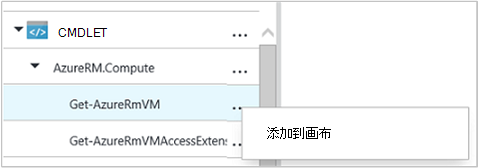

<properties 
    pageTitle="在 Azure 自动化图形创作 |Microsoft Azure"
    description="图形创作允许您无需使用代码创建 Azure 自动化运行手册。 本文提供了图形创作的简介，并开始创建图形化的 runbook 所需的所有详细信息。"
    services="automation"   
    documentationCenter=""
    authors="mgoedtel"
    manager="jwhit"
    editor="tysonn" />
<tags 
    ms.service="automation"
    ms.devlang="na"
    ms.topic="article"
    ms.tgt_pltfrm="na"
    ms.workload="infrastructure-services"
    ms.date="06/03/2016"
    ms.author="magoedte;bwren" />

# 图形创作在 Azure 自动化

## 介绍

可以使用图形创作 Azure 自动化而无需复杂的基础 Windows PowerShell 或 PowerShell 工作流代码创建运行手册。 将活动添加到画布上，从一个 cmdlet 和运行手册的库、 将它们链接在一起和配置，以形成一个工作流。  如果您有过与系统中心控制器或服务管理自动化 (SMA)，然后这应熟悉给您。   

这篇文章提供了图形创作的简介和需要着手创建图形化 runbook 的概念。

## 图形化运行手册

在 Azure 自动化所有运行手册是 Windows PowerShell 的工作流。  图形和图形 PowerShell 工作流运行手册生成 PowerShell 代码运行的自动化工作人员，但您将不能进行查看，或者直接对其进行修改。  可以将图形 runbook 转换为图形 PowerShell 流 runbook，反之亦然，但它们不能转换为文本的 runbook。 现有的文本 runbook 不能导入到图形编辑器中。  

## 图形化编辑器概述

您可以通过创建或编辑图形 runbook Azure 门户中打开图形编辑器。

以下各节描述了图形化编辑器中的控件。

### 画布
画布是您设计您的 runbook 的位置。  将活动从库控件中的节点添加到 runbook，并将它们与链接定义的 runbook 的逻辑。

在画布的底部中，可以使用控件来放大和缩小。

### 库控制

库控件是您可以在其中选择要添加到您的 runbook 的[活动](#activities)。  您将其添加到画布上，您将它们连接到其他活动。  它包括下表中描述的四个部分。

| 部分 | 说明 |
|:---|:---|
| Cmdlet | 在您的 runbook 中包含所有可以使用的 cmdlet。  按模块组织 Cmdlet。  所有已安装在您的自动化帐户模块将提供。  |
| 运行手册 |  包括自动化帐户中运行手册。 这些运行手册可以添加到画布以用作子运行手册。 仅运行手册的编辑 runbook 相同的核心类型都会显示出来;为图形显示运行手册只基于 PowerShell 的运行手册，而仅 PowerShell 的基于工作流的运行手册所示的图形 PowerShell 工作流运行手册。
| 资产 | 您可以在您的 runbook 中使用的自动化帐户中包括[自动化资产](http://msdn.microsoft.com/library/dn939988.aspx)。  在将资源添加到 runbook，它将获取所选的资产的工作流活动。  在变量的资产的情况下您可以选择是否要添加活动获取变量，或将该变量设置。
| Runbook 控件 | 在您当前的 runbook 中包含可以使用的 runbook 控制活动。 *结合*采用多个输入并等待，直到所有已完成工作流继续。 *代码*活动运行 PowerShell 或 PowerShell 工作流代码取决于图形 runbook 类型的一个或多个行。  对于自定义代码或很难达到与其他活动的功能，您可以使用此活动。|

### 配置控件

配置控件是在画布上选择对象提供详细信息的位置。 此控件中可用的属性取决于所选对象的类型。  配置控件中选择选项时，将打开其他刀片式服务器以提供附加信息。

### 测试控件

测试控件不显示在图形化编辑器第一次启动时。 打开当您以交互方式[测试图形 runbook](#graphical-runbook-procedures)。  

## 图形化 runbook 过程 

### 导出和导入图形 runbook

您只能导出图形 runbook 的已发布的版本。  如果尚未发布 runbook，**导出已发布**按钮将被禁用。  当单击**导出发布**按钮时，runbook 将下载到您的本地计算机中。  文件的名称匹配的扩展名为*graphrunbook* runbook 的名称。

选择**导入**选项，添加 runbook 时，可以导入图形或图形 PowerShell 工作流的 runbook 文件。   选择要导入的文件时，可以保持相同的**名称**，或提供一个新。  Runbook 类型字段将显示 runbook 的类型之后它将评估选定的文件，如果您尝试选择不同的类型不正确，将注意潜在的冲突和在转换过程中可能存在语法错误显示一条消息。  

### 测试图形 runbook

而保留 runbook 的已发布的版本不变，或之前已发布，您可以测试新的 runbook 可以在 Azure 门户测试 runbook 的草稿版本。 这允许您验证更换的已发布的版本之前正常工作 runbook。 Runbook 测试时，执行拔模 runbook，它执行的任何操作都已完成。 创建没有作业历史记录，但在测试输出窗格中显示输出。 

打开打开以进行编辑 runbook runbook 的测试控件，然后单击**测试窗格**按钮上。

测试控件的任何输入参数，将提示，您可以通过单击**开始**按钮启动 runbook。

### 发布图形 runbook

每个 runbook Azure 自动化中的有草稿和已发布的版本。 只有已发布版本可以运行和可编辑的草稿版本。 已发布版本不会受到影响的草稿版本所做的任何更改。 准备好要用的草稿版本时，则将发布它将覆盖已发布版本的草稿版本。

您可以通过打开进行编辑，然后单击**发布**按钮上 runbook 发布图形 runbook。

尚未发布的 runbook，它有**新**的状态。  当它发布时，它具有**已发布**的状态。  如果已发布后的草稿和已发布的版本是不同编辑 runbook，runbook 都有**正在编辑**状态。

 

您还可以选择要恢复到 runbook 的已发布版本。  这立即引发自上次发布 runbook，和 runbook 的草稿版本替换为已发布版本以来所做的任何更改。

## 活动

活动是 runbook 的构建块。  活动可以是 PowerShell cmdlet、 子 runbook 或工作流活动。  通过库控件中右键单击它并选择**添加到画布**可将活动添加到 runbook 中。  然后，您可以单击并拖动任意位置将其放置在画布上自己喜欢的活动。  位置在画布上的活动不会影响任何方式 runbook 操作。  但是您找到最合适的方法来直观地显示其操作可以以您 runbook 布局。 

选择要配置刀片式服务器中配置其属性和参数在画布上的活动。  成描述您可以更改**标签**的活动。  仍在运行原始的 cmdlet，您只需更改将在图形编辑器中使用的显示名称。  该标签中必须是唯一的 runbook。 

### 参数设置

一个参数集定义将接受特殊的 cmdlet 的值的必填字段和可选参数。  所有的 cmdlet 具有至少一个参数设置，而一些多个。  如果 cmdlet 都有多个参数集，则必须选择之前可以配置参数将使用哪一个。  您可以配置的参数将取决于您选择的参数集。  您可以更改活动选择**参数设置**，选择另一组使用的参数集。  在这种情况下，您配置的任何参数值将丢失。

在以下示例中，获取 AzureRmVM cmdlet 具有三个参数集。  不能配置参数值，直到您选择一个参数集。  ListVirtualMachineInResourceGroupParamSet 参数设置为返回的资源组中的所有虚拟机，并且具有一个可选参数。  GetVirtualMachineInResourceGroupParamSet 是用于指定虚拟机，您想返回并具有两个必需和一个可选参数。

#### 参数值

指定参数的值时，您选择的数据源，以确定如何将指定的值。  可用于某个特定参数的数据源将取决于该参数的有效值。  例如，空值不会不是允许空值的参数中的可用选项。

| 数据源 | 说明 |
|:---|:---|
|常量值|键入该参数的值。  此功能仅适用于以下数据类型︰ Int32、 Int64、 字符串、 布尔值、 日期时间、 开关。 |
|活动输出|输出从之前的当前活动工作流中的活动。  将列出所有的有效活动。  选择只是它的输出用于参数值的活动。  如果活动输出具有多个属性的对象，则可以键入该属性的名称中选择活动后。|
|Runbook 的输入 |选择 runbook 输入的参数作为输入活动参数。|  
|变量的资产|作为输入，选择自动化变量。|  
|凭据资产|选择自动化凭据作为输入。|  
|证书资产|选择自动化证书作为输入。|  
|连接资产|选择连接的自动化作为输入。| 
|PowerShell 表达式|指定简单[PowerShell 表达式](#powershell-expressions)。  会前活动和结果的参数值用于计算表达式。  可以使用变量来引用活动或 runbook 输入的参数的输出。|
|未配置|清除任何以前配置的值。|

#### 可选的附加参数

所有的 cmdlet 将可以选择以提供额外的参数。  这些是 PowerShell 通用参数或其他自定义参数。  会出现一个文本框，您可以使用 PowerShell 语法参数。  例如，若要使用**详细**公共参数，将指定**"-详细︰ $True"**。

### 重试活动

**重试的行为**使活动要运行多次，直到满足特定条件，非常像一个循环。  您可以使用此功能的活动，应该多次运行出错，可能需要多次尝试取得成功，或测试的活动的有效数据的输出信息。    

启用活动的重试时，您可以设置延迟和条件。  延迟是时间 （单位为秒或几分钟），runbook 将等待再次运行该活动。  如果不指定了任何的延迟，然后活动将再次运行完成后立即。 

重试条件是每次运行时活动之后计算 PowerShell 表达式。  如果表达式解析为 True，然后活动再次运行。  如果表达式为 False 可以解决然后再次，不运行活动，runbook 会移到下一个活动。 

重试条件可以使用名为 $RetryData 提供有关活动的重试次数的信息的访问。  此变量具有下表中的属性。

| 属性 | 说明 |
|:--|:--|
| NumberOfAttempts | 已运行该活动的次数。              |
| 输出           | 活动的最后一次运行的输出。                    |
| TotalDuration    | 计时活动第一次启动后经过的。 |
| StartedAt        | 该活动首次启动 UTC 格式的时间。           |

下面是示例活动的重试的条件。

    # Run the activity exactly 10 times.
    $RetryData.NumberOfAttempts -ge 10 

    # Run the activity repeatedly until it produces any output.
    $RetryData.Output.Count -ge 1 

    # Run the activity repeatedly until 2 minutes has elapsed. 
    $RetryData.TotalDuration.TotalMinutes -ge 2

配置重试条件的活动后，活动都包括两个可视化提示，以提醒您。  一个显示在活动中，另一种是当您查看活动的配置。

### 工作流脚本控件

代码控件是接受 PowerShell 或 PowerShell 工作流脚本取决于图形 runbook 来提供功能，否则可能没有创作的类型的特别活动。  它不能接受参数，但它可用于活动的输出和 runbook 输入参数变量。  活动的任何输出添加到 databus 中，除非它有没有传出链接在这种情况下它会添加到 runbook 的输出。

例如，下面的代码执行日期计算使用名为 $NumberOfDays 的 runbook 输入的变量。  然后将计算的日期时间发送作为输出使用的 runbook 中的后续活动。

    $DateTimeNow = (Get-Date).ToUniversalTime()
    $DateTimeStart = ($DateTimeNow).AddDays(-$NumberOfDays)}
    $DateTimeStart

## 链接和工作流

图形化的 runbook 中的**链接**将连接两个活动。  它是在画布上显示为箭头从源活动指向目标活动。  按箭头的方向与目标活动源活动完成后启动运行活动。  

### 创建链接

创建通过选择源活动并单击该形状的底部圆的两个活动之间的链接。  将箭头拖到目标活动和发布。

选择要配置其属性配置刀片式服务器中的链接。  这包括下表中描述的链接类型。

| 链接类型 | 说明 |
|:---|:---|
| 管道 | 目标活动是一次为每个对象输出从运行源活动。  如果使用源活动不产生任何输出，目标活动不运行。  源活动的输出是一个对象可用。  |
| 顺序 | 目标活动只运行一次。  接收来自源活动的对象的数组。  源活动的输出是一个对象数组可用。 |

### 启动活动

图形化的 runbook 将从开始没有一个传入链接的任何活动。  这通常会将作为 runbook 的起始活动项目只能有一个活动。  如果多个活动并没有一个传入链接，然后将启动 runbook 并行运行。  它然后将按照运行其他活动，为每个对象的链接。

### 条件

指定在链接上的条件后，在目标活动只运行如果条件将解析为 true。  通常将在条件中使用 $ActivityOutput 变量来检索源活动的输出。  

对于管道链接，指定单个对象的条件和条件求值的每个对象输出的源活动。  然后，对满足条件的每个对象运行目标活动。  例如，源获取 AzureRmVm 的活动，下面的语法可以用于条件管道链接检索资源组名为*group1*中唯一的虚拟机。  

    $ActivityOutput['Get Azure VMs'].Name -match "Group1"

对于序列链接，条件是只计算一次因为一个数组的形式返回包含所有对象输出源活动。  正因为如此，序列链接不能用于筛选管线链接类似，但只确定下一步的活动运行。 在我们启动 VM runbook 采取例如以下一组活动。   
有三个值提供给两个 runbook 输入参数表示虚拟机名称和资源组的名称，以确定这是适当的措施来采取的验证的不同序列链接启动一个 VM，启动所有虚拟机的资源组中或在订阅中的所有虚拟机。  连接到 Azure 和获取单个虚拟机之间的序列链接，下面是条件逻辑︰

    <# 
    Both VMName and ResourceGroupName runbook input parameters have values 
    #>
    (
    (($VMName -ne $null) -and ($VMName.Length -gt 0))
    ) -and (
    (($ResourceGroupName -ne $null) -and ($ResourceGroupName.Length -gt 0))
    )

使用条件链接时，将按条件筛选可用源活动从该分支中的其他活动的数据。  如果活动是对多个链接的源，可用于每个分支中的活动的数据将取决链接连接到该分支中的条件。

例如，在下面的 runbook**开始 AzureRmVm**活动启动所有虚拟机。  它有两个条件的链接。  第一个条件链接使用表达式*$ActivityOutput [' 开始-AzureRmVM]。IsSuccessStatusCode-eq $true*筛选如果开始 AzureRmVm 活动已成功完成。  第二个使用表达式*$ActivityOutput [' 开始-AzureRmVM]。IsSuccessStatusCode ne $true*筛选如果开始 AzureRmVm 活动无法启动虚拟机。  

遵循第一个链接并获取 AzureVM 的活动输出才会获取 AzureVM 运行时启动虚拟机使用的任何活动。  后面的第二个链接的任何活动，才会出现在 Get AzureVM 运行时停止了虚拟机。  任何活动的第三个链接将所有虚拟机而不考虑其运行状态。

### 接合

连接是一个特殊的活动，将等待，直到完成所有传入分支。  这使您可以并行运行多个活动，并确保所有已完成然后才能移动。

虽然交接可以有无限的多个传入链接，不能超过这些链接之一可以是管线。  传入的序列链接数不受限制。  将允许您使用多个传入管道链接创建交接点，并保存 runbook，但当它运行时将失败。

下面的示例是同时下载修补程序应用于这些计算机时启动虚拟机一套 runbook 的一部分。  结合用于确保 runbook 继续进行之前，完成这两个过程。

### 周期

周期时目标活动的链接回源活动或其他活动，最终重新链接到其源。  循环当前不能在图形创作。  如果您的 runbook 有一个周期，它将正确保存，但在运行时将收到错误。

### 活动之间共享数据

输出活动的传出链接的任何数据写入为 runbook *databus* 。  Runbook 中的任何活动可以在 databus 上使用数据填充参数值或在脚本代码中包含。  一个活动可以访问的任何工作流中的前一个活动的输出。     

如何将数据写入到 databus 取决于活动的链接的类型。  为**管线**，数据是输出为多个对象。  对于**序列**链接，数据是作为一个数组输出。  如果只有一个值，它将输出为单个元素的数组。

您可以访问使用两种方法之一 databus 上的数据。  首先使用**活动输出**数据源来填充另一个活动的参数。  如果输出是一个对象，您可以指定单个属性。

此外可以检索活动**PowerShell 表达式**的数据源中或从**工作流脚本**活动与 ActivityOutput 变量的输出。  如果输出是一个对象，您可以指定单个属性。  ActivityOutput 变量使用下面的语法。

    $ActivityOutput['Activity Label']
    $ActivityOutput['Activity Label'].PropertyName 

### 检查点

您可以通过选择上任何活动的*检查点 runbook*图形 PowerShell 流 runbook 中设置[检查点](automation-powershell-workflow.md#checkpoints)。  这将导致后活动运行设置检查点。

只有在图形 PowerShell 工作流运行手册中启用检查点，不可用图形化运行手册。  Runbook 使用 Azure 的 cmdlet，您应遵循添加 AzureRMAccount 任何执行检查点操作活动，在 runbook 已被暂停且重新启动的情况下从不同的工作人员对此检查点。 

## 对 Azure 的资源进行身份验证

管理 Azure 资源在 Azure 自动化运行手册需要身份验证到 Azure。  新的[运行方式帐户](automation-sec-configure-azure-runas-account.md)功能 （也称为主体服务） 是默认的方法来访问您的订阅使用自动化运行手册中的 Azure 资源管理器资源。  通过添加**AzureRunAsConnection**连接资源，使用 PowerShell [Get AutomationConnection](https://technet.microsoft.com/library/dn919922%28v=sc.16%29.aspx) cmdlet 和绘图画布上的[添加 AzureRmAccount](https://msdn.microsoft.com/library/mt619267.aspx) cmdlet，可以将此功能添加到图形 runbook。 下面的示例所示。  
获取运行作为连接活动 (例如 Get-AutomationConnection)，使用名为 AzureRunAsConnection 的常量值数据源配置。  
下一步的活动中，添加-AzureRmAccount，runbook 中添加使用的身份验证运行方式帐户。 
 
**APPLICATIONID**、 **CERTIFICATETHUMBPRINT**和**TENANTID**的参数需要指定域路径的属性的名称，因为该活动输出具有多个属性的对象。  否则执行 runbook 时，它将失败尝试进行身份验证。  这是您需要至少对您 runbook 与运行方式帐户进行身份验证。

对于已创建自动化客户使用[Azure AD 用户帐户](automation-sec-configure-aduser-account.md)来管理 Azure 服务管理 (ASM) 或 Azure 资源管理器资源的订户保持向后兼容性，进行身份验证的方法是添加 AzureAccount cmdlet 与代表到 Azure 帐户具有访问 Active Directory 用户[凭据资产](http://msdn.microsoft.com/library/dn940015.aspx)。

通过将凭据资产添加到画布上跟添加 AzureAccount 活动，可以将此功能添加到图形 runbook。  添加 AzureAccount 使用凭据活动作为其输入。  下面的示例所示。

您必须在开始的 runbook 和每个检查点之后进行身份验证。  这意味着后任何检查点工作流活动添加添加添加 AzureAccount 活动。 因为您可以使用同一个不需要添加凭据活动 

## Runbook 的输入和输出

### Runbook 的输入

如果当前用作子，runbook 可能需要输入从用户当他们开始通过 Azure 的门户网站 runbook 或其他 runbook。
例如，如果您有创建虚拟机 runbook，可能需要提供名称之类的信息虚拟机和其他属性的每次启动 runbook。  

您接受 runbook 的输入通过定义一个或多个输入参数。  您提供这些参数值在每次启动 runbook。  使用 Azure 门户启动 runbook 时，将提示您为每个 runbook 的输入参数提供值。

通过单击 runbook 工具栏上的**输入和输出**按钮，可以访问 runbook 的输入的参数。  

 

这将打开，可以编辑现有的输入的参数或创建一个新通过单击**添加输入****的输入和输出**控制。 

每个输入的参数由下表中的属性定义。

|属性|说明|
|:---|:---|
| 名称 | 参数的唯一名称。  这只能包含字母数字字符，并且不能包含空格。 |
| 说明 | 输入参数的可选说明。  |
| 类型 | 预期的参数值的数据类型。  提示输入时，Azure 的门户将对于数据类型的每个参数提供适当的控件。 |
| 必填字段 | 指定是否必须为参数提供一个值。  Runbook 不能启动，如果不提供每个必选参数没有定义的默认值的值。 |
| 默认值 | 指定什么值如果未提供参数使用。  这可以是空值或特定值。 |

### Runbook 输出

创建的任何活动，并没有传出链接的数据将添加到[runbook 的输出](http://msdn.microsoft.com/library/azure/dn879148.aspx)。  输出与 runbook 作业保存，现为父 runbook runbook 用作子时。  

## PowerShell 表达式

图形创作的优点之一为您提供构建 runbook PowerShell 的学到的知识与能力。  目前，您必须知道有点 PowerShell 虽然为填充某些[参数值](#activities)和设置[链接条件](#links-and-workflow)。  本部分提供了为那些可能不熟悉它的 PowerShell 表达式简介。  PowerShell 的全部细节都在[使用 Windows PowerShell 的脚本](http://technet.microsoft.com/library/bb978526.aspx)。 

### PowerShell 表达式的数据源

可以作为数据源使用 PowerShell 表达式来填充一些 PowerShell 代码的结果与[活动参数](#activities)的值。  这可能是执行一些简单的函数或执行一些复杂逻辑的多行代码，一行。  任何没有分配给变量的命令的输出将被输出到参数值。 

例如，以下命令将输出当前日期。 

    Get-Date

下面的命令生成的当前日期的字符串，并将其分配给一个变量。  变量的内容将发送到输出 

    $string = "The current date is " + (Get-Date)
    $string

以下命令计算的当前日期，并返回一个字符串，表示当前日期周末还是工作日。 

    $date = Get-Date
    if (($date.DayOfWeek = "Saturday") -or ($date.DayOfWeek = "Sunday")) { "Weekend" }
    else { "Weekday" }
    
 
### 活动输出

在 runbook 中使用前一个活动的输出，请使用下面的语法使用 $ActivityOutput 变量。

    $ActivityOutput['Activity Label'].PropertyName

例如，您可能必须需要一个虚拟机的名称的属性的活动在这种情况下，您可以使用下面的表达式。

    $ActivityOutput['Get-AzureVm'].Name

如果虚拟机所需的属性对象而不是只是一个属性，然后将返回整个对象使用下面的语法。

    $ActivityOutput['Get-AzureVm']

此外可以在更复杂的表达式，如下所示，将文本连接到虚拟机的名称中使用活动的输出。

    "The computer name is " + $ActivityOutput['Get-AzureVm'].Name

### 条件

[比较运算符](https://technet.microsoft.com/library/hh847759.aspx)可用于比较的值或确定一个值是否与指定的模式匹配。  比较返回的值为 $true 或 $false。

例如，以下条件确定将虚拟机从名为*Get AzureVM*活动当前是否已*停止*。 

    $ActivityOutput["Get-AzureVM"].PowerState –eq "Stopped"

以下条件检查是否同一虚拟机在任何状态下不*停止*。

    $ActivityOutput["Get-AzureVM"].PowerState –ne "Stopped"

您可以加入多个条件，使用[逻辑运算符](https://technet.microsoft.com/library/hh847789.aspx)，如**-和**或**-或**。  例如，下面的条件检查在前面的示例相同的虚拟机是否在*停止*或*停止*状态。

    ($ActivityOutput["Get-AzureVM"].PowerState –eq "Stopped") -or ($ActivityOutput["Get-AzureVM"].PowerState –eq "Stopping") 

### 哈希表

[哈希表](http://technet.microsoft.com/library/hh847780.aspx)是可用于返回一组值的名称/值对。  某些活动的属性可能会期望而不是一个简单的值的哈希表。  您还可能看到作为哈希表称为字典。 

您可以使用以下语法创建哈希表。  哈希表可以包含任意数量的条目，但每个定义名称和值。

    @{ <name> = <value>; [<name> = <value> ] ...}

例如，下面的表达式创建哈希表来为活动参数估计与互联网搜索的值的哈希表的数据源中使用。

    $query = "Azure Automation"
    $count = 10
    $h = @{'q'=$query; 'lr'='lang_ja';  'count'=$Count}
    $h

下面的示例使用称为*获取使用 Twitter 连接*活动的输出来填充散列表。

    @{'ApiKey'=$ActivityOutput['Get Twitter Connection'].ConsumerAPIKey;
      'ApiSecret'=$ActivityOutput['Get Twitter Connection'].ConsumerAPISecret;
      'AccessToken'=$ActivityOutput['Get Twitter Connection'].AccessToken;
      'AccessTokenSecret'=$ActivityOutput['Get Twitter Connection'].AccessTokenSecret}

## 下一步行动

- 若要开始使用 PowerShell 工作流运行手册，请参阅[我第一个 PowerShell 流 runbook](automation-first-runbook-textual.md) 
- 要开始使用图形化的运行手册，请参阅[我的第一个图形 runbook](automation-first-runbook-graphical.md)
- 若要了解有关 runbook 类型，它们的优点和限制的详细信息，请参阅[Azure 自动化 runbook 类型](automation-runbook-types.md)
- 若要了解如何使用自动化运行方式帐户进行身份验证，请参阅[配置 Azure 运行方式帐户](automation-sec-configure-azure-runas-account.md)
 
