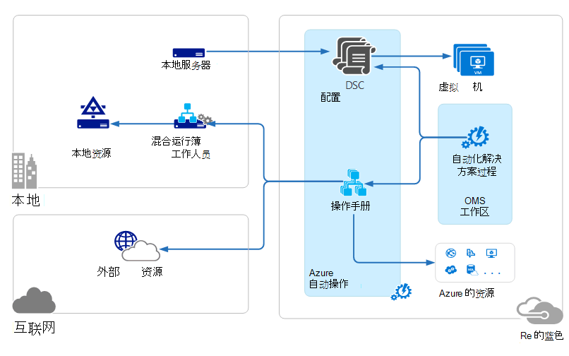
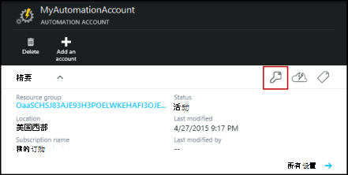
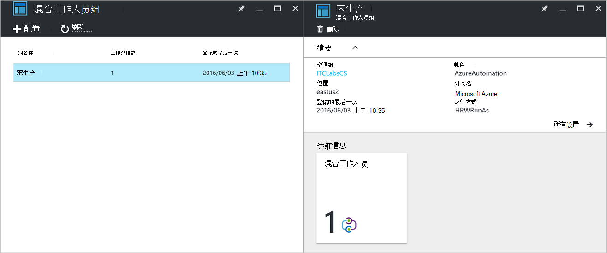
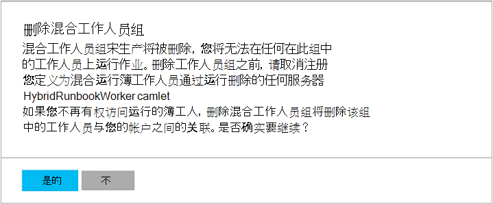

<properties
   pageTitle="Azure 自动化混合 Runbook 工作人员 |Microsoft Azure"
   description="本文提供有关安装和使用混合 Runbook 工作人员，这是使您可以在您的本地数据中心中的计算机上运行运行手册的 Azure 自动化功能的信息。"
   services="automation"
   documentationCenter=""
   authors="mgoedtel"
   manager="jwhit"
   editor="tysonn" />
<tags
   ms.service="automation"
   ms.devlang="na"
   ms.topic="article"
   ms.tgt_pltfrm="na"
   ms.workload="infrastructure-services"
   ms.date="10/14/2016"
   ms.author="bwren" />

# Azure 自动化混合 Runbook 工作人员

在 Azure 自动化运行手册无法访问您的本地数据中心中的资源，因为它们运行在 Azure 的云。  Azure 自动化的混合 Runbook 辅助功能使您可以位于您的数据中心管理的本地资源的计算机上运行运行手册。 存储和在 Azure 自动化管理运行手册中，然后发送到一个或多个内部机。  

下图说明了此功能。   

数据中心可以作为混合 Runbook 工作人员执行，并从 Azure 自动化运行运行手册中，可以指定一个或多个计算机。  每个工作人员都需要一个连接到 Microsoft 操作管理套件和 Azure 自动化 runbook 环境 Microsoft 管理代理。  操作管理套件只用来安装和维护管理代理并监视功能的工作人员。  运行手册和指令来运行它们的传输由 Azure 自动化执行。

没有入站的防火墙要求以支持混合的 Runbook 工作人员。 本地计算机上的代理启动与 Azure 云自动化的所有通信。 当启动 runbook 时，Azure 自动化创建代理检索指令。 代理程序然后拉下 runbook 和任何参数在运行它之前。  它还将检索从 Azure 自动化 runbook 所使用的所有[资产](http://msdn.microsoft.com/library/dn939988.aspx)。

>[AZURE.NOTE] 混合的 Runbook 工作人员当前不支持[DSC 配置](automation-dsc-overview.md)。

## 混合的 Runbook 工作人员组

每个混合 Runbook 工作人员是在安装代理时指定混合 Runbook 工作人员组的成员。  一个组可以包含一个代理，但您可以为高可用性组中安装多个代理。

混合的 Runbook 工作人员启动 runbook 时，您指定的组，它将在运行。  该组的成员将确定哪些工作人员将为请求提供服务。  您不能指定特定的工作人员。

## 混合的 Runbook 工作人员要求

您必须指定至少一个本地计算机运行混合 runbook 作业。  这台计算机必须具有下列项目︰

- 或更高版本的 Windows Server 2012
- Windows PowerShell 4.0 或更高版本
- 两个内核和 4 GB 的 RAM 的最小值

考虑混合工作人员的以下建议︰ 

- 指定多个混合工作人员，每个组中的高可用性。  
- 混合工作人员可以共存与服务管理自动化功能或系统中心控制器的 runbook 服务器。
- 请考虑使用计算机的物理位置或自动化客户的地区附近因为作业数据发送回 Azure 自动化作业完成后。

>[AZURE.NOTE] 混合的 Runbook 工作版本 7.2.11136.0 目前支持通过仅使用 PowerShell 脚本代理服务器进行通信。  PowerShell 工作流脚本支持将在将来的发行版中可用。  

### 配置代理服务器和防火墙设置

对于内部部署混合 Runbook 工作人员连接到并使用 Microsoft 操作管理套件 (OMS) 服务注册，则必须访问的端口号和 Url，如下所述。  这不包括[端口和 Microsoft 监控代理所需的 Url](../log-analytics/log-analytics-proxy-firewall.md#configure-proxy-and-firewall-settings-with-the-microsoft-monitoring-agent)连接到 OMS。 如果您使用代理服务器代理和 OMS 服务之间的通信，您需要确保适当的资源进行访问。 如果您使用防火墙来限制对 Internet 的访问，您需要配置您的防火墙以允许访问。 

以下信息列出的端口和程序所需混合 Runbook 工作人员的通信与自动化的 Url。

- 仅 TCP 443 时需要出站 Internet 访问权限的端口︰
- 全球网址︰ *.azure automation.net

如果您具有定义针对特定区域的自动化帐户并且想要限制与该区域数据中心的通信，下表提供了每个区域的 DNS 记录。

|**地区**|**DNS 记录**|
|--------------|--------------|
|美国中南部|scus-jobruntimedata-生产-su1.azure-automation.net|
|东亚美国 2|eus2-jobruntimedata-生产-su1.azure-automation.net|
|西欧|我们的 jobruntimedata-生产-su1.azure-automation.net|
|北欧|内布拉斯加州-jobruntimedata-生产-su1.azure-automation.net|
|加拿大中部|cc-jobruntimedata-生产-su1.azure-automation.net|
|东南亚|海-jobruntimedata-生产-su1.azure-automation.net|
|中央印度|cid-jobruntimedata-生产-su1.azure-automation.net|
|日本东|jpe-jobruntimedata-生产-su1.azure-automation.net|
|澳大利亚东南|ase-jobruntimedata-生产-su1.azure-automation.net|

## 安装混合 Runbook 工作人员

下面的过程介绍如何安装和配置混合 Runbook 工作人员。  一次自动化环境执行前两个步骤，然后重复工作人员中的每台计算机的其余步骤。

### 1.创建工作区操作管理套件

如果没有操作管理套件工作区，然后创建一个使用说明[设置您的工作区](https://technet.microsoft.com/library/mt484119.aspx)。 如果您已经拥有一个，您可以使用现有的工作区。

### 2.添加至工作区操作管理套件自动化解决方案的过程

解决方案操作管理套件中添加功能。  自动化解决方案添加 Azure 自动化包括混合 Runbook 工作人员的支持的功能。  当解决方案添加到您的工作区时，它会自动按下辅助组件到代理计算机，您应该安装在下一步。

请按照说明进行操作[以添加使用解决方案库的解决方案](../log-analytics/log-analytics-add-solutions.md)将**自动化**解决方案添加到您的操作管理套件区。

### 3.安装 Microsoft 监控代理

Microsoft 监控代理将计算机连接到操作管理套件。  当您在本地计算机上安装代理并将它连接到您的工作区时，它将自动下载混合 Runbook 工作人员所需的组件。

请按照[日志分析到连接的 Windows 计算机](../log-analytics/log-analytics-windows-agents.md)上的说明进行操作，可以在本地计算机上安装代理。  您可以重复此过程以将多个工作人员添加到您的环境的多台计算机。

当代理已成功连接到操作管理套件时，它将操作管理套件**设置**窗格中的**连接源**选项卡上列出。  您可以验证代理已正确下载的自动化解决方案，具有 C:\Program 该监视 Agent\Agent 在名为**AzureAutomationFiles**的文件夹时。  要确认混合 Runbook 工作的版本，您可以导航到 C:\Program 该监视 Agent\Agent\AzureAutomation\ 和注\\*版本*的子文件夹。   

### 4.安装 runbook 环境并连接到 Azure 自动化

当您添加一个代理操作管理套件时，自动化解决方案推动下包含**添加 HybridRunbookWorker** cmdlet 的**HybridRegistration** PowerShell 模块。  使用此 cmdlet 的计算机上安装的 runbook 环境并将它注册 Azure 自动化。

在管理员模式下打开 PowerShell 会话并运行以下命令来导入模块。

    cd "C:\Program Files\Microsoft Monitoring Agent\Agent\AzureAutomation\<version>\HybridRegistration"
    Import-Module HybridRegistration.psd1

然后运行**添加 HybridRunbookWorker** cmdlet 使用下面的语法︰

    Add-HybridRunbookWorker –Name <String> -EndPoint <Url> -Token <String>

您可以在 Azure 门户**管理密钥**刀片式服务器从该 cmdlet 所需的信息。  通过单击自动帐户元素面板上的钥匙图标打开此刀片。

- **名称**是混合 Runbook 工作人员组的名称。 如果自动化帐户中已存在此组，然后向其添加当前计算机。  如果已经存在，则添加。
- **终结点**是**管理密钥**刀片式服务器中的**URL**字段。
- **令牌**是**管理密钥**刀片式服务器中的**主键访问**。  

使用**-详细**交换机，**添加 HybridRunbookWorker**以获得有关安装的详细的信息。

### 5.安装 PowerShell 模块

运行手册可以使用的任何活动和 Azure 自动化环境中安装的模块中定义的 cmdlet。  这些模块不会自动部署到本地计算机，因此您必须手动安装这些。  例外情况是 Azure 模块安装默认情况下为 Azure 自动化提供 cmdlet 访问所有 Azure 服务和活动。

由于混合 Runbook 辅助功能的主要目的是管理本地资源，您很可能需要安装支持这些资源的模块。  有关安装 Windows PowerShell 模块的信息，可以参考[安装模块](http://msdn.microsoft.com/library/dd878350.aspx)。

## 删除混合 Runbook 工作人员

从组中删除一个或多个混合的 Runbook 工作人员，或者您可以删除组，具体取决于您的需求。  要从本地计算机删除混合 Runbook 工作人员，打开 PowerShell 会话在管理员模式下，运行下面的命令-**删除 HybridRunbookWorker** cmdlet。  使用**-详细**开关删除过程的详细日志。 

这不会从计算机的功能和配置的混合 Runbook 辅助角色删除 Microsoft 监控代理。  

若要删除一个组，您首先需要从每台计算机都是使用前面所示的命令的组的成员中删除混合 Runbook 工作人员，然后执行以下步骤以删除组。  

1. 在 Azure 的门户打开自动化帐户。
2. 选择**混合工作人员组**麻将牌，并在**混合工作人员组**刀片式服务器，选择想要删除的组。  在选择的特定组后，会显示**混合工作人员组**属性刀片式服务器。     
3. 在选定组的属性刀片式服务器，单击**删除**。  消息将出现要求您确认此操作，并且如果您确信要继续，请选择**是**。    此过程可能需要几秒钟的时间来完成，您可以跟踪从菜单下**通知**其进度。  

## 混合的 Runbook 工作人员开始运行手册

[开始在 Azure 自动化 Runbook](automation-starting-a-runbook.md)描述了不同的方法来启动 runbook。  混合 Runbook 工作人员添加**RunOn**选项，您可以指定混合 Runbook 工作人员组的名称。  如果指定了组，然后检索 runbook 值，并将通过运行在该组工作的人员。  如果未指定此选项，然后在运行于 Azure 自动化像平常一样。

在 Azure 门户启动 runbook 时，您将看到**在上运行**的选项可以选择**Azure**或**混合工作人员**。  如果您选择了**混合工作**，然后可以从下拉列表选择的组。

使用**RunOn**参数可以使用以下命令启动名为上一个名为 MyHybridGroup，使用 Windows PowerShell 的混合 Runbook 工作人员组的测试 Runbook runbook。

    Start-AzureRmAutomationRunbook –AutomationAccountName "MyAutomationAccount" –Name "Test-Runbook" -RunOn "MyHybridGroup"

>[AZURE.NOTE] **RunOn**参数添加到 Microsoft Azure PowerShell 0.9.1 版本中**开始 AzureAutomationRunbook** cmdlet。  如果您有安装一个早期，应[下载最新版本](https://azure.microsoft.com/downloads/)。  您只需要在其中您马上就要开始 runbook 从 Windows PowerShell 的工作站上安装此版本。  不需要，除非您想要从该计算机开始运行手册的辅助计算机上安装。  因为这将需要 Azure Powershell 自动化帐户在安装最新版本，目前无法从另一种 runbook 混合 Runbook 工作人员启动 runbook。  将 Azure 自动化中自动更新和自动推送到工作人员很快就最新的版本。

## Runbook 的权限

因为他们访问在 Azure 之外的资源运行手册运行在混合 Runbook 工作上不能使用相同的[的方法，通常用于运行手册对 Azure 的资源进行身份验证](automation-configuring.md#configuring-authentication-to-azure-resources)。  Runbook 可以提供自己的身份验证的本地资源，也可以指定一个用来为所有运行手册中提供的用户上下文的 RunAs 帐户。

### Runbook 身份验证

默认情况下，运行手册将运行在本地系统帐户的上下文中的本地计算机上，因此，它们必须提供自己的身份将可以访问的资源。  

在您使用 cmdlet，您可以指定凭据，这样您就可以验证不同资源的 runbook，您可以使用[凭据](http://msdn.microsoft.com/library/dn940015.aspx)和[证书](http://msdn.microsoft.com/library/dn940013.aspx)的资产。  下面的示例演示了将计算机重新启动 runbook 的一部分。  它检索凭据凭据资产和变量资产从计算机名并重新启动计算机 cmdlet 使用这些值。

    $Cred = Get-AzureRmAutomationCredential -ResourceGroupName "ResourceGroup01" -Name "MyCredential"
    $Computer = Get-AzureRmAutomationVariable -ResourceGroupName "ResourceGroup01" -Name  "ComputerName"

    Restart-Computer -ComputerName $Computer -Credential $Cred

您还可以利用[InlineScript](automation-powershell-workflow.md#inline-script)将允许您使用[PSCredential 公共参数](http://technet.microsoft.com/library/jj129719.aspx)所指定的凭据在另一台计算机上运行的代码块。

### RunAs 帐户

而不是让运行手册提供本地资源对自己进行身份验证，您可以指定混合工作人员组的**RunAs**帐户。  指定有权访问本地资源，[凭据资产](automation-credentials.md)和所有运行手册将这些凭据下运行，就当在组中混合 Runbook 工作运行。  

凭据的用户名必须是下列格式之一︰

- 域 \ 用户名 
- username@domain
- 用户名 （对于内部计算机的本地帐户）

使用以下过程指定混合工作人员组的 RunAs 帐户︰

1. 创建具有访问本地资源的[凭据资产](automation-credentials.md)。
2. 在 Azure 的门户打开自动化帐户。
2. 选择**混合工作人员组**拼贴，然后选择组。
3. 选择**的所有设置**，然后**混合辅助组设置**。
4. 改**为运行**从**默认**为**自定义。**
5. 选择凭据，然后单击**保存**。

## 为混合 Runbook 工作人员创建运行手册

不没有运行在 Azure 自动化和那些在混合 Runbook 工作上运行的运行手册的结构中的任何差异。 运行手册，使用与每个将很可能差别很大但由于在 Azure 自动化运行手册通常管理 Azure 的云环境中的资源时，混合 Runbook 工作人员运行手册通常将管理您的数据中心中的本地资源。 

您可以编辑 runbook 混合 Runbook Azure 自动化中的工作人员，但如果您尝试在编辑器中测试 runbook，可能会有困难。  PowerShell 模块访问本地资源可能没有安装在 Azure 自动化环境中这种情况下，测试就会失败。  如果您安装所需的模块，然后将运行 runbook，但它将不能访问本地资源的完整测试。

## 故障诊断混合 Runbook 工作人员运行手册

[Runbook 的输出和消息](automation-runbook-output-and-messages.md)被发送到 Azure 自动化混合从类似 runbook 作业的工作人员在云中运行。  您还可以启用详细和进度流一样，就像为其他运行手册。  

在每个混合工作人员在 C:\ProgramData\Microsoft\System Center\Orchestrator\7.2\SMA\Sandboxes 上本地存储日志。

如果运行手册不能成功，作业摘要显示状态为**已挂起**，请查看疑难解答文章[混合 Runbook 工作人员︰ runbook 作业状态为挂起终止](automation-troubleshooting-hrw-runbook-terminates-suspended.md)。   

## 关系到服务管理自动化

[服务管理自动化 (SMA)](https://technet.microsoft.com/library/dn469260.aspx)允许您运行在您的本地数据中心中的 Azure 自动化支持同一运行手册。 SMA 通常与 Windows Azure 包，因为 Windows Azure 包包含一个图形界面的 SMA 管理部署。 Azure 自动化与 SMA 需要包含 web 服务器承载 API，以包含运行手册和 SMA 配置数据库和 Runbook 工作人员执行 runbook 作业的本地安装。 Azure 的自动化提供了这些服务在云环境中的，只需维护本地环境中混合 Runbook 工作人员。

如果您是现有 SMA 用户，您可以将运行手册移动到 Azure 自动化与混合 Runbook 工作人员使用无变化，[创建混合 Runbook 工作人员运行手册](#creating-runbooks-for-hybrid-runbook-worker)中所述，假如他们执行自己的身份与资源。  在 SMA 可能提供身份验证运行手册的辅助服务器上运行的服务帐户上下文中运行手册。

以下条件用于确定与混合 Runbook 工作人员或服务管理自动化的 Azure 自动化是否更适合您的需求。

- SMA 要求图形管理界面是否需要连接到 Windows Azure 包及其基础组件的本地安装。 具有较高的维护成本比 Azure 自动化，只需要在本地 runbook 工作人员上安装代理，则需要更多的本地资源。 代理管理的操作管理套件，进一步降低维护成本。
- Azure 自动化在云中存储其运行手册，并将它们传送到内部混合 Runbook 工作人员。 如果您的安全策略不允许这种行为，则应使用 SMA。
- SMA 是附带系统中心;因此，需要 System Center 2012 R2 许可。 Azure 自动化基于分层的订阅模型。
- Azure 的自动化具有高级功能，例如在 SMA 中不可用的图形化运行手册。

## 下一步行动

- 若要了解有关可用于启动 runbook 的不同方法的详细信息，请参阅[启动了 Azure 自动化 Runbook](automation-starting-a-runbook.md)
- 要了解使用 PowerShell 并且 PowerShell 工作流的运行手册，使用文本编辑器的 Azure 自动化中的不同过程，请参阅[编辑 Runbook 在 Azure 自动化](automation-edit-textual-runbook.md)

 
