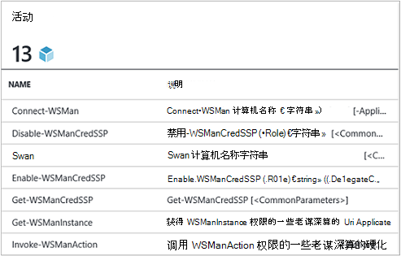
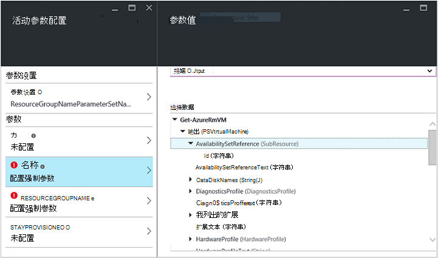
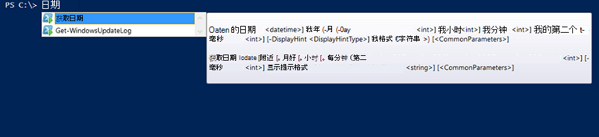

<properties
   pageTitle="创建 Azure 自动化集成模块 |Microsoft Azure"
   description="教程，指导您完成创建、 测试和示例使用 Azure 自动化中的集成模块。"
   services="automation"
   documentationCenter=""
   authors="mgoedtel"
   manager="jwhit"
   editor="" />

<tags
   ms.service="automation"
   ms.workload="tbd"
   ms.tgt_pltfrm="na"
   ms.devlang="na"
   ms.topic="get-started-article"
   ms.date="09/12/2016"
   ms.author="magoedte" />

# <a name="azure-automation-integration-modules"></a>Azure 自动化集成模块

PowerShell 是 Azure 自动化背后的基本技术。 由于 Azure 自动化基于 PowerShell，PowerShell 模块是 Azure 自动化的可扩展性的关键。 在本文中，我们将引导您完成 Azure 自动化使用 PowerShell 模块，称为"集成模块"，并创建 PowerShell 模块的最佳方法，以确保它们在 Azure 自动化集成模块作为工作的具体情况。 

## <a name="what-is-a-powershell-module"></a>什么是 PowerShell 模块？

PowerShell 模块是一组 PowerShell cmdlet**获取日期**或**复制项目**，可从 PowerShell 控制台、 脚本、 工作流程、 运行手册和 PowerShell DSC 资源，如 WindowsFeature 或文件，可用于从 PowerShell DSC 配置等。 通过 cmdlet 和 DSC 资源公开所有 PowerShell 的功能和每个 cmdlet/DSC 资源后盾 PowerShell 模块，其中附带 PowerShell 本身的很多。 例如，**获取日期**cmdlet 是 Microsoft.PowerShell.Utility PowerShell 模块的一部分和**复制项**cmdlet Microsoft.PowerShell.Management PowerShell 模块的一部分，并且包 DSC 资源 PSDesiredStateConfiguration PowerShell 模块的一部分。 这些模块的两个附带 PowerShell。 但 PowerShell 模块多不要的 PowerShell，一部分作为发行，而是随 System Center 2012 配置管理器或类似 PowerShell 库位置上的大型 PowerShell 社区的第一或第三方产品。  这些模块很有用，因为它们使复杂的任务通过封装功能更加简单。  您可以了解有关[MSDN 上的 PowerShell 模块](https://msdn.microsoft.com/library/dd878324%28v=vs.85%29.aspx)的详细信息。 

## <a name="what-is-an-azure-automation-integration-module"></a>什么是 Azure 自动化集成模块？

集成模块并不是非常不同于 PowerShell 模块。 它只是一个 PowerShell 模块 （可选） 包含一个附加文件-指定用于运行手册中的模块的 cmdlet Azure 自动化连接类型的元数据文件。 可选文件，这些模块可以导入到 Azure 自动化处理，使其 cmdlet 可在运行手册和其 DSC 资源中使用可在 DSC 配置中使用 PowerShell。 在幕后，Azure 自动化存储这些模块，并在 runbook 作业和 DSC compiliation 作业执行时将加载它们到 Azure 自动化沙箱中执行运行手册和 DSC 配置编译。  DSC 模块中的任何资源也会自动放置在自动化 DSC 请求服务器上，以便可以通过尝试应用 DSC 配置的机器中抽取。  我们开箱即用 Azure 自动化供您使用，以便可以开始自动 Azure 的管理，但对于任何系统、 服务或您想要与集成的工具可以轻松地导 PowerShell 模块中运送大量的 Azure PowerShell 模块。 

>[AZURE.NOTE] 某些模块附带在自动化服务中的"全局模块"。 这些全局模块可供您开箱时创建自动化客户，和我们有时会更新它们的自动将它们自动化客户的。 如果不希望它们会自动更新，您可以始终导入相同的模块自己，和它将优先于我们能够提供的服务中该模块的全局模块版本。 

导入集成模块包的格式是一个压缩的文件具有相同名称的模块和.zip 扩展名。 它包含 Windows PowerShell 模块和所有支持文件，如果模块有一个包括清单文件 (.psd1)。

如果该模块应包含 Azure 自动化连接类型，它必须包含具有该名称的文件*<ModuleName>*-Automation.json 指定的连接类型属性。 这是压缩的.zip 文件中，模块文件夹中放置一个 json 文件，其中包含的"连接"字段时所需连接到系统或服务模块表示。 这将最终在 Azure 自动化中创建的连接类型。 使用此文件，您可以设置的字段名称，类型，以及字段应该是加密和/或可选的模块的连接类型。 下面是中的 json 文件格式的模板︰

```
{ 
   "ConnectionFields": [
   {
      "IsEncrypted":  false,
      "IsOptional":  false,
      "Name":  "ComputerName",
      "TypeName":  "System.String"
   },
   {
      "IsEncrypted":  false,
      "IsOptional":  true,
      "Name":  "Username",
      "TypeName":  "System.String"
   },
   {
      "IsEncrypted":  true,
      "IsOptional":  false,
      "Name":  "Password",
   "TypeName":  "System.String"
   }],
   "ConnectionTypeName":  "DataProtectionManager",
   "IntegrationModuleName":  "DataProtectionManager"
}
```

如果您已经部署了服务管理自动化和创建自动化运行手册的集成模块包，这看起来很熟悉。 


## <a name="authoring-best-practices"></a>创作的最佳做法

只是因为集成模块，实质上是 PowerShell 模块，并不意味着我们没有一套围绕创作它们的做法。 还有许多事情，我们建议您考虑使用 PowerShell 模块，创作时才能最 Azure 自动化中使用它。 其中的某些情况而言，Azure 自动化，有些则只是为了使模块适用于 PowerShell 的工作流，而不考虑正在使用自动化非常有用。 

1. 包括概述，说明，以及模块中的每个 cmdlet 的帮助的 URI。 继续，您可以定义某些 cmdlet 允许用户接收使用**获取帮助**cmdlet 的帮助的帮助信息。 例如，下面是如何定义提要并帮助 PowerShell 模块.psm1 文件中写入的 URI。<br>  

    ```
    <#
        .SYNOPSIS
         Gets all outgoing phone numbers for this Twilio account 
    #>
    function Get-TwilioPhoneNumbers {
    [CmdletBinding(DefaultParameterSetName='SpecifyConnectionFields', `
    HelpUri='http://www.twilio.com/docs/api/rest/outgoing-caller-ids')]
    param(
       [Parameter(ParameterSetName='SpecifyConnectionFields', Mandatory=$true)]
       [ValidateNotNullOrEmpty()]
       [string]
       $AccountSid,

       [Parameter(ParameterSetName='SpecifyConnectionFields', Mandatory=$true)]
       [ValidateNotNullOrEmpty()]
       [string]
       $AuthToken,

       [Parameter(ParameterSetName='UseConnectionObject', Mandatory=$true)]
       [ValidateNotNullOrEmpty()]
       [Hashtable]
       $Connection
    )

    $cred = CreateTwilioCredential -Connection $Connection -AccountSid $AccountSid -AuthToken $AuthToken

    $uri = "$TWILIO_BASE_URL/Accounts/" + $cred.UserName + "/IncomingPhoneNumbers"
    
    $response = Invoke-RestMethod -Method Get -Uri $uri -Credential $cred

    $response.TwilioResponse.IncomingPhoneNumbers.IncomingPhoneNumber
    }
    ```
<br> 
提供此信息不会仅显示此帮助使用 PowerShell 控制台中的**获取帮助**cmdlet，它还将公开在 Azure 自动化，例如在 runbook 创作过程插入活动时此帮助功能。 单击"查看详细的帮助"将在您用于访问 Azure 自动化功能的 web 浏览器的另一个选项卡中打开帮助的 URI。<br>
2. 如果针对一个远程系统运行模块。 它应该包含定义连接到该远程系统的连接类型所需的信息集成模块的元数据文件。 b。 模块中的每个 cmdlet 应能使对象中一个连接 （该连接类型的实例） 作为参数。  
    模块中的 Cmdlet 就会更容易在 Azure 自动化中使用，如果您允许该 cmdlet 到作为参数传递的对象使用的连接类型的字段。 此方法的用户无需将连接资产的参数映射到该 cmdlet 的相应参数调用 cmdlet 每次。 根据上面的 runbook 示例，它使用一个名为 CorpTwilio 的 Twilio 连接资产访问 Twilio 并返回帐户中的所有电话号码。  请注意如何将映射到该 cmdlet 的参数连接的字段？<br>

    ```
    workflow Get-CorpTwilioPhones
    {
      $CorpTwilio = Get-AutomationConnection -Name 'CorpTwilio'
    
      Get-TwilioPhoneNumbers 
        -AccountSid $CorpTwilio.AccountSid  
        -AuthToken $CorptTwilio.AuthToken
    }
    ```
<br>
更容易和更好解决办法这直接将连接对象传递给该 cmdlet 的

    ```
    workflow Get-CorpTwilioPhones
    {
      $CorpTwilio = Get-AutomationConnection -Name 'CorpTwilio'

      Get-TwilioPhoneNumbers -Connection $CorpTwilio
    }
    ```
<br>
您可以通过使他们能够接受一个连接对象作为参数，而不是只是连接字段参数直接启用您 cmdlet 的此类行为。 通常您需要参数集，以便用户不使用 Azure 自动化构建哈希表来充当连接对象不调用您的 cmdlet。 **SpecifyConnectionFields**以下用于将连接传递字段属性逐个参数集。 **UseConnectionObject**可以通过直接连接。 正如您可以看到，在[Twilio PowerShell 模块](https://gallery.technet.microsoft.com/scriptcenter/Twilio-PowerShell-Module-8a8bfef8)发送 TwilioSMS cmdlet 允许传递两种方法︰ 

    ```
    function Send-TwilioSMS {
      [CmdletBinding(DefaultParameterSetName='SpecifyConnectionFields', `
      HelpUri='http://www.twilio.com/docs/api/rest/sending-sms')]
      param(
         [Parameter(ParameterSetName='SpecifyConnectionFields', Mandatory=$true)]
         [ValidateNotNullOrEmpty()]
         [string]
         $AccountSid,

         [Parameter(ParameterSetName='SpecifyConnectionFields', Mandatory=$true)]
         [ValidateNotNullOrEmpty()]
         [string]
         $AuthToken,

         [Parameter(ParameterSetName='UseConnectionObject', Mandatory=$true)]
         [ValidateNotNullOrEmpty()]
         [Hashtable]
         $Connection

       )
    }
    ```
<br>
3. 在模块中定义所有 cmdlet 的输出的类型。 定义输出类型的 cmdlet 允许设计时 IntelliSense 将有助于确定该 cmdlet，在创作的过程中使用的输出属性。 创作过程中自动化 runbook 图形，其中设计时知识是关键模块的轻松的用户体验是非常有帮助。<br> <br> 这是输出的类似于"提前键入"PowerShell ISE cmdlet 的功能而无需运行它。<br> <br>
4. 模块中的 Cmdlet 不需要参数的复杂对象的类型。 PowerShell 流的 PowerShell 不同，在于它将复杂类型存储在窗体中反序列化。 基元类型将保持作为基元，但复杂类型会转换为它们反序列化的版本，是本质属性包。 例如，如果使用**Get 过程**cmdlet runbook （或就此而言 PowerShell 流） 中的，它将返回类型 [Deserialized.System.Diagnostic.Process]，不是预期的 [System.Diagnostic.Process] 类型的对象。 此类型具有完全相同属性的非反序列化的类型，但是不包含任何方法。 并且如果您尝试此值作为参数传递到 cmdlet cmdlet 位置需要此参数 [System.Diagnostic.Process] 值，您将收到以下错误︰*不能处理参数变换参数进程。错误:"无法转换的"System.Diagnostics.Process (CcmExec)"值类型"Deserialized.System.Diagnostics.Process"，键入"System.Diagnostics.Process"。*   这是因为预期 [System.Diagnostic.Process] 类型和给定的 [Deserialized.System.Diagnostic.Process] 类型之间的类型不匹配。 解决此问题的方式是模块的为了确保您的 cmdlet 不带参数的复杂类型。 下面是错误的方式去做。

    ```
    function Get-ProcessDescription {
      param (
            [System.Diagnostic.Process] $process
      )
      $process.Description
    }
    ``` 
<br>
并且这里是正确的方式，在可供内部 cmdlet 抓取的复杂对象，并使用它的基元。 因为 cmdlet PowerShell 的上下文中执行，则正确的 [System.Diagnostic.Process] 类型不 PowerShell 工作流程，在 cmdlet $process。  

    ```
    function Get-ProcessDescription {
      param (
            [String] $processName
      )
      $process = Get-Process -Name $processName

      $process.Description
    }
    ```
<br>
连接资产运行手册中的哈希表，这是一个复杂类型，并且这些哈希表看起来能够传递到的 cmdlet 尚未他们 – 连接参数完全，与任何强制转换异常。 从技术上讲，某些 PowerShell 类型能够正确地从其序列化形式转换为其反序列化窗体中，并因此可以传递到 cmdlet 接受非反序列化的类型的参数。 哈希表是其中之一。 模块作者的定义类型，它们可以正确地反序列化以及一种实现的可能，但有一些折衷方案，以使。 类型必须具有默认构造函数，具有其所有属性公开的并且具有 PSTypeConverter。 但是，对于模块的作者并不属于已定义类型，没有方法来"修复"，因此建议以避免复杂类型参数一起。 Runbook 创作的提示︰ 如果某些原因您 cmdlet 需要采用复杂的类型参数，或使用其他人的模块所要求的复杂类型参数，PowerShell 工作流运行手册，并在本地 PowerShell，PowerShel 工作流中的替代方法是包装生成的复杂类型和使用相同的 InlineScript 活动中的复杂类型的 cmdlet cmdlet。 InlineScript 将其内容作为 PowerShell 而不是 PowerShell 工作流执行，因为生成的复杂类型 cmdlet 将产生该正确类型，而不能反序列化的复杂类型。
5. 请在模块中的所有 cmdlet 无状态。 运行在一个不同的会话中调用工作流中每个 cmdlet 的 PowerShell 工作流。 这意味着任何依赖于会话状态创建 / 修改同一模块中的其他 cmdlet 的 cmdlet 不起 PowerShell 工作流运行手册中。  下面是不是要执行的操作的示例。

    ```
    $globalNum = 0
    function Set-GlobalNum {
       param(
           [int] $num
       )
      
       $globalNum = $num
    }
    function Get-GlobalNumTimesTwo {
       $output = $globalNum * 2
     
       $output
    }
    ```
<br>
6. 该模块应完全包含在 Xcopy 能包。 Azure 自动化模块分布到自动化沙箱时需要执行的运行手册，因为他们需要独立于主机正在运行的工作。 这意味着，您应该能够压缩组成的模块包，将其移动到任何其他主机具有相同或更高版本 PowerShell 版本，并使之正常时导入到该主机的 PowerShell 环境。 为了保证做到这一点，模块应不取决于任何文件外部模块文件夹 （导入到 Azure 自动化时获取压缩设置的文件夹），或者在主机上，如设置安装的产品的任何唯一的注册表设置。 如果不遵循该最佳方案，则模块将不能使用 Azure 自动化中。  

## <a name="next-steps"></a>下一步行动

- 若要开始使用 PowerShell 工作流运行手册，请参阅[我第一个 PowerShell 流 runbook](automation-first-runbook-textual.md)
- 若要了解有关创建 PowerShell 模块的详细信息，请参见[编写 Windows PowerShell 模块](https://msdn.microsoft.com/library/dd878310%28v=vs.85%29.aspx)