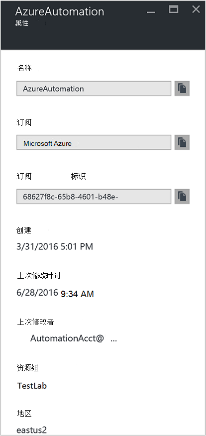
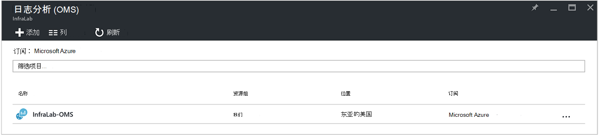
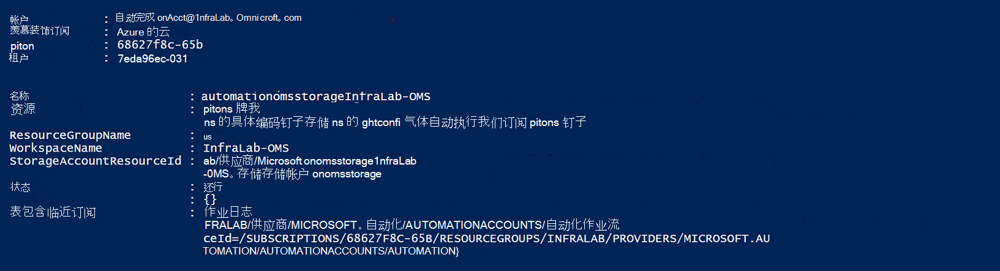
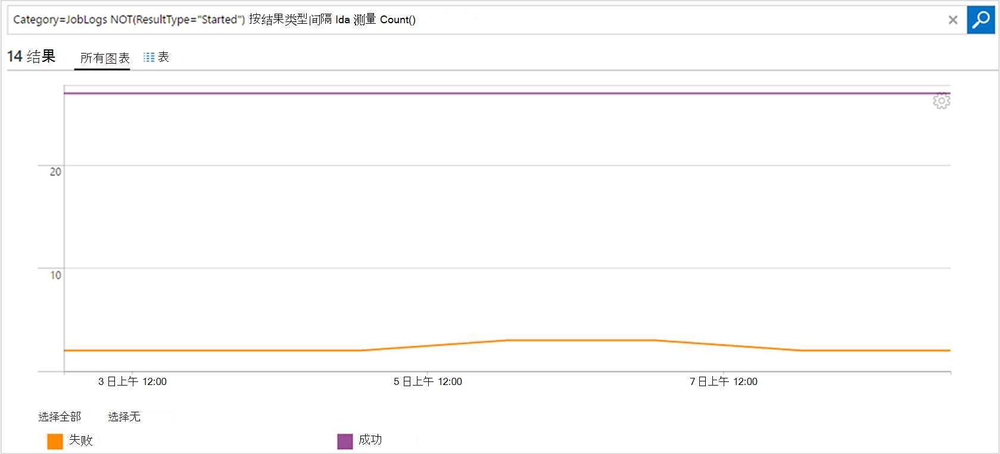

<properties
    pageTitle="从正推作业状态和工作流自动化到日志分析 (OMS) |Microsoft Azure"
    description="本文演示如何发送作业状态和 runbook 与 Microsoft 操作管理套件日志分析提供额外的洞察力和管理工作流。"
    services="automation"
    documentationCenter=""
    authors="MGoedtel"
    manager="jwhit"
    editor="tysonn" />
<tags
    ms.service="automation"
    ms.devlang="na"
    ms.topic="article"
    ms.tgt_pltfrm="na"
    ms.workload="infrastructure-services"
    ms.date="09/22/2016"
    ms.author="magoedte" />

# 从正推作业状态和工作流自动化到日志分析 (OMS)

自动化可以发送 runbook 作业状态和作业流到 Microsoft 操作管理套件 (OMS) 日志分析区。  可以查看此信息与 PowerShell Azure 的门户网站或通过单个作业状态或特定自动化客户的所有作业，而任何高级来支持您的操作要求将要求您创建 PowerShell 的自定义脚本。  现在使用日志 Anaytics 您可以︰

- 获取有关自动化作业的洞察力 
- 电子邮件或警报基于 runbook 作业状态 （例如失败或挂起） 的触发器 
- 个作业流写入高级的查询 
- 在自动化帐户关联的作业 
- 随着时间的推移可视化作业历史记录     

## 系统必备组件和部署注意事项

若要开始将自动化日志发送到日志分析，您必须︰

1. OMS 的订阅。 有关其他信息，请参阅[开始使用日志分析](../log-analytics/log-analytics-get-started.md)。  

    >[AZURE.NOTE]OMS 区，自动化帐户必须在相同 Azure 订阅以使此配置正常工作中。 
  
2. [Azure 存储帐户](../storage/storage-create-storage-account.md)。  
   
    >[AZURE.NOTE]存储帐户*必须*是在同一区域作为自动化帐户。 
 
3. Azure PowerShell 版本 1.0.8 或更高版本的运营洞察力 cmdlet。 有关此发行版以及如何安装它的信息，请参阅[如何安装和配置 Azure PowerShell](../powershell-install-configure.md)。
4. Azure 的诊断和日志分析 PowerShell。  有关此发行版以及如何安装它的详细信息，请参阅[Azure 诊断和日志分析](https://www.powershellgallery.com/packages/AzureDiagnosticsAndLogAnalytics/0.1)。  
5. 从[PowerShell 库](https://www.powershellgallery.com/packages/Enable-AzureDiagnostics/1.0/DisplayScript)下载 PowerShell 脚本**启用 AzureDiagnostics.ps1** 。 此脚本将配置以下项目︰
 - 若要保存您指定的自动化帐户 runbook 作业状态和流数据存储帐户。
 - 启用此数据从您的自动化帐户来将其存储在 Azure Blob 存储帐户以 JSON 格式的集合。
 - 配置到 OMS 日志分析从 Blob 存储帐户收集数据。
 - 启用自动日志分析解决方案 OMS 区。   

**启用 AzureDiagnostics.ps1**脚本在执行过程中需要以下参数︰

- *AutomationAccountName* -自动化帐户的名称
- *LogAnalyticsWorkspaceName* -您 OMS 的工作区的名称

若要查找值为*AutomationAccountName*，Azure 门户中从**自动化帐户**刀片式服务器选择自动化帐户并选择**所有设置**。  从**所有设置**刀片式服务器，在**帐户设置**下选择**属性**。  在**属性**刀片式服务器，您可以注意这些值。  。

## 安装程序日志分析与集成

1. 您计算机上，启动**Windows PowerShell**从**开始**屏幕。  
2. 从 PowerShell 命令行解释器中，导航到包含您下载并执行该更改参数的值的脚本的文件夹*-AutomationAccountName*和*LogAnalyticsWorkspaceName 的*。

    >[AZURE.NOTE] 系统将提示您进行身份验证 Azure 之后执行该脚本。  是订阅管理员角色的成员和联订阅的管理员帐户，**必须**登录。   
    
        .\Enable-AzureDiagnostics -AutomationAccountName <NameofAutomationAccount> `
        -LogAnalyticsWorkspaceName <NameofOMSWorkspace> `

3. 运行此脚本后应该看到记录日志分析中的大约 30 分钟后新诊断的数据写入到存储。  如果这一次是指[blob 存储在 JSON 文件](../log-analytics/log-analytics-azure-storage-json.md#troubleshooting-configuration-for-azure-diagnostics-written-to-blob-in-json)中的故障排除部分后，记录不可用。

### 验证配置

要确认脚本成功地配置了您的自动化帐户和 OMS wokspace，可以继续执行以下步骤。  这样，若要查找您 OMS 的工作区名称和资源组的名称，从 Azure 门户的值导航到日志分析 (OMS) 和日志分析 (OMS) 刀片式服务器之前, 记下的值**名称**和**资源组**。  时我们验证您使用 PowerShell cmdlet[获取 AzureRmOperationalInsightsStorageInsight](https://msdn.microsoft.com/library/mt603567.aspx)的 OMS 工作区中的配置，我们将使用这两个值。

1.  Azure 的门户中，导航到存储帐户和搜索下列存储帐户，使用命名约定- *AutomationAccountNameomsstorage*。  在 runbook 后作业完成，不久之后，您应该看到两个 Blob 创建的容器的**洞察力-日志-joblogs**和**见解的日志-jobstreams**。  

2.  从 PowerShell，运行下面的 PowerShell 代码，更改**ResourceGroupName**和**工作区名称**，复制或者前面提到的参数值。  

    获取登录 AzureRmAccount-AzureRmSubscription SubscriptionName 'SubscriptionName' |获取一组 AzureRmContext-AzureRmOperationalInsightsStorageInsight ResourceGroupName"OMSResourceGroupName"-区"OMSWorkspaceName" 

    这将返回为指定的 OMS 区存储真知灼见。  我们想确认我们在前面部分指定的自动化帐户存储真知灼见存在和**状态**对象显示的值为**确定**。  。

## 分析的日志记录

自动化 OMS 存储库中创建两种类型的记录。

### 作业登录

属性 | 说明|
----------|----------|
时间 | 日期和时间的 runbook 作业的执行时间。|
资源 Id | 在 Azure 中指定的资源类型。  为实现自动化的值是与 runbook 相关联的自动化帐户。|
操作名称 | 指定在 Azure 中所执行的操作的类型。  为实现自动化，则这将作业。|
resultType | Runbook 作业的状态。  可能值包括︰ -启动 -停止 挂起 -失败 -成功|
resultDescription | 介绍了 runbook 作业结果状态。  可能值包括︰ 启动作业 的失败作业 作业已完成|
都会 | 是 runbook 作业的关联 Id 的 GUID。|
类别 | 数据类型的分类。  为实现自动化，则值为 JobLogs。|
RunbookName | Runbook 的名称。|
作业 Id | 是的 runbook 作业 Id 的 GUID。|
调用方 |  谁启动该操作。  可能的值是一个电子邮件地址或对于已排定作业系统。|

### 作业流
属性 | 说明|
----------|----------|
时间 | 日期和时间的 runbook 作业的执行时间。|
资源 Id | 在 Azure 中指定的资源类型。  为实现自动化的值是与 runbook 相关联的自动化帐户。|
操作名称 | 指定在 Azure 中所执行的操作的类型。  为实现自动化，则这将作业。|
resultType | Runbook 作业的状态。  可能值包括︰ -正在进行|
resultDescription | 包括从 runbook 的输出流。|
都会 | 是 runbook 作业的关联 Id 的 GUID。|
类别 | 数据类型的分类。  为实现自动化，则值为 JobStreams。|
RunbookName | Runbook 的名称。|
作业 Id | 是的 runbook 作业 Id 的 GUID。|
调用方 | 谁启动该操作。  可能的值是一个电子邮件地址或对于已排定作业系统。| 
StreamType | 工作流的类型。 可能值包括︰ 进行 输出 -警告 -错误 调试 详细|

## 查看自动记录在日志分析 

现在，您已经开始将自动化作业日志发送到日志分析，我们看看如何使用这些日志内 OMS。   

### Runbook 作业失败或挂起时发送电子邮件 

我们重要的客户之一，询问是发送一封电子邮件或文本时出现问题与 runbook 作业的能力。   

创建预警规则，您首先创建日志搜索应该唤醒调用警报的 runbook 作业记录。  使您可以创建和配置警报规则**警报**按钮将可用。

1.  从 OMS 概述页中，单击**日志搜索**。
2.  通过在下面的示例在查询字段中键入来创建警报日志搜索查询︰ `Category=JobLogs (ResultType=Failed || ResultType=Suspended)`。  您还通过 RunbookName 使用可以进行分组︰ `Category=JobLogs (ResultType=Failed || ResultType=Suspended) | measure Count() by RunbookName_s`。   
  
    如果您已经设置了日志从多个自动化帐户或订阅到您的工作区，您也可能有兴趣分组您的通知订阅或自动化的帐户。  JobLogs 搜索中的资源字段中，可以派生自动化帐户名称。  

3.  单击**警报**在页面的顶部以打开**添加警报规则**页面。  要配置警报的选项的详细信息，请参阅[日志分析中的警报](../log-analytics/log-analytics-alerts.md#creating-an-alert-rule)。

### 查找所有作业都已完成但有错误 

除了警报基于故障，您可能想要知道当 runbook 作业有无尽的错误 （PowerShell 产生错误流中，而非终止错误不会导致作业挂起或失败）。    

1. 在 OMS 门户中，单击**日志搜索**。
2. 在查询字段中，键入`Category=JobStreams StreamType_s=Error | measure count() by JobId_g`，然后单击**搜索**。

### 查看工作流作业  

调试作业时，您可能还要检查工作流。  下面的查询显示为单个作业与 GUID 2ebd22ea-e05e-4eb9-9 d 76-d73cbd4356e0 的所有流︰   

`Category=JobStreams JobId_g="2ebd22ea-e05e-4eb9-9d76-d73cbd4356e0" | sort TimeGenerated | select ResultDescription` 

### 查看历史作业状态 

最后，可能要随着时间的推移可视化作业历史记录。  可以使用此查询可以随着时间的推移搜索作业的状态。 

`Category=JobLogs NOT(ResultType="started") | measure Count() by ResultType interval 1day`  
   

## 摘要

通过将自动化作业状态和流数据发送到日志分析，您可以更好地了解通过设置没有问题，而且自定义仪表板使用高级的查询可视化 runbook 结果时通知您的警报您自动化作业的状态、 runbook 作业状态和其他相关的关键指标或指标。  这将有助于提供更大的操作可见性和更快地解决这些事件。  

## 下一步行动

- 若要了解有关如何构造不同的搜索查询和查看与日志分析的自动化作业日志的详细信息，请参阅[在日志分析的日志搜索](../log-analytics/log-analytics-log-searches.md)
- 若要了解如何创建和运行手册从中检索输出和错误消息，请参阅[Runbook 输出和消息](automation-runbook-output-and-messages.md) 
- 若要了解有关 runbook 执行的方式来监视 runbook 作业，和其他技术的详细信息，请参阅[跟踪 runbook 作业](automation-runbook-execution.md)
- 若要了解有关 OMS 日志分析和集合的数据源的详细信息，请参阅[日志分析概述中的收集 Azure 存储数据](../log-analytics/log-analytics-azure-storage.md)