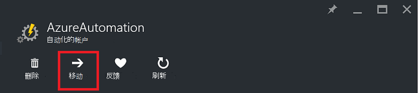
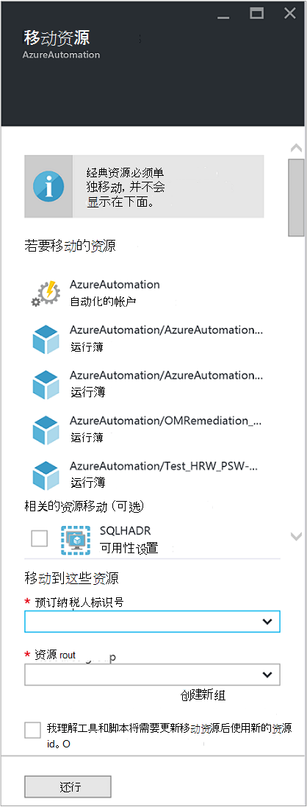

<properties
   pageTitle="自动化的帐户和资源迁移 |Microsoft Azure"
   description="本文介绍如何将自动化客户在 Azure 自动化和关联的资源从一个订阅移动到另一个。"
   services="automation"
   documentationCenter=""
   authors="MGoedtel"
   manager="jwhit"
   editor="tysonn" />
<tags
   ms.service="automation"
   ms.devlang="na"
   ms.topic="article"
   ms.tgt_pltfrm="na"
   ms.workload="infrastructure-services"
   ms.date="07/07/2016"
   ms.author="magoedte" />

# <a name="migrate-automation-account-and-resources"></a>自动化的帐户和资源迁移

自动化客户和其关联的资源 （即资产、 运行手册、 模块等） 在 Azure 门户中创建并想迁移从一个资源组到另一个或从一个订阅到另一个，您可以轻松完成此[移动资源](../resource-group-move-resources.md)功能在 Azure 门户中可用。 但是，此操作前，您应首先阅读下列[清单之前移动资源](../resource-group-move-resources.md#Checklist-before-moving-resources)，此外，具体自动化到下面的列表。   

1.  目标订阅/资源组必须在同一区域中作为源。  这意味着，不能跨区域移动自动化客户。
2.  当移动资源 （例如运行手册、 作业等），源组和目标群体锁定操作的持续时间。 写入和删除操作移动完成之前会阻止组上。  
3.  任何运行手册或从现有订阅引用资源或订阅 ID 的变量需要迁移完成后进行更新。   


>[AZURE.NOTE] 此功能不支持移动经典自动化资源。

## <a name="to-move-the-automation-account-using-the-portal"></a>若要移动使用门户的自动化帐户

1. 从自动化您的帐户，请单击顶部的刀片式服务器的**移动**。<br> <br> 
2. **将资源移动**刀片式服务器，请注意它提供与您自动化的帐户和资源组的资源。  从下拉列表中，选择的**订阅**和**资源组**或选择选项**创建新的资源组**并在提供的字段中输入新的资源组名称。  
3. 查看并选择该复选框以确认您*了解工具和脚本将需要更新以使用新的资源 Id 移动资源后*，然后单击**确定**。<br> <br>   

此操作将需要几分钟才能完成。  在**通知**，您将看到会发生-验证、 迁移，每个操作的状态，然后最后时已完成。     

## <a name="to-move-the-automation-account-using-powershell"></a>若要移动使用 PowerShell 的自动化帐户

若要将现有的自动化资源移到另一个资源组或订阅，使用**Get AzureRmResource** cmdlet 获取自动化的特定帐户，然后**移动 AzureRmResource** cmdlet 以进行移动。

第一个示例演示如何将自动化帐户移动到新的资源组。

   ```
    $resource = Get-AzureRmResource -ResourceName "TestAutomationAccount" -ResourceGroupName "ResourceGroup01"
    Move-AzureRmResource -ResourceId $resource.ResourceId -DestinationResourceGroupName "NewResourceGroup"
   ``` 

执行上面的代码示例后，将提示您确认要执行此操作。  单击**是**并允许执行脚本后，您不会收到任何通知，它执行迁移时。  

若要移动到新的订阅，包括*DestinationSubscriptionId*参数的值。

   ```
    $resource = Get-AzureRmResource -ResourceName "TestAutomationAccount" -ResourceGroupName "ResourceGroup01"
    Move-AzureRmResource -ResourceId $resource.ResourceId -DestinationResourceGroupName "NewResourceGroup" -DestinationSubscriptionId "SubscriptionId"
   ``` 

与前面的示例中，您将会提示您确认移动。  

## <a name="next-steps"></a>下一步行动

- 有关将资源移动到新的资源组或订阅的详细信息，请参阅[移动到新的资源组或预订的资源](../resource-group-move-resources.md)
- 有关 Azure 自动化中基于角色的访问控制的详细信息，请参阅[在 Azure 自动化的基于角色的访问控制](../automation/automation-role-based-access-control.md)。
- 要了解有关 PowerShell cmdlet 来管理您的订阅，请参阅[使用 Azure PowerShell 与资源管理器](../powershell-azure-resource-manager.md)
- 若要了解有关门户功能用于管理您的订阅，请参阅[使用 Azure 门户来管理资源](../azure-portal/resource-group-portal.md)。 
