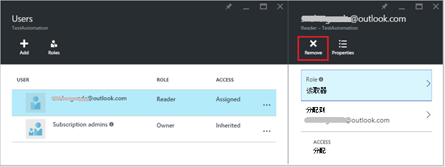

<properties 
   pageTitle="在 Azure 自动化的基于角色的访问控件 |Microsoft Azure"
   description="基于角色的访问控制 (RBAC) 使您能够访问管理 Azure 的资源。 本文介绍如何设置 RBAC 在 Azure 自动化。"
   services="automation"
   documentationCenter=""
   authors="mgoedtel"
   manager="jwhit"
   editor="tysonn"
   keywords="自动化 rbac 角色基于 azure rbac 的访问控制" />
<tags 
   ms.service="automation"
   ms.devlang="na"
   ms.topic="get-started-article"
   ms.tgt_pltfrm="na"
   ms.workload="infrastructure-services"
   ms.date="09/12/2016"
   ms.author="magoedte;sngun"/>

# 在 Azure 自动化的基于角色的访问控制

## 基于角色的访问控制

基于角色的访问控制 (RBAC) 使您能够访问管理 Azure 的资源。 使用[RBAC](../active-directory/role-based-access-control-configure.md)，可以隔离在团队内的职责，并授予用户、 组和应用程序执行其工作所需的访问量。 基于角色的访问权限可以授予用户使用 Azure 门户、 Azure 的命令行工具或 Azure 管理 Api。

## RBAC 在自动化客户

在 Azure 自动化，通过将适当的 RBAC 角色分配给用户、 组和自动化帐户范围的应用程序授予访问权限。 以下是支持的自动化帐户内置角色︰  

|**角色** | **说明** |
|:--- |:---|
| 所有者 | 所有者角色可以访问所有资源和操作自动化客户包括提供对其他用户、 组和应用程序管理的自动化帐户的访问。 |
| 参与者 | 参与者角色允许您管理除修改自动化帐户的其他用户的访问权限。 |
| 读取器 | 读者角色允许您查看所有资源自动化帐户中，但不能进行任何更改。|
| 自动化运算符 | 自动化操作员角色允许您执行运营任务，如启动、 停止、 暂停、 继续和安排作业。 这个角色是组织的有帮助的如果您想要防止被查看和修改凭据资产和运行手册等自动化客户资源，但是仍然允许您的成员执行这些运行手册。 |
| 用户访问管理员 | 用户访问管理员角色允许您管理用户对 Azure 自动化帐户的访问。 |

>[AZURE.NOTE] 您不能授予访问权限与特定的 runbook 或运行手册、 只为资源和操作的自动化帐户内。  

在本文中我们将指导您完成如何设置 RBAC 在 Azure 自动化。 不过，首先让我们看一下，以便我们更好理解之前对自动化客户的权限授予任何人授予给参与者、 读取器、 自动化运算符和用户访问管理员的各个权限。  否则，它可能导致意外的或令人不快的后果。     

## 参与者角色权限

下表列出了可以通过自动化中的参与者角色执行的特定操作。

| **资源类型** | **读取** | **写入** | **删除** | **其他操作** |
|:--- |:---|:--- |:---|:--- |
| Azure 自动化帐户 |  |  |  | | 
| 自动化证书资产 |  |  |  | |
| 自动化连接资产 |  |  |  | | 
| 自动化连接类型资产 |  |  |  | | 
| 自动化的凭据资产 |  |  |  | |
| 自动化计划资产 |  |  |  | |
| 自动变量资产 |  |  |  | |
| 自动化所需状态的配置 | | | |  |
| 混合的 Runbook 工作人员资源类型 |  | |  | | 
| Azure 自动化作业 |  |  | |  | 
| 自动化工作流 |  | | | | 
| 自动化的作业调度 |  |  |  | |
| 自动化模块 |  |  |  | |
| Azure 自动化 Runbook |  |  |  |  |
| 自动化 Runbook 草稿 |  | | |  |
| 自动化测试作业 Runbook 草稿 |  |  | |  | 
| 自动化 Webhook |  |  |  |  |

## 读取器的角色权限

下表列出了可以通过在自动化的读者角色执行的特定操作。

| **资源类型** | **读取** | **写入** | **删除** | **其他操作** |
|:--- |:---|:--- |:---|:--- |
| 经典的预订管理员 |  | | | 
| 管理锁定 |  | | | 
| 权限 |  | | |
| 提供程序操作 |  | | | 
| 角色分配 |  | | | 
| 角色定义 |  | | | 

## 自动化的操作员角色权限

下表列出了可以通过自动化中自动化操作员角色执行的特定操作。

| **资源类型** | **读取** | **写入** | **删除** | **其他操作** |
|:--- |:---|:--- |:---|:--- |
| Azure 自动化帐户 |  | | | 
| 自动化证书资产 | | | |
| 自动化连接资产 | | | |
| 自动化连接类型资产 | | | |
| 自动化的凭据资产 | | | |
| 自动化计划资产 |  |  | | |
| 自动变量资产 | | | |
| 自动化所需状态的配置 | | | | |
| 混合的 Runbook 工作人员资源类型 | | | | | 
| Azure 自动化作业 |  |  | |  | 
| 自动化工作流 |  | | |  
| 自动化的作业调度 |  |  | | |
| 自动化模块 | | | |
| Azure 自动化 Runbook |  | | | |
| 自动化 Runbook 草稿 | | | |
| 自动化测试作业 Runbook 草稿 | | | |  
| 自动化 Webhook | | | |

更多细节，[自动化操作员的操作](../active-directory/role-based-access-built-in-roles.md#automation-operator)列出支持的自动化操作员角色为自动化帐户和资源的操作。

## 用户访问管理员角色权限

下表列出了通过自动化中的用户访问管理员角色可以执行的特定操作。

| **资源类型** | **读取** | **写入** | **删除** | **其他操作** |
|:--- |:---|:--- |:---|:--- |
| Azure 自动化帐户 |  | | | |
| 自动化证书资产 |  | | | |
| 自动化连接资产 |  | | | |
| 自动化连接类型资产 |  | | | |
| 自动化的凭据资产 |  | | | |
| 自动化计划资产 |  | | | |
| 自动变量资产 |  | | | |
| 自动化所需状态的配置 | | | | |
| 混合的 Runbook 工作人员资源类型 |  | | | | 
| Azure 自动化作业 |  | | | | 
| 自动化工作流 |  | | | | 
| 自动化的作业调度 |  | | | |
| 自动化模块 |  | | | |
| Azure 自动化 Runbook |  | | | |
| 自动化 Runbook 草稿 |  | | | |
| 自动化测试作业 Runbook 草稿 |  | | | | 
| 自动化 Webhook |  | | |

## 自动化客户使用 Azure 门户配置 RBAC

1.  登录到[Azure 门户](https://portal.azure.com/)并自动化帐户刀片式服务器中打开您的自动化帐户。  

2.  单击右上角处的**访问**控制。 这将打开您可以在其中添加新用户、 组和应用程序管理自动化帐户并查看现有角色，可以为自动化帐户配置**用户**刀片式服务器。  

      

>[AZURE.NOTE] **订阅管理**已存在默认用户。 订阅管理活动目录组包括服务管理员和 Azure 订购的 co-administrator(s)。 服务管理是 Azure 订购和它的资源的所有者，将具有所有者角色继承用于自动化客户太。 这意味着访问**继承****服务管理员和 co 管理员**订阅和其**分配**所有其他用户。 单击**订阅管理员**以查看更多详细信息的权限。  

### 添加一个新用户并分配了一个角色

1.  从用户刀片式服务器，请单击**添加**以打开**添加访问刀片式服务器**，可以添加用户、 组或应用程序，并为它们分配一个角色。  

      

2.  从可用的角色的列表中选择一个角色。 我们将选择**读者**角色，但您可以选择任何可用的内置角色自动化客户支持或您定义的任何自定义角色。  

      

3.  单击**添加用户**打开**添加用户**刀片。 如果您已经添加任何用户、 组或应用程序以管理您的订阅，然后列出的那些用户，您可以选择这些添加的访问权限。 如果没有列出任何用户或者如果有兴趣的用户未列出添加然后单击**邀请**打开**邀请来宾**刀片式服务器，在其中您可以邀请具有如 Outlook.com、 OneDrive 或 Xbox Live Id 有效 Microsoft 帐户电子邮件地址的用户。 一旦输入用户的电子邮件地址，请单击**选择**以添加该用户，然后单击**确定**。 

      
 
    现在您应该看到添加到**用户**刀片式服务器分配**读者**角色的用户。  

      

    您还可以向用户分配角色，从**角色**刀片式服务器。 

1. 从用户刀片式服务器打开**刀片式服务器角色**，单击**角色**。 从该刀片式服务器，您可以查看的角色、 用户和组分配给该角色的名称。

      
   
    >[AZURE.NOTE] 在自动化帐户级别而不是在任何自动化帐户下的资源，只可以设置基于角色的访问控制。

    可以将多个角色分配给用户、 组或应用程序。 例如，如果我们将**读者角色**以及**自动化操作员**角色添加到用户，然后他们可以查看所有自动化资源，以及执行的 runbook 作业。 您可以展开下拉列表以查看分配给用户的角色列表。  

      
 
### 删除用户

您可以删除的用户谁不管理自动化帐户，或那些不再适合组织的访问权限。 要删除的用户的步骤如下︰ 

1.  从**用户**刀片式服务器，请选择您想要删除角色分配。

2.  单击分配详细信息刀片式服务器中的**删除**按钮。

3.  单击**是**以确认删除。 

      

## 角色分配的用户

当用户分配给角色登录到其自动化帐户，他们现在可以看到**默认的目录**列表中列出的所有者的帐户。 要查看已添加到自动化帐户，则必须到负责人的默认目录切换到默认目录。  

  

### 自动化操作员角色的用户体验

用户时，她被分配到自动化操作员角色视图自动化帐户分配给他们的他们只能查看运行手册，runbook 作业和调度自动化帐户中创建的列表，但不能查看它们的定义。 它们可以启动、 停止、 暂停、 继续或 runbook 作业安排。 用户不会访问其他自动化资源如混合工作人员组或 DSC 节点的配置。  

  

当用户单击 runbook 时，作为自动化操作员角色不允许访问它们不提供查看源代码或编辑 runbook 的命令。  

  

用户将有权查看和创建的计划，但不是会对任何其他资产类型的访问。  

  

此用户还没有访问权限若要查看与 runbook webhooks

  

## 配置自动化客户使用 Azure PowerShell RBAC

基于角色的访问也可以配置为使用以下[Azure PowerShell cmdlet](../active-directory/role-based-access-control-manage-access-powershell.md)的自动化帐户。

•[获得 AzureRmRoleDefinition](https://msdn.microsoft.com/library/mt603792.aspx)列出所有的 RBAC 角色在 Azure Active Directory 中可用。 可以使用**Name**属性以及此命令列出所有可以通过某个特定角色执行的操作。  
    **示例︰**  
      

•[获得 AzureRmRoleAssignment](https://msdn.microsoft.com/library/mt619413.aspx)列出了在指定范围内的 Azure AD RBAC 角色分配。 不带任何参数，此命令返回下面订阅所做的所有角色分派。 使用指定的用户，以及该用户的组列表访问分配的**ExpandPrincipalGroups**参数。  
    **示例︰**使用以下命令列出所有的用户和他们的角色在自动化客户。

    Get-AzureRMRoleAssignment -scope “/subscriptions/<SubscriptionID>/resourcegroups/<Resource Group Name>/Providers/Microsoft.Automation/automationAccounts/<Automation Account Name>” 

•[新建 AzureRmRoleAssignment](https://msdn.microsoft.com/library/mt603580.aspx)将访问权限分配给用户、 组和应用程序与某个特定的范围。  
    **示例︰**使用下面的命令将自动化帐户作用域中的用户"自动化操作员"的角色。

    New-AzureRmRoleAssignment -SignInName <sign-in Id of a user you wish to grant access> -RoleDefinitionName "Automation operator" -Scope “/subscriptions/<SubscriptionID>/resourcegroups/<Resource Group Name>/Providers/Microsoft.Automation/automationAccounts/<Automation Account Name>”  

• 使用[删除 AzureRmRoleAssignment](https://msdn.microsoft.com/library/mt603781.aspx)从某个特定的范围中删除指定的用户、 组或应用程序的访问。  
    **示例︰**使用下面的命令从自动化帐户范围内"自动化运算符"角色中删除用户。

    Remove-AzureRmRoleAssignment -SignInName <sign-in Id of a user you wish to remove> -RoleDefinitionName "Automation Operator" -Scope “/subscriptions/<SubscriptionID>/resourcegroups/<Resource Group Name>/Providers/Microsoft.Automation/automationAccounts/<Automation Account Name>”

在上面的示例中，替换**登录 Id**、**预订 Id**、**资源组的名称**和**自动化帐户名称**您帐户的详细信息。 选择**是**时提示您确认要继续删除用户角色分配。   

## 下一步行动
-  有关配置 RBAC 的 Azure 自动化的不同方法的信息，请参阅[管理 RBAC 与 Azure PowerShell](../active-directory/role-based-access-control-manage-access-powershell.md)。
- 有关启动 runbook 的不同方法的详细信息，请参阅[启动 runbook](automation-starting-a-runbook.md)
- 有关不同的 runbook 类型的信息，请参阅[Azure 自动化 runbook 类型](automation-runbook-types.md)

