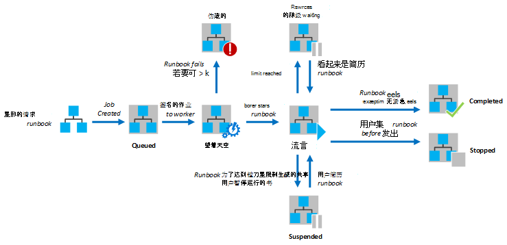
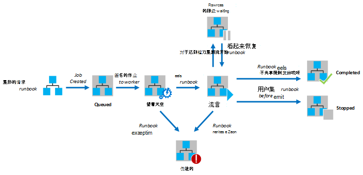

<properties
   pageTitle="在 Azure 自动化 Runbook 执行"
   description="介绍了 runbook Azure 自动化中的处理方式的详细信息。"
   services="automation"
   documentationCenter=""
   authors="mgoedtel"
   manager="stevenka"
   editor="tysonn" />
<tags
   ms.service="automation"
   ms.devlang="na"
   ms.topic="article"
   ms.tgt_pltfrm="na"
   ms.workload="infrastructure-services"
   ms.date="03/21/2016"
   ms.author="bwren" />

# 在 Azure 自动化 Runbook 执行

在 Azure 自动化启动 runbook 时，将创建一个作业。 作业是 runbook 的一个执行实例。 Azure 自动化工作人员被指派运行每个作业。 而由多个 Azure 帐户共享的工作人员，来自不同的自动化帐户的作业是相互隔离。 没有控制的工作人员将对您的工作请求的服务。  一个 runbook 可以有多个同时运行的作业。 Azure 门户中查看运行手册的列表时，它将列出已为每个 runbook 启动的最后一次作业的状态。 为了跟踪每个的状态，可以查看每个 runbook 的作业的列表。 不同的作业状态的说明，请参阅[作业状态](#job-statuses)。

下图显示了[图形化运行手册](automation-runbook-types.md#graphical-runbooks)和[PowerShell 工作流运行手册](automation-runbook-types.md#powershell-workflow-runbooks)runbook 作业的生命周期。

下面的关系图显示[PowerShell 运行手册](automation-runbook-types.md#powershell-runbooks)runbook 作业的生命周期。

您的作业将通过连接到 Azure 订购有权 Azure 资源。 他们才会对资源的访问您的数据中心中如果从公共云可以访问这些资源。

## 作业状态

下表描述可用于作业的不同状态。

| 状态| 说明|
|:---|:---|
|完成|作业已成功完成。|
|失败| 对于[图形和 PowerShell 工作流运行手册](automation-runbook-types.md)，runbook 无法编译。  [PowerShell 脚本运行手册](automation-runbook-types.md)，runbook 启动失败或作业时遇到异常。 |
|失败，正在等待资源|该作业失败，因为它达到[公平份额](#fairshare)限制三次，每次启动从同一个检查点或 runbook 的开始。|
|排队|工作上要有可用，以便可以启动自动化工作人员正在等待资源。|
|启动|该作业已分配给工作人员，和系统正在启动。|
|恢复|系统的过程中它已挂起后继续作业。|
|运行|作业正在运行。|
|在运行，等待资源|该作业已被卸载，因为它已经达到[公平份额](#fairshare)的限制。 不久从其最后一次检查点操作将继续。|
|停止|用户完成之前已停止作业。|
|停止|系统，则停止该作业。|
|挂起|该作业已挂起用户、 系统或 runbook 中的命令。 挂起作业可以重新启动，并且会继续从其最后一个检查点或 runbook 的开头是否任何检查点。 Runbook 将只在异常情况下系统挂起。 默认情况下，ErrorActionPreference 设置为**继续**该作业将继续运行在一个错误的含义。 如果此首选项变量设置为**停止**然后作业将暂停的错误。  仅适用于[图形和 PowerShell 工作流运行手册](automation-runbook-types.md)。|
|正在挂起|系统试图在用户请求挂起作业。 Runbook 必须达到可以挂起其下一个检查点。 如果它已过其最后一个检查点，，它将完成之前都可以暂停它。  仅适用于[图形和 PowerShell 工作流运行手册](automation-runbook-types.md)。|

## 查看作业状态使用 Azure 管理门户

### 自动化仪表板

自动化仪表板将显示所有特定自动化帐户运行手册的摘要。 它还包括为该帐户使用情况概述。 摘要图表显示在给定数天数或小时数输入每个状态的所有运行手册的总作业数。 您可以选择右上角的关系图上的时间范围。 图表的时间轴将根据您选择的时间范围内的类型。 您可以选择是否通过单击屏幕顶部显示某特定状态的行。

下列步骤可用于显示自动化仪表板。

1. 在 Azure 管理门户中，选择**自动化**，然后单击自动化帐户的名称。
1. 选择**仪表板**选项卡。

### Runbook 仪表板

Runbook 仪表板可以显示为单个 runbook 摘要。 摘要图表显示在给定数天数或小时数输入每个状态 runbook 总作业数。 您可以选择右上角的关系图上的时间范围。 图表的时间轴将根据您选择的时间范围内的类型。 您可以选择是否通过单击屏幕顶部显示某特定状态的行。

下列步骤可用于显示 Runbook 操控板。

1. 在 Azure 管理门户中，选择**自动化**，然后单击自动化帐户的名称。
1. 单击 runbook 的名称。
1. 选择**仪表板**选项卡。

### 作业摘要

您可以查看所有已创建特定的 runbook 和其最新状态的作业的列表。 您可以筛选此列表按作业状态和最后更改该作业的日期范围。 请单击要查看其详细的信息和相应的输出作业名称。 作业的详细资料的视图包含对该作业所提供的 runbook 参数的值。

可以使用以下步骤来查看 runbook 的作业。

1. 在 Azure 管理门户中，选择**自动化**，然后单击自动化帐户的名称。
1. 单击 runbook 的名称。
1. 选择**作业**选项卡。
1. 单击以查看其详细信息和输出的作业的**作业创建**列。

## 使用 Windows PowerShell 的检索作业状态

可以使用[Get AzureAutomationJob](http://msdn.microsoft.com/library/azure/dn690263.aspx)检索 runbook 和特定作业的详细信息创建的作业。 如果启动 Windows PowerShell 使用[开始 AzureAutomationRunbook](http://msdn.microsoft.com/library/azure/dn690259.aspx)与 runbook，它将返回结果的作业。 使用[Get AzureAutomationJob](http://msdn.microsoft.com/library/azure/dn690263.aspx)输出获取作业的输出。

下面的示例命令检索示例 runbook 的最后一个作业，并显示它的状态，值为 runbook 参数和作业的输出。

    $job = (Get-AzureAutomationJob –AutomationAccountName "MyAutomationAccount" –Name "Test-Runbook" | sort LastModifiedDate –desc)[0]
    $job.Status
    $job.JobParameters
    Get-AzureAutomationJobOutput –AutomationAccountName "MyAutomationAccount" -Id $job.Id –Stream Output

## 公平份额

为了共享资源中所有运行在云中的手册，Azure 自动化将暂时卸载任何作业，它已经持续了 3 个小时后。    [图形](automation-runbook-types.md#graphical-runbooks)和[PowerShell 工作流](automation-runbook-types.md#powershell-workflow-runbooks)运行手册将继续从其最后一个[检查点](http://technet.microsoft.com/library/dn469257.aspx#bk_Checkpoints)。 在此期间，作业就将显示状态为正在运行、 正在等待资源。 如果 runbook 有任何检查点或作业正在卸载之前未达到第一个检查点，然后它将从头重新播放。  总是从头重新[PowerShell](automation-runbook-types.md#powershell-runbooks)运行手册，因为它们不支持检查点。

>[AZURE.NOTE] 公平份额限制不适用于 runbook 上混合 Runbook 工作人员执行的作业。

如果从相同的检查点或 runbook 的开头三个连续时间重新启动 runbook，则会被终止失败，正在等待资源的状态。 这是为了防止运行手册无限期地运行而没有完成，是不是能够使其为下一个检查点而无需再次卸载。 在这种情况下，您会收到以下异常与失败。

*作业无法继续运行，因为已从同一个检查点反复被退出。请确保您的 Runbook 不保留其状态的情况下不能长时间的操作。*

当您创建 runbook 时，应确保运行两个检查点之间的任何活动的时间不会超过 3 小时。 您可能需要将检查点添加到您的 runbook，以确保它不会到达这 3 小时的限制或分解长时间运行的操作。 例如，您 runbook 可能对大型 SQL 数据库执行重新编制索引。 如果在公平份额限制内未完成此单个操作，然后作业将卸载并从头开始。 在这种情况下，应分解成多个步骤，如重建一个表索引，每次重新编制索引操作，这样在最后一次操作完成后无法恢复作业，每次操作后插入一个检查点。

## 下一步行动

- [从 runbook 开始在 Azure 自动化](automation-starting-a-runbook.md)
