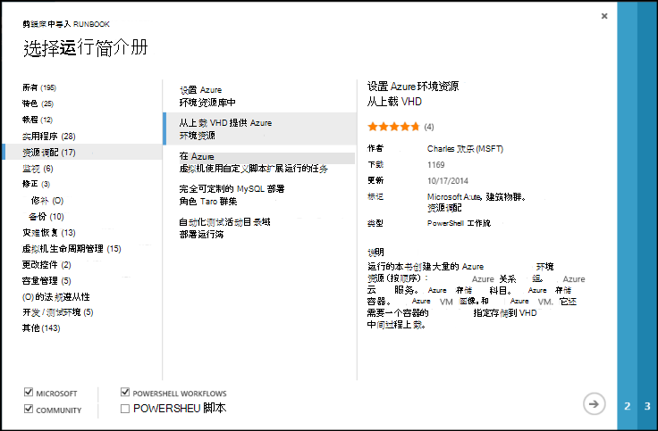
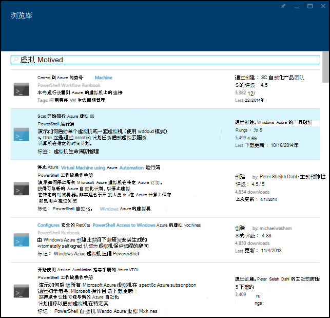
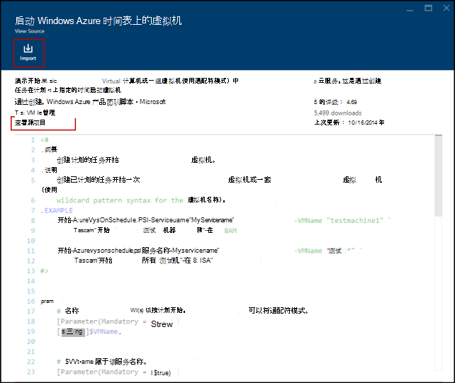
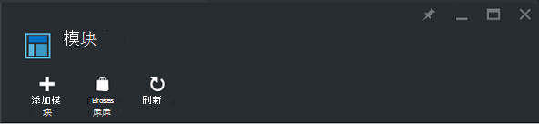
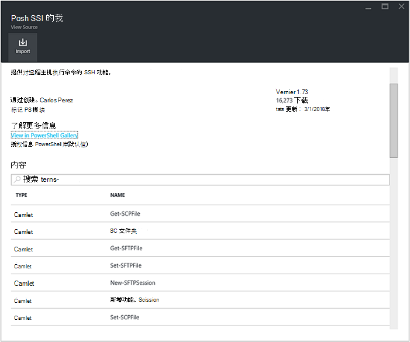
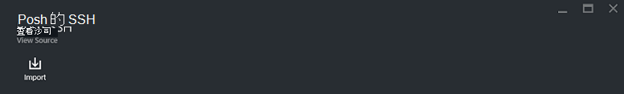
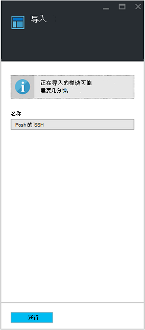

<properties
    pageTitle="Runbook 和模块库的 Azure 自动化 |Microsoft Azure"
    description="为您安装并使用 Azure 自动化环境中提供了运行手册和模块从 Microsoft 和社区。  本文介绍了如何访问这些资源并参与到库运行手册。"
    services="automation"
    documentationCenter=""
    authors="mgoedtel"
    manager="jwhit"
    editor="tysonn" />
<tags
    ms.service="automation"
    ms.devlang="na"
    ms.topic="article"
    ms.tgt_pltfrm="na"
    ms.workload="infrastructure-services"
    ms.date="09/18/2016"
    ms.author="magoedte;bwren" />

# Runbook 和模块库的 Azure 自动化

而不是在 Azure 自动化中创建您自己的运行手册和模块，您可以访问各种已经生成由 Microsoft 和社区的方案。  您可以使用而无需修改这些方案也可以使用它们作为第一步，并为您的特定需求对其进行编辑。

从[Runbook 库](#runbooks-in-runbook-gallery)和模块从[PowerShell 库](#modules-in-powerShell-gallery)可以运行手册。  您也可能会产生对社区通过共享您开发的方案。

## Runbook 库中运行手册

[Runbook 库](http://gallery.technet.microsoft.com/scriptcenter/site/search?f[0].Type=RootCategory&f[0].Value=WindowsAzure&f[1].Type=SubCategory&f[1].Value=WindowsAzure_automation&f[1].Text=Automation)从 Microsoft 和社区可以导入到 Azure 自动化提供了多种运行手册。 您可以下载从库位于在[TechNet 脚本中心](http://gallery.technet.microsoft.com/)，runbook 或者您可以直接从导入运行手册从 Azure 的传统门户网站或 Azure 门户库。

您只能导入从 Runbook 库直接使用 Azure 的传统门户网站或 Azure 的门户。 您不能执行此函数使用 Windows PowerShell。

>[AZURE.NOTE] 您应验证您 Runbook 库中获取并安装和运行它们在生产环境中要格外的小心任何运行手册的内容。 |

### 从 Azure 的传统门户网站 Runbook 库导入 runbook

1. 在 Azure 门户中，单击，**新****的应用程序服务**、**自动化**、 **Runbook**、**剪辑库中**。
2. 选择一个类别以查看相关的运行手册，并选择 runbook 来查看其详细信息。 选择所需的 runbook 时，请单击右箭头按钮。

    

3. 检查 runbook 中的内容并注意说明中的任何要求。 当您完成时，请单击右箭头按钮。
4. 输入 runbook 的详细信息，然后单击复选标记按钮。 已经将填写的 runbook 名。
5. Runbook 将**运行手册**选项卡上显示自动化帐户。

### 从 Azure 的门户网站 Runbook 库导入 runbook

1. 在 Azure 门户中，打开您自动化的帐户。
2. 单击打开列表运行手册，**运行手册**方块。
3. 单击**浏览库**按钮。

    

4. 找到您希望并选择它可查看其详细信息的库项目。

    

4. 单击**查看源项目** [TechNet 脚本中心](http://gallery.technet.microsoft.com/)中查看该项目。
5. 要导入项目，请单击它以查看其详细信息，然后单击**导入**按钮。

    

6. （可选） 更改 runbook 的名称，然后单击**确定**以导入 runbook。
5. Runbook 将**运行手册**选项卡上显示自动化帐户。

### 将 runbook 添加到 runbook 库

Microsoft 鼓励您添加到您认为有用的其他客户的 Runbook 库运行手册。  您可以通过考虑下列详细信息[上载到脚本中心](http://gallery.technet.microsoft.com/site/upload)添加 runbook。

- 必须指定*Windows Azure*向导中显示的**类别**和**子类别**的 runbook*自动化*。  

- 在上载必须是单个.ps1 或.graphrunbook 文件。  如果 runbook 要求任何模块、 子运行手册或资产，则应列出那些和 runbook 的注释部分中提交的说明。  如果您需要多个运行手册的情况，然后每个单独的上载并列出的名称及其说明个中相关的运行手册。 请确保您使用相同的标记，以便它们将显示在相同的类别。 用户将被迫阅读的说明来了解其他运行手册所需工作的方案。

- 如果您要发布**图形 runbook** （没有图形化工作流） 中添加"GraphicalPS"的标记。 

- 将 PowerShell 或者 PowerShell 工作流代码段插入到使用**插入代码段**图标的说明。

- 将 Runbook 库结果中显示的摘要上载，因此应提供可帮助用户识别 runbook 的功能的详细的信息。

- 您应该指定以下标记的一到三个上载到。  Runbook 将列入匹配及其标记的类别下的向导。  通过该向导，不在此列表上的任何标记将被忽略。 如果您不指定任何匹配标记，runbook 将出现在其他类别下。

 - 备份
 - 容量管理
 - 更改控件
 - 法规遵从性
 - 开发 / 测试环境
 - 灾难恢复
 - 监视
 - 修补程序
 - 资源调配
 - 补救措施
 - 虚拟机生命周期管理

- 自动化更新库每小时一次，因此不会立即看到您的贡献。

## PowerShell 库中的模块

PowerShell 模块中包含可在运行手册，使用的 cmdlet 和可以在 Azure 自动化安装的现有模块还提供了[PowerShell 库](http://www.powershellgallery.com)。  可以启动此库从 Azure 的门户网站，然后将它们安装到 Azure 自动化直接或可以下载并手动安装它们。  您不能安装模块直接从 Azure 的传统门户网站，但您可以下载这些安装它们，就像任何其他模块。

### 若要从使用 Azure 门户自动化模块库中导入模块

1. 在 Azure 门户中，打开您自动化的帐户。
2. 单击**资产**平铺打开的资产列表。
3. 单击要打开的模块列表**模块**图块上。
4. 单击**浏览库**按钮，浏览库刀片式服务器启动。

      
5. 已启动浏览库刀片式服务器后，您可以搜索由以下字段︰

   - 模块名称
   - 标记
   - 作者
   - Cmdlet/DSC 资源名称

6. 找到您感兴趣的模块并选择它可查看其详细信息。  
当钻到特定模块时，您可以查看详细信息模块中，包括一个链接回 PowerShell 库中，关于任何所需的依存关系，以及所有的 cmdlet 和/或模块包含的 DSC 资源。

      

7. 若要直接在 Azure 自动化安装模块，请单击**导入**按钮。

    

8. 当您单击导入按钮时，您将看到您将要导入的模块名称。 如果安装所有依赖项，**确定**按钮将处于活动状态。 如果您缺少的依赖项，您需要导入这些之前您可以导入此模块。
9. 单击**确定**以导入模块，模块刀片式服务器将启动。 当 Azure 自动化模块导入到您的帐户中时，其提取有关这些 cmdlet 和模块的元数据。

    

    这可能需要几分钟的时间，因为需要提取每个活动。
10. 完成后，您将收到通知正在部署该模块和通知。
11. 导入模块后，您将看到可用的活动，并可以使用其运行手册和所需状态配置中的资源。

## 请求的 runbook 或模块

您可以将请求发送至[用户的声音](https://feedback.azure.com/forums/246290-azure-automation/)。  如果您需要帮助编写 runbook，或有关于 PowerShell 的问题，发布到我们的[论坛](http://social.msdn.microsoft.com/Forums/windowsazure/en-US/home?forum=azureautomation&filter=alltypes&sort=lastpostdesc)问题。

## 下一步行动

- 若要开始使用运行手册，请参阅[创建或导入了 Azure 自动化 runbook](automation-creating-importing-runbook.md)
- 若要了解与运行手册 PowerShell 并且 PowerShell 工作流之间的差别，请参见[学习 PowerShell 工作流](automation-powershell-workflow.md)
