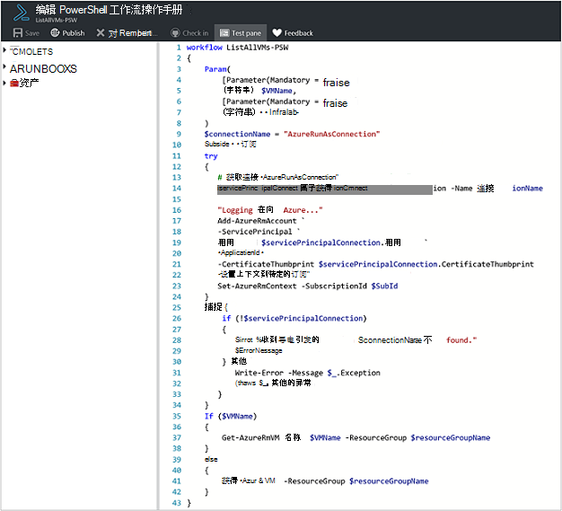
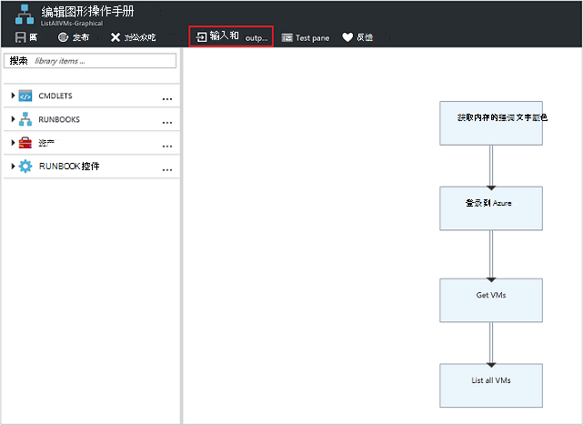
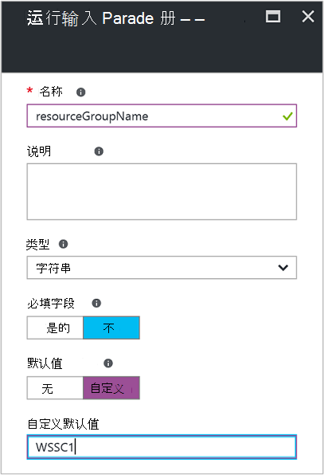
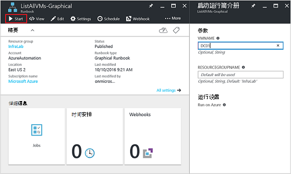
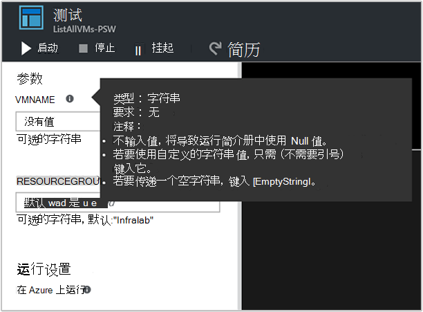
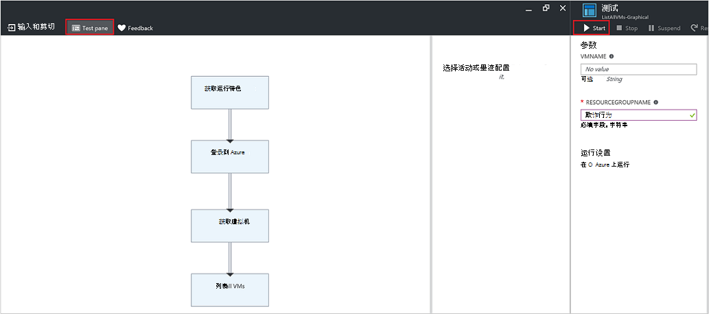
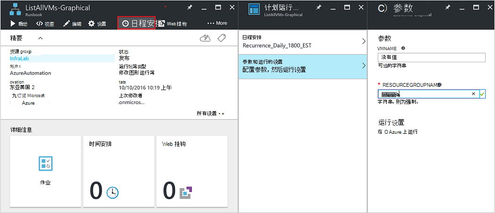
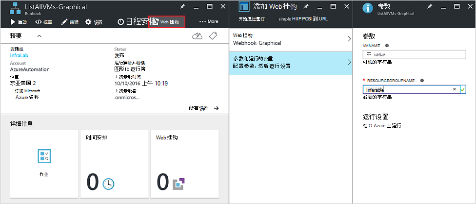
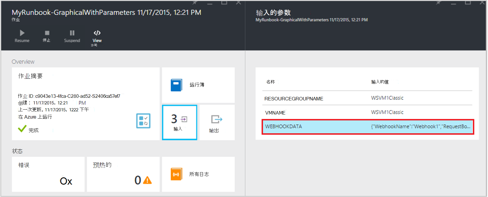

<properties
   pageTitle="Runbook 输入参数 |Microsoft Azure"
   description="Runbook 输入的参数，允许您将数据传递到 runbook，在它启动时提高运行手册的灵活性。 本文介绍了在运行手册中使用输入的参数的位置的不同方案。"
   services="automation"
   documentationCenter=""
   authors="MGoedtel"
   manager="jwhit"
   editor="tysonn" />
<tags
   ms.service="automation"
   ms.devlang="na"
   ms.topic="article"
   ms.tgt_pltfrm="na"
   ms.workload="infrastructure-services"
   ms.date="10/11/2016"
   ms.author="sngun"/>

# <a name="runbook-input-parameters"></a>Runbook 的输入的参数

Runbook 输入的参数，允许您传递给它的数据，启动时提高运行手册的灵活性。 参数允许用于特定方案和环境目标的 runbook 操作。 在本文中，我们将引导您完成不同的方案中运行手册使用输入的参数的位置。

## <a name="configure-input-parameters"></a>配置输入的参数

输入的参数可以配置 PowerShell，PowerShell 流和图形化运行手册中。 在所有 runbook 可以有多个具有不同数据类型的参数或不带参数。 输入参数可以是必需的还是可选的并且可以通过指定可选参数的默认值。 通过一种方法启动计算机时，可以分配 runbook 的输入参数值。 这些方法包括从 runbook 开始从门户或 web 服务。 您还可以启动一个作为内联调用另一个 runbook 中子 runbook。

## <a name="configure-input-parameters-in-powershell-and-powershell-workflow-runbooks"></a>配置 PowerShell 并且 PowerShell 工作流运行手册中的输入的参数

PowerShell 并且[PowerShell 工作流运行手册](automation-first-runbook-textual.md)在 Azure 自动化支持通过下列属性进行定义的输入的参数。  

| **属性** | **说明** |
|:--- |:---|
| 类型 | 必填。 参数值的预期数据类型。 任何.NET 类型是有效的。 |
| 名称 | 必填。 参数的名称。 这必须是在 runbook 中，唯一的和可以包含只有字母、 数字或下划线字符。 它必须以字母开头。 |
| 必填字段 | 可选。 指定是否必须为参数提供一个值。 如果将此属性设置为**$true**，然后提供一个值必须启动 runbook 时。 如果将此属性设置为**$false**的值是可选的。 |
| 默认值 | 可选。  指定如果启动 runbook 时不中传递的值将用于该参数的值。 默认值可以设置为任何参数，将自动使该参数可选无论必需的设置。 |

Windows PowerShell 支持输入参数的属性列在这里，如验证，别名，而不是参数设置。 但是，Azure 自动化目前支持仅上面列出的输入的参数。

PowerShell 工作流运行手册中的参数定义了下面的一般形式，其中用逗号分隔多个参数。

   ```
     Param
     (
         [Parameter (Mandatory= $true/$false)]
         [Type] Name1 = <Default value>,

         [Parameter (Mandatory= $true/$false)]
         [Type] Name2 = <Default value>
     )
   ```

>[AZURE.NOTE] 当您定义参数，如果未指定**必需**的属性时，然后在默认情况下，参数被视为可选。 此外，如果 PowerShell 工作流运行手册中设置参数的默认值，它将被视为 PowerShell 的可选参数，而不考虑**强制性**属性值。

举一个例子，我们可以配置 PowerShell 流 runbook 输出的详细信息的单个 VM 或资源组内的所有虚拟机的虚拟机的输入的参数。 该 runbook 有两个参数，如下面的屏幕快照中所示︰ 虚拟机和资源组的名称的名称。



在此参数中定义的参数**$VMName**和**$resourceGroupName**是字符串的简单类型的参数。 但是，PowerShell 并且 PowerShell 工作流运行手册支持所有简单类型和复杂类型，如**对象**或**PSCredential**的输入参数。

如果您的 runbook 对象类型输入的参数，然后使用 PowerShell 散列表 （名称，值） 对要传递的值。 例如，如果您在 runbook 中有以下参数︰

     [Parameter (Mandatory = $true)]
     [object] $FullName

然后可以将下面的值传递给参数︰

    @{"FirstName"="Joe";"MiddleName"="Bob";"LastName"="Smith"}


## <a name="configure-input-parameters-in-graphical-runbooks"></a>在图形化运行手册中配置输入的参数

[配置图形 runbook](automation-first-runbook-graphical.md)输入参数，请到我们创建输出的详细信息的单个 VM 或资源组内的所有虚拟机的虚拟机图形 runbook。 配置 runbook 包括两项主要活动，如下所述。

[**使用 Azure 运行方式帐户身份运行手册**](automation-sec-configure-azure-runas-account.md)与 Azure 进行身份验证。

[**获得 AzureRmVm**](https://msdn.microsoft.com/library/mt603718.aspx)获取虚拟机的属性。

您可以使用[**写入输出**](https://technet.microsoft.com/library/hh849921.aspx)活动输出的虚拟机的名称。 活动**获取 AzureRmVm**接受两个参数，**虚拟机的名称**和**资源组的名称**。 由于这些参数可能需要不同的值每次启动 runbook 时，您可以向您 runbook 添加输入的参数。 下面是添加输入的参数的步骤︰

1. 从**运行手册**刀片式服务器选择图形的 runbook，然后单击[**编辑**](automation-graphical-authoring-intro.md)它。

2. 从 runbook 编辑器中，单击**输入和输出**以打开**输入和输出**的刀片式服务器。

    

3. **输入和输出**刀片式服务器显示为 runbook 定义的输入参数的列表。 此刀片式服务器，可以添加新的输入的参数，或编辑现有的输入参数的配置。 若要添加新的 runbook 参数，请单击**添加输入**打开**Runbook 输入的参数**刀片式服务器。 那里，您可以配置以下参数︰

  	| **属性** | **说明** |
  	|:--- |:---|
  	| 名称 | 必填。  参数的名称。 这必须是在 runbook 中，唯一的和可以包含只有字母、 数字或下划线字符。 它必须以字母开头。 |
  	| 说明 | 可选。 有关用途的输入参数的说明。 |
  	| 类型 | 可选。 数据类型参数值的预期。 受支持的参数类型包括**字符串**、 **Int32**、 **Int64**、**十进制**、**布尔值**、**日期时间**和**对象**。 如果未选中数据类型，它将默认为**字符串**。 |
  	| 必填字段 | 可选。 指定是否必须为参数提供一个值。 如果选择**是**，然后提供一个值必须启动 runbook 时。 如果选择**无**，然后一个值时不需要 runbook 已启动，并且可以设置默认值。 |
  	| 默认值 | 可选。 指定如果启动 runbook 时不中传递的值将用于该参数的值。 参数不是必填字段，可以设置默认值。 若要设置默认值，请选择**自定义**。 除非启动 runbook 时提供另一个值，则使用此值。 选择**无**如果您不想提供的任何默认值。 |  

    

4. 创建具有以下属性将使用**Get AzureRmVm**活动的两个参数︰

    - **Parameter1:**
      - 名称-VMName
      - 字符串类型
      - 必需-无

    - **Parameter2:**
      - 名称-resourceGroupName
      - 字符串类型
      - 必需-无
      - 默认值-自定义
      - 自定义的默认值-\<包含虚拟机的资源组名称 >

5. 一旦添加参数，请单击**确定**。  您现在可以查看它们在**输入和输出刀片式服务器**。 再次单击**确定**，然后单击**保存**并**发布**您的 runbook。

## <a name="assign-values-to-input-parameters-in-runbooks"></a>指定输入参数运行手册中的值

可以通过输入以下方案中运行手册中的参数的值。

### <a name="start-a-runbook-and-assign-parameters"></a>启动 runbook 和分配参数

可以通过多种方法启动 runbook︰ 通过 Azure 的门户，与 webhook，PowerShell cmdlet、 REST API，或 sdk。 下面我们将讨论不同的方法来启动 runbook 和分配参数。

#### <a name="start-a-published-runbook-by-using-the-azure-portal-and-assign-parameters"></a>通过 Azure 门户网站开始发布的 runbook 和分配参数

当[启动 runbook](automation-starting-a-runbook.md#starting-a-runbook-with-the-azure-portal)时，**启动 Runbook**刀片式服务器将打开，并且您可以配置您刚刚创建的参数值。



在下面的输入框的标签，您可以看到已设置为参数的特性。 属性包括必需或可选的类型和默认值。 在参数名称旁边的帮助中，您可以看到您需要确定的参数输入值的所有重要信息。 此信息包括参数是必需的还是可选。 它还包括类型和默认值 （如果有的话），以及其他有用的注释。



>[AZURE.NOTE] 字符串类型参数支持**空**字符串值。  在输入的参数框中输入**[情况]**将向参数传递一个空字符串。 另外，字符串类型参数不支持**Null**值传递。 如果看不到字符串参数传递的任何值，然后 PowerShell 会将其解释为空。

#### <a name="start-a-published-runbook-by-using-powershell-cmdlets-and-assign-parameters"></a>通过使用 PowerShell cmdlet 开始发布的 runbook 和分配参数

  - **Azure 资源管理器的 cmdlet:**您可以开始使用[开始 AzureRmAutomationRunbook](https://msdn.microsoft.com/library/mt603661.aspx)创建的资源组中自动化 runbook。

    **示例︰**

   ```
    $params = @{“VMName”=”WSVMClassic”;”resourceGroupeName”=”WSVMClassicSG”}
 
    Start-AzureRmAutomationRunbook -AutomationAccountName “TestAutomation” -Name “Get-AzureVMGraphical” –ResourceGroupName $resourceGroupName -Parameters $params
   ```

  - **Azure 服务管理 cmdlet:**您可以开始使用[启动 AzureAutomationRunbook](https://msdn.microsoft.com/library/dn690259.aspx)的默认资源组中创建自动化 runbook。

    **示例︰**

   ```
    $params = @{“VMName”=”WSVMClassic”; ”ServiceName”=”WSVMClassicSG”}

    Start-AzureAutomationRunbook -AutomationAccountName “TestAutomation” -Name “Get-AzureVMGraphical” -Parameters $params
   ```

>[AZURE.NOTE] 当使用 PowerShell 的 cmdlet，默认参数，启动 runbook **MicrosoftApplicationManagementStartedBy**值**PowerShell**创建。 您可以查看**作业详细信息**刀片式服务器中的该参数。  

#### <a name="start-a-runbook-by-using-an-sdk-and-assign-parameters"></a>通过使用 SDK 启动 runbook 和分配参数

  - **Azure 资源管理器方法︰**您可以通过使用一种编程语言的 SDK 启动 runbook。 下面是用于自动化帐户中启动 runbook 的 C# 代码段。 在我们[GitHub 存储库](https://github.com/Azure/azure-sdk-for-net/blob/master/src/ResourceManagement/Automation/Automation.Tests/TestSupport/AutomationTestBase.cs)，您可以查看所有代码。  

   ```
     public Job StartRunbook(string runbookName, IDictionary<string, string> parameters = null)
        {
          var response = AutomationClient.Jobs.Create(resourceGroupName, automationAccount, new JobCreateParameters
           {
              Properties = new JobCreateProperties
               {
                  Runbook = new RunbookAssociationProperty
                   {
                     Name = runbookName
                   },
                     Parameters = parameters
               }
           });
        return response.Job;
        }
   ```

  - **Azure 服务管理方法︰**您可以通过使用一种编程语言的 SDK 启动 runbook。 下面是用于自动化帐户中启动 runbook 的 C# 代码段。 在我们[GitHub 存储库](https://github.com/Azure/azure-sdk-for-net/blob/master/src/ServiceManagement/Automation/Automation.Tests/TestSupport/AutomationTestBase.cs)，您可以查看所有代码。

   ```      
    public Job StartRunbook(string runbookName, IDictionary<string, string> parameters = null)
      {
        var response = AutomationClient.Jobs.Create(automationAccount, new JobCreateParameters
      {
        Properties = new JobCreateProperties
           {
             Runbook = new RunbookAssociationProperty
           {
             Name = runbookName
                },
                  Parameters = parameters
                }
         });
        return response.Job;
      }
   ```

  要启动此方法，请创建字典存储 runbook 参数、 **VMName**和**resourceGroupName**，以及它们的值。 然后启动 runbook。 下面是 C# 代码段调用上面定义的方法。

   ```
    IDictionary<string, string> RunbookParameters = new Dictionary<string, string>();

    // Add parameters to the dictionary.
    RunbookParameters.Add("VMName", "WSVMClassic");
    RunbookParameters.Add("resourceGroupName", "WSSC1");

    //Call the StartRunbook method with parameters
    StartRunbook(“Get-AzureVMGraphical”, RunbookParameters);
   ```

#### <a name="start-a-runbook-by-using-the-rest-api-and-assign-parameters"></a>通过使用 REST API，启动 runbook 和分配参数

可以创建和**放置**方法使用下列请求 URI 的入门 Azure 自动化 REST API，runbook 作业。

    https://management.core.windows.net/<subscription-id>/cloudServices/<cloud-service-name>/resources/automation/~/automationAccounts/<automation-account-name>/jobs/<job-id>?api-version=2014-12-08`

在请求的 URI 中，替换下列参数︰

  - **订阅 id:**您的 Azure 的订阅 id。  
  - **云服务名称︰**应将请求发送到云服务的名称。  
  - **自动化帐户名称︰**您指定的云服务中承载的自动化帐户的名称。  
  - **作业 id:**作业的 GUID。 在 PowerShell 的 Guid 可以创建通过使用**[GUID]::NewGuid()。Tostring （)**命令。

若要将参数传递给 runbook 作业，使用请求正文。 它采用 JSON 格式中提供了以下两个属性︰

  - **Runbook 名称︰**必填。 Runbook 为要启动的作业的名称。  
  - **Runbook 参数︰**可选。 其中名称应为字符串类型，值可以是任何有效 JSON 格式设置 （名称，而值） 中的参数列表的字典。

如果您想要开始以前创建的**VMName**和**resourceGroupName**作为参数**获取 AzureVMTextual** runbook，用于请求正文下面的 JSON 格式。

   ```
    {
      "properties":{
        "runbook":{
        "name":"Get-AzureVMTextual"},
      "parameters":{
         "VMName":"WSVMClassic",
         "resourceGroupName":”WSCS1”}
        }
    }
   ```

如果作业创建成功，则返回 HTTP 状态码 201。 响应标头和响应体的详细信息，请参阅有关如何文章[使用 REST API 创建 runbook 作业。](https://msdn.microsoft.com/library/azure/mt163849.aspx)

### <a name="test-a-runbook-and-assign-parameters"></a>测试 runbook 和分配参数

当您[测试您的 runbook 的草稿版本](automation-testing-runbook.md)使用测试选项，将**测试**刀片式服务器打开，并且您可以配置您刚刚创建的参数值。



### <a name="link-a-schedule-to-a-runbook-and-assign-parameters"></a>链接到 runbook 的计划和分配参数

可以[计划链接](automation-schedules.md)到您的 runbook，以便在特定时间启动 runbook。 当创建时间安排，并通过该计划启动时，runbook 将使用这些值，您可以指定输入的参数。 提供了所有必需的参数值之前，您无法保存计划。



### <a name="create-a-webhook-for-a-runbook-and-assign-parameters"></a>创建的 runbook webhook 和分配参数

您可以创建您的 runbook [webhook](automation-webhooks.md)和配置 runbook 输入的参数。 提供了所有必需的参数值之前，您无法保存 webhook。



通过使用 webhook， **[Webhookdata](automation-webhooks.md#details-of-a-webhook)** ，一起发送您定义输入参数的预定义输入参数执行 runbook 时。 您可以单击展开的**WebhookData**参数的更多详细信息。




## <a name="next-steps"></a>下一步行动

- 对 runbook 的输入和输出的详细信息，请参阅[Azure 自动化︰ runbook 输入、 输出和嵌套运行手册](https://azure.microsoft.com/blog/azure-automation-runbook-input-output-and-nested-runbooks/)。
- 有关启动 runbook 的不同方法的详细信息，请参阅[启动 runbook](automation-starting-a-runbook.md)。
- 若要编辑文本的 runbook，是指[编辑文本运行手册](automation-edit-textual-runbook.md)。
- 若要编辑图形的 runbook，请参阅[图形创作 Azure 自动化中](automation-graphical-authoring-intro.md)。
