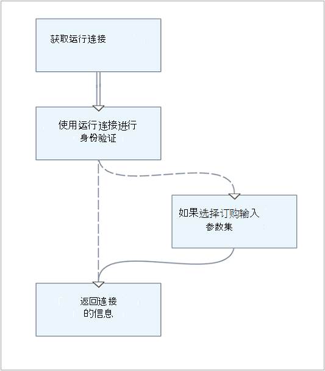
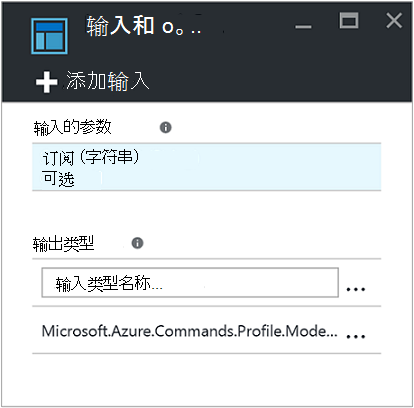
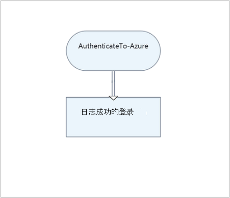
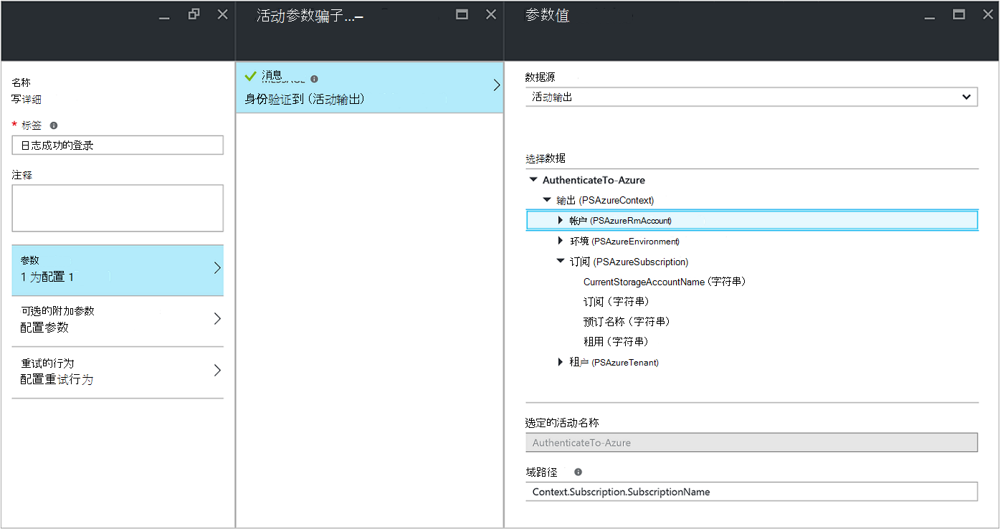
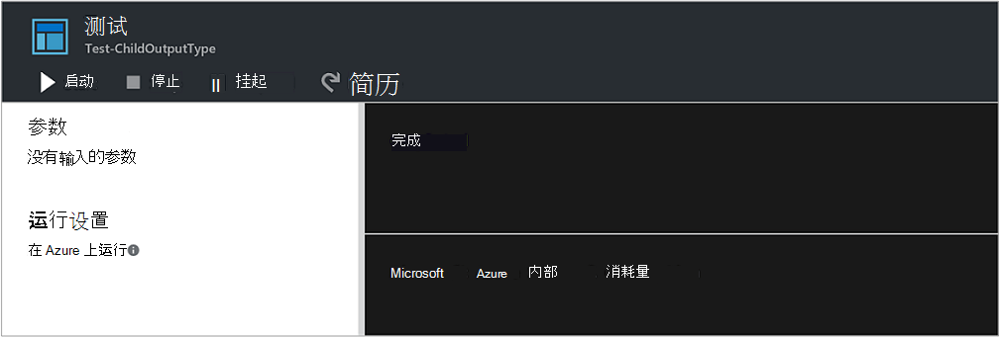
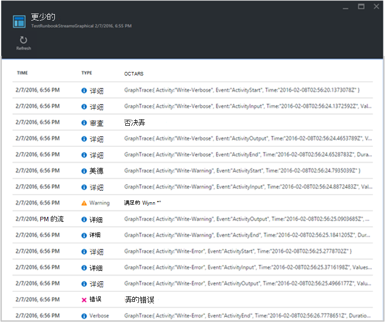
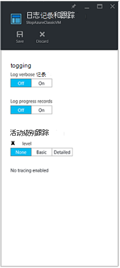

<properties
   pageTitle="Runbook 输出和消息在 Azure 自动化 |Microsoft Azure"
   description="描述了如何创建和检索输出和错误消息从 Azure 自动化运行手册。"
   services="automation"
   documentationCenter=""
   authors="mgoedtel"
   manager="jwhit"
   editor="tysonn" />
<tags
   ms.service="automation"
   ms.devlang="na"
   ms.topic="article"
   ms.tgt_pltfrm="na"
   ms.workload="infrastructure-services"
   ms.date="08/24/2016"
   ms.author="magoedte;bwren" />

# Runbook 的输出和 Azure 自动化中的消息

大多数的 Azure 自动化运行手册会有某种形式的输出，例如，向用户显示错误消息或一个复杂的对象应由另一个工作流。 Windows PowerShell 提供了[多个流](http://blogs.technet.com/heyscriptingguy/archive/2014/03/30/understanding-streams-redirection-and-write-host-in-powershell.aspx)从脚本或工作流发送输出。 Azure 自动化的工作与每个这些流以不同的方式，并应按照有关如何使用每个创建 runbook 时的最佳做法。

下表提供每个流和它们的行为在 Azure 管理门户中的简要说明和已发布的 runbook 运行时[测试 runbook](automation-testing-runbook.md)。 后续各节中提供了对每个流的更多详细信息。

| 流 | 说明 | 发布 | 测试|
|:---|:---|:---|:---|
|输出|对象应由其他运行手册。|写入的作业历史记录。|测试输出窗格中显示。|
|警告|面向用户的警告消息。|写入的作业历史记录。|测试输出窗格中显示。|
|错误|面向用户的错误消息。 与不同异常，runbook 不断在错误消息之后，默认情况。|写入的作业历史记录。|测试输出窗格中显示。|
|详细|提供常规或调试信息的消息。|仅当为 runbook 打开详细日志记录写入作业历史记录。|只有当 $VerbosePreference 在 runbook 中设置继续测试输出窗格中显示。|
|进度|自动生成之前和之后在 runbook 中的每个活动的记录。 Runbook 不应尝试创建自己的进度记录，因为用于交互式用户。|Runbook 为开启了进度日志记录的情况下，才写入作业历史记录。|测试输出窗格中不显示。|
|调试|针对交互式用户的消息。 不应在运行手册中使用。|不写入作业历史记录。|不写入测试输出窗格中。|

## 输出流

输出流适用于输出时它能够正常运行的脚本或工作流创建的对象。 在 Azure 自动化此流主要用于对象应由[当前的 runbook 调用父运行手册](automation-child-runbooks.md)。 当从父 runbook [runbook 内联调用](automation-child-runbooks.md#InlineExecution)，它从返回数据输出流到父级。 您应只使用输出流来通信返回到用户的一般信息，如果您知道另一个 runbook 则不会调用 runbook。 作为最佳实践，但是，通常建议您使用[详细流](#Verbose)传达给用户的常规信息。

可以写入数据，使用[输出写入](http://technet.microsoft.com/library/hh849921.aspx)输出流或通过将对象放置在 runbook 中各占一行。

    #The following lines both write an object to the output stream.
    Write-Output –InputObject $object
    $object

### 从函数中返回的输出

当写入输出流中包含在您的 runbook 函数时，输出将被传递回 runbook。 如果 runbook 将该输出赋给一个变量，它不是写入输出流。 从任何其他流函数内写入将写入相应流为 runbook。

请考虑以下示例 runbook。

    Workflow Test-Runbook
    {
        Write-Verbose "Verbose outside of function" -Verbose
        Write-Output "Output outside of function"
        $functionOutput = Test-Function
        $functionOutput

    Function Test-Function
     {
        Write-Verbose "Verbose inside of function" -Verbose
        Write-Output "Output inside of function"
      }
    }

将输出流为 runbook 作业︰

    Output inside of function
    Output outside of function

将 runbook 作业的详细流︰

    Verbose outside of function
    Verbose inside of function

您一次发布 runbook 并启动它之前，您必须还打开详细日志记录中的 runbook 设置以获得详细的流输出。

### 声明输出数据类型

工作流可以指定使用的[输出类型属性](http://technet.microsoft.com/library/hh847785.aspx)的输出数据类型。 此属性在运行时，有没有影响，但它清楚地指出为 runbook 作者在设计时 runbook 的预期输出。 根据运行手册的工具的不断发展，在设计时声明输出数据类型的重要性将增加的重要性。 因此，是一种最佳做法，在您创建任何运行手册中包括此声明。

下面是示例的列表输出类型︰

-   System.String
-   System.Int32
-   System.Collections.Hashtable
-   Microsoft.Azure.Commands.Compute.Models.PSVirtualMachine

  
下面的示例 runbook 输出字符串对象，包括其输出类型的声明。 如果您 runbook 输出特定类型的数组，则应该仍指定类型与数组的类型。

    Workflow Test-Runbook
    {
       [OutputType([string])]

       $output = "This is some string output."
       Write-Output $output
    }

若要声明 Grapical 或图形 PowerShell 工作流运行手册中的输出类型，您可以选择的**输入和输出**菜单选项和输出类型的名称的类型。  我们建议使用的完整的.NET 类名称以使其从父 runbook 引用它时很容易识别。  这公开的数据总线在 runbook 类的所有属性，使用条件逻辑，记录，并引用作为值在 runbook 中的其他活动时，提供了很大的灵活性。  

在以下示例中，我们有两个图形的运行手册，以说明此功能。  如果我们应用模块化的 runbook 设计模型，我们有一个 runbook 作为*身份验证 Runbook 模板*使用运行方式帐户使用 Azure 管理身份验证。  我们第二个 runbook，将正常情况下执行自动给定的方案的核心逻辑，在这种情况下会执行*身份验证 Runbook 模板*并向**测试**输出窗格中显示结果。  在正常情况下，我们就必须采取针对某个资源利用子 runbook 的输出此 runbook。    

下面是**AuthenticateTo Azure** runbook 的基本逻辑。  。  

它包括*Microsoft.Azure.Commands.Profile.Models.PSAzureContext*，它将返回身份验证的配置文件属性的输出类型。   

该 runbook 是一个非常直截了当，而没有一个配置项来此处指明。  最后一项活动执行**写入输出**cmdlet 并将配置文件数据写入 $_ 变量使用**Inputobject**参数，这要求该 cmdlet PowerShell 表达式。  

在此示例中，名为*测试 ChildOutputType*，第二个 runbook 的我们只是有两个活动。   

第一个活动调用**AuthenticateTo Azure** runbook 和第二个活动正在**写详细**的 cmdlet 使用**活动输出****数据源****域路径**的值是**Context.Subscription.SubscriptionName**，它指定的上下文从**AuthenticateTo Azure** runbook 输出。      

输出结果是订阅的名称。  

输出类型控件的行为有关的一个说明。  当输入和输出属性刀片式服务器上的输出类型字段中键入一个值时，您必须键入它，以便您能够识别出该控件的输入后，控件外单击。  

## 消息流

与不同的输出流中，消息流用于向用户传达信息。 有不同种类的信息，多个消息流和 Azure 自动化将以不同的方式处理每个。

### 警告和错误的流

警告和错误流用于在 runbook 中记录发生的问题。 执行时，runbook，和 runbook 进行测试时，被包含在 Azure 管理门户的测试输出窗格中时，它们将写入作业历史记录。 默认情况下，runbook 将继续执行后面的警告或错误。 您可以指定，应通过创建消息之前在 runbook 中设置[首选项变量](#PreferenceVariables)挂起警告或错误 runbook。 例如，能够造成如此异常的错误暂停 runbook，将**$ErrorActionPreference**设置为停止。

创建使用 cmdlet[写警告](https://technet.microsoft.com/library/hh849931.aspx)或[写入错误](http://technet.microsoft.com/library/hh849962.aspx)的警告或错误消息。 活动还可能写入这些流。

    #The following lines create a warning message and then an error message that will suspend the runbook.

    $ErrorActionPreference = "Stop"
    Write-Warning –Message "This is a warning message."
    Write-Error –Message "This is an error message that will stop the runbook because of the preference variable."

### 详细的流

详细消息流是 runbook 操作有关的一般信息。 因为[调试流](#Debug)不能在 runbook 中，详细的消息应该用于调试信息。 默认情况下，从已发布运行手册的详细消息不会存储在作业历史记录。 存储详细消息，请 runbook Azure 管理门户中的配置选项卡上配置日志详细记录的发布运行手册。 在大多数情况下，应保留默认设置没有记录出于性能原因 runbook 的详细记录。 打开此选项只是为了排除或调试 runbook。

当[测试 runbook](automation-testing-runbook.md)，详细的消息都不显示，即使 runbook 配置为日志详细记录。 若要显示详细消息[测试 runbook](automation-testing-runbook.md)时，必须继续设置 $VerbosePreference 变量。 该变量的设置，将 Azure 门户的测试输出窗格中显示详细消息。

创建使用[写详细](http://technet.microsoft.com/library/hh849951.aspx)的 cmdlet 的详细消息。

    #The following line creates a verbose message.

    Write-Verbose –Message "This is a verbose message."

### 调试流

调试流主要用于交互式用户，并且不应在运行手册中使用。

## 进行记录

如果您配置 runbook 日志进行记录 （在 runbook Azure 门户中的配置选项卡中），然后记录将写入作业历史记录之前, 和之后运行的每个活动。 在大多数情况下，应尽量不以最大化性能记录 runbook 的进度记录的默认设置。 打开此选项只是为了排除或调试 runbook。 当测试 runbook，即使 runbook 配置为日志记录进度不显示进度消息。

[写进度](http://technet.microsoft.com/library/hh849902.aspx)cmdlet 是无效 runbook 中，因为这适用于交互式用户。

## 首选项变量

Windows PowerShell 使用[首选项变量](http://technet.microsoft.com/library/hh847796.aspx)来确定如何响应数据发送到不同的输出流。 您可以设置这些变量 runbook 来控制如何将响应发送到不同的流数据。

下表列出了可用于具有其有效运行手册和默认值的首选项变量。 请注意，此表仅包括在 runbook 中有效的值。 其他值都为首选变量在 Windows PowerShell 之外 Azure 自动化中使用时无效。

| 变量| 默认值| 有效的值|
|:---|:---|:---|
|WarningPreference|继续|停止 继续 SilentlyContinue|
|ErrorActionPreference|继续|停止 继续 SilentlyContinue|
|VerbosePreference|SilentlyContinue|停止 继续 SilentlyContinue|

下表列出了有效运行手册中的首选项变量值的行为。

| 值| 行为|
|:---|:---|
|继续|记录消息并继续执行 runbook。|
|SilentlyContinue|继续执行 runbook 但不记录消息。 此操作将忽略该消息。|
|停止|记录消息并挂起 runbook。|

## 正在检索 runbook 输出和消息

### Azure 门户

您可以在 Azure 门户从 runbook 的作业选项卡中查看 runbook 作业的详细信息。 作业的摘要将显示输入的参数和[输出流](#Output)以及有关作业以及任何异常的常规信息，如果它们发生。 如果 runbook 配置为详细的日志并进行记录，历史将包括来自[输出流](#Output)[警告和错误流](#WarningError)以及[详细的流](#Verbose)和[进度记录](#Progress)的消息。

### Windows PowerShell

在 Windows PowerShell，您可以从使用[Get AzureAutomationJobOutput](https://msdn.microsoft.com/library/mt603476.aspx) cmdlet runbook 检索输出和消息。 此 cmdlet 需要作业的 ID 和参数调用您在其中指定要返回的流的流。 您可以指定任何返回所有工作流。

下面的示例将启动示例 runbook，然后等待它完成。 完成后，其输出流被收集从作业。

    $job = Start-AzureRmAutomationRunbook -ResourceGroupName "ResourceGroup01" `
    –AutomationAccountName "MyAutomationAccount" –Name "Test-Runbook"

    $doLoop = $true
    While ($doLoop) {
       $job = Get-AzureRmAutomationJob -ResourceGroupName "ResourceGroup01" `
       –AutomationAccountName "MyAutomationAccount" -Id $job.JobId
       $status = $job.Status
       $doLoop = (($status -ne "Completed") -and ($status -ne "Failed") -and ($status -ne "Suspended") -and ($status -ne "Stopped")
    }

    Get-AzureRmAutomationJobOutput -ResourceGroupName "ResourceGroup01" `
    –AutomationAccountName "MyAutomationAccount" -Id $job.JobId –Stream Output

### 图形化创作

对于图形的运行手册，额外记录是可用在窗体中的活动级别跟踪。  有两个级别的跟踪︰ 基本和详细。  在基本的跟踪，您可以看到开始，runbook 以及信息相关的任何活动次数，例如数，每个活动的结束时间尝试和开始活动的时间。  详细的跟踪在每个活动获取基本的跟踪以及输入和输出数据。  请注意，当前跟踪记录写入使用详细的流中，因此您必须启用详细日志记录时启用跟踪。  为图形化运行手册并启用跟踪没有必要记录进度记录，因为基本的跟踪用于相同的目的并且更有意义。

从上面的屏幕抓图可以看出，当您启用详细日志记录和跟踪用于图形的运行手册，更多的信息是生产作业流视图中可用。  这些额外的信息可以是必不可少的诊断的 runbook 的生产问题，因此，才应启用它为此目的，而不是通常的做法。    
跟踪记录可以特别是很多。  使用图形化 runbook 跟踪您可以获得两个到四个记录每个活动取决于是否已配置基本或详细跟踪。  除非您需要此信息来跟踪进度的 runbook 进行故障排除，您可能想要保持跟踪关闭。

**若要启用活动级别跟踪，请执行以下步骤。**

 1. 在 Azure 门户中，打开您自动化的帐户。

 2. 单击打开列表运行手册，**运行手册**方块。

 3. 在运行手册刀片式服务器，单击以从列表中运行手册选择图形 runbook。

 4. 在设置为选定的 runbook 刀片式服务器，单击**日志记录和跟踪**。

 5. 在日志记录和跟踪刀片，日志下详细记录, 单击****启用详细日志记录和 udner 活动级别跟踪，更改跟踪级别设置为**基本**或基于级别的跟踪您的**详细**要求。 

    

## 下一步行动

- 若要了解有关 runbook 执行的方式来监视 runbook 作业，和其他技术的详细信息，请参阅[跟踪 runbook 作业](automation-runbook-execution.md)
- 若要了解如何设计和使用子运行手册，请参阅[Azure 自动化中的子运行手册](automation-child-runbooks.md)
