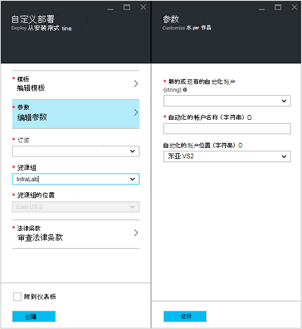
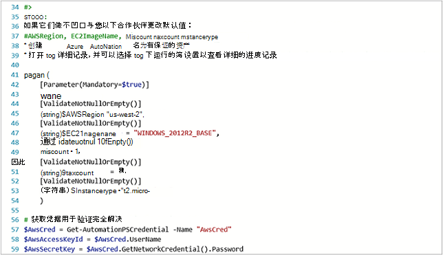

<properties
   pageTitle="自动在 Amazon Web 服务中的虚拟机的部署 |Microsoft Azure"
   description="本文介绍如何使用 Azure 自动化来自动创建 Amazon Web 服务虚拟机"
   services="automation"
   documentationCenter=""
   authors="mgoedtel"
   manager="jwhit"
   editor="" />
<tags
   ms.service="automation"
   ms.devlang="na"
   ms.topic="article"
   ms.tgt_pltfrm="na"
   ms.workload="na"
   ms.date="08/17/2016"
   ms.author="tiandert; bwren" />

# <a name="azure-automation-scenario---provision-an-aws-virtual-machine"></a>Azure 的自动化方案 — 提供 AWS 虚拟机 

在本文中，我们展示如何利用 Azure 自动化提供 Amazon Web 服务 (AWS) 订阅中的虚拟机，该虚拟机有特定名称 – AWS 将称为"标记"VM。

## <a name="prerequisites"></a>系统必备组件

这篇文章的目的，需要有 Azure 自动化客户与 AWS 订阅。 有关设置 Azure 自动化帐户并配置以 AWS 预订凭据的详细信息，查看[与 Amazon Web 服务配置身份验证](../automation/automation-sec-configure-aws-account.md)。  此帐户应创建或更新与 AWS 预订凭据继续之前，我们将引用此帐户的下面的步骤。


## <a name="deploy-amazon-web-services-powershell-module"></a>部署 Amazon 网络服务 PowerShell 模块

我们 VM 设置 runbook 将利用 AWS PowerShell 模块，以完成其工作。 执行以下步骤来将模块添加到您的自动化帐户配置为具有 AWS 预订凭据。  

1. 打开 web 浏览器并定位到[PowerShell 库](http://www.powershellgallery.com/packages/AWSPowerShell/)**部署到 Azure 自动化按钮**上单击。<br> 

2. 则会转到 Azure 的登录页和之后进行身份验证，您将路由到 Azure 门户并显示下面的刀片式服务器。<br> 

3. 从**资源组**下拉列表和参数刀片式服务器选择资源组，请提供以下信息︰
   * 从**新的或现有的自动化帐户 （字符串）**下拉列表中选择**现有**。  
   * 在**自动化帐户名称 （字符串）**框中，键入将包括为 AWS 预订凭据的自动化帐户的确切名称。  例如，如果您创建了一个名为**AWSAutomation**的专门的科目，然后这是您在框中键入。
   * 从**自动化帐户位置**下拉列表中选择相应的区域。

4. 当您已完成输入必需的信息时，请单击**创建**。

    >[AZURE.NOTE]虽然将 PowerShell 模块导入到 Azure 自动化，它还提取这些 cmdlet 并导入并提取这些 cmdlet 模块完全完成之前，将不会显示这些活动。 此过程可能需要几分钟的时间。  
<br>
5. 在 Azure 门户中，打开您在步骤 3 中所引用的自动化帐户。
6. 单击**资产**平铺和**资产**刀片式服务器上，选择**模块**拼贴。
7. 在刀片式服务器**的模块**中，您将看到**AWSPowerShell**模块的列表中。

## <a name="create-aws-deploy-vm-runbook"></a>创建 AWS 部署 VM runbook

一旦部署了 AWS PowerShell 模块，我们可以现在创作 runbook 自动化资源调配 AWS 使用 PowerShell 脚本中的虚拟机。 下面的步骤将说明如何利用 Azure 自动化中的本机 PowerShell 脚本。  

>[AZURE.NOTE] 有关更多选项和有关此脚本的信息，请访问[PowerShell 库](https://www.powershellgallery.com/packages/New-AwsVM/DisplayScript)。


1. 从 PowerShell 库下载 PowerShell 脚本新建 AwsVM，通过打开 PowerShell 会话并键入以下︰<br>
   ```
   Save-Script -Name New-AwsVM -Path \<path\>
   ```
<br>
2. 从 Azure 门户，自动化帐户，请单击**运行手册**平铺。  
3. 从**运行手册**刀片式服务器，选择**添加 runbook**。
4. 在**runbook 添加**刀片式服务器，选择**快速创建**（创建新 runbook）。
5. 在**Runbook**属性刀片式服务器，您的 runbook 的名称框中键入一个名称， **Runbook 类型**的下拉列表选择**PowerShell**，然后再单击**创建**。<br> 
6. 出现编辑 PowerShell Runbook 刀片式服务器时，复制并粘贴创作画布 runbook PowerShell 脚本。<br> <br>

    >[AZURE.NOTE] 请使用示例 PowerShell 脚本时注意以下信息︰
    >
    > - Runbook 包含许多默认的参数值。 请评估所有默认值并根据需要更新。
    > - 如果您已经作为凭据资产名称不同**AWScred**存储 AWS 凭据，您需要更新行 57 以匹配相应的脚本。  
    > - 在使用 AWS CLI 命令继续，特别是与本示例 runbook，您必须指定 AWS 地区。 否则，这些 cmdlet 将失败。  在 PowerShell 文档以获得详细信息的 AWS 工具查看 AWS 主题[指定 AWS 地区](http://docs.aws.amazon.com/powershell/latest/userguide/pstools-installing-specifying-region.html)。  
<br>
7. 若要从 AWS 订阅检索图像名称的列表，请启动 PowerShell ISE，AWS PowerShell 模块导入。  通过将**获得 AutomationPSCredential**替换与 ISE 环境中验证 AWS **AWScred = 获取凭据**。  这将提示您输入您的凭据，您可以为密码您的**访问密钥 ID**提供用户名和**密码访问键**。  请参阅下面的示例︰

        #Sample to get the AWS VM available images
        #Please provide the path where you have downloaded the AWS PowerShell module
        Import-Module AWSPowerShell
        $AwsRegion = "us-west-2"
        $AwsCred = Get-Credential
        $AwsAccessKeyId = $AwsCred.UserName
        $AwsSecretKey = $AwsCred.GetNetworkCredential().Password

        # Set up the environment to access AWS
        Set-AwsCredentials -AccessKey $AwsAccessKeyId -SecretKey $AwsSecretKey -StoreAs AWSProfile
        Set-DefaultAWSRegion -Region $AwsRegion

        Get-EC2ImageByName -ProfileName AWSProfile
   将返回以下输出︰<br>
     
8. 复制和粘贴图像名称之一为**$InstanceType**runbook 中引用自动化变量中。 因为在本例中我们使用免费的 AWS 分层订阅、 runbook 在本例，我们将使用**t2.micro** 。
9. 保存 runbook，然后**发布**发布 runbook 单击，然后单击**是**时出现提示。


### <a name="testing-the-aws-vm-runbook"></a>测试 AWS VM runbook
我们测试的 runbook 开始之前，我们需要验证的几种方法。 具体来说︰

   -  进行身份验证 AWS 资产已创建称为的**AWScred**或已更新脚本来引用您的凭据资产的名称。  
   -  在 Azure 自动化中导入的 AWS PowerShell 模块
   -  已创建新的 runbook 和验证并根据需要更新参数值
   -  **详细的日志记录**和 （可选） 设置**日志记录和跟踪**runbook 下的**日志进行记录**被设置为**On**。<br> 

1. 我们想要启动 runbook 所以单击**开始**，然后开始 Runbook 刀片式服务器打开时单击**确定**。
2. 在启动 Runbook 刀片式服务器，提供**VMname**。  接受您预先配置脚本中前面的其他参数的默认值。  单击**确定**以启动 runbook 作业。<br> 
3. 我们刚刚创建的 runbook 作业就会打开作业窗格。 关闭该窗格。
4. 我们可以查看作业的进度，并通过从 runbook 作业刀片式服务器选择的**所有日志**平铺视图输出的**数据流**。<br> 
5. 要确认正在配置虚拟机，请登录到 AWS 管理控制台，如果您当前并未登录。<br> 

## <a name="next-steps"></a>下一步行动
-   要开始使用图形化的运行手册，请参阅[我的第一个图形 runbook](automation-first-runbook-graphical.md)
-   若要开始使用 PowerShell 工作流运行手册，请参阅[我第一个 PowerShell 流 runbook](automation-first-runbook-textual.md)
-   若要了解有关 runbook 类型，它们的优点和限制的详细信息，请参阅[Azure 自动化 runbook 类型](automation-runbook-types.md)
-   PowerShell 脚本的详细信息支持功能，请参见[本机 PowerShell 支持在 Azure 自动化的脚本](https://azure.microsoft.com/blog/announcing-powershell-script-support-azure-automation-2/)
