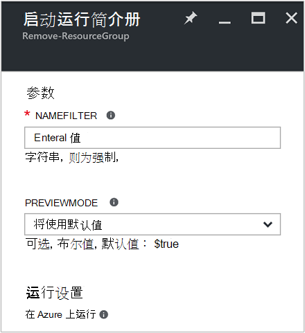
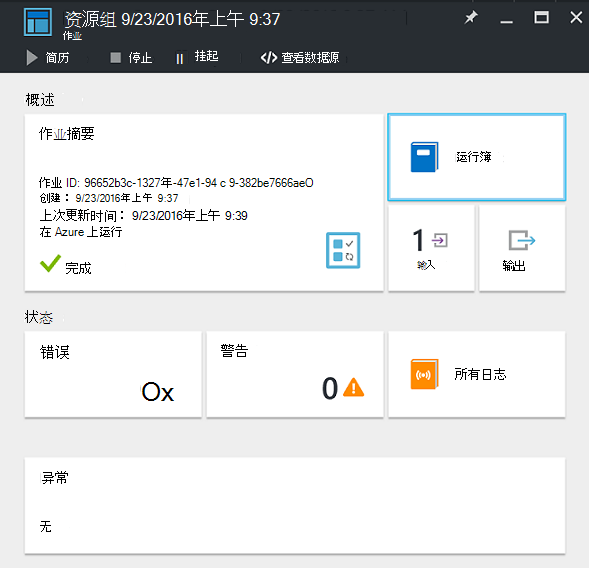
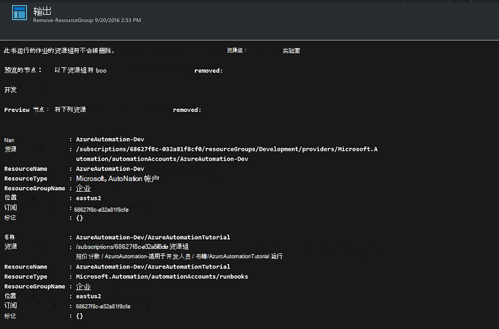

<properties
    pageTitle="自动化的资源组中删除 |Microsoft Azure"
    description="包括在您的订阅中移除所有资源组的运行手册 Azure 自动化方案 PowerShell 工作流版本。"
    services="automation"
    documentationCenter=""
    authors="MGoedtel"
    manager="jwhit"
    editor=""
    />
<tags
    ms.service="automation"
    ms.workload="tbd"
    ms.tgt_pltfrm="na"
    ms.devlang="na"
    ms.topic="get-started-article"
    ms.date="09/26/2016"
    ms.author="magoedte"/>

# Azure 的自动化方案的自动移除资源组

许多客户创建多个资源组。 有些可能用于管理生产应用程序，和其他人可能用作开发、 测试环境和临时环境。 自动化部署这些资源是一回事，但能够停止使用带有按钮的单击操作的资源组是另一个。 通过使用 Azure 自动化，可以简化此项常规管理任务。 这是非常有用，如果您正在使用 Azure 订阅具有通过 MSDN 或 Microsoft 合作伙伴网络云基础程序等成员提议的支出限制。

此方案基于 PowerShell runbook，旨在删除从您的订阅指定的一个或多个资源组。 Runbook 的默认设置是在继续操作之前进行测试。 这样可以确保不会意外地删除资源组之前就可以完成此过程。   

## 获取方案

这种情况下包含，您可以从[PowerShell 库](https://www.powershellgallery.com/packages/Remove-ResourceGroup/1.0/DisplayScript)下载 PowerShell runbook。 您还可以将其导直接从[Runbook 库](automation-runbook-gallery.md)在 Azure 的门户。  

Runbook | 说明|
----------|------------|
删除 ResourceGroup | 从订阅中移除一个或多个 Azure 的资源组和关联的资源。  
 
为此 runbook 定义下面的输入的参数︰

参数 | 说明|
----------|------------|
NameFilter （必填） | 指定名称筛选器以限制您想删除的资源组。 您可以通过使用逗号分隔多个值。 筛选器不区分大小写，并将匹配任何包含字符串的资源组。|
PreviewMode （可选） | 执行 runbook 以查看哪些资源组将被删除，但不执行任何操作。 默认值是**true**有助于避免意外删除传递给 runbook 的一个或多个资源组。  

## 安装和配置此方案

### 系统必备组件

该 runbook 身份验证使用[Azure 运行方式帐户](automation-sec-configure-azure-runas-account.md)。    

### 安装和运行手册的发布

下载 runbook 之后，您可以通过使用[导入 runbook 过程](automation-creating-importing-runbook.md#importing-a-runbook-from-a-file-into-Azure-Automation)中的过程将其导入。 它已被成功导入自动化帐户后，将发布 runbook。

## 使用 runbook

以下步骤将指导您完成此 runbook 和帮助您熟悉它是如何工作的执行。 您将只测试 runbook 在此示例中，实际上并没有删除该资源组。  

1. 从 Azure 的门户，打开您自动化的帐户，然后单击**运行手册**。
2. 选择**删除 ResourceGroup** runbook，然后单击**开始**。
3. 当您启动 runbook 时，**启动 Runbook**刀片式服务器打开并可以配置的参数。 在您的订阅，您可以用于测试，并将导致任何损害，如果意外地删除输入资源组的名称。  

    >[AZURE.NOTE] 请确保将**Previewmode**设置为**true**以避免删除所选的资源组。  **注意**此 runbook 不会移除资源组包含运行此 runbook 的自动化帐户。  

4. 配置完所有参数后的值，请单击**确定**，和 runbook 将排队等待执行。  

在 Azure 门户中查看**删除 ResourceGroup** runbook 作业的详细信息，请在 runbook 中选择**作业**。 作业摘要显示输入的参数和输出流以及有关作业和发生的任何异常的常规信息。  。

**作业摘要**包括来自输出、 警告和错误流。 选择要查看详细的 runbook 执行结果的**输出**。  

## 下一步行动

- 若要开始创建您自己的 runbook，请参阅[创建或导入 runbook Azure 自动化中](automation-creating-importing-runbook.md)。
- 若要开始使用 PowerShell 工作流运行手册，请参阅[我第一个 PowerShell 流 runbook](automation-first-runbook-textual.md)。
