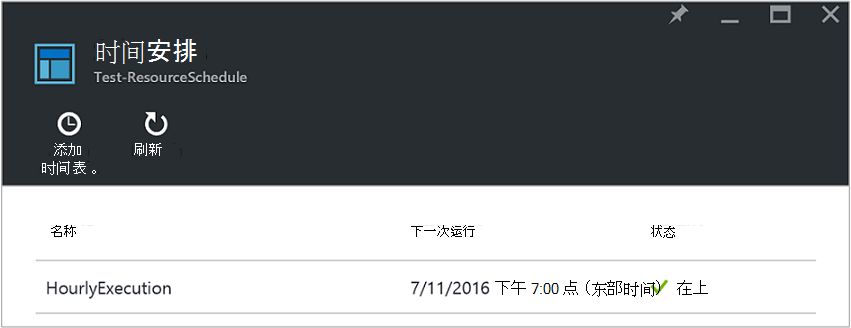
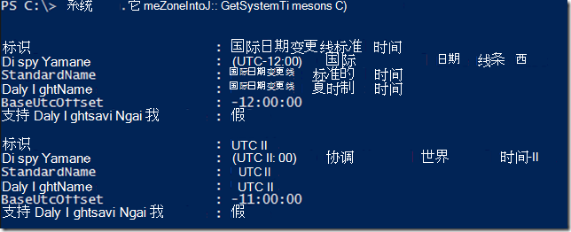
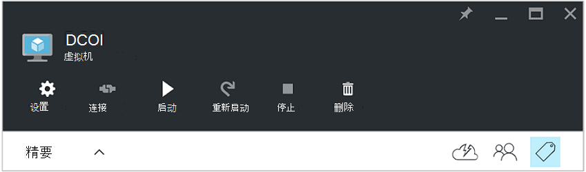
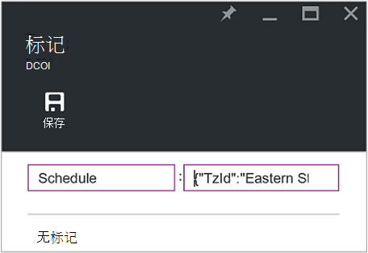
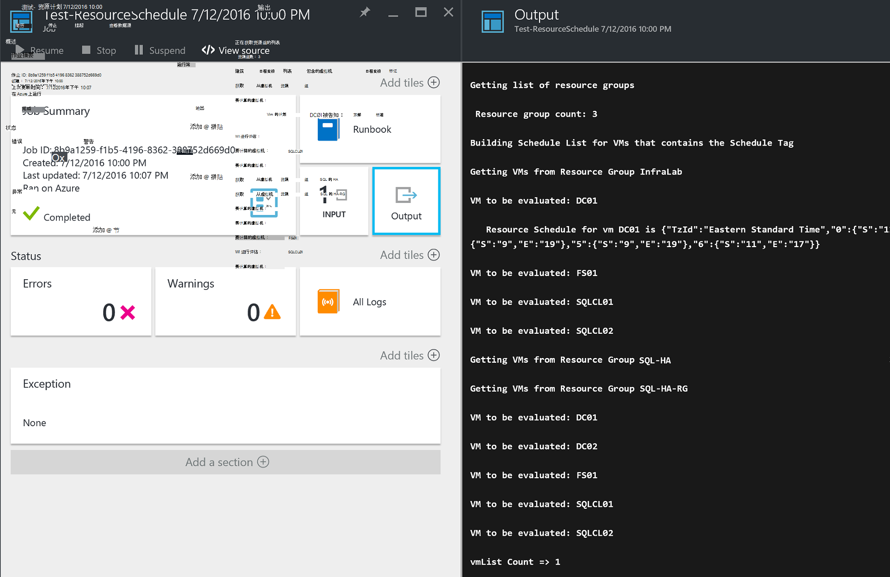

<properties
   pageTitle="使用 JSON 格式标记来创建 Azure 虚拟机启动和关闭的时间表 |Microsoft Azure"
   description="本文介绍如何使用 JSON 字符串标记来自动执行虚拟机启动和关闭的时间安排。"
   services="automation"
   documentationCenter=""
   authors="MGoedtel"
   manager="jwhit"
   editor="tysonn" />
<tags
   ms.service="automation"
   ms.devlang="na"
   ms.topic="article"
   ms.tgt_pltfrm="na"
   ms.workload="infrastructure-services"
   ms.date="07/18/2016"
   ms.author="magoedte;paulomarquesc" />

# Azure 的自动化方案︰ 使用 JSON 格式标记来创建 Azure 虚拟机启动和关闭的时间表

客户常常希望计划的启动和关闭虚拟机可帮助降低订购成本或支持业务和技术需求。  

下面的方案使您能够使用称为计划在资源组级别或在 Azure 中的虚拟机级别的标签设置了自动的启动和关闭虚拟机。 此计划可以配置从星期日到星期六的启动时间和关机时间。  

我们有一些优秀的选项。 其中包括︰
-  [虚拟机比例设置](../virtual-machine-scale-sets/virtual-machine-scale-sets-overview.md)自动缩放设置，使您能够扩展或缩小。
- [DevTest 实验室](../devtest-lab/devtest-lab-overview.md)服务，具有内置的调度启动和关闭操作能力。

但是，这些选项只支持特定的方案并不能应用于虚拟机基础架构作为-服务 (IaaS)。   

该时间表标记应用于资源组，将同时应用到该资源组中的所有虚拟机。 如果计划也直接应用于虚拟机中，最后一个日程安排优先顺序如下︰

1.  应用于资源组的日程安排
2.  日程安排应用于资源组和资源组中的虚拟机
3.  日程安排应用于虚拟机

这种情况下基本上是采用 JSON 字符串与指定的格式并将其添加为值标记称为计划。 然后 runbook 列出所有资源组和虚拟机并标识每台虚拟机基于前面列出的方案计划。 接下来，它循环访问虚拟机具有附加的计划并评估应采取何种措施。 例如，它确定哪些虚拟机需要停止、 关闭或忽略。

这些运行手册使用[Azure 运行方式帐户](../automation/automation-sec-configure-azure-runas-account.md)进行身份验证。

## 下载运行方案手册

该方案由四个 PowerShell 工作流运行手册，您可以从[TechNet 库](https://gallery.technet.microsoft.com/Azure-Automation-Runbooks-84f0efc7)或此项目[GitHub](https://github.com/paulomarquesdacosta/azure-automation-scheduled-shutdown-and-startup)资料库下载。

Runbook | 说明
----------|----------
测试 ResourceSchedule | 检查每个虚拟机计划并执行关机或重新启动，具体取决于该计划。
添加 ResourceSchedule | 将时间表标记添加到虚拟机或资源组。
更新 ResourceSchedule | 通过将它换成一个新修改现有时间表标记。
删除 ResourceSchedule | 从虚拟机或资源组中移除计划标记。

## 安装和配置此方案

### 安装和运行手册的发布

在下载后运行手册，您可以导入它们使用中[创建或导入 runbook Azure 自动化中](automation-creating-importing-runbook.md#importing-a-runbook-from-a-file-into-Azure-Automation)的过程。  它已被成功导入自动化帐户后将发布每个 runbook。

### 将计划添加到测试 ResourceSchedule runbook

请按照以下步骤启用测试 ResourceSchedule runbook 的计划。 这是 runbook 验证哪些虚拟机应该启动、 关机，或者保留原样。

1. 从 Azure 的门户，打开您的自动化帐户，然后单击**运行手册**平铺。
2. **测试 ResourceSchedule**刀片式服务器，单击**日程安排**拼贴。
3. **计划**刀片式服务器，请单击**添加时间表**。
4. 在**计划**刀片式服务器，选中**链接到您的 runbook 计划**。 然后，选择**创建新的计划**。
5.  **新计划**刀片上, 键入此日程安排，例如︰ *HourlyExecution*。
6. **启动**计划，设置小时递增的开始时间。
7. 选择**重复**，然后再**重复间隔**，选择**1 小时**。
8. 验证**集到期时间**设置为**否**，然后单击**创建**以保存新的日程。
9. 在**计划 Runbook**选项刀片式服务器，选择**参数和运行的设置**。 在测试 ResourceSchedule**参数**刀片式服务器，输入您的订购的**SubscriptionName**字段中的名称。  这是 runbook 具有所需的唯一参数。  当您完成时，单击**确定**。  

完成后，runbook 计划应如下所示︰

 

## 将 JSON 字符串格式化

此解决方案采用 JSON 字符串与指定的格式并将其添加为标签的值基本上称为计划。 然后 runbook 列出所有资源组和虚拟机并标识每个虚拟机的计划。

Runbook 循环访问虚拟机具有附加的计划，并检查应采取何种措施。 以下是解决方案应设置格式的示例︰

    {
       "TzId": "Eastern Standard Time",
        "0": {  
           "S": "11",
           "E": "17"
        },
        "1": {
           "S": "9",
           "E": "19"
        },
        "2": {
           "S": "9",
           "E": "19"
        },
    }

以下是一些有关此结构的详细的信息︰

1. 此 JSON 结构格式优化要解决单个标记值在 Azure 中的 256 个字符限制。

2. *TzId*表示该虚拟机的时区。 可以通过使用中 PowerShell 会话 — 何时.NET 类获得此 ID**[System.TimeZoneInfo]:: GetSystemTimeZones()**。

    

    - 用零到六个数值表示工作日。 零值等于星期日。
    - 开始时间由**S**属性，其值为 24 小时格式。
    - 结束或关机时间表示与**电子**特性，并且它的值是以 24 小时制。

    如果**S**和**E**每个属性的值为零 (0)，虚拟机处于其当前状态评估的时候。   

3. 如果您想跳过一周的特定一天的评估，不添加节的这一天是星期几。 在下面的示例中，只有星期一进行评估，并在一周的其余时间都将被忽略︰

        {
          "TzId": "Eastern Standard Time",
           "1": {
             "S": "11",
             "E": "17"
           }
        }

## 标记资源组或虚拟机

关闭虚拟机，您需要将 Vm 或它们是所在的资源组添加标签。 没有计划标记的虚拟机不会计算。 因此，他们不会启动或关闭。

有两种方式标记资源组或虚拟机可以使用这一解决方案。 您可以直接从门户中完成。 或者，您可以使用添加 ResourceSchedule、 更新-ResourceSchedule，并删除 ResourceSchedule 运行手册。

### 通过门户添加标签

请按照以下步骤标记在门户中的虚拟机或资源组︰

1. 平面化 JSON 字符串并验证没有任何空格。  JSON 字符串应如下所示︰

        {"TzId":"Eastern Standard Time","0":{"S":"11","E":"17"},"1":{"S":"9","E":"19"},"2": {"S":"9","E":"19"},"3":{"S":"9","E":"19"},"4":{"S":"9","E":"19"},"5":{"S":"9","E":"19"},"6":{"S":"11","E":"17"}}

2. 选择要应用此计划的 VM 或资源组的**标记**图标。

    
3. 标记定义下列键/值对。 在**键**字段中，键入**计划**，然后将 JSON 字符串粘贴到**值**字段。 单击**保存**。 新的标记现在应显示在列表中所需的资源的标记。

### 从 PowerShell 的标记

所有导入运行手册包含描述了如何直接从 PowerShell 执行运行手册的脚本开头的帮助信息。 您可以从 PowerShell 调用添加 ScheduleResource 和更新 ScheduleResource 运行手册。 通过传递所需的参数，使您能够创建或更新日程标记上门户外的 VM 或资源组来执行此操作。  

若要创建，添加和删除标签通过 PowerShell，您第一个需要[设置 Azure 的 PowerShell 环境](../powershell-install-configure.md)。 完成设置后，您可以继续以下步骤。

### 使用 PowerShell 创建日程标记

1. 打开 PowerShell 会话。 与您的运行方式帐户进行身份验证，并指定订阅，然后使用以下示例︰   

        Conn = Get-AutomationConnection -Name AzureRunAsConnection
        Add-AzureRMAccount -ServicePrincipal -Tenant $Conn.TenantID `
        -ApplicationId $Conn.ApplicationID -CertificateThumbprint $Conn.CertificateThumbprint
        Select-AzureRmSubscription -SubscriptionName "MySubscription"

2. 定义的计划哈希表。 这里是它的构成方式的示例︰

        $schedule= @{ "TzId"="Eastern Standard Time"; "0"= @{"S"="11";"E"="17"};"1"= @{"S"="9";"E"="19"};"2"= @{"S"="9";"E"="19"};"3"= @{"S"="9";"E"="19"};"4"= @{"S"="9";"E"="19"};"5"= @{"S"="9";"E"="19"};"6"= @{"S"="11";"E"="17"}}

3. 定义所需的 runbook 的参数。 在以下示例中，我们针对虚拟机︰

        $params = @{"SubscriptionName"="MySubscription";"ResourceGroupName"="ResourceGroup01"; `
        "VmName"="VM01";"Schedule"=$schedule}

    如果要标记一个资源组，删除*VMName*参数 $params 哈希表，如下所示︰

        $params = @{"SubscriptionName"="MySubscription";"ResourceGroupName"="ResourceGroup01"; `
        "Schedule"=$schedule}

4. 使用以下参数创建日程标记运行添加 ResourceSchedule runbook:

        Start-AzureRmAutomationRunbook -Name "Add-ResourceSchedule" -Parameters $params `
        -AutomationAccountName "AutomationAccount" -ResourceGroupName "ResourceGroup01"

5. 若要更新资源组或虚拟机标记，执行**更新 ResourceSchedule** runbook 使用以下参数︰

        Start-AzureRmAutomationRunbook -Name "Update-ResourceSchedule" -Parameters $params `
        -AutomationAccountName "AutomationAccount" -ResourceGroupName "ResourceGroup01"

### 删除具有 PowerShell 的日程标记

1. 打开 PowerShell 会话，然后运行以下与您的运行方式帐户进行身份验证并进行选择和指定订阅︰

        Conn = Get-AutomationConnection -Name AzureRunAsConnection
        Add-AzureRMAccount -ServicePrincipal -Tenant $Conn.TenantID `
        -ApplicationId $Conn.ApplicationID -CertificateThumbprint $Conn.CertificateThumbprint
        Select-AzureRmSubscription -SubscriptionName "MySubscription"

2. 定义所需的 runbook 的参数。 在以下示例中，我们针对虚拟机︰

        $params = @{"SubscriptionName"="MySubscription";"ResourceGroupName"="ResourceGroup01" `
        ;"VmName"="VM01"}

    如果要从资源组中删除一个标记，删除*VMName*参数 $params 哈希表，如下所示︰

        $params = @{"SubscriptionName"="MySubscription";"ResourceGroupName"="ResourceGroup01"}

3. 执行删除 ResourceSchedule runbook，以删除该时间表标记︰

        Start-AzureRmAutomationRunbook -Name "Remove-ResourceSchedule" -Parameters $params `
        -AutomationAccountName "AutomationAccount" -ResourceGroupName "ResourceGroup01"

4. 若要更新资源组或虚拟机标记，执行删除 ResourceSchedule runbook 使用以下参数︰

        Start-AzureRmAutomationRunbook -Name "Remove-ResourceSchedule" -Parameters $params `
        -AutomationAccountName "AutomationAccount" -ResourceGroupName "ResourceGroup01"

>[AZURE.NOTE] 我们建议主动下监视这些运行手册 （和虚拟机的状态），请验证您的虚拟机将被关闭，并据此开始。  

以 Azure 门户中查看测试 ResourceSchedule runbook 作业的详细信息，请选择 runbook**作业**麻将牌。 作业摘要显示输入的参数和输出流，以及有关作业以及任何异常的常规信息，如果它们发生。  

**作业摘要**包括来自输出、 警告和错误流。 选择**输出**区域以查看详细的结果 runbook 执行。

  

## 下一步行动

-  若要开始使用 PowerShell 工作流运行手册，请参阅[我第一个 PowerShell 流 runbook](automation-first-runbook-textual.md)。
-  若要了解有关 runbook 类型及其优点和限制的详细信息，请参阅[Azure 自动化 runbook 类型](automation-runbook-types.md)。
-  有关 PowerShell 脚本的详细信息支持功能，请参见[本机 PowerShell 支持在 Azure 自动化的脚本](https://azure.microsoft.com/blog/announcing-powershell-script-support-azure-automation-2/)。
-  若要了解有关 runbook 日志记录和输出的详细信息，请参阅[Runbook 输出和 Azure 自动化中的消息](automation-runbook-output-and-messages.md)。
-  若要了解有关 Azure 运行方式帐户以及如何使用它运行手册进行身份验证的详细信息，请参阅[使用 Azure 运行方式帐户的身份运行手册](../automation/automation-sec-configure-azure-runas-account.md)。
