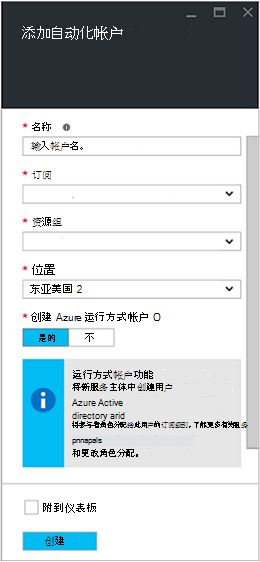
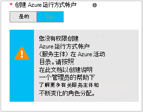

<properties
   pageTitle="将 Azure AD 用户帐户配置 |Microsoft Azure"
   description="本文介绍如何在 Azure 自动化对 ARM 和 ASM 进行身份验证配置为运行手册的 Azure AD 用户帐户凭据。"
   services="automation"
   documentationCenter=""
   authors="MGoedtel"
   manager="jwhit"
   editor="tysonn"
   keywords="azure 的活动目录的用户，azure 服务管理，azure ad 用户帐户" />
<tags
   ms.service="automation"
   ms.devlang="na"
   ms.topic="get-started-article"
   ms.tgt_pltfrm="na"
   ms.workload="infrastructure-services"
   ms.date="09/12/2016"
   ms.author="magoedte" />

# 身份验证使用 Azure 服务管理和资源管理器运行手册

本文介绍了 Azure 自动化运行手册对 Azure 服务管理 (ASM) 或 Azure 资源管理器 (ARM) 的资源运行的 Azure AD 用户帐户配置时必须执行的步骤。  尽管这仍是您 ARM 的支持的身份验证标识基于运行手册，推荐的方法使用新的 Azure 运行方式帐户。       

## 创建一个新的 Azure Active Directory 用户

1. 您想要管理 Azure 订阅的服务管理员登录 Azure 经典门户。
2. **活动目录**中选择，然后选择组织目录的名称。
3. 选择**用户**选项卡，然后在命令区域中，选择**添加用户**。
4. 在**告诉我们有关此用户**页的**用户类型**下，选择**您的组织中的新用户**。
5. 输入的用户名称。  
6. 选择与活动目录页上您 Azure 订阅关联的目录名称。
7. 在**用户配置文件**页中，可以提供第一个和最后一个名称、 一个用户友好的名称，以及用户**角色**列表中。  不要**启用多因素身份验证**。
8. 注意用户的全名和临时密码。
9. 选择**设置 > 管理员 > 添加**。
10. 键入您创建的用户的完整的用户名。
11. 请选择您希望用户以管理订阅。
12. 从 Azure 注销，然后重新登录您刚刚创建的帐户。 系统将提示您更改用户的密码。

## 在 Azure 传统门户网站中创建自动化帐户
在本节中，您将执行下列步骤以使用管理资源在 ASM 和 ARM 模式下运行手册 Azure 门户中创建新的 Azure 自动化帐户。  

>[AZURE.NOTE] 使用 Azure 经典门户创建自动化客户可以管理 Azure 经典和 Azure 门户和任何一个 cmdlet 的一套。 创建帐户后，是如何创建和管理资源帐户内的没有区别。 如果您计划继续使用 Azure 传统门户网站，然后您应使用它代替 Azure 门户创建任何自动化客户。

1. 您想要管理 Azure 订阅的服务管理员登录 Azure 经典门户。
2. 选择**自动化**。
3. 在**自动化**页面中，选择**创建自动化客户**。
4. 中**创建自动化帐户**框中，键入您的自动化新帐户的名称，从下拉列表中选择**区域**。  
5. 单击**确定**以接受您的设置并创建该帐户。
6. 创建完成后，它将**自动化**页面上列出。
7. 单击帐户，它将为您带来仪表板页。  
8. 在自动化仪表板页上，选择**资源**。
9. 在**资源**页上选择**添加设置**在页面的底部。
10. 在**添加设置**页上，选择**添加凭据**。
11. 在**定义凭据**页中，从**凭据类型**下拉列表中选择**Windows PowerShell 凭据**并提供的凭据名称。
12. 以下**定义凭据**页类型在用户名的 AD 用户帐户创建前面部分的**用户名**字段和**密码**和**确认密码**字段中的密码。 单击**确定**以保存所做的更改。

## 在 Azure 门户创建自动化客户

在本节中，您将执行以下步骤以将与 ARM 模式中运行手册管理资源使用 Azure 门户中创建新的 Azure 自动化帐户。  

1. 要管理 Azure 订阅的服务管理员身份登录到 Azure 的门户。
2. 选择**自动化帐户**。
3. 在自动化客户刀片式服务器，请单击**添加**。 
2. 在**添加自动化帐户**刀片式服务器，在**名称**框中键入新的自动化帐户的名称。
5. 如果您有多个订阅，则指定一个新帐户，以及新的或现有的**资源组**和 Azure 数据中心**位置**。
3. 选择选项的值**不**为**创建 Azure 运行方式帐户**，然后单击**创建**按钮。  

    >[AZURE.NOTE] 如果您选择不通过选择**否**选项来创建运行方式帐户，您将看到一条警告消息中**添加自动化帐户**刀片式服务器。  帐户已创建并指派给订阅中的**参与者**角色，而它订阅上并没有内订阅目录服务，因此，没有访问权限的资源的相应身份验证标识。  这将阻止任何运行手册引用此帐户不能进行身份验证和执行根据 ARM 资源的任务。

    

4. Azure 创建自动化帐户，同时您可以从菜单上跟踪下**通知**进度。

完成创建凭据后，然后需要创建凭据资产将自动化帐户与前面创建的 AD 用户帐户相关联。  请记住，我们只创建自动化客户并不是与身份验证标识相关联。  执行[凭据资产在 Azure 自动化文章](../automation/automation-credentials.md#creating-a-new-credential)中概述的步骤并输入**用户名**，**域 \ 用户**格式中的值。

## 在 runbook 中使用的凭据

您可以检索中使用[Get AutomationPSCredential](http://msdn.microsoft.com/library/dn940015.aspx)活动 runbook 凭据和再使用它[添加 AzureAccount](http://msdn.microsoft.com/library/azure/dn722528.aspx)连接到 Azure 订购。 如果凭据是管理员的 Azure 的多个订阅，则您还应该使用[选择 AzureSubscription](http://msdn.microsoft.com/library/dn495203.aspx)指定一个正确。 Windows PowerShell 下面通常出现在顶部的大多数 Azure 自动化运行手册的示例所示。

    $cred = Get-AutomationPSCredential –Name "myuseraccount.onmicrosoft.com"
    Add-AzureAccount –Credential $cred
    Select-AzureSubscription –SubscriptionName "My Subscription"

您 runbook 中，应在所有[检查点](http://technet.microsoft.com/library/dn469257.aspx#bk_Checkpoints)后重复这些行。 如果 runbook 挂起，然后继续在另一个工作人员，它将需要进行重新身份验证。

## 下一步行动
* 查看不同的 runbook 类型和从以下文章[Azure 自动化 runbook 类型](../automation/automation-runbook-types.md)创建您自己的运行手册的步骤
