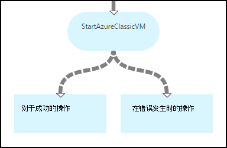
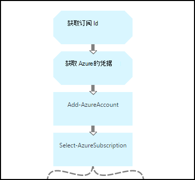
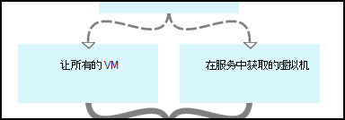
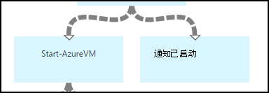
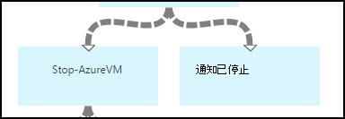
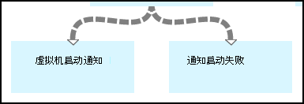
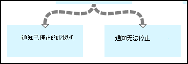

<properties 
    pageTitle="启动和停止虚拟机-图 |Microsoft Azure"
    description="Azure 自动化方案包括运行手册来启动和停止虚拟机经典 PowerShell 工作流版本。"
    services="automation"
    documentationCenter=""
    authors="mgoedtel"
    manager="jwhit"
    editor="tysonn" />
<tags 
    ms.service="automation"
    ms.devlang="na"
    ms.topic="article"
    ms.tgt_pltfrm="na"
    ms.workload="infrastructure-services"
    ms.date="07/06/2016"
    ms.author="bwren" />

# Azure 的自动化方案的启动和停止虚拟机

此 Azure 自动化方案包括运行手册来启动和停止经典的虚拟机。  可用于此方案如下︰  

- 在您自己的环境中使用而无需修改运行手册。 
- 修改要执行的自定义的功能运行手册。  
- 从另一个 runbook 作为整体解决方案的一部分调用运行手册。 
- 使用运行手册作为教程学习创作概念的 runbook。 

> [AZURE.SELECTOR]
- [图形](automation-solution-startstopvm-graphical.md)
- [PowerShell 工作流](automation-solution-startstopvm-psworkflow.md)

这是这种情况下的图形化的 runbook 版本。 此外，还可以使用[PowerShell 工作流运行手册](automation-solution-startstopvm-psworkflow.md)。

## 获取方案

该方案包括两个两个图形的运行手册，您可以从下面的链接下载。  看到[PowerShell 工作流版本](automation-solution-startstopvm-psworkflow.md)这一方案 PowerShell 工作流运行手册的链接。

| Runbook | 链接 | 类型 | 说明 |
|:---|:---|:---|:---|
| StartAzureClassicVM | [启动 Azure 经典 VM 图形 Runbook](https://gallery.technet.microsoft.com/scriptcenter/Start-Azure-Classic-VM-c6067b3d) | 图形 | 在 Azure 订阅向导或使用特定的服务名称的所有虚拟机启动所有经典的虚拟机。 |
| StopAzureClassicVM | [停止 Azure 经典 VM 图形 Runbook](https://gallery.technet.microsoft.com/scriptcenter/Stop-Azure-Classic-VM-397819bd) | 图形 | 停止自动帐户中的所有虚拟机或使用特定的服务名称的所有虚拟机。  |

## 安装和配置方案

### 1.安装运行手册

在下载后运行手册，您可以导入它们使用[图形 runbook 过程](automation-graphical-authoring-intro.md#graphical-runbook-procedures)中的过程。

### 2.审查的说明和要求
运行手册包括称为**自述文件**包含说明和所需的资源的活动。  您可以通过选择该**自述文件**活动和**工作流脚本**参数来查看此信息。  此外可以从这篇文章相同的信息。 

### 3.资产配置
运行手册要求以下的资产，您必须创建和填充适当的值。  名称是默认值。  如果在[输入的参数](#using-the-runbooks)中指定这些名称，启动 runbook 时，可以使用资产具有不同的名称。

| 资产类型 | 默认名称 | 说明 |
|:---|:---|:---|:---|
| [凭据](automation-credentials.md) | AzureCredential | 包含有权启动和停止虚拟机在 Azure 订阅帐户的凭据。  |
| [变量](automation-variables.md) | AzureSubscriptionId | 包含 Azure 订阅的订阅 ID。 |

## 使用方案

### 参数

运行手册每个具有下面的[输入的参数](automation-starting-a-runbook.md#runbook-parameters)。  必须提供所有必需的参数值，并可以选择提供值的其它参数根据您的要求。

| 参数 | 类型 | 必填字段 | 说明 |
|:---|:---|:---|:---|
| 服务名 | 字符串 | 不 | 如果未提供值，则使用该服务名称的所有虚拟机的启动或停止。  如果未提供值，Azure 的订阅中的所有经典虚拟机的启动或停止。 |
| AzureSubscriptionIdAssetName | 字符串 | 不 | 包含[变量的资产](#installing-and-configuring-the-scenario)包含 Azure 订阅的订阅 ID 的名称。  如果不指定值，则使用*AzureSubscriptionId* 。  |
| AzureCredentialAssetName | 字符串 | 不 | 包含[凭据资产](#installing-and-configuring-the-scenario)包含 runbook 使用的凭据名称。  如果不指定值，则使用*AzureCredential* 。  |

### 开始运行手册

可用于任何一种方法[开始在 Azure 自动化 runbook](automation-starting-a-runbook.md)在本文开始运行手册之一。

下面的示例命令使用 Windows PowerShell 运行**StartAzureClassicVM**来启动与该服务名称*MyVMService*的所有虚拟机。

    $params = @{"ServiceName"="MyVMService"}
    Start-AzureAutomationRunbook –AutomationAccountName "MyAutomationAccount" –Name "StartAzureClassicVM" –Parameters $params

### 输出

运行手册将为每个虚拟机，该值指示[输出一条消息，](automation-runbook-output-and-messages.md)指示已成功提交的开始或停止指令。  您可以查找特定字符串的输出来确定每个 runbook 的结果中。  下表中列出了可能的输出字符串。

| Runbook | 条件 | 消息 |
|:---|:---|:---|
| StartAzureClassicVM | 虚拟机已在运行  | MyVM 已在运行 |
| StartAzureClassicVM | 已成功提交的虚拟机的启动请求 | MyVM 已开始 |
| StartAzureClassicVM | 虚拟机启动请求失败  | MyVM 将无法启动 |
| StopAzureClassicVM | 虚拟机已在运行  | MyVM 已停止 |
| StopAzureClassicVM | 已成功提交的虚拟机的启动请求 | MyVM 已开始 |
| StopAzureClassicVM | 虚拟机启动请求失败  | MyVM 将无法启动 |

下面是使用作为示例图形 runbook 中[子 runbook](automation-child-runbooks.md) **StartAzureClassicVM**的图像。  这将使用下表中的条件链接。

| 链接 | 条件 |
|:---|:---|
| 成功的链接 | $ActivityOutput 'StartAzureClassicVM'-像"\*已开始"    |
| 错误链接   | "StartAzureClassicVM' $ActivityOutput-notlike"\*已开始" |

## 详细的分解

下面是在这种情况下运行手册的细目。  此信息可用于自定义运行手册，或者只是从中了解创作您自己的自动化方案。
 

### 身份验证

Runbook 开头要设置[凭据](automation-configuring.md#configuring-authentication-to-azure-resources)和 Azure 将用剩下的 runbook 的订阅活动。

前两个活动，**获取订阅 Id**和**获取 Azure 凭据**，检索使用接下来的两个活动的[资产](#installing-the-runbook)。  这些活动可以直接指定资产，但它们需要的资源名称。  我们将允许用户在[输入的参数](#using-the-runbooks)中指定这些名称，因为我们需要这些活动来检索指定的输入参数的名称与资产。

**添加 AzureAccount**设置为 runbook 的其余部分将使用的凭据。  它从**获取 Azure 凭据**检索凭据资产必须有权启动和停止虚拟机在 Azure 的订阅。  通过**选择 AzureSubscription**使用订阅 Id**获取订阅 Id**，用于订阅处于选中状态。

### 获取虚拟机

Runbook 需要用来确定它将使用哪些虚拟机并且是已启动还是停止 （取决于 runbook)。   这两种活动之一将检索虚拟机。  如果 runbook 的*服务*输入的参数包含的值，**获取服务中的虚拟机**将运行。  **获取所有虚拟机**将运行 runbook 的*服务*输入的参数不包含一个值。  这种逻辑被通过条件链接前面每个活动。

这两个活动使用**Get AzureVM** cmdlet。  **获取所有 Vm**都使用**ListAllVMs**参数设置为返回的所有虚拟机。  **获取服务中的虚拟机**使用**GetVMByServiceAndVMName**参数集，并为**服务**参数提供**服务**输入的参数。  

### 合并的虚拟机

**合并 Vm**活动时需要提供输入到**开始 AzureVM**需要名称和服务名称的 vm(s) 开始。  输入可以来自**获得所有 Vm**或**服务中获得的 Vm**，但**开始 AzureVM**只能指定为其输入一个活动。   

该方案是创建**合并虚拟机**运行**写入输出**cmdlet。  该 cmdlet 的**InputObject**参数是一个 PowerShell 表达式，结合前面两个活动的输入。  这些活动中的只有一个会运行，只期望输出的一组。  对于其输入参数，**开始 AzureVM**可以使用该输出。 

### 启动/停止虚拟机

 

根据 runbook 下, 一步活动尝试启动或停止使用**开始 AzureVM**或**停止 AzureVM**runbook。  由于管道链接前面有活动，它将为**合并虚拟机**从返回的每个对象的一次运行。  以下链接是条件，以便虚拟机*RunningState*是*已停止*的**开始 AzureVM**和*已启动*的**Stop AzureVM**才会运行该活动。 如果不满足此条件，然后**通知已启动**或**已通知停止**运行时要使用**写入输出**发送邮件。

### 将输出发送

 

在 runbook 中的最后一步是将输出发送是否每个虚拟机启动或停止请求已成功提交。 没有单独的**输出写入**活动的每一个，然后我们确定要运行条件链接使用哪一种。  如果*OperationStatus*是*成功*，运行**通知 VM 启动**或**通知 VM 停止**。  如果*OperationStatus*为任何其他值，**通知失败到开始**或**停止通知失败**是运行。

## 下一步行动

- [图形创作在 Azure 自动化](automation-graphical-authoring-intro.md)
- [在 Azure 自动化中子运行手册](automation-child-runbooks.md) 
- [Runbook 的输出和 Azure 自动化中的消息](automation-runbook-output-and-messages.md)