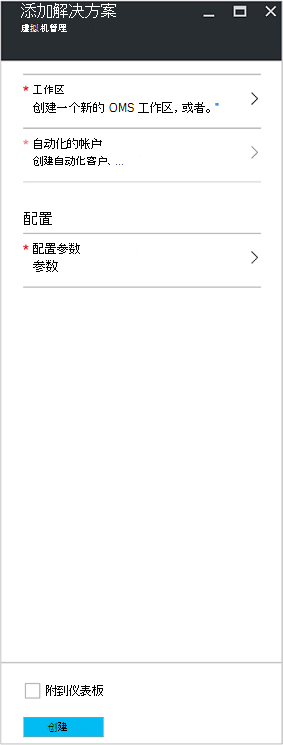
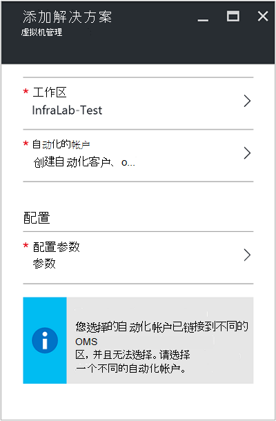
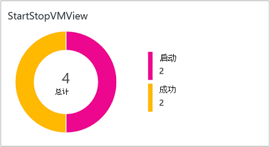
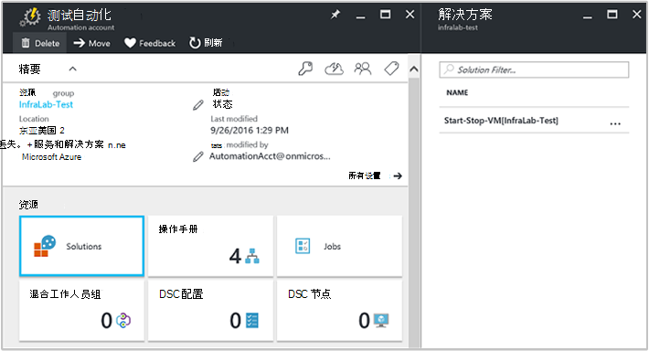
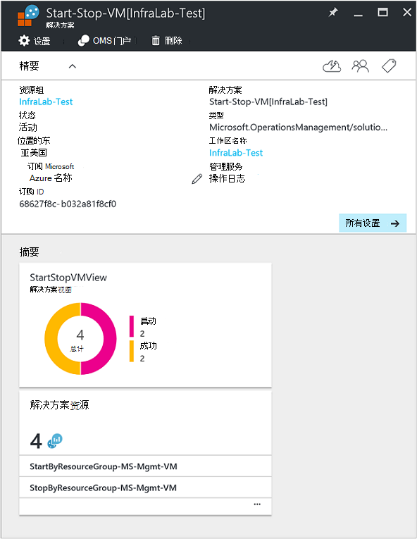

<properties
    pageTitle="启动/停止 Vm 在非高峰时段 [预览] 解决方案 |Microsoft Azure"
    description="VM 管理解决方案启动和停止 Azure 资源管理器的虚拟机按计划主动监视日志分析中。"
    services="automation"
    documentationCenter=""
    authors="MGoedtel"
    manager="jwhit"
    editor=""
    />
<tags
    ms.service="automation"
    ms.workload="tbd"
    ms.tgt_pltfrm="na"
    ms.devlang="na"
    ms.topic="get-started-article"
    ms.date="10/07/2016"
    ms.author="magoedte"/>

# 启动/停止在非高峰时段 [预览] 解决方案自动化中的虚拟机

在非高峰时段 [预览] 解决方案启动/停止虚拟机启动和停止 Azure 资源管理器的虚拟机上的用户定义的计划提供深入的成功启动和停止虚拟机与 OMS 日志分析的自动化作业。  

## 系统必备组件

- 使用[Azure 运行方式帐户](automation-sec-configure-azure-runas-account.md)工作运行手册。  运行方式帐户是首选的身份验证方法，因为它使用证书身份验证而不是可能过期或经常更改的密码。  

- 该解决方案只能管理相同的订阅和自动化帐户所在的资源组中的虚拟机。  

- 此解决方案仅部署到以下的 Azure 地区-澳大利亚东南部、 东部美国、 东南亚，以及西欧。  管理虚拟机计划运行手册可以将目标在任何区域中的虚拟机。  

- 开始和停止虚拟机运行手册完成后，请发送电子邮件通知，Office 365 提供企业级订阅是必需的。  

## 解决方案组件

此解决方案包括以下资源将被导入并添加到您的自动化帐户。

### 运行手册

Runbook | 说明|
--------|------------|
CleanSolution MS-管理虚拟机 | 删除从您的订阅的解决方案时，此 runbook 将删除包含的所有资源和时间表。|  
SendMailO365-MS-管理 | 该 runbook 发送通过 Office 365 交换电子邮件。|
StartByResourceGroup MS-管理虚拟机 | 此 runbook 旨在启动 Vm (这两个经典和 ARM 基于虚拟机)，驻留在给定的 Azure 的资源组列表中。
StopByResourceGroup MS-管理虚拟机 | 此 runbook 旨在停止虚拟机 (这两个经典和 ARM 基于虚拟机)，驻留在给定的 Azure 的资源组列表中。|
 

### 变量

变量 | 说明|
---------|------------|
**SendMailO365-MS-管理**Runbook ||
SendMailO365-IsSendEmail-MS-管理 | 指定 StartByResourceGroup MS-管理虚拟机和 StopByResourceGroup MS-管理虚拟机运行手册可以发送电子邮件通知完成后。  选择**True**以启用和**False**以禁用电子邮件警报。 默认值为**False**。| 
**StartByResourceGroup MS-管理虚拟机**Runbook ||
StartByResourceGroup-ExcludeList-MS-管理的 VM | 输入虚拟机名称来排除来自管理操作;通过使用 semi-colon(;) 分隔名称。 值是区分大小写，支持通配符 （星号）。|
StartByResourceGroup-SendMailO365-EmailBodyPreFix-MS-管理 | 可附加到电子邮件正文的开头的文本。|
StartByResourceGroup-SendMailO365-EmailRunBookAccount-MS-管理 | 指定包含电子邮件 runbook 自动化帐户的名称。  **不要修改此变量。**|
StartByResourceGroup-SendMailO365-EmailRunbookName-MS-管理 | 指定电子邮件 runbook 的名称。  这用于由 StartByResourceGroup MS-管理虚拟机和 StopByResourceGroup MS-管理虚拟机运行手册发送电子邮件。  **不要修改此变量。**|
StartByResourceGroup-SendMailO365-EmailRunbookResourceGroup-MS-管理 | 指定包含电子邮件 runbook 的资源组的名称。  **不要修改此变量。**|
StartByResourceGroup-SendMailO365-EmailSubject-MS-管理 | 指定的电子邮件的主题行的文本。|  
StartByResourceGroup-SendMailO365-EmailToAddress-MS-管理 | 指定的电子邮件的收件人。  通过使用 semi-colon(;) 中输入不同的名称。|
StartByResourceGroup-TargetResourceGroups-MS-管理的 VM | 输入虚拟机名称来排除来自管理操作;通过使用 semi-colon(;) 分隔名称。 值是区分大小写，支持通配符 （星号）。  默认值 （星号） 将包括在预订中的所有资源组。|
StartByResourceGroup-TargetSubscriptionID-MS-管理的 VM | 指定订阅包含虚拟机要受此解决方案。  这必须是相同的订阅此解决方案的自动化帐户驻留的位置。|
**StopByResourceGroup MS-管理虚拟机**Runbook ||
StopByResourceGroup-ExcludeList-MS-管理的 VM | 输入虚拟机名称来排除来自管理操作;通过使用 semi-colon(;) 分隔名称。 值是区分大小写，支持通配符 （星号）。|
StopByResourceGroup-SendMailO365-EmailBodyPreFix-MS-管理 | 可附加到电子邮件正文的开头的文本。|
StopByResourceGroup-SendMailO365-EmailRunBookAccount-MS-管理 | 指定包含电子邮件 runbook 自动化帐户的名称。  **不要修改此变量。**|
StopByResourceGroup-SendMailO365-EmailRunbookResourceGroup-MS-管理 | 指定包含电子邮件 runbook 的资源组的名称。  **不要修改此变量。**|
StopByResourceGroup-SendMailO365-EmailSubject-MS-管理 | 指定的电子邮件的主题行的文本。|  
StopByResourceGroup-SendMailO365-EmailToAddress-MS-管理 | 指定的电子邮件的收件人。  通过使用 semi-colon(;) 中输入不同的名称。|
StopByResourceGroup-TargetResourceGroups-MS-管理的 VM | 输入虚拟机名称来排除来自管理操作;通过使用 semi-colon(;) 分隔名称。 值是区分大小写，支持通配符 （星号）。  默认值 （星号） 将包括在预订中的所有资源组。|
StopByResourceGroup-TargetSubscriptionID-MS-管理的 VM | 指定订阅包含虚拟机要受此解决方案。  这必须是相同的订阅此解决方案的自动化帐户驻留的位置。|  
 

### 时间安排

日程安排 | 说明|
---------|------------|
StartByResourceGroup 计划-MS 管理 | StartByResourceGroup runbook，后者将执行此解决方案的托管的虚拟机的启动计划。|
StopByResourceGroup 计划-MS 管理 | StopByResourceGroup runbook，执行此解决方案的托管的虚拟机关闭的计划。|

### 凭据

凭据 | 说明|
-----------|------------|
O365Credential | 指定有效的 Office 365 提供用户帐户来发送电子邮件。  只有需要变量 SendMailO365-IsSendEmail-MS-管理将设置为**True**。

## 配置

执行以下步骤以启动/停止 Vm 在非高峰时段 [预览] 解决方案添加自动化帐户，然后配置自定义解决方案的变量。

1. 从主屏幕 Azure 的门户中，选择**市场上**拼贴。  如果拼贴不再固定在主屏幕中，从左侧的导航窗格中，选择**新建**。  
2. 在市场刀片式服务器，在搜索框中，键入**启动 VM** ，然后从搜索结果中选择**在非高峰时段 [预览] 的启动/停止虚拟机**的解决方案。  
3. 在所选解决方案的**开始/停止 Vm 在非高峰时段 [预览]**刀片式服务器，查看摘要信息，然后单击**创建**。  
4. **将解决方案添加**刀片式服务器出现提示您配置解决方案，您可以将其导入自动化订阅之前。     
5.  **将解决方案添加**刀片式服务器，选择**的工作区**，您在此处选择了 OMS 工作区链接到自动化帐户处于同一个 Azure 订阅或创建新的 OMS 工作区。  如果没有了 OMS 工作区，可以选择**创建新工作区**并**OMS 区**刀片式服务器上执行以下︰ 
   - 指定新的**OMS 工作区**的名称。
   - 选择**订阅**链接到选择从下拉列表中，如果选定默认不合适的。
   - **资源组**中，您可以创建新的资源组或选择现有资源组。  
   - 选择一个**位置**。  目前可供选择的唯一位置是**澳大利亚东南部**、**东部美国**、**东南亚**和**西欧**。
   - 选择**定价层**。  两层将提供解决方案︰ 释放，OMS 支付层。  每天保持期和 runbook 作业运行时分钟，自由层上收集到的数据量的限制。  支付的 OMS 层每天收集的数据量没有限制。  

        > [AZURE.NOTE]
        > 作为一个选项显示支付层独立时，它不适用。  如果选择它，并继续创建此解决方案在您的订阅，它将会失败。  在正式发布此解决方案时，这将得到解决。 如果您使用此解决方案，它将只使用自动化作业分钟和日志摄取。  解决方案不会添加到您的环境的其他 OMS 节点。  

6. 之后**OMS 区**刀片式服务器上提供所需的信息，请单击**创建**。  当验证信息并创建工作区时，您可以从菜单上跟踪下**通知**其进度。  您将返回到**将解决方案添加**刀片式服务器。  
7. 在**将解决方案添加**刀片式服务器，选择**自动化帐户**。  如果您正在创建一个新的 OMS 工作区，您将需要还创建一个新的自动化帐户，将用新 OMS 指定的工作区更早版本，包括 Azure 订购、 资源组和区域相关联。  可以选择**创建自动化帐户**并**添加自动化帐户**刀片式服务器，提供以下信息︰ 
  - 在**名称**字段中，输入自动化帐户的名称。

    所有其他选项会自动填充基于选择的 OMS 工作区，不能修改这些选项。  Azure 运行方式帐户是此解决方案中包含运行手册的默认身份验证方法。  当您单击**确定**时，验证配置选项并创建自动化客户。  从菜单上，您可以跟踪其进度**通知**下。 

    否则，您可以选择一个现有的自动化运行方式帐户。  注意，您选择的帐户不能已被链接到另一个的 OMS 区，否则消息将显示在刀片式服务器来通知您。  如果它已被链接，您需要选择不同的自动化运行方式帐户或创建一个新。    

8. 最后在**将解决方案添加**刀片式服务器，选择**配置**和**参数**刀片式服务器出现。  在**参数**刀片式服务器，系统提示︰  
   - 指定**目标 ResourceGroup 名**，其中是包含虚拟机要受此解决方案的资源组名称。  您可以输入多个名称和分隔每个使用的分号 （值是区分大小写）。  如果要在预订中的所有资源组中的目标 Vm，支持使用通配符。
   - 选择一个**计划**为定期的日期和时间启动和停止虚拟机的目标资源组中。  

10. 一旦您已完成配置解决方案所需的初始设置，选择**创建**。  所有设置都将进行都验证，然后它将尝试部署解决方案，在您的订阅。  此过程可能需要几秒钟的时间来完成，您可以跟踪从菜单下**通知**其进度。 

## 集合的频率

自动化作业日志和作业流数据到 OMS 资料库中每隔五分钟 ingested。  

## 使用解决方案

添加虚拟机管理解决方案时，OMS 工作区**StartStopVM 视图**中图块将被添加到您 OMS 的仪表板。  该拼贴显示计数和解决方案的运行手册作业已启动并成功完成的图形表示形式。     

自动化您的帐户，可以访问和管理的解决方案通过选择**解决方案**拼贴，然后从**解决方案**刀片式服务器中，从列表中选择该解决方案**开始停止 VM [区]** 。     

选择解决方案将显示**开始停止 VM [区]**解决方案刀片式服务器，从中您可以查看重要的详细信息，例如**StartStopVM**图块，像您 OMS 的工作区，其中显示计数和解决方案的运行手册作业已启动并成功完成的图形表示形式。     

从这里您还可以打开 OMS 区，和进一步执行的作业记录的分析。  只需单击**所有设置**，在**设置**刀片式服务器，选择**快速启动**，然后**快速入门**刀片式服务器中选择**OMS 门户**。   这将打开一个新的选项卡或新浏览器会话，并提供您与您的自动化帐户和订阅的 OMS 工作区。  

### 配置电子邮件通知

若要启用电子邮件通知，当开始和停止虚拟机运行手册完成后，您将需要修改**O365Credential**凭据和最少以下变量︰

 - SendMailO365-IsSendEmail-MS-管理
 - StartByResourceGroup-SendMailO365-EmailToAddress-MS-管理
 - StopByResourceGroup-SendMailO365-EmailToAddress-MS-管理

若要配置**O365Credential**凭据，请执行以下步骤︰

1. 从自动化您的帐户，请单击窗口顶部的**所有设置**。 
2. 在部分**自动化资源**下**设置**刀片式服务器，选择**资产**。 
3. 在**资产**刀片式服务器，选择**凭据**平铺和**凭据**刀片式服务器，选择**O365Credential**。  
4. 请输入有效的 Office 365 用户名和密码，然后单击**保存**以保存您的更改。  

若要配置以前突出显示的变量，请执行以下步骤︰

1. 从自动化您的帐户，请单击窗口顶部的**所有设置**。 
2. 在部分**自动化资源**下**设置**刀片式服务器，选择**资产**。 
3. **资产**刀片式服务器，选择**变量**麻将牌，和从**变量**刀片式服务器，选择上面列出的变量，然后修改它的描述前面指定[变量](##variables)部分中其值以下。  
4. 单击**保存**以将更改保存到变量。   

### 修改启动和关闭计划

管理此解决方案中的启动和关闭计划遵循相同的步骤，[安排在 Azure 自动化 runbook](automation-scheduling-a-runbook.md)中所述。  请记住，您不能修改计划配置。  您需要禁用现有安排，然后创建一个新并再链接到**StartByResourceGroup MS 管理 VM**或所需计划应用于**StopByResourceGroup MS-管理虚拟机**runbook。   

## 分析的日志记录

自动化 OMS 存储库中创建两种类型的记录。

### 作业登录

属性 | 说明|
----------|----------|
调用方 |  谁启动该操作。  可能的值是一个电子邮件地址或对于已排定作业系统。|
类别 | 数据类型的分类。  为实现自动化，则值为 JobLogs。|
都会 | 是 runbook 作业的关联 Id 的 GUID。|
作业 Id | 是的 runbook 作业 Id 的 GUID。|
操作名称 | 指定在 Azure 中所执行的操作的类型。  为实现自动化，则这将作业。|
资源 Id | 在 Azure 中指定的资源类型。  为实现自动化的值是与 runbook 相关联的自动化帐户。|
ResourceGroup | 指定 runbook 作业的资源组的名称。|
ResourceProvider | 指定的 Azure 服务提供的资源，您可以部署和管理。  为实现自动化，则值为 Azure 自动化。|
资源类型 | 在 Azure 中指定的资源类型。  为实现自动化的值是与 runbook 相关联的自动化帐户。|
resultType | Runbook 作业的状态。  可能值包括︰ -启动 -停止 挂起 -失败 -成功|
resultDescription | 介绍了 runbook 作业结果状态。  可能值包括︰ 启动作业 的失败作业 作业已完成|
RunbookName | 指定 runbook 的名称。|
SourceSystem | 指定用于提交的数据的源系统。  对于自动化，值将是︰ OpsManager|
StreamType | 指定事件的类型。 可能值包括︰ 详细 输出 -错误 -警告|
SubscriptionId | 指定作业的订阅 ID。
时间 | 日期和时间的 runbook 作业的执行时间。|

### 作业流

属性 | 说明|
----------|----------|
调用方 |  谁启动该操作。  可能的值是一个电子邮件地址或对于已排定作业系统。|
类别 | 数据类型的分类。  为实现自动化，则值为 JobStreams。|
作业 Id | 是的 runbook 作业 Id 的 GUID。|
操作名称 | 指定在 Azure 中所执行的操作的类型。  为实现自动化，则这将作业。|
ResourceGroup | 指定 runbook 作业的资源组的名称。|
资源 Id | 在 Azure 中指定的资源 Id。  为实现自动化的值是与 runbook 相关联的自动化帐户。|
ResourceProvider | 指定的 Azure 服务提供的资源，您可以部署和管理。  为实现自动化，则值为 Azure 自动化。|
资源类型 | 在 Azure 中指定的资源类型。  为实现自动化的值是与 runbook 相关联的自动化帐户。|
resultType | 在生成事件的时间 runbook 作业的结果。  可能值包括︰ -正在进行|
resultDescription | 包括从 runbook 的输出流。|
RunbookName | Runbook 的名称。|
SourceSystem | 指定用于提交的数据的源系统。  为实现自动化，会 OpsManager 的值。|
StreamType | 工作流的类型。 可能值包括︰ 进行 输出 -警告 -错误 调试 详细|
时间 | 日期和时间的 runbook 作业的执行时间。|

当您执行返回的**JobLogs**或**JobStreams**分类记录任何日志搜索时，您可以选择**JobLogs**或**JobStreams**的视图，其中显示的图块汇总更新搜索返回的一组。

## 示例日志搜索

下表提供了作业记录收集此解决方案的示例日志搜索。 

查询 | 说明|
----------|----------|
查找 runbook StartVM 已成功完成作业 | 类别 = JobLogs RunbookName_s ="StartByResourceGroup-MS-管理的 VM"ResultType = 成功 & #124;测量由 JobId_g count()|
查找 runbook StopVM 已成功完成作业 | 类别 = JobLogs RunbookName_s ="StartByResourceGroup-MS-管理的 VM"ResultType = 失败 & #124;测量由 JobId_g count()
针对 StartVM 和 StopVM 运行手册随着时间推移显示作业状态 | 类别 = JobLogs RunbookName_s ="StartByResourceGroup-MS-管理的 VM"或者"StopByResourceGroup-MS-管理的 VM"NOT(ResultType="started") | 按 ResultType 间隔 1 天测量 Count()|

## 下一步行动

- 若要了解有关如何构造不同的搜索查询和查看与日志分析的自动化作业日志的详细信息，请参阅[在日志分析的日志搜索](../log-analytics/log-analytics-log-searches.md)
- 若要了解有关 runbook 执行的方式来监视 runbook 作业，和其他技术的详细信息，请参阅[跟踪 runbook 作业](automation-runbook-execution.md)
- 若要了解有关 OMS 日志分析和集合的数据源的详细信息，请参阅[日志分析概述中的收集 Azure 存储数据](../log-analytics/log-analytics-azure-storage.md)

   

