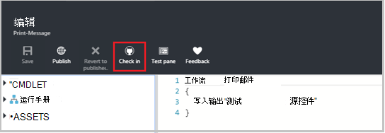

<properties 
    pageTitle=" 源代码控制集成了 Azure 自动化 |Microsoft Azure"
    description="本文介绍了使用 GitHub Azure 自动化中的源代码管理集成。"
    services="automation"
    documentationCenter=""
    authors="mgoedtel"
    manager="jwhit"
    editor="tysonn" />    
<tags 
    ms.service="automation"
    ms.devlang="na"
    ms.topic="article"
    ms.tgt_pltfrm="na"
    ms.workload="infrastructure-services"
    ms.date="09/12/2016"
    ms.author="magoedte;sngun" />

# 在 Azure 自动化源代码管理集成

源代码管理集成允许您将您的自动化帐户到 GitHub 版本控制库中运行手册。 源控件允许您轻松地与团队协作，跟踪更改，并回滚到早期版本的运行手册。 例如，源控件允许您同步与您开发、 测试或生产自动化的帐户轻松地升级到生产自动化客户开发环境中经过测试的代码的源代码管理中的不同分支。

源控件使您可以将代码从 Azure 自动化推送到源代码管理或拉到 Azure 自动化运行手册从源代码管理。 本文介绍如何设置 Azure 自动化环境中的源代码管理。 我们将开始通过配置 Azure 自动化访问 GitHub 资料库和遍历不同的操作，可以使用源代码管理集成。 

>[AZURE.NOTE]源控件支持拉出并推[PowerShell 工作流运行手册](automation-runbook-types.md#powershell-workflow-runbooks)，以及[PowerShell 运行手册](automation-runbook-types.md#powershell-runbooks)。 尚不支持[图形化运行手册](automation-runbook-types.md#graphical-runbooks)。  

有两个简单的步骤配置源代码管理用于自动化您的帐户和只有一个，如果您已经从 GitHub 帐户所需。 它们是︰
## 第 1 步 – 创建 GitHub 资料库

如果您已经有 GitHub 帐户和您想要链接到 Azure 自动化，然后登录到您的现有帐户，然后从步骤 2 开始的存储库。 否则，导航到[GitHub](https://github.com/)，标志了新帐户并[创建新的存储库](https://help.github.com/articles/create-a-repo/)。

## 第 2 步 – 设置 Azure 自动化中的源代码管理

1. 从 Azure 门户中自动化帐户刀片式服务器，请单击**设置源代码管理。** 
 
    

2. 将打开**源代码管理**刀片式服务器，在那里您可以配置 GitHub 帐户详细信息。 下面是要配置的参数列表︰  

  	|**参数**            |**说明** |
  	|:---|:---| 
  	|选择源   | 选择源。 目前，仅**GitHub**被支持。 |
  	|授权 | 单击**授权**按钮授予 Azure 自动化对 GitHub 存储库的访问权限。 如果您已登录到您在其他窗口的 GitHub 帐户，则使用该帐户的凭据。 授权成功后，刀片式服务器将显示在**授权属性**下您 GitHub 的用户名。 |
  	|选择存储库 | 从可用资料库的列表中选择 GitHub 资料库。 |
  	|选择分支 | 从可用分支的列表中选择分支。 如果尚未创建任何分支显示仅**主**分支。 |
  	|Runbook 文件夹路径 | Runbook 文件夹路径在 GitHub 知识库中想要推或拉出代码中指定的路径。 它必须以**/foldername/subfoldername**格式输入。 Runbook 文件夹路径中的仅运行手册将同步到自动化帐户。 同步子文件夹 runbook 文件夹路径将**不**运行手册。 使用**/**同步在存储库中的所有运行手册。 |

3. 例如，如果您有一个名为**PowerShellScripts** ，其中包含名为**RootFolder**的文件夹的存储库，其中包含一个文件夹命名**子文件夹**。 您可以使用下列字符串同步文件夹中的每个级别︰

    1. 若要同步**存储库**中的运行手册，runbook 文件夹路径是*/*
    2. 若要同步运行手册从**RootFolder**，runbook 文件夹路径是*/RootFolder*
    3. 若要同步**的子文件夹**中运行手册，runbook 文件夹路径是*/RootFolder/SubFolder*。
  

4. 配置参数后，它们会显示在**设置源控制刀片。**  
 
    

5. 当您单击确定时，源代码管理集成现已配置为自动帐户和应使用 GitHub 信息进行更新。 您现在可以单击此部分查看所有源代码管理同步作业历史记录。  

    

6. 设置源控件后，将自动帐户中创建以下自动化资源︰  
 创建两个[变量的资产](automation-variables.md)。  
      
    * **Microsoft.Azure.Automation.SourceControl.Connection**变量包含的值的连接字符串，如下所示。  

  	|**参数**            |**值** |
  	|:---|:---|
  	| 名称  | Microsoft.Azure.Automation.SourceControl.Connection |
  	| 类型 | 字符串 |
  	| 值  | {"分支":\<*分支名称*>，"RunbookFolderPath":\<*Runbook 文件夹路径*>，"提供程序类型":\<*值为 1 的 GitHub*>，"存储库":\<*的存储库名称*>，"Username":\<*您 GitHub 用户名*>} |   

    * 变量**Microsoft.Azure.Automation.SourceControl.OAuthToken**，包含您的 OAuthToken 的安全加密的值。  

  	|**参数**            |**值** |
  	|:---|:---|
  	| 名称  | Microsoft.Azure.Automation.SourceControl.OAuthToken |
  	| 类型 | Unknown(Encrypted) |
  	| 值 | <*加密的 OAuthToken*> |  

      

    * 作为应用程序授权给 GitHub 帐户添加**自动化源代码管理**。 若要查看该应用程序︰ 从 GitHub 的主页上，浏览到您的**配置文件** > **设置** > **应用程序**。 此应用程序允许 Azure 自动同步向自动化客户 GitHub 资料库。  

    

## 在自动化中使用源代码管理

### 签入到源控件从 Azure 自动化 runbook

Runbook-在允许您推入到源控件存储库到 Azure 自动化中 runbook 所做的更改。 要签入的 runbook 步骤如下︰

1. 从自动化帐户、[创建新的文本 runbook](automation-first-runbook-textual.md)，或[编辑现有的文本的 runbook](automation-edit-textual-runbook.md)。 该 runbook 可以 PowerShell 流或 PowerShell 脚本 runbook。  

2. 编辑您的 runbook 后，保存它然后单击**签入****编辑**刀片式服务器中。  

    

     >[AZURE.NOTE] 签入从 Azure 自动化将覆盖您的源代码管理中当前存在的代码。 要签入的 Git 等效的命令行指令是**git 中添加 + git commit + git 推**  

3. 当您单击**签入**将会有一条确认消息，提示时单击是继续。  

    

4. 签入启动源控件 runbook︰**同步 MicrosoftAzureAutomationAccountToGitHubV1**。 该 runbook 连接到 GitHub 并将更改从 Azure 自动化推送到您的存储库。 若要查看签入作业历史记录，请返回到**源代码管理集成**选项卡，单击打开存储库同步刀片式服务器。 此刀片显示所有源控制作业。  选择您想要查看，单击此处可查看详细信息的作业。  

    

    >[AZURE.NOTE] 源控件运行手册都是特殊的自动化运行手册，您不能查看或编辑。 而他们将不会显示在您的 runbook 列表，您将看到同步作业在作业列表上显示出来。
 
5. 修改后的 runbook 的名称作为输入参数发送到签入 runbook。 可以通过扩展**存储库同步**刀片式服务器中的 runbook[查看作业的详细信息](automation-runbook-execution.md#viewing-job-status-using-the-azure-management-portal)。  

    

6. 一旦该作业完成后，若要查看所做的更改，则刷新 GitHub 资料库。  提交消息与资料库中应提交︰**更新*Runbook 名称*在 Azure Automation.* *  

### 从源代码管理 Azure 自动化的同步运行手册 

存储库同步刀片式服务器上的同步按钮允许您向自动化客户拉 runbook 文件夹路径的存储库中的所有运行手册。 可以对多个自动化帐户同步同一存储库。 若要同步 runbook 步骤如下︰

1. 从自动化帐户设置源控件、 打开**源代码控制存储库集成/同步刀片式服务器**和您将被提示以确认消息，然后单击**同步**的位置，请单击**是**继续。  

    

2. 同步启动 runbook︰**同步 MicrosoftAzureAutomationAccountFromGitHubV1**。 该 runbook 连接到 GitHub 并将更改从您的存储库拉 Azure 自动化。 在**存储库同步**刀片式服务器执行此操作，您应该看到一份新工作。 若要查看有关同步作业的详细信息，请单击打开作业详细信息刀片式服务器。  
 
    

 
    >[AZURE.NOTE] 从源代码管理同步覆盖当前存在于目前在源代码管理中的**所有**运行手册您自动化的帐户运行手册的草稿版本。 要同步的 Git 等效的命令行指令是**git 拉**

## 源控件疑难解答

如果有任何错误使用签入或同步作业，应暂停作业状态和作业刀片式服务器中可以查看有关错误的更多详细信息。  **所有日志**部分将显示与该作业关联的所有 PowerShell 流。 这将为您提供帮助您解决任何问题您签入或同步所需的详细信息。 它还将显示您的同步或签入 runbook 时出现的操作序列。  

## 源代码管理断开连接

要断开从 GitHub 帐户，请打开存储库同步刀片式服务器并单击**断开**。 一旦源代码管理断开连接，前面已同步运行手册仍会保留在您的自动化帐户，但将不会启用存储库同步刀片式服务器。  

  

## 下一步行动

有关源代码管理集成的详细信息，请参阅以下资源︰  
- [在 Azure 自动化 azure 自动化︰ 源代码管理集成](https://azure.microsoft.com/blog/azure-automation-source-control-13/)  
- [投票最喜爱的源代码控制系统](https://www.surveymonkey.com/r/?sm=2dVjdcrCPFdT0dFFI8nUdQ%3d%3d)  
- [Azure 自动化︰ 集成 Runbook 源代码管理使用 Visual Studio 的团队服务](https://azure.microsoft.com/blog/azure-automation-integrating-runbook-source-control-using-visual-studio-online/)  
