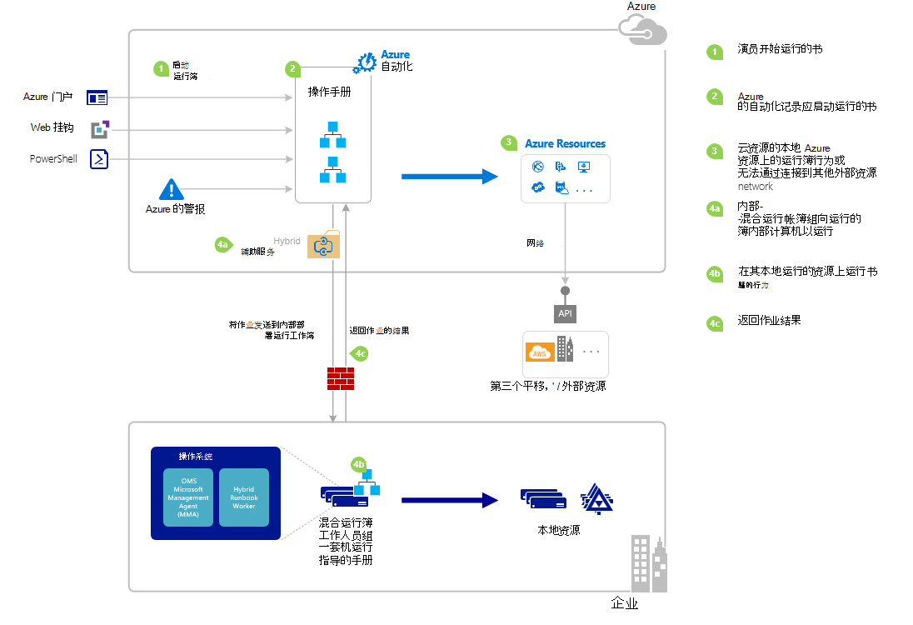

<properties
   pageTitle="在 Azure 自动化启动 runbook |Microsoft Azure"
   description="总结了不同的方法，可用来启动 runbook Azure 自动化中使用 Azure 门户和 Windows PowerShell 提供了详细信息。"
   services="automation"
   documentationCenter=""
   authors="mgoedtel"
   manager="jwhit"
   editor="tysonn" />
<tags
   ms.service="automation"
   ms.devlang="na"
   ms.topic="article"
   ms.tgt_pltfrm="na"
   ms.workload="infrastructure-services"
   ms.date="10/08/2016"
   ms.author="magoedte;bwren"/>

# <a name="starting-a-runbook-in-azure-automation"></a>从 runbook 开始在 Azure 自动化

下表将帮助您确定要启动 runbook Azure 自动化中最适用于您的特定情况的方法。 这篇文章包括与 Azure 的门户和 Windows PowerShell 启动 runbook 的详细信息。 您可以从下面的链接访问其他文档中提供了其他方法的详细信息。

| **方法**                                                                    | **特征**                                                                                                                                                                                                                                                                                                                                                |
|-------------------------------------------------------------------------------|--------------------------------------------------------------------------------------------------------------------------------------------------------------------------------------------------------------------------------------------------------------------------------------------------------------------------------------------------------------------|
| [Azure 门户](#starting-a-runbook-with-the-azure-portal)                     | <li>交互式用户界面的最简单方法。<br> <li>窗体中提供简单的参数值。<br> <li>轻松跟踪作业状态。<br> <li>使用 Azure 的登录身份验证的访问。                                                                                                                                                                               |
| [Windows PowerShell](https://msdn.microsoft.com/library/dn690259.aspx)        | <li>从命令行中使用 Windows PowerShell cmdlet 调用。<br> <li>可以包含多个步骤的自动化解决方案中。<br> <li>请求进行身份验证的证书或 OAuth 用户主体 / 服务主体。<br> <li>提供简单和复杂的参数值。<br> <li>跟踪工作状态。<br> <li>支持 PowerShell cmdlet 所需的客户端。 |
| [Azure 自动化 API](https://msdn.microsoft.com/library/azure/mt662285.aspx) | <li>最灵活的方法，但也最复杂。<br> <li>从可以发出 HTTP 请求的任何自定义代码中调用。<br> <li>经过身份验证的证书，或 Oauth 用户主体 / 服务请求主体。<br> <li>提供简单和复杂的参数值。<br> <li>跟踪工作状态。                                                                          |
| [Webhooks](automation-webhooks.md)                                            | <li>从 runbook 开始从单一的 HTTP 请求。<br> <li>使用 URL 中的安全令牌身份验证。<br> <li>客户端无法重写 webhook 创建时指定的参数值。 Runbook 可以定义包含 HTTP 请求的详细信息的单个参数。<br> <li>跟踪工作状态通过 webhook URL 不能。                                      |
| [对 Azure 警报作出响应](../log-analytics/log-analytics-alerts.md)               | <li>从 runbook 开始响应 Azure 的警报。<br> <li>配置 webhook runbook 和链接的报警。<br> <li>使用 URL 中的安全令牌身份验证。<br> <li>目前仅在衡量标准上支持警报。                                                                                                                                                       |
| [日程安排](automation-schedules.md)                                | <li>自动启动 runbook 每小时、 每日或每周的时间表。<br> <li>操作通过 Azure 的门户，PowerShell 的 cmdlet 或 Azure API 的计划。<br> <li>提供参数值用于日程安排。                                                                                                                                               |
| [从另一个 Runbook](automation-child-runbooks.md)                          | <li>使用 runbook 作为另一个 runbook 中的活动。<br> <li>对于由多个运行手册的功能非常有用。<br> <li>提供子 runbook 的参数值并使用父 runbook 中的输出。                                                                                                                                                               |

下图说明在生命周期的 runbook 详细的分步过程。 它包括不同 runbook 启动了 Azure 自动化组件所需的混合 Runbook 工作人员执行 Azure 自动化运行手册和不同组件之间的交互的方式。 若要了解有关在您的数据中心执行自动化运行手册，请参阅[混合 runbook 工作人员](automation-hybrid-runbook-worker.md)



## <a name="starting-a-runbook-with-the-azure-portal"></a>从 runbook 开始的 Azure 门户

1.  在 Azure 的门户中，选择**自动化**，然后再单击自动化帐户的名称。
2.  选择**运行手册**选项卡。
3.  选择 runbook，然后单击**开始**。
4.  如果 runbook 参数，系统会提示您用在文本框中为每个参数提供值。 更多有关参数的详细信息，请参阅下面的[Runbook 参数](#Runbook-parameters)。
5.  请选择**查看作业**下, 一步**启动**runbook 消息或选择 runbook 来查看 runbook 作业的状态为**作业**选项卡。

## <a name="starting-a-runbook-with-the-azure-portal"></a>从 runbook 开始的 Azure 门户

1.  从自动化您的帐户，单击以打开**运行手册**刀片式服务器的**运行手册**部分。
2.  单击要打开其**Runbook**刀片式服务器 runbook。
3.  单击**开始**。
4.  如果 runbook 没有任何参数，将提示您确认是否要启动它。 如果 runbook 参数，则将会打开**启动 Runbook**刀片式服务器，使您可以提供参数值。 更多有关参数的详细信息，请参阅下面的[Runbook 参数](#Runbook-parameters)。
5.  **作业**刀片式服务器已打开，以便您可以跟踪作业的状态。

## <a name="starting-a-runbook-with-windows-powershell"></a>从 runbook 开始 Windows PowerShell

可以使用[启动 AzureRmAutomationRunbook](https://msdn.microsoft.com/library/mt603661.aspx)以 runbook 开头 Windows PowerShell。 下面的代码示例启动调用测试 Runbook runbook。

```
Start-AzureRmAutomationRunbook -AutomationAccountName "MyAutomationAccount" -Name "Test-Runbook" -ResourceGroupName "ResourceGroup01"
```

开始 AzureRmAutomationRunbook 返回可用于启动 runbook 后跟踪其状态的作业对象。 然后可以使用[Get AzureRmAutomationJob](https://msdn.microsoft.com/library/mt619440.aspx)与本作业对象来确定作业和[Get AzureRmAutomationJobOutput](https://msdn.microsoft.com/library/mt603476.aspx)以获取其输出的状态。 下面的代码示例启动 runbook 调用测试 Runbook，等待它完成，并显示其输出。

```
$runbookName = "Test-Runbook"
$ResourceGroup = "ResourceGroup01"
$AutomationAcct = "MyAutomationAccount"

$job = Start-AzureRmAutomationRunbook –AutomationAccountName $AutomationAcct -Name $runbookName -ResourceGroupName $ResourceGroup

$doLoop = $true
While ($doLoop) {
   $job = Get-AzureRmAutomationJob –AutomationAccountName $AutomationAcct -Id $job.JobId -ResourceGroupName $ResourceGroup
   $status = $job.Status
   $doLoop = (($status -ne "Completed") -and ($status -ne "Failed") -and ($status -ne "Suspended") -and ($status -ne "Stopped"))
}

Get-AzureRmAutomationJobOutput –AutomationAccountName $AutomationAcct -Id $job.JobId -ResourceGroupName $ResourceGroup –Stream Output
```

如果 runbook 需要参数，则必须提供它们作为[哈希表](http://technet.microsoft.com/library/hh847780.aspx)在哈希表的键匹配的参数名和值是参数值。 下面的示例演示如何以 runbook 开头两个名为名字字段和姓氏、 名为 RepeatCount，一个整数和命名放映一个布尔型参数的字符串参数。 参数的其他信息，请参阅[Runbook 参数](#Runbook-parameters)下。

```
$params = @{"FirstName"="Joe";"LastName"="Smith";"RepeatCount"=2;"Show"=$true}
Start-AzureRmAutomationRunbook –AutomationAccountName "MyAutomationAccount" –Name "Test-Runbook" -ResourceGroupName "ResourceGroup01" –Parameters $params
```

## <a name="runbook-parameters"></a>Runbook 参数

在 Azure 门户或 Windows PowerShell 启动 runbook 时，通过 Azure 自动化 web 服务发送指令。 此服务不支持复杂数据类型的参数。 如果您需要一个复杂的参数提供的值，然后必须调用其内联从另一台 runbook [Azure 自动化中的子运行手册](automation-child-runbooks.md)中所述。

Azure 自动化 web 服务将提供使用以下各节中所述某些数据类型参数的特殊功能。

### <a name="named-values"></a>已命名的值

如果该参数是数据类型 [对象]，则可以使用下面的 JSON 格式发送该已命名的值的列表︰ *{Name1: Value1、 Name2︰ 值"2"，Name3: Value3}*。 这些值必须是简单类型。 Runbook 会收到[PSCustomObject](https://msdn.microsoft.com/library/system.management.automation.pscustomobject%28v=vs.85%29.aspx)与属性对应于每个已命名的值作为参数。

请考虑下面的测试 runbook 接受名为 user 参数。

```
Workflow Test-Parameters
{
   param (
      [Parameter(Mandatory=$true)][object]$user
   )
    $userObject = $user | ConvertFrom-JSON
    if ($userObject.Show) {
        foreach ($i in 1..$userObject.RepeatCount) {
            $userObject.FirstName
            $userObject.LastName
        }
    }
}
```

下面的文本无法用于用户参数。

```
{FirstName:'Joe',LastName:'Smith',RepeatCount:'2',Show:'True'}
```

这会导致下面的输出。

```
Joe
Smith
Joe
Smith
```

### <a name="arrays"></a>数组

如果参数是一个数组，如 [阵列] 或 [字符串 []]，则可以使用以下的 JSON 格式发送它的值的列表: *[值 1，值 2，Value3]*。 这些值必须是简单类型。

请考虑下面的测试 runbook 接受名为*user*参数。

```
Workflow Test-Parameters
{
   param (
      [Parameter(Mandatory=$true)][array]$user
   )
    if ($user[3]) {
        foreach ($i in 1..$user[2]) {
            $ user[0]
            $ user[1]
        }
    }
}
```

下面的文本无法用于用户参数。

```
["Joe","Smith",2,true]
```

这会导致下面的输出。

```
Joe
Smith
Joe
Smith
```

### <a name="credentials"></a>凭据

如果该参数是数据类型**PSCredential**，您可以提供 Azure 自动化[凭据资产](automation-credentials.md)的名称。 Runbook 将检索与您指定的名称，凭据。

请考虑以下测试 runbook 接受参数称为凭据。

```
Workflow Test-Parameters
{
   param (
      [Parameter(Mandatory=$true)][PSCredential]$credential
   )
   $credential.UserName
}
```

下面的文本可能用于为用户参数假设，没有称为*我的凭据*的凭据资产。

```
My Credential
```

这假定凭据中的用户名*jsmith*，在下面的输出结果。

```
jsmith
```

## <a name="next-steps"></a>下一步行动

-   在当前项目中的 runbook 体系结构高度概括运行手册管理 Azure 和与混合 Runbook 工作人员内部部署中的资源。  要了解有关在您的数据中心中执行自动化运行手册，请参阅[混合 Runbook 工作人员](automation-hybrid-runbook-worker.md)。
-   要了解有关创建的模块化运行手册，要其他运行手册用于特定或通用函数的详细信息，请参阅[子运行手册](automation-child-runbooks.md)。
