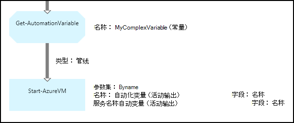

<properties 
   pageTitle="在 Azure 自动化变量资产 |Microsoft Azure"
   description="变量的资产是可供所有运行手册和 Azure 自动化中的 DSC 配置的值。  本文介绍了变量以及如何使用这些文本和图形创作中的详细信息。"
   services="automation"
   documentationCenter=""
   authors="mgoedtel"
   manager="jwhit"
   editor="tysonn" />
<tags 
   ms.service="automation"
   ms.devlang="na"
   ms.topic="article"
   ms.tgt_pltfrm="na"
   ms.workload="infrastructure-services"
   ms.date="05/24/2016"
   ms.author="magoedte;bwren" />

# 在 Azure 自动化变量资产

变量的资产是可供所有运行手册和 DSC 配置自动化科目中的值。 他们可以创建、 修改和检索从 Azure 的门户中，Windows PowerShell 以及 runbook 或 DSC 配置。 自动变量可用于以下情形︰

- 共享多个运行手册 / DSC 配置之间的一个值。

- 共享相同的 runbook 或 DSC 配置中的多个作业之间的一个值。

- 从门户网站或运行手册或 DSC 配置为使用 Windows PowerShell 命令行来管理一个值。

自动变量将保留，以便它们继续提供即使 runbook 或 DSC 配置失败。  这还允许通过由同一个 runbook 或 DSC 配置下一次运行一个 runbook，然后由另一个，或用来设置值。

创建一个变量时，您可以指定它将存储加密。  当一个变量加密的时 Azure 自动化中安全地存储，无法从[获得 AzureAutomationVariable](http://msdn.microsoft.com/library/dn913772.aspx) cmdlet 附带为 Azure PowerShell 模块的一部分检索它的值。  加密后的值可以进行检索的唯一方法是从 runbook 或 DSC 配置中**获取 AutomationVariable**活动。

>[AZURE.NOTE]在 Azure 自动化的安全资产包括凭据、 证书、 连接和加密的变量。 这些资产都得到加密并存储在每个自动化帐户使用唯一的密钥生成 Azure 自动化。 此密钥是由主证书加密并存储在 Azure 自动化。 之前存储安全资产，自动化帐户密钥进行解密使用该母版的证书，然后用来加密该资产。

## 变量类型

Azure 门户创建变量时，必须指定下拉列表从数据类型，因此门户可以显示相应的控件用于输入变量的值。 该变量并不局限于此数据类型，但您必须设置使用 Windows PowerShell，如果想要指定不同类型的值的变量。 如果指定**未定义**，然后将该变量的值设置为**$null**，并必须设置与[一组 AzureAutomationVariable](http://msdn.microsoft.com/library/dn913767.aspx) cmdlet 或**设置 AutomationVariable**活动的值。  您不能创建或更改在门户中，复杂变量类型的值，但您可以使用 Windows PowerShell 任何类型的值。 将[PSCustomObject](http://msdn.microsoft.com/library/system.management.automation.pscustomobject.aspx)作为返回复杂类型。

可以通过创建一个数组或哈希表并将其保存到变量中存储多个值给一个变量。

## Cmdlet 和工作流活动

下表中的 cmdlet 用于创建和管理自动化 Windows PowerShell 的变量。 他们寄送为[Azure PowerShell 模块](../powershell-install-configure.md)可供使用自动化运行手册和 DSC 配置中的一部分。

|Cmdlet|说明|
|:---|:---|
|[获得 AzureAutomationVariable](http://msdn.microsoft.com/library/dn913772.aspx)|检索现有变量的值。|
|[新 AzureAutomationVariable](http://msdn.microsoft.com/library/dn913771.aspx)|创建一个新变量，并设置其值。|
|[删除 AzureAutomationVariable](http://msdn.microsoft.com/library/dn913775.aspx)|删除一个现有的变量。|
|[一组 AzureAutomationVariable](http://msdn.microsoft.com/library/dn913767.aspx)|设置现有变量的值。|

下表中的工作流活动用于访问自动化变量 runbook 中。 他们只可在 runbook 或 DSC 配置中使用并且不要发行为 Azure PowerShell 模块的一部分。

|工作流活动|说明|
|:---|:---|
|获得 AutomationVariable|检索现有变量的值。|
|一组 AutomationVariable|设置现有变量的值。|

>[AZURE.NOTE] 您应该避免使用变量--Name 参数中**获取 AutomationVariable**的 runbook 或 DSC 配置，因为这会使发现运行手册或 DSC 配置和自动变量之间的依赖关系复杂化在设计时中。

## 创建一个新的自动化变量

### 若要使用 Azure 门户创建一个新变量

1. 从自动化您的帐户，请单击窗口顶部的**资产**。
1. 在窗口的底部，单击**添加设置**。
1. 单击**添加变量**。
1. 完成该向导，请单击该复选框以保存新的变量。

### 若要使用 Azure 门户创建一个新变量

1. 从自动化您的帐户，单击以打开刀片式服务器**资产**的**资产**部分。
1. 单击以打开刀片式服务器**变量**的**变量**部分。
1. 单击顶部的刀片式服务器**添加一个变量**。
1. 完成窗体并单击**创建**以保存新的变量。

### 若要使用 Windows PowerShell 创建新的变量

[新建 AzureAutomationVariable](http://msdn.microsoft.com/library/dn913771.aspx) cmdlet 创建一个新变量，并设置其初始值。 您可以使用[Get AzureAutomationVariable](http://msdn.microsoft.com/library/dn913772.aspx)的值。 如果值为简单类型，则返回该相同类型。 如果是复杂类型，则会返回**PSCustomObject** 。

下面的示例命令显示如何创建一个字符串类型的变量，然后返回其值。

    New-AzureAutomationVariable –AutomationAccountName "MyAutomationAccount" –Name 'MyStringVariable' –Encrypted $false –Value 'My String'
    $string = (Get-AzureAutomationVariable –AutomationAccountName "MyAutomationAccount" –Name 'MyStringVariable').Value

下面的示例命令显示如何使用复杂类型创建一个变量，然后返回其属性。 在这种情况下，使用**Get AzureVM**从一个虚拟机对象。

    $vm = Get-AzureVM –ServiceName "MyVM" –Name "MyVM"
    New-AzureAutomationVariable –AutomationAccountName "MyAutomationAccount" –Name "MyComplexVariable" –Encrypted $false –Value $vm
    
    $vmValue = (Get-AzureAutomationVariable –AutomationAccountName "MyAutomationAccount" –Name "MyComplexVariable").Value
    $vmName = $vmValue.Name
    $vmIpAddress = $vmValue.IpAddress

## 使用 runbook 或 DSC 配置变量

使用**一组 AutomationVariable**活动设置自动变量的值在 runbook 或 DSC 配置和**获取 AutomationVariable**来检索它。  因为它们是比工作流活动效率低，不应使用 runbook 或 DSC 配置中的**设置 AzureAutomationVariable**或**获取 AzureAutomationVariable** cmdlet。  无法检索安全使用**Get AzureAutomationVariable**变量的值。  创建新的变量从 runbook 或 DSC 配置内的唯一办法是使用[New AzureAutomationVariable](http://msdn.microsoft.com/library/dn913771.aspx) cmdlet。

### 文本的 runbook 示例

#### 设置和检索一个简单值的变量

下面的示例命令显示如何设置和检索文本的 runbook 中的变量。 在此示例中，假定的整数类型变量名为*NumberOfIterations*和*NumberOfRunnings*以及*SampleMessage*的命名的已创建的字符串类型的变量。

    $NumberOfIterations = Get-AutomationVariable -Name 'NumberOfIterations'
    $NumberOfRunnings = Get-AutomationVariable -Name 'NumberOfRunnings'
    $SampleMessage = Get-AutomationVariable -Name 'SampleMessage'
    
    Write-Output "Runbook has been run $NumberOfRunnings times."
    
    for ($i = 1; $i -le $NumberOfIterations; $i++) {
       Write-Output "$i`: $SampleMessage"
    }
    Set-AutomationVariable –Name NumberOfRunnings –Value ($NumberOfRunnings += 1)

#### 设置和检索中变量的复杂对象

下面的代码示例演示如何更新复杂文本的 runbook 值的变量。 在此示例中，Azure 的虚拟机使用**Get AzureVM**检索并保存到现有自动化变量。  [变量类型](#variable-types)中所述，这存储为 PSCustomObject。

    $vm = Get-AzureVM -ServiceName "MyVM" -Name "MyVM"
    Set-AutomationVariable -Name "MyComplexVariable" -Value $vm

在以下代码中，值是从变量中检索和用于启动虚拟机。

    $vmObject = Get-AutomationVariable -Name "MyComplexVariable"
    if ($vmObject.PowerState -eq 'Stopped') {
       Start-AzureVM -ServiceName $vmObject.ServiceName -Name $vmObject.Name
    }

#### 设置和检索中变量的集合

下面的代码示例演示如何使用某个变量的复杂文本的 runbook 中的值的集合。 在此示例中，Azure 的多个虚拟机都使用**Get AzureVM**检索并保存到现有自动化变量。  如所述[的变量类型](#variable-types)，这被视为 PSCustomObjects 的集合。

    $vms = Get-AzureVM | Where -FilterScript {$_.Name -match "my"}     
    Set-AutomationVariable -Name 'MyComplexVariable' -Value $vms

在以下代码中，集合变量中检索并用于启动每个虚拟机。

    $vmValues = Get-AutomationVariable -Name "MyComplexVariable"
    ForEach ($vmValue in $vmValues)
    {
       if ($vmValue.PowerState -eq 'Stopped') {
          Start-AzureVM -ServiceName $vmValue.ServiceName -Name $vmValue.Name
       }
    }

### Runbook 图形示例

在图形 runbook，即可添加**Get AutomationVariable**或**设置 AutomationVariable**变量在图形化编辑器的库窗格中右击并选择所需的活动。

#### 设置变量中的值

下图显示了示例活动更新图形 runbook 的简单值的变量。 在此示例中，使用**Get AzureVM**检索单个 Azure 的虚拟机和计算机名称保存到现有自动化变量与类型的字符串。  无论是否[链接是一种管道或序列](automation-graphical-authoring-intro.md#links-and-workflow)由于我们只期望输出中的单个对象。

下图显示了用于复杂图形 runbook 的值更新变量的活动。 前面的示例中的唯一更改不指定**域路径****集 AutomationVariable**活动的**活动输出**，以便该对象存储而不是属性的对象。  [变量类型](#variable-types)中所述，这存储为 PSCustomObject。

下图显示了多个虚拟机保存到变量与前面的示例中，类似的功能。  这样，**集 AutomationVariable**活动收到了整套虚拟机作为一个集合[序列链接](automation-graphical-authoring-intro.md#links-and-workflow)必须此处使用。  如果[管道链接](automation-graphical-authoring-intro.md#links-and-workflow)时使用，然后**集 AutomationVariable**活动会分别针对每个对象以运行结果在于将保存虚拟机集合中只有最后一次。  如所述[的变量类型](#variable-types)，这被视为 PSCustomObjects 的集合。

#### 从变量中检索值

下图显示了示例检索，并在图形 runbook 中使用变量的活动。  第一个活动检索已保存到前面的示例中的变量中的虚拟机。  链接必须是[管线](automation-graphical-authoring-intro.md#links-and-workflow)，以便**开始 AzureVM**活动的每个对象发送**Get AutomationVariable**活动中运行一次。  这同样有效是否一个对象或多个对象存储在变量中。  **开始 AzureVM**活动使用的 PSCustomObject，它表示每个虚拟机的属性。 

下图显示如何筛选到图形 runbook 中的变量存储的对象。  [条件](automation-graphical-authoring-intro.md#links-and-workflow)即添加到前面的示例筛选变量设置时停止这些虚拟机中的链接。

## 下一步行动

- 要了解有关连接图形创作中组合在一起的活动，请参阅[图形创作中的链接](automation-graphical-authoring-intro.md#links-and-workflow)
- 要开始使用图形化的运行手册，请参阅[我的第一个图形 runbook](automation-first-runbook-graphical.md) 
