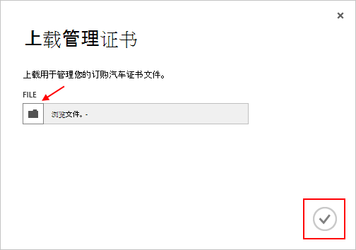

<properties 
    pageTitle="上载了 Azure 管理 API 证书 |Azure Microsoft" 
    description="了解如何上载 Azure 经典门户管理员管理 API 证书。" 
    services="cloud-services" 
    documentationCenter=".net" 
    authors="Thraka" 
    manager="timlt" 
    editor=""/>

<tags 
    ms.service="na" 
    ms.workload="tbd" 
    ms.tgt_pltfrm="na" 
    ms.devlang="na" 
    ms.topic="article" 
    ms.date="04/18/2016"
    ms.author="adegeo"/>

# 上载的 Azure 管理 API 管理证书

管理证书，可以使用提供的 Azure 服务管理 API 进行身份验证。 许多程序和工具 （如 Visual Studio 或 Azure SDK） 将使用这些证明来自动化配置和部署各种 Azure 服务。 **这只适用于 Azure 的传统门户网站**。 

>[AZURE.WARNING] 小心！ 这些类型的证书允许他们可以管理与其关联的订阅通过身份验证的任何人。 

如果您需要它，Azure 证书 （包括创建自签名的证书） 的详细信息是[可用](cloud-services/cloud-services-certs-create.md#what-are-management-certificates)的。

您还可以使用[Azure Active Directory](/services/active-directory/)进行身份验证的客户端代码进行自动化。

## 上载管理证书

一旦您有一个管理证书创建的 （仅使用公钥.cer 文件） 可以将其上载到门户网站。 门户中可用的证书时，匹配 certficiate （私钥） 的任何人都可以通过管理 API 连接和访问的资源相关联的订阅。

1. 登录到[Azure 的传统门户网站](http://manage.windowsazure.com)。

2. 请确保选择您想要将与证书关联的正确订阅。 按右上角的门户网站的**订阅**文本。

    

3. 正确选择的订阅后，按**设置**（您可能需要向下滚动） 入口的左侧。 
    
    

4. 按**管理证书**选项卡。

    
    
5. 按**上载**按钮。

    
    
6. 填写对话框信息，并按完成的**复选标记**。

    

## 下一步行动

现在，您已经与订阅管理证书，可以 （安装本地匹配的证书后） 以编程方式连接到[服务管理 REST API，](https://msdn.microsoft.com/library/azure/mt420159.aspx)并自动化也是与此订阅关联的各种 Azure 资源。 