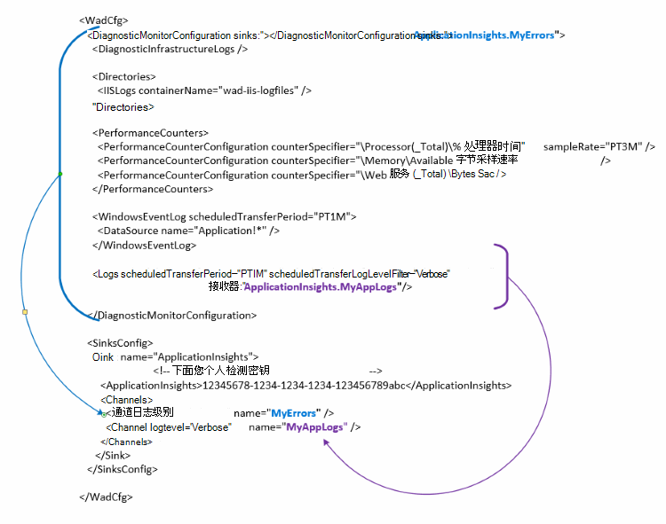

<properties
   pageTitle="配置 Azure 诊断程序将数据发送到应用程序的见解 |Microsoft Azure"
   description="更新公用配置 Azure 诊断程序将数据发送到应用程序的见解。"
   services="multiple"
   documentationCenter=".net"
   authors="sbtron"
   manager="douge"
   editor="" />
<tags
   ms.service="application-insights"
   ms.devlang="na"
   ms.topic="article"
   ms.tgt_pltfrm="na"
   ms.workload="na"
   ms.date="12/15/2015"
   ms.author="saurabh" />

# 配置 Azure 诊断程序将数据发送到应用程序的见解

Azure 诊断存储到 Azure 存储表数据。  但是，也可以所有管道或见解应用于数据的一个子集时使用 Azure 诊断扩展 1.5 或更高版本在您的配置中配置"接收器"和"通道"。

本文介绍如何创建 Azure 诊断程序扩展的公用配置，以便配置为将数据发送到应用程序的见解。

## 作为一个接收器配置应用程序的见解

引入了 Azure 诊断扩展 1.5**<SinksConfig>**中的公用配置元素。 这将定义 Azure 诊断数据可以发送到其他*接收器*。 您可以指定想要发送的这一部分的 Azure 诊断数据的应用程序理解资源的详细信息**<SinksConfig>**。
例如**SinksConfig**外观如下-  

    <SinksConfig>
        <Sink name="ApplicationInsights">
          <ApplicationInsights>{Insert InstrumentationKey}</ApplicationInsights>
          <Channels>
            <Channel logLevel="Error" name="MyTopDiagData"  />
            <Channel logLevel="Verbose" name="MyLogData"  />
          </Channels>
        </Sink>
      </SinksConfig>

**接收器**元素*名称*属性指定一个字符串值，用于唯一地引用到接收器。
**ApplicationInsights**元素指定检测 Azure 诊断数据将发送到应用程序的见解资源键。 如果您没有现有的应用程序理解资源，创建资源时，得到的检测项的详细信息，请参阅[创建新的应用程序理解资源](./application-insights/app-insights-create-new-resource.md)。

如果您要开发 Azure SDK 2.8 的云服务项目打包云服务项目时，根据**APPINSIGHTS_INSTRUMENTATIONKEY**服务配置设置的公用配置中自动填充该项检测。 请参阅[使用应用程序见解与 Azure 云服务的问题进行疑难解答的诊断](./cloud-services/cloud-services-dotnet-diagnostics-applicationinsights.md)。

该**通道**元素可以定义将被发送到接收器的数据的一个或多个**通道**元素。 通道就像一个筛选器，允许您选择特定的日志级别，您可能希望将发送到接收器。 例如可以收集详细的日志并将其发送到存储，但您可以选择定义的错误和通道仅错误日志将被发送到该接收器发送日志的日志级别的通道。
**通道**的*名称*属性用于唯一地引用到该通道。
*日志级别*属性，可以指定将使通道的日志级别。 在订单的最少信息可用的日志级别
 - 详细
 - 信息
 - 警告
 - 错误
 - 关键

## 将数据发送到应用程序的见解接收器
一旦定义应用程序的见解接收器可以将*接收器*属性添加到元素节点下的**DiagnosticMonitorConfiguration**将数据发送到该接收器。 将*接收器*元素添加到每个节点指定您希望从该节点和它发送给指定的接收器下的任何节点收集到的数据。

例如，如果您想要发送 Azure 诊断程序收集到的所有数据然后可以直接对**DiagnosticMonitorConfiguration**节点添加*接收器*属性。 将*接收器*的值设置为在**SinkConfig**中指定的接收器名称。

    <DiagnosticMonitorConfiguration overallQuotaInMB="4096" sinks="ApplicationInsights">

如果您想要发送仅错误日志应用程序深入到水池则可以设置要跟信道名称以句点分隔的接收器名称的*接收器*值 ("。")。 例如，若要将唯一错误日志发送到应用程序的见解接收器使用在 SinksConfig 上面定义了 MyTopDiagdata 通道。  

    <DiagnosticMonitorConfiguration overallQuotaInMB="4096" sinks="ApplicationInsights.MyTopDiagdata">

如果您只想将详细的应用程序日志发送到应用程序的见解会将*接收器*属性添加到**日志**节点。

    <Logs scheduledTransferPeriod="PT1M" scheduledTransferLogLevelFilter="Verbose" sinks="ApplicationInsights.MyLogData"/>

您还可以在层次结构中的不同级别配置包含多个接收器。 在这种情况下指定层次结构的顶层的接收器作为全局设置，另一个在类似于全局设置重写单个元素元素充当指定。    

下面是一个完整的示例应用程序日志 （在**日志**节点指定） 的应用程序 （在**DiagnosticMonitorConfiguration**节点指定） 的见解与此外详细级别记录发送所有错误的公共配置文件。

    <WadCfg>
      <DiagnosticMonitorConfiguration overallQuotaInMB="4096"
           sinks="ApplicationInsights.MyTopDiagData"> <!-- All info below sent to this channel -->
        <DiagnosticInfrastructureLogs />
        <PerformanceCounters>
          <PerformanceCounterConfiguration counterSpecifier="\Processor(_Total)\% Processor Time" sampleRate="PT3M" sinks="ApplicationInsights.MyLogData/>
          <PerformanceCounterConfiguration counterSpecifier="\Memory\Available MBytes" sampleRate="PT3M" />
          <PerformanceCounterConfiguration counterSpecifier="\Web Service(_Total)\Bytes Total/Sec" sampleRate="PT3M" />
        </PerformanceCounters>
        <WindowsEventLog scheduledTransferPeriod="PT1M">
          <DataSource name="Application!*" />
        </WindowsEventLog>
        <Logs scheduledTransferPeriod="PT1M" scheduledTransferLogLevelFilter="Verbose"
                sinks="ApplicationInsights.MyLogData"/> <!-- This specific info sent to this channel -->
      </DiagnosticMonitorConfiguration>

    <SinksConfig>
        <Sink name="ApplicationInsights">
          <ApplicationInsights>{Insert InstrumentationKey}</ApplicationInsights>
          <Channels>
            <Channel logLevel="Error" name="MyTopDiagData"  />
            <Channel logLevel="Verbose" name="MyLogData"  />
          </Channels>
        </Sink>
      </SinksConfig>
    </WadCfg>

有一些限制，要注意使用这一功能

- 通道只能处理日志类型和没有性能计数器。 如果您使用性能计数器元素指定一个通道，它将被忽略。
- 通道的日志级别不能超过 Azure 诊断所收集内容的日志级别。 例如︰ 不能收集应用程序日志中的日志元素的错误并尝试发送详细的日志传输到应用程序分析接收器。 *ScheduledTransferLogLevelFilter*属性始终必须收集相等或更多的日志，这些日志比想要发送到接收器。
- 对应用程序的见解无法发送任何 blob 数据收集由 Azure 诊断程序扩展。 例如任何指定*目录*节点下。 为故障转储实际故障转储仍将发送到 blob 存储，只生成的故障转储的通知将发送到应用程序的见解。

## 下一步行动

- 使用[PowerShell](./cloud-services/cloud-services-diagnostics-powershell.md)启用 Azure 诊断扩展您的应用程序。 
- 使用[Visual Studio](vs-azure-tools-diagnostics-for-cloud-services-and-virtual-machines.md)以启用 Azure 诊断扩展您的应用程序
