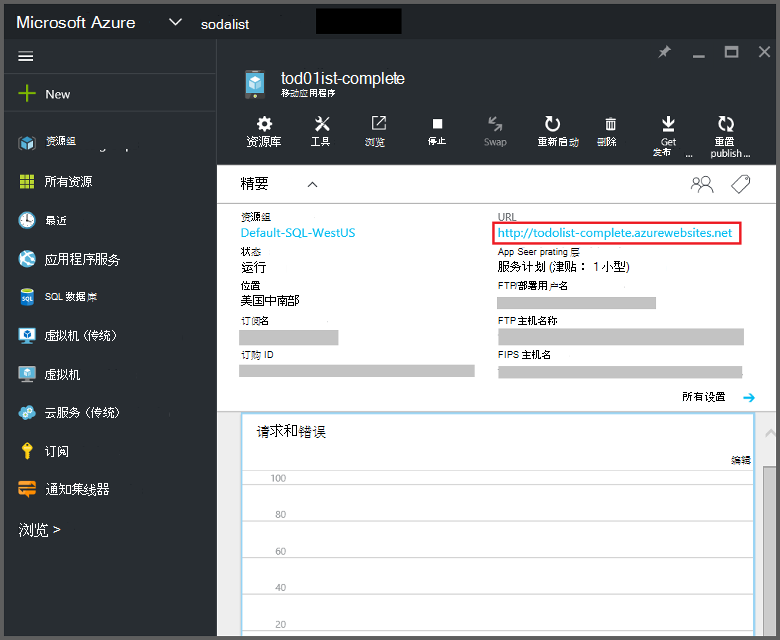

<properties
    pageTitle="Azure 函数移动应用程序绑定 |Microsoft Azure"
    description="了解如何在 Azure 的函数中使用 Azure 移动应用程序绑定。"
    services="functions"
    documentationCenter="na"
    authors="ggailey777"
    manager="erikre"
    editor=""
    tags=""
    keywords="azure 函数，函数、 事件处理、 动态计算、 无服务器体系结构"/>

<tags
    ms.service="functions"
    ms.devlang="multiple"
    ms.topic="reference"
    ms.tgt_pltfrm="multiple"
    ms.workload="na"
    ms.date="08/30/2016"
    ms.author="glenga"/>

# Azure 函数移动应用程序绑定

[AZURE.INCLUDE [functions-selector-bindings](../../includes/functions-selector-bindings.md)]

本文介绍了如何配置和 Azure 函数中的代码 Azure 移动应用程序绑定。 

[AZURE.INCLUDE [intro](../../includes/functions-bindings-intro.md)] 

Azure 应用程序服务移动应用程序可用于表终结点将数据暴露给移动客户端。 此相同的表格格式数据可与这两个输入和输出在 Azure 的函数中的绑定。 因为它支持动态架构，Node.js 后端移动应用程序非常适合于公开与您的函数一起使用的表格数据。 动态架构默认启用的应在生产移动应用程序中禁用。 有关表中 Node.js 后端的终结点的详细信息，请参阅[概述︰ 表操作](../app-service-mobile/app-service-mobile-node-backend-how-to-use-server-sdk.md#TableOperations)。 在移动应用程序，Node.js 后端支持门户中浏览和编辑的表。 有关详细信息，请参阅 Node.js SDK 主题[门户中编辑](../app-service-mobile/app-service-mobile-node-backend-how-to-use-server-sdk.md#in-portal-editing)。 使用 Azure 函数使用.NET 后端移动应用程序时，您必须手动更新数据模型按照您的函数的要求。 有关表中.NET 后端移动应用程序的终结点的详细信息，请参阅[如何︰ 定义一个表格控制器](../app-service-mobile/app-service-mobile-dotnet-backend-how-to-use-server-sdk.md#define-table-controller).NET 后端 SDK 主题中。 

## 为您移动应用程序的后端 URL 创建一个环境变量

移动应用程序绑定当前需要您创建一个环境变量，返回的移动应用程序的后端本身的 URL。 此 URL 可以找[Azure 门户](https://portal.azure.com)中查找您的移动应用程序，然后打开刀片式服务器。

若要将此 URL 设置为一个环境变量函数应用程序中︰

1. 在[Azure 函数入口](https://functions.azure.com/signin)函数应用程序，请单击**函数的应用程序设置** > **转到应用程序服务设置**。 

    

2. 在函数应用程序中，单击**所有设置**、 向下滚动到**应用程序设置**，然后在**应用程序设置**类型下，新**名称**的环境变量、 URL 粘贴**值**，并确保使用 HTTPS 方案，然后都单击**保存**并关闭函数应用程序刀片式服务器返回到功能门户。   

    

在您的绑定，现在可以*连接*的字段设置此新的环境变量。

## 使用安全访问到您的移动应用程序表端点的 API 密钥。

在 Azure 函数中，移动表绑定可以指定可用于防止有害您的函数之外的应用程序访问的共享秘密的 API 密钥。 移动应用程序没有内置的 API 密钥身份验证支持。 但是，可以按照[Azure 应用程序服务移动应用程序的后端实现一个 API 键](https://github.com/Azure/azure-mobile-apps-node/tree/master/samples/api-key)中的示例 Node.js 后端移动应用程序中实现一个 API 键。 同样，可以在[.NET 后端移动应用程序](https://github.com/Azure/azure-mobile-apps-net-server/wiki/Implementing-Application-Key)实现一个 API 键。

>[AZURE.IMPORTANT] 此 API 密钥必须不随您的移动应用程序客户端，它应该仅能安全地分发服务端的客户端，类似 Azure 函数。 

## Azure 的移动应用程序输入绑定

输入的绑定可以加载从动终结点的记录，它直接传递到绑定。 在确定 ID 的记录基于触发器调用该函数。 C# 函数中对记录所做的任何更改自动发送回表中，当函数成功退出。

#### 移动应用程序的输入绑定的 function.json

*Function.json*文件支持以下属性︰

- `name`︰ 在函数代码中使用的新记录变量的名称。
- `type`︰ 候机类型必须设置为*mobileTable*。
- `tableName`︰ 将在其中创建新记录的表。
- `id`︰ 要检索的记录 ID。 此属性支持绑定类似于`{queueTrigger}`，它将使用队列消息的字符串值作为记录 id。
- `apiKey`︰ 指定移动应用程序的可选 API 密钥的应用程序设置的字符串。 当您移动的应用程序使用一个 API 键限制客户端访问，这是必需的。
- `connection`︰ 为应用程序设置中指定的 URL 的移动应用程序端的环境变量的名称的字符串。
- `direction`︰ 绑定方向，必须设置为*中*。

*Function.json*文件的示例︰

    {
      "bindings": [
        {
          "name": "record",
          "type": "mobileTable",
          "tableName": "MyTable",
          "id" : "{queueTrigger}",
          "connection": "My_MobileApp_Url",
          "apiKey": "My_MobileApp_Key",
          "direction": "in"
        }
      ],
      "disabled": false
    }

#### Azure C# 队列触发器的移动应用程序代码示例

基于示例 function.json 上面，从移动应用程序的记录表端点的 ID 匹配的队列消息字符串并将其传递给*记录*参数输入的绑定检索。 当找不到记录时，则此参数为空。 函数退出时，用新的*文本*值然后更新记录。

    #r "Newtonsoft.Json"    
    using Newtonsoft.Json.Linq;
    
    public static void Run(string myQueueItem, JObject record)
    {
        if (record != null)
        {
            record["Text"] = "This has changed.";
        }    
    }

#### Azure Node.js 队列触发器的移动应用程序代码示例

基于示例 function.json 上面，从移动应用程序的记录表端点的 ID 匹配的队列消息字符串并将其传递给*记录*参数输入的绑定检索。 Node.js 函数中已更新的记录不会发送回表。 此代码示例将检索到的记录写入日志。

    module.exports = function (context, input) {    
        context.log(context.bindings.record);
        context.done();
    };

## Azure 的移动应用程序输出绑定

您的函数可以将记录写入使用输出绑定的手机应用程序表终结点。 

#### 移动应用程序的 function.json 输出绑定

Function.json 文件支持以下属性︰

- `name`︰ 在函数代码中使用的新记录变量的名称。
- `type`︰ 必须设置为*mobileTable*的绑定类型。
- `tableName`︰ 在其中创建新记录的表。
- `apiKey`︰ 指定移动应用程序的可选 API 密钥的应用程序设置的字符串。 当您移动的应用程序使用一个 API 键限制客户端访问，这是必需的。
- `connection`︰ 为应用程序设置中指定的 URL 的移动应用程序端的环境变量的名称的字符串。
- `direction`︰ 它必须给*出*设置绑定方向。

示例 function.json:

    {
      "bindings": [
        {
          "name": "record",
          "type": "mobileTable",
          "tableName": "MyTable",
          "connection": "My_MobileApp_Url",
          "apiKey": "My_MobileApp_Key",
          "direction": "out"
        }
      ],
      "disabled": false
    }

#### Azure C# 队列触发器的移动应用程序代码示例

此 C# 代码示例与上面的绑定中指定表中的*文本*属性的移动应用程序表终结点中插入新记录。

    public static void Run(string myQueueItem, out object record)
    {
        record = new {
            Text = $"I'm running in a C# function! {myQueueItem}"
        };
    }

#### Azure Node.js 队列触发器的移动应用程序代码示例

此 Node.js 代码示例与上面的绑定中指定表中的*文本*属性的移动应用程序表终结点中插入新记录。

    module.exports = function (context, input) {
    
        context.bindings.record = {
            text : "I'm running in a Node function! Data: '" + input + "'"
        }   
    
        context.done();
    };

## 下一步行动

[AZURE.INCLUDE [next steps](../../includes/functions-bindings-next-steps.md)]
