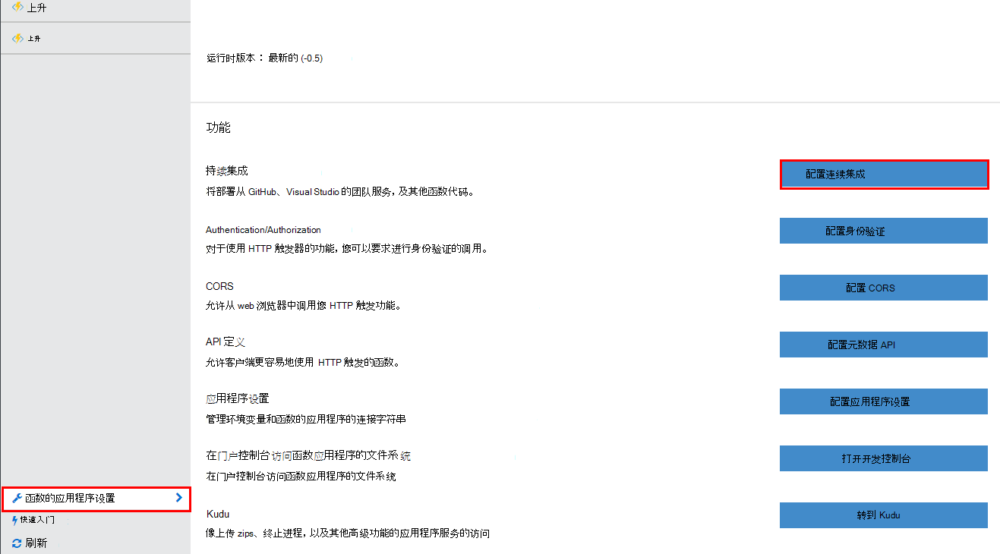
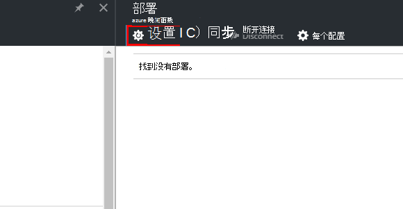
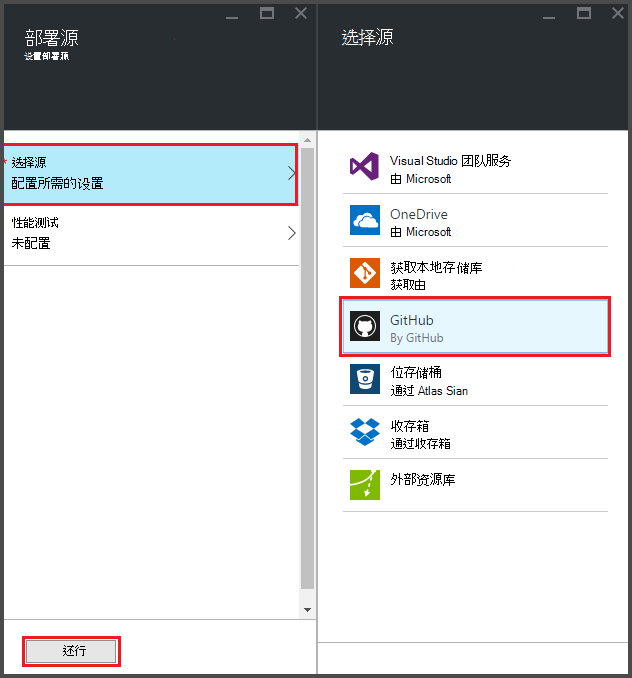
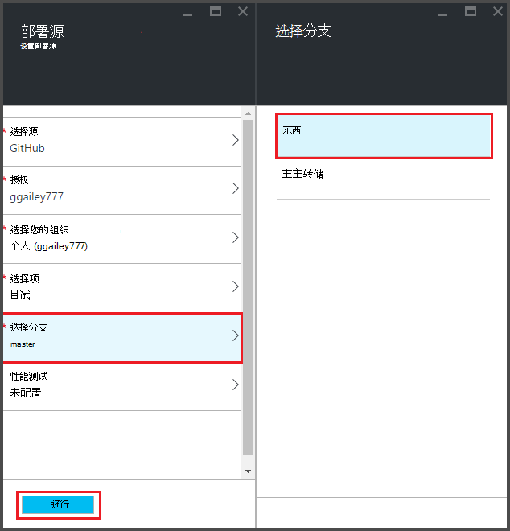
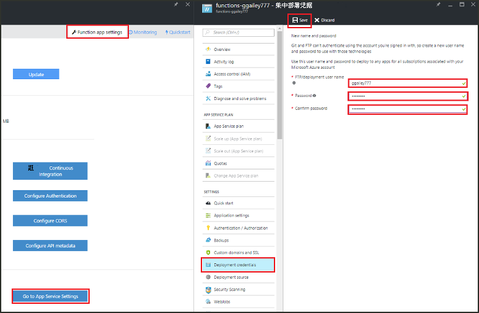
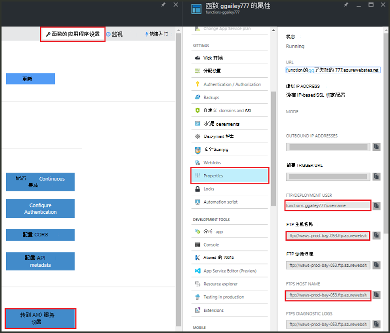
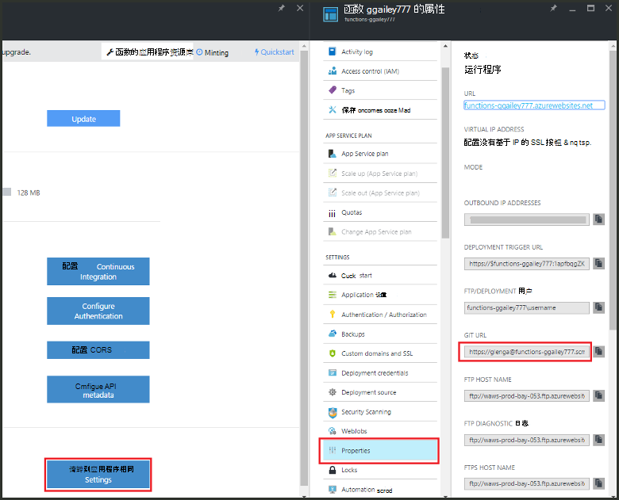

<properties
   pageTitle="Azure 函数的连续部署 |Microsoft Azure"
   description="连续部署设施的 Azure 应用程序服务用于发布 Azure 函数。"
   services="functions"
   documentationCenter="na"
   authors="ggailey777"
   manager="erikre"
   editor=""
   tags=""
   />

<tags
   ms.service="functions"
   ms.devlang="multiple"
   ms.topic="article"
   ms.tgt_pltfrm="multiple"
   ms.workload="na"
   ms.date="09/25/2016"
   ms.author="glenga"/>

# Azure 函数的连续部署 

Azure 的功能很容易配置连续函数的应用程序的部署。 函数利用 Azure 应用程序服务与集成 BitBucket、 收存、 GitHub 和 Visual Studio 团队服务 (VSTS) 启用它们发布到其中一个服务时，Azure 位置提取对函数代码的更新的连续部署工作流。 如果您是新手 Azure 的函数，从开始[Azure 功能概述](functions-overview.md)。

连续部署选项很有用的项目，多和频繁的贡献已被集成。 它还允许您保持对函数代码的源代码。 目前支持下列部署源︰

+ [Bitbucket](https://bitbucket.org/)
+ [收存箱](https://bitbucket.org/)
+ [Git 本地 repo](../app-service-web/app-service-deploy-local-git.md)
+ Git 外部 repo
+ [GitHub]
+ Mercurial 外部 repo
+ [OneDrive](https://onedrive.live.com/)
+ Visual Studio 团队服务

每个函数的应用程序进行配置的部署。 启用连续部署后，对门户中的函数代码访问权限设置为*只读*。

## 连续部署的要求。

您必须配置您部署源和函数代码您设置连续部署之前部署源中。 在给定的函数的应用程序部署中，每个函数的命名子目录中生存之地，有的目录名称的函数的名称。 此文件夹结构是实质上是您的站点代码。 

[AZURE.INCLUDE [functions-folder-structure](../../includes/functions-folder-structure.md)]

## 设置连续部署

使用以下过程来配置对现有函数的应用程序的连续部署︰

1. 在[Azure 函数入口](https://functions.azure.com/signin)函数应用程序，请单击**函数的应用程序设置** > **配置持续集成** > **安装程序**。

    
    
    
    
    也可以转到部署刀片式服务器函数快速入门中通过单击**开始从源代码管理**。

2. 在部署刀片式服务器，单击**选择源**，然后填充您选择的部署的源的信息并单击**确定**。

    

连续部署配置之后，部署源中的所有更改文件都复制到函数的应用程序，并完全的站点部署会触发。 更新源中的文件时，该网站被重新部署。

##部署选项

以下是一些典型的部署方案︰

+ 

###创建临时部署

函数的应用程序还不支持部署插槽。 但是，您仍可以使用持续集成管理单独的临时和生产部署。

配置和使用临时部署的过程通常是这样的︰

1. 在您的订阅、 成品代码和临时创建两个函数的应用程序。 

2. 如果您还没有，创建部署源。 我们将使用[GitHub]。
 
3. 为您生产函数的应用程序，完成上面的步骤中**设置连续部署**并设置部署分支到 GitHub repo 主分支。

    

4. 临时函数应用程序，重复此步骤，但这次在 GitHub repo 选择临时分支。 如果您部署的源不支持分支，使用不同的文件夹。
 
5. 对临时分支或文件夹，在您的代码进行更新，然后验证这些更改将反映在临时部署。

6. 测试完成后，合并更改从临时分支到主分支。 该操作将触发到生产函数的应用程序的部署。 如果您部署的源不支持分支，请使用临时文件夹中的文件覆盖生产文件夹中的文件。

###将现有的功能移至连续的部署

当您具有创建和维护在门户中，您需要下载使用 FTP 将现有函数代码文件或本地 Git 存储库之前您可以设置连续部署，如上面所述的现有功能。 你可以在应用程序服务设置为您函数的应用程序。 下载文件后，可以将它们上载到您选择的连续部署源。

>[AZURE.NOTE]配置持续集成后，您将不再能够编辑源文件中的函数入口。

####如何︰ 配置部署凭据
您可以从函数应用程序下载文件之前，您必须配置您的凭据来访问该站点，您可以从门户中执行此操作。 在函数的应用程序级别设置凭据。

1. 在[Azure 函数入口](https://functions.azure.com/signin)函数应用程序，请单击**函数的应用程序设置** > **转到应用程序服务设置** > **部署凭据**。

    

2. 键入用户名和密码，然后单击**保存**。 您现在可以使用这些凭据从 FTP 或内置的 Git repo 访问函数的应用程序。

####如何︰ 使用 FTP 下载文件

1. 在[Azure 函数入口](https://functions.azure.com/signin)函数应用程序，请单击**函数的应用程序设置** > **转到应用程序服务设置** > **属性**并将值复制用于**FTP/部署用户**、 **FTP 主机名称**和**提取主机名**。  
显示在门户中，为 FTP 服务器提供正确的上下文中包括应用程序名称，则必须输入**FTP/部署用户**。

    
    
2. 从 FTP 客户端，使用连接信息收集连接到您的应用程序和下载您的函数的源文件。

####如何︰ 使用本地 Git 存储库下载文件

1. 在[Azure 函数入口](https://functions.azure.com/signin)函数应用程序，请单击**函数的应用程序设置** > **配置持续集成** > **安装程序**。

2. 在部署刀片式服务器，单击**选择源****本地 Git 存储库**，然后单击**确定**。
 
3. 单击**转到应用程序服务设置** > **属性**和注释 Git URL 的值。 
    
    

4. 克隆 repo 使用 Git 的命令行或您喜爱的 Git 工具在本地计算机上。 Git 克隆命令如下所示︰

        git clone https://username@my-function-app.scm.azurewebsites.net:443/my-function-app.git

5. 回迁文件从您的函数应用程序克隆到本地计算机上，如以下示例所示︰

        git pull origin master

    如果需要，则提供用户名和密码函数的应用程序部署。  

[GitHub]: https://github.com/
