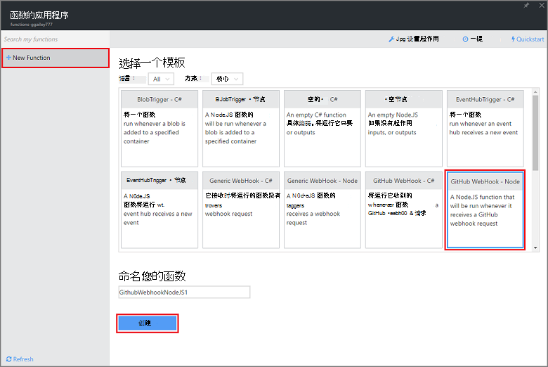

<properties
   pageTitle="创建 web 挂钩或 API Azure 函数 |Microsoft Azure"
   description="使用 Azure 函数，以创建由 WebHook 或 API 调用的函数调用。"
   services="azure-functions"
   documentationCenter="na"
   authors="ggailey777"
   manager="erikre"
   editor=""
   tags=""
   />

<tags
   ms.service="functions"
   ms.devlang="multiple"
   ms.topic="get-started-article"
   ms.tgt_pltfrm="multiple"
   ms.workload="na"
   ms.date="08/30/2016"
   ms.author="glenga"/>
   
# 创建一个 webhook 或 API Azure 函数

Azure 的功能是代码的允许您创建计划或触发单元中多种编程语言实现事件驱动、 按需计算体验。 若要了解有关 Azure 的函数的详细信息，请参阅[Azure 功能概述](functions-overview.md)。

本主题演示如何创建一个新的 Node.js 函数由 GitHub webhook 调用。 基于 Azure 函数入口中预定义的模板创建新的函数。 您还可以观看短片以查看如何在门户中执行这些步骤。

## 观看视频

下面的视频演示如何在本教程中执行的基本步骤 

[AZURE.VIDEO create-a-web-hook-or-api-azure-function]

##从该模板创建一个 webhook 触发的函数

一个函数应用程序承载 Azure 中函数的执行。 您可以创建一个函数之前，您需要有一个活动的 Azure 帐户。 如果您尚没有 Azure 的帐户，[有免费的帐户](https://azure.microsoft.com/free/)。 

1. 转到[Azure 函数入口](https://functions.azure.com/signin)和登录使用 Azure 帐户。

2. 如果您有现有函数应用程序使用，请从**函数应用程序**选择它然后单击**打开**。 若要创建新的函数应用程序，键入新函数应用程序的唯一**名称**或接受的生成的一个，选择您首选的**区域**，然后单击**创建开始 +**。 

3. 在您函数的应用程序，请单击**+ 新函数** > **GitHub Webhook-节点** > **创建**。 这与根据指定的模板的默认名称创建了一个函数。 

     

4. 在**发展**，请注意在**代码**窗口中的 express.js 函数示例。 此函数接受问题评论 webhook GitHub 请求，记录问题文本和发送响应为 webhook `New GitHub comment: <Your issue comment text>`。

     

5. 复制**函数 URL**和**GitHub 密码**值。 在 GitHub 中创建的 webhook 时，您将需要这些。 

6. 向下滚动到**运行**，请注意的问题注释在请求正文中，预定义的 JSON 正文，然后单击**运行**。 
 
    始终可以测试一个新的基于模板的函数提供任何的**开发**选项卡中右预期主体 JSON 数据，然后单击**运行**按钮。 在这种情况下，模板具有预定义的问题注释正文。 
 
接下来，您将创建实际 webhook GitHub 资料库中。

##配置 webhook

1. 在 GitHub 中，导航到存储库，您负责;这包括有分叉的所有资料库。
 
2. 单击**设置** > **Webhooks 和服务** > **添加 webhook**。

       

3. 将函数的 URL 和密钥粘贴到**负载 URL**和**机密**，**用户选择单个事件**，请单击、 选择**问题注释**然后单击**添加 webhook**。

     

此时，GitHub webhook 被配置为添加新问题注释时触发您的函数。  
现在，它将对它进行测试。

##测试功能

1. 在您 GitHub repo，新浏览器窗口中打开**问题**选项卡，单击**新问题**、 键入标题，然后单击**提交新问题**。 您还可以打开一个现有的问题。

2. 此问题，请在键入的注释并单击**批注**。 此时，您可以返回到您在 GitHub 的新 webhook**最近交货**请参阅下发送一个 webhook 请求和响应的正文是`New GitHub comment: <Your issue comment text>`。

3. 在函数入口，向下滚动到日志，请参阅已触发的函数和值`New GitHub comment: <Your issue comment text>`写到日志流。

##下一步行动

这些主题有关 Azure 函数的详细信息，请参阅。

+ [Azure 功能开发人员参考](functions-reference.md)  
程序员编写的函数的引用。
+ [测试 Azure 的函数](functions-test-a-function.md)  
介绍了各种工具和技术来测试您的函数。
+ [如何缩放 Azure 的函数](functions-scale.md)  
讨论了 Azure 功能，包括动态服务计划，以及如何选择正确的规划提供的服务计划。  

[AZURE.INCLUDE [Getting Started Note](../../includes/functions-get-help.md)]
