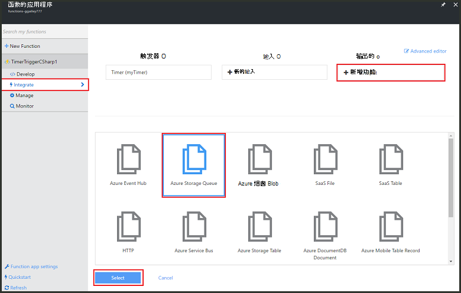
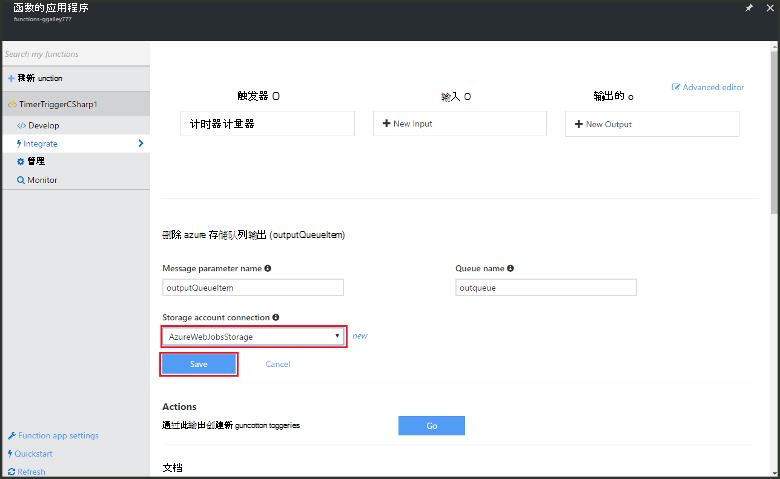

<properties
   pageTitle="创建事件处理函数 |Microsoft Azure"
   description="使用 Azure 函数创建事件计时器运行基于 C# 函数。"
   services="functions"
   documentationCenter="na"
   authors="ggailey777"
   manager="erikre"
   editor=""
   tags=""
   />

<tags
   ms.service="functions"
   ms.devlang="multiple"
   ms.topic="get-started-article"
   ms.tgt_pltfrm="multiple"
   ms.workload="na"
   ms.date="09/25/2016"
   ms.author="glenga"/>
   
# 创建事件处理 Azure 函数

Azure 的功能是代码的允许您创建计划或触发单元中多种编程语言实现事件驱动、 按需计算体验。 若要了解有关 Azure 的函数的详细信息，请参阅[Azure 功能概述](functions-overview.md)。

本主题演示如何在 C# 执行基于事件计时器将消息添加到存储队列中创建一个新函数。 

## 系统必备组件 

您可以创建一个函数之前，您需要有一个活动的 Azure 帐户。 如果您尚没有 Azure 的帐户，[有免费的帐户](https://azure.microsoft.com/free/)。

## 从模板创建的计时器触发的函数

一个函数应用程序承载 Azure 中函数的执行。 您可以创建一个函数之前，您需要有一个活动的 Azure 帐户。 如果您尚没有 Azure 的帐户，[有免费的帐户](https://azure.microsoft.com/free/)。 

1. 转到[Azure 函数入口](https://functions.azure.com/signin)和登录使用 Azure 帐户。

2. 如果您有现有函数应用程序使用，请从**函数应用程序**选择它然后单击**打开**。 若要创建新的函数应用程序，键入新函数应用程序的唯一**名称**或接受的生成的一个，选择您首选的**区域**，然后单击**创建开始 +**。 

3. 在您函数的应用程序，请单击**+ 新函数** > **TimerTrigger-C#** > **创建**。 这与运行在每分钟一次的默认日程安排的默认名称创建了一个函数。 

    

4. 在新函数，请单击**集成**选项卡 >**新的输出** > **Azure 存储队列** > **选择**。

    

5. 在**Azure 存储队列输出**中，选择现有的**存储帐户连接**，或创建一个新的活动，然后单击**保存**。 

    

6. 在**发展**选项卡，用下面的代码替换现有 C# 脚本**代码**窗口中︰

        using System;
        
        public static void Run(TimerInfo myTimer, out string outputQueueItem, TraceWriter log)
        {
            // Add a new scheduled message to the queue.
            outputQueueItem = $"Ping message added to the queue at: {DateTime.Now}.";
            
            // Also write the message to the logs.
            log.Info(outputQueueItem);
        }

    此代码将新消息添加到队列的当前日期和时间函数执行的时间。

7. 单击**保存**并观察下一步的函数执行的**日志**窗口。

8. （可选）导航到存储帐户，并验证消息添加到队列。

9. 返回到**集成**选项卡并更改计划字段为`0 0 * * * *`。 该函数现在运行每隔一小时一次。 

这是一个非常简单的计时器触发器和存储队列的示例输出绑定。 有关详细信息，请参阅[Azure 函数计时器触发](functions-bindings-timer.md)和[Azure 功能触发器和 Azure 存储的绑定](functions-bindings-storage.md)的主题。

##下一步行动

这些主题有关 Azure 函数的详细信息，请参阅。

+ [Azure 功能开发人员参考](functions-reference.md)  
程序员编写函数和触发器和绑定定义的引用。
+ [测试 Azure 的函数](functions-test-a-function.md)  
介绍了各种工具和技术来测试您的函数。
+ [如何缩放 Azure 的函数](functions-scale.md)  
讨论了 Azure 功能，包括动态服务计划，以及如何选择正确的规划提供的服务计划。  

[AZURE.INCLUDE [Getting Started Note](../../includes/functions-get-help.md)]
