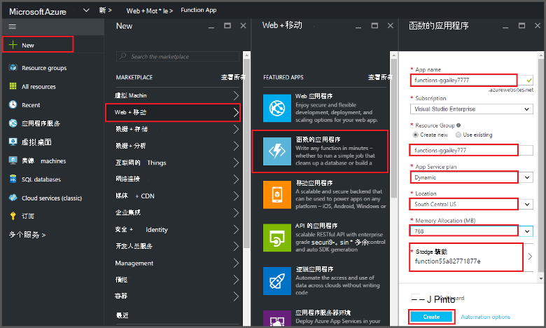
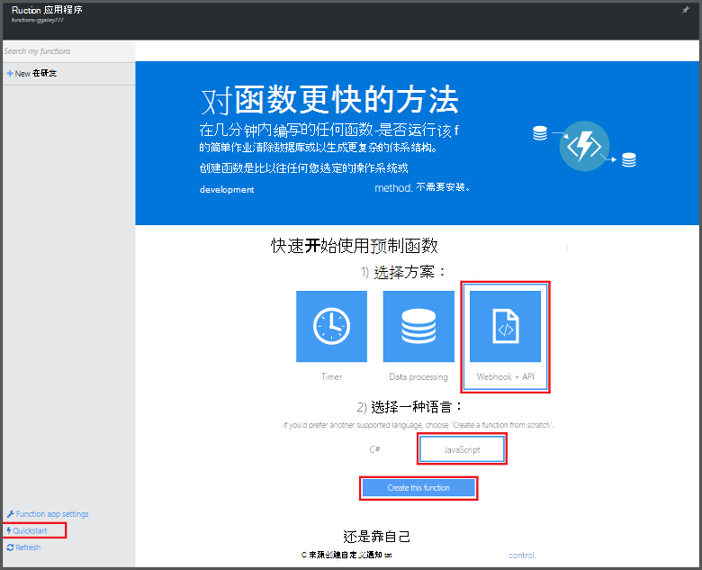
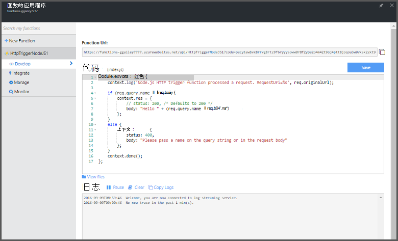

<properties
   pageTitle="从 Azure 门户创建函数 |Microsoft Azure"
   description="构建第一个 Azure 函数，一个无服务器的应用程序，在不到两分钟。"
   services="functions"
   documentationCenter="na"
   authors="ggailey777"
   manager="erikre"
   editor=""
   tags=""
/>

<tags
   ms.service="functions"
   ms.devlang="multiple"
   ms.topic="article"
   ms.tgt_pltfrm="multiple"
   ms.workload="na"
   ms.date="09/08/2016"
   ms.author="glenga"/>

#从 Azure 门户创建函数

##概述
Azure 函数是扩展现有的 Azure 应用程序平台功能，以实现由其他 Azure 服务、 SaaS 产品和内部系统中发生的事件触发的代码与事件驱动、 按需计算体验。 通过 Azure 函数，您的应用程序扩展基于的需求和只支付您使用的资源。 Azure 函数使您可以创建计划或触发单位实现各种编程语言的代码。 若要了解有关 Azure 的函数的详细信息，请参阅[Azure 功能概述](functions-overview.md)。

本主题演示如何使用 Azure 门户网站创建一个简单的"你好世界"通过 HTTP 触发器调用的 Node.js Azure 函数。 可以在 Azure 门户中创建函数之前，必须显式在 Azure 应用程序服务创建函数的应用程序。 若要让自动为您创建该函数应用程序，请参阅[其他 Azure 函数快速入门教程](functions-create-first-azure-function.md)，它是简单的快速入门经验，包括视频。

##创建一个函数的应用程序

一个函数应用程序承载 Azure 中函数的执行。 请按照下列步骤在 Azure 的门户网站中创建函数的应用程序。

您可以创建您的第一个函数之前，您需要有一个活动的 Azure 帐户。 如果您尚没有 Azure 的帐户，[有免费的帐户](https://azure.microsoft.com/free/)。

1. 转到[Azure 的门户网站](https://portal.azure.com)，登录使用 Azure 帐户。

2. 单击**新建 +** > **Web + 移动** > **函数的应用程序**中，选择您的**订阅**，键入唯一的**应用程序名称**，用于标识您函数的应用程序，然后指定下列设置︰

    + **[资源组](../azure-portal/resource-group-portal.md/)**︰ 选择**新建**，然后输入新的资源组的名称。 您还可以选择现有的资源组，但是您可能不能创建函数应用程序的动态应用程序服务计划。
    + **[应用程序服务计划](../app-service/azure-web-sites-web-hosting-plans-in-depth-overview.md)**︰ 选择*动态*或*经典*。 
        + **动态**︰ Azure 函数的默认计划类型。 当您选择一个动态计划时，也必须选择**位置**并设置**内存分配**（以 mb 为单位）。 有关内存分配是如何影响成本，请参阅[Azure 函数定价](https://azure.microsoft.com/pricing/details/functions/)。 
        + **经典**︰ 经典的应用程序服务计划要求您创建**应用程序服务的规划位置**，或选择一个现有。 这些设置决定的[位置功能，成本和计算资源](https://azure.microsoft.com/pricing/details/app-service/)与应用程序相关联。  
    + **存储帐户**︰ 每个函数的应用程序需要的存储帐户。 可以选择现有的存储帐户，也可以创建一个。 

    

3. 单击**创建**配置和部署新函数应用程序。  

现在，配置函数应用程序时，您可以创建您的第一个函数。

## 创建函数

下列步骤创建一个函数从 Azure 函数快速入门。

1. 在**快速启动**选项卡，单击**WebHook + API**和**JavaScript**，然后单击**创建函数**。 创建新的预定义的 Node.js 函数。 

    

2. （可选）此时在快速入门，您可以选择要在门户中快速漫游的 Azure 的函数功能。   一旦您已完成或已跳过该教程，可以通过使用 HTTP 触发器来测试新函数。

##测试功能

由于 Azure 函数快速入门包含功能代码，您可以立即测试新的函数。

1. 在**发展**选项卡，查看**代码**窗口，请注意此 Node.js 代码，需要为邮件正文中或查询字符串中传递的*名称*值的 HTTP 请求。 该函数在运行时，会响应消息中返回此值。

    

2. 向下滚动到**请求正文**文本框中， *name*属性的值更改为您的名称，然后单击**运行**。 您看到某个测试 HTTP 请求将触发执行，信息写入到流的日志中，并在**输出**中显示的"你好"响应。 

3. 触发执行相同的功能，从另一个浏览器窗口或选项卡上，从**发展**选项卡中复制**函数 URL**值并将其粘贴在浏览器地址栏中，然后追加查询字符串值`&name=yourname`并按 enter 键。 相同的信息写入到日志，浏览器将显示为之前的"你好"响应。

##下一步行动

本快速入门演示基本的 HTTP 触发函数非常简单执行。 这些主题有关使用 Azure 函数的强大功能在您的应用程序的详细信息，请参阅。

+ [Azure 功能开发人员参考](functions-reference.md)  
程序员编写函数和触发器和绑定定义的引用。
+ [测试 Azure 的函数](functions-test-a-function.md)  
介绍了各种工具和技术来测试您的函数。
+ [如何缩放 Azure 的函数](functions-scale.md)  
讨论了 Azure 功能，包括动态服务计划，以及如何选择正确的规划提供的服务计划。 
+ [Azure 应用程序服务是什么？](../app-service/app-service-value-prop-what-is.md)  
Azure 函数使用 Azure 应用程序服务平台的核心功能部署、 环境变量和诊断等。 

[AZURE.INCLUDE [Getting Started Note](../../includes/functions-get-help.md)]
