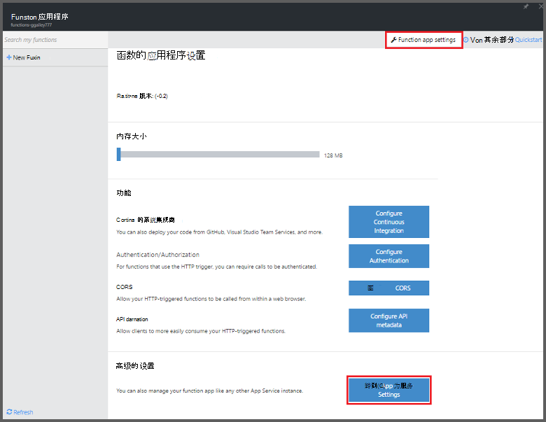
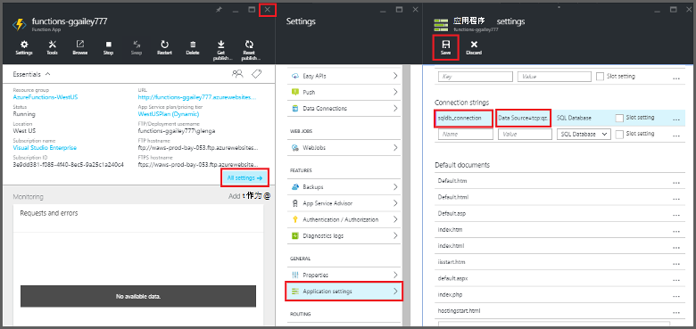
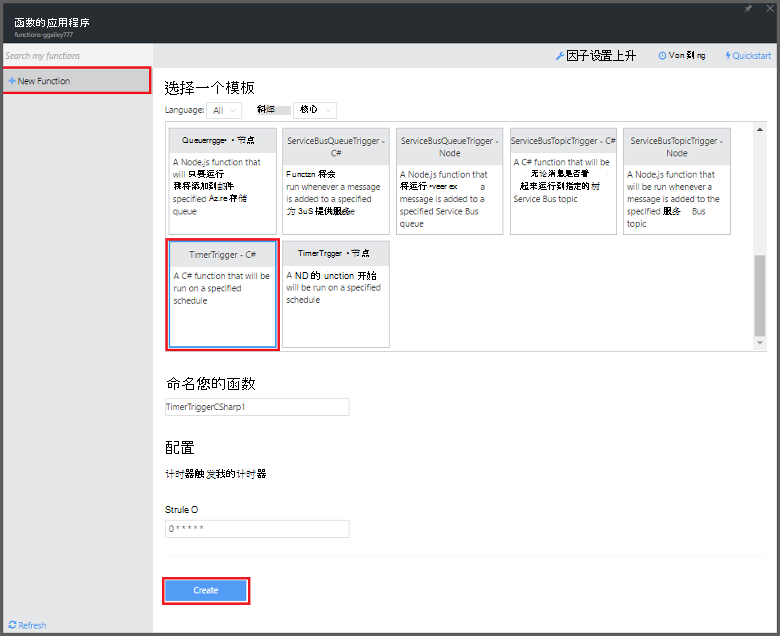

<properties
   pageTitle="使用 Azure 函数执行清理任务计划 |Microsoft Azure"
   description="使用 Azure 函数创建事件计时器运行基于 C# 函数。"
   services="functions"
   documentationCenter="na"
   authors="ggailey777"
   manager="erikre"
   editor=""
   tags=""
   />

<tags
   ms.service="functions"
   ms.devlang="multiple"
   ms.topic="article"
   ms.tgt_pltfrm="multiple"
   ms.workload="na"
   ms.date="09/26/2016"
   ms.author="glenga"/>
   
# 使用 Azure 函数执行清理任务计划

本主题演示如何使用 Azure 函数创建一个新函数，在 C# 上清理事件计时器运行基于数据库表中的行。 基于 Azure 函数入口中预定义的模板创建新的函数。 若要支持此方案，您还必须设置数据库连接字符串作为应用程序服务功能的应用程序中设置。 

## 系统必备组件 

您可以创建一个函数之前，您需要有一个活动的 Azure 帐户。 如果您尚没有 Azure 的帐户，[有免费的帐户](https://azure.microsoft.com/free/)。

本主题演示如何在名为*TodoItems*的 SQL 数据库中的表中执行批量清理操作的事务处理 SQL 命令。 当您完成[Azure 应用程序服务移动应用程序快速入门教程](../app-service-mobile/app-service-mobile-ios-get-started.md)创建此相同的 TodoItems 表。 如果您选择使用一个不同的表，也可以使用示例数据库，您需要修改该命令。

您可以通过移动应用程序端在**所有设置**下，门户中使用的连接字符串 > **应用程序设置** > **连接字符串** > **显示连接字符串值** > **MS_TableConnectionString**。 也可以获取连接字符串直接从 SQL 数据库中**所有**设置的门户 > **属性** > **显示数据库连接字符串** > **ADO.NET （SQL 身份验证）**。

这种情况下使用对数据库执行批量操作。 若要移动应用程序表中您各个函数过程的 CRUD 操作，您应改用移动表绑定。

## 在函数的应用程序中设置 SQL 数据库的连接字符串

一个函数应用程序承载 Azure 中函数的执行。 它是一种最佳做法来存储函数的应用程序设置中的连接字符串和其他机密信息。 当在某处 repo 函数代码末端向上，这样可以防止意外泄漏。 

1. 转到[Azure 函数入口](https://functions.azure.com/signin)和登录使用 Azure 帐户。

2. 如果您有现有函数应用程序使用，请从**函数应用程序**选择它然后单击**打开**。 若要创建新的函数应用程序，键入新函数应用程序的唯一**名称**或接受的生成的一个，选择您首选的**区域**，然后单击**创建开始 +**。 

3. 在您函数的应用程序，请单击**函数的应用程序设置** > **转到应用程序服务设置**。 

    

4. 在函数应用程序中，单击**所有设置**、 滚到**应用程序设置**，然后在**连接字符串**类型下`sqldb_connection`**名**，粘贴**值**的连接字符串，都单击**保存**，然后关闭函数应用程序刀片式服务器返回到功能门户。

    

现在，您可以添加连接到 SQL 数据库的 C# 函数代码。

## 从模板创建的计时器触发的函数

1. 在您函数的应用程序，请单击**+ 新函数** > **TimerTrigger-C#** > **创建**。 这与运行在每分钟一次的默认日程安排的默认名称创建了一个函数。 

    

2. 在**发展**选项卡中的**代码**窗格中，顶部的现有函数代码中添加以下程序集引用︰

        #r "System.Configuration"
        #r "System.Data"

3. 添加以下`using`函数语句︰

        using System.Configuration;
        using System.Data.SqlClient;
        using System.Threading.Tasks; 

4. 用以下代码替换现有的**Run**函数︰

        public static async Task Run(TimerInfo myTimer, TraceWriter log)
        {
            var str = ConfigurationManager.ConnectionStrings["sqldb_connection"].ConnectionString;
            using (SqlConnection conn = new SqlConnection(str))
            {
                conn.Open();
                var text = "DELETE from dbo.TodoItems WHERE Complete='True'";
                using (SqlCommand cmd = new SqlCommand(text, conn))
                {
                    // Execute the command and log the # rows deleted.
                    var rows = await cmd.ExecuteNonQueryAsync();
                    log.Info($"{rows} rows were deleted");
                }
            }
        }

5. 单击**保存**，观看的下一步的函数执行的**日志**窗口，然后注意从 TodoItems 表中删除的行数。

6. （可选）使用[移动应用程序快速启动应用程序](../app-service-mobile/app-service-mobile-ios-get-started.md)时，将标记其他项目"完成"返回到**日志**窗口中以及在下一步的执行过程中由该函数删除监视相同的行数。 

##下一步行动

这些主题有关 Azure 函数的详细信息，请参阅。

+ [Azure 功能开发人员参考](functions-reference.md)  
程序员编写函数和触发器和绑定定义的引用。
+ [测试 Azure 的函数](functions-test-a-function.md)  
介绍了各种工具和技术来测试您的函数。
+ [如何缩放 Azure 的函数](functions-scale.md)  
讨论了 Azure 功能，包括动态服务计划，以及如何选择正确的规划提供的服务计划。  

[AZURE.INCLUDE [Getting Started Note](../../includes/functions-get-help.md)]