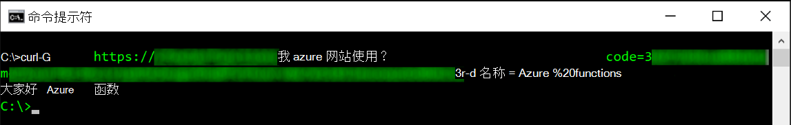
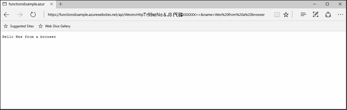
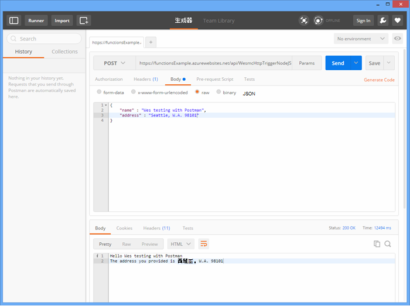
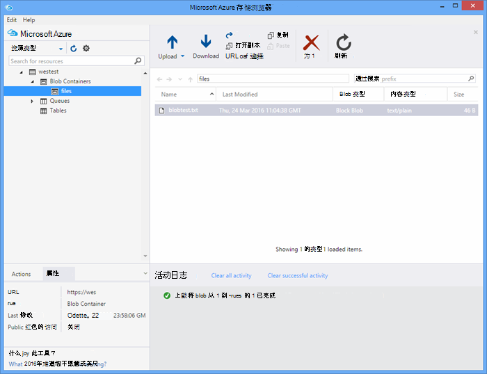

<properties
   pageTitle="测试 Azure 函数 |Microsoft Azure"
   description="测试使用把邮递员弄、 卷曲和 Node.js Azure 函数。"
   services="functions"
   documentationCenter="na"
   authors="wesmc7777"
   manager="erikre"
   editor=""
   tags=""
   keywords="azure 函数、 函数、 事件处理、 webhooks、 动态计算、 无服务器体系结构中，测试"/>

<tags
   ms.service="functions"
   ms.devlang="multiple"
   ms.topic="article"
   ms.tgt_pltfrm="multiple"
   ms.workload="na"
   ms.date="08/19/2016"
   ms.author="wesmc"/>

# 测试 Azure 的函数

## 概述

在本教程中，我们将面临不同的方法对测试函数。 我们将定义一个 http 触发器函数，接受输入，通过查询字符串参数或请求正文。 默认的**HttpTrigger Node.js 函数**模板代码支持`name`查询字符串参数。 我们还将添加代码以支持该参数后的沿`address`请求主体中的用户信息。

## 创建用于测试的函数

对于本教程中的大多数，我们将使用**HttpTrigger Nodejs 函数**模板创建新函数时，可用的稍微修改后的版本。  如果您需要创建一个新函数的帮助，可以查看[创建您的第一个 Azure 函数教程](functions-create-first-azure-function.md)。  在[Azure 门户网站]中创建测试函数时，只需选择**HttpTrigger Nodejs 函数**模板。

默认函数模板基本上是你好世界函数将回显请求正文或查询字符串参数，从名称`name=<your name>`。  我们将更新还允许您提供的名称和地址作为 JSON 请求主体中的内容的代码。 然后该函数将回显这些回客户端时可用。   

用下面的代码进行测试，我们将使用该更新函数︰

    module.exports = function(context, req) {
        context.log("Node.js HTTP trigger function processed a request. RequestUri=%s", req.originalUrl);
        context.log("Request Headers = " + JSON.stringify(req.headers));    
    
        if (req.query.name || (req.body && req.body.name)) {
            if (typeof req.query.name != "undefined") {
                context.log("Name was provided as a query string param..."); 
                ProcessNewUserInformation(context, req.query.name);
            }
            else {
                context.log("Processing user info from request body..."); 
                ProcessNewUserInformation(context, req.body.name, req.body.address);
            }
        }
        else {
            context.res = {
                status: 400,
                body: "Please pass a name on the query string or in the request body"
            };
        }
        context.done();
    };
    
    function ProcessNewUserInformation(context, name, address)
    {    
        context.log("Processing User Information...");            
        context.log("name = " + name);            
        echoString = "Hello " + name;
        
        if (typeof address != "undefined")
        {
            echoString += "\n" + "The address you provided is " + address;
            context.log("address = " + address);            
        }
        
        context.res = {
                // status: 200, /* Defaults to 200 */
                body: echoString
            };
    }

## 测试工具使用的函数

### 带曲线测试

通常在测试软件时，不需要任何进一步比命令行帮助调试应用程序的外观，这是没有什么不同的函数。

若要测试上面的函数，请从门户复制**函数 Url** 。 它将具有以下形式︰ 

    https://<Your Function App>.azurewebsites.net/api/<Your Function Name>?code=<your access code>
    
这是一个 Url，触发的函数，我们可以通过在命令行上使用 cURL 命令以获取测试这 (`-G`或`--get`) 请求与我们的函数︰

    curl -G https://<Your Function App>.azurewebsites.net/api/<Your Function Name>?code=<your access code>
    
此特定示例中上述要求可以作为数据传递查询字符串参数 (`-d`) 在 cURL 命令︰

    curl -G https://<Your Function App>.azurewebsites.net/api/<Your Function Name>?code=<your access code> -d name=<Enter a name here>
    
点击输入，您将在命令行上看到函数的输出。

在门户的**日志**窗口中，执行函数时记录与下面类似的输出︰

    2016-04-05T21:55:09  Welcome, you are now connected to log-streaming service.
    2016-04-05T21:55:30.738 Function started (Id=ae6955da-29db-401a-b706-482fcd1b8f7a)
    2016-04-05T21:55:30.738 Node.js HTTP trigger function processed a request. RequestUri=https://functionsExample.azurewebsites.net/api/HttpTriggerNodeJS1?code=XXXXXXX&name=Azure Functions
    2016-04-05T21:55:30.738 Function completed (Success, Id=ae6955da-29db-401a-b706-482fcd1b8f7a)

### 使用浏览器进行测试

函数不需要参数，或只需要查询字符串参数，可以使用浏览器进行测试。

若要测试我们上面定义的函数，请从门户复制**函数 Url** 。 它将具有以下形式︰

    https://<Your Function App>.azurewebsites.net/api/<Your Function Name>?code=<your access code>

追加`name`查询字符串参数，如下所示，使用的实际名称`<Enter a name here>`占位符。

    https://<Your Function App>.azurewebsites.net/api/<Your Function Name>?code=<your access code>&name=<Enter a name here>

将该 URL 粘贴到您的浏览器，并应获得响应类似于以下。

在门户的**日志**窗口中，执行函数时记录与下面类似的输出︰

    2016-03-23T07:34:59  Welcome, you are now connected to log-streaming service.
    2016-03-23T07:35:09.195 Function started (Id=61a8c5a9-5e44-4da0-909d-91d293f20445)
    2016-03-23T07:35:10.338 Node.js HTTP trigger function processed a request. RequestUri=https://functionsExample.azurewebsites.net/api/WesmcHttpTriggerNodeJS1?code=XXXXXXXXXX==&name=Wes from a browser
    2016-03-23T07:35:10.338 Request Headers = {"cache-control":"max-age=0","connection":"Keep-Alive","accept":"text/html","accept-encoding":"gzip","accept-language":"en-US"}
    2016-03-23T07:35:10.338 Name was provided as a query string param.
    2016-03-23T07:35:10.338 Processing User Information...
    2016-03-23T07:35:10.369 Function completed (Success, Id=61a8c5a9-5e44-4da0-909d-91d293f20445)

### 测试把邮递员弄

推荐的工具来测试您的函数中的大多数是把邮递员弄。 若要安装把邮递员弄，请参阅[获取把邮递员弄](https://www.getpostman.com/)。 把邮递员弄提供了对 HTTP 请求的更多特性的控制。

> [AZURE.TIP] 使用其他客户端您是舒适。 下面是一些把邮递员弄的替代方法︰  
> 
> * [Fiddler](http://www.telerik.com/fiddler)  
> * [爪](https://luckymarmot.com/paw)  

若要测试中把邮递员弄请求正文的函数︰ 

1. 从角的 Chrome 浏览器窗口的左上角中的**应用程序**按钮启动把邮递员弄。
2. 复制**函数的 Url**并将其粘贴到把邮递员弄。 它包括访问代码查询字符串参数。
3. 改**后**的 HTTP 方法。
4. 单击**正文** > **原始**和添加 JSON 请求正文与以下内容类似︰

        {
            "name" : "Wes testing with Postman",
            "address" : "Seattle, W.A. 98101"
        }

5. 单击**发送**。

下图显示了在本教程中测试简单的回显函数的示例。 

在门户的**日志**窗口中，执行函数时记录与下面类似的输出︰

    2016-03-23T08:04:51  Welcome, you are now connected to log-streaming service.
    2016-03-23T08:04:57.107 Function started (Id=dc5db8b1-6f1c-4117-b5c4-f6b602d538f7)
    2016-03-23T08:04:57.763 Node.js HTTP trigger function processed a request. RequestUri=https://functions841def78.azurewebsites.net/api/WesmcHttpTriggerNodeJS1?code=XXXXXXXXXX==
    2016-03-23T08:04:57.763 Request Headers = {"cache-control":"no-cache","connection":"Keep-Alive","accept":"*/*","accept-encoding":"gzip","accept-language":"en-US"}
    2016-03-23T08:04:57.763 Processing user info from request body...
    2016-03-23T08:04:57.763 Processing User Information...
    2016-03-23T08:04:57.763 name = Wes testing with Postman
    2016-03-23T08:04:57.763 address = Seattle, W.A. 98101
    2016-03-23T08:04:57.795 Function completed (Success, Id=dc5db8b1-6f1c-4117-b5c4-f6b602d538f7)
    
### 测试 blob 触发器使用存储浏览器

可以使用[Microsoft Azure 存储资源管理器中](http://storageexplorer.com/)的 blob 触发器函数进行测试。

1. 在[Azure 门户网站]为您的函数的应用程序，创建新的 C#、 F# 或节点 blob 触发器函数。 设置监视到 blob 容器的名称的路径。 例如︰

        files

2. 单击**+**按钮选择或创建您想要使用的存储帐户。 然后单击**创建**。

3. 创建一个文本文件，包含以下文本并将其保存︰

        A text file for blob trigger function testing.

4. 运行[Microsoft Azure 存储浏览器](http://storageexplorer.com/)并连接到被监视的存储帐户中的 blob 容器。

5. 单击**上载**按钮并上传文字文件。

    

    默认 blob 触发器函数代码将报告日志中的 blob 的处理︰

        2016-03-24T11:30:10  Welcome, you are now connected to log-streaming service.
        2016-03-24T11:30:34.472 Function started (Id=739ebc07-ff9e-4ec4-a444-e479cec2e460)
        2016-03-24T11:30:34.472 C# Blob trigger function processed: A text file for blob trigger function testing.
        2016-03-24T11:30:34.472 Function completed (Success, Id=739ebc07-ff9e-4ec4-a444-e479cec2e460)

## 测试中的函数的函数

### 使用运行按钮的功能门户进行测试

门户网站提供了一个**运行**按钮，这将允许您进行一些有限的测试。 您可以请求正文使用运行按钮，但不是能提供的查询字符串参数或更新请求标头。

测试我们前面创建的**请求正文**字段中添加类似于下面的 JSON 字符串的 HTTP 触发器函数，然后单击**运行**按钮。

    {
        "name" : "Wes testing Run button",
        "address" : "USA"
    } 

在门户的**日志**窗口中，执行函数时记录与下面类似的输出︰

    2016-03-23T08:03:12  Welcome, you are now connected to log-streaming service.
    2016-03-23T08:03:17.357 Function started (Id=753a01b0-45a8-4125-a030-3ad543a89409)
    2016-03-23T08:03:18.697 Node.js HTTP trigger function processed a request. RequestUri=https://functions841def78.azurewebsites.net/api/wesmchttptriggernodejs1
    2016-03-23T08:03:18.697 Request Headers = {"connection":"Keep-Alive","accept":"*/*","accept-encoding":"gzip","accept-language":"en-US"}
    2016-03-23T08:03:18.697 Processing user info from request body...
    2016-03-23T08:03:18.697 Processing User Information...
    2016-03-23T08:03:18.697 name = Wes testing Run button
    2016-03-23T08:03:18.697 address = USA
    2016-03-23T08:03:18.744 Function completed (Success, Id=753a01b0-45a8-4125-a030-3ad543a89409)

### 使用计时器触发测试

某些函数，不能真正测试与上文所述的工具。 例如，一个队列触发器函数，运行时消息被放入[Azure 队列存储](../storage/storage-dotnet-how-to-use-queues.md)。 您始终可以编写代码来放到队列的消息，下面提供了在一个控制台项目的一个例子。 但是，还有另一种方法，可用于直接与功能测试。  

您可以使用配置的队列计时器触发输出绑定。 该计时器触发代码然后无法写入队列的测试消息。 本部分将逐步一个示例。 

在绑定中使用 Azure 函数的更多详细信息，请参阅[Azure 功能开发人员参考](functions-reference.md)。 

#### 创建用于测试队列触发器

为了说明这种方法，我们将首先创建一个队列触发器函数，我们想要测试队列名为`queue-newusers`。 此函数将处理放到 Azure 队列存储的新用户的名称和地址信息。 

> [AZURE.NOTE] 如果您使用不同的队列名称，请确保您使用的名称符合[命名队列和元数据](https://msdn.microsoft.com/library/dd179349.aspx)的规则。  否则，您将获得一个 HTTP 状态代码 400︰ 错误的请求。 

1. 在[Azure 门户网站]为您的函数的应用程序，单击**新函数** > **QueueTrigger-C#**。
2. 输入要监视的队列函数的队列名称 

        queue-newusers 

3. 单击**+**（添加） 按钮，以选择或创建您想要使用的存储帐户。 然后单击**创建**。
4. 保持打开以便您可以监视日志条目的默认队列函数模板代码此门户的浏览器窗口。

#### 创建计时器触发器要删除队列中的消息

1. 在新的浏览器窗口中打开[Azure 门户]并导航到您函数的应用程序。
2. 单击**新函数** > **TimerTrigger-C#**。 输入一个 cron 表达式来设置时间间隔计时器代码将执行测试队列函数。 然后单击**创建**。 如果您想要运行每隔 30 秒的测试可以使用[CRON 表达式](https://wikipedia.org/wiki/Cron#CRON_expression)如下︰

        */30 * * * * *

2. 单击新计时器触发器的**集成**选项卡。
3. 在**输出**中，单击**+ 新输出**按钮。 然后单击**队列**和**选择**按钮。
4. 请注意所使用的名称的**队列消息对象**您将使用此计时器函数代码中。

        myQueue

4. 输入的队列名称会发送该邮件的位置︰ 

        queue-newusers 

3. 单击**+**（添加） 按钮，以选择队列触发器与以前使用的存储帐户。 然后单击**保存**。
4. 单击计时器触发的**开发**选项卡。
5. 只要使用相同的队列消息对象名称如上所示，可以使用下面的代码为 C# 计时器功能。 然后单击**保存**

        using System;
        
        public static void Run(TimerInfo myTimer, out String myQueue, TraceWriter log)
        {
            String newUser = 
            "{\"name\":\"User testing from C# timer function\",\"address\":\"XYZ\"}";
        
            log.Verbose($"C# Timer trigger function executed at: {DateTime.Now}");   
            log.Verbose($"{newUser}");   
            
            myQueue = newUser;
        }

此时 C# 计时器函数将执行每隔 30 秒，如果您使用示例 cron 表达式。 计时器功能的日志将报告每个执行︰

    2016-03-24T10:27:02  Welcome, you are now connected to log-streaming service.
    2016-03-24T10:27:30.004 Function started (Id=04061790-974f-4043-b851-48bd4ac424d1)
    2016-03-24T10:27:30.004 C# Timer trigger function executed at: 3/24/2016 10:27:30 AM
    2016-03-24T10:27:30.004 {"name":"User testing from C# timer function","address":"XYZ"}
    2016-03-24T10:27:30.004 Function completed (Success, Id=04061790-974f-4043-b851-48bd4ac424d1)

在队列函数浏览器窗口中，您将看到正在处理的每个消息︰

    2016-03-24T10:27:06  Welcome, you are now connected to log-streaming service.
    2016-03-24T10:27:30.607 Function started (Id=e304450c-ff48-44dc-ba2e-1df7209a9d22)
    2016-03-24T10:27:30.607 C# Queue trigger function processed: {"name":"User testing from C# timer function","address":"XYZ"}
    2016-03-24T10:27:30.607 Function completed (Success, Id=e304450c-ff48-44dc-ba2e-1df7209a9d22)
    
## 测试代码的函数

### 测试代码的 HTTP 触发器函数︰ Node.js

您可以使用 Node.js 代码来执行测试 Azure 函数的 http 请求。 

请务必设置︰

- `host`在到函数应用程序主机的请求选项
- 您在中的函数名称`path`。
- 您的访问代码 (`<your code>`) 在`path`。

代码示例︰

    var http = require("http");
    
    var nameQueryString = "name=Wes%20Query%20String%20Test%20From%20Node.js";
    
    var nameBodyJSON = {
        name : "Wes testing with Node.JS code",
        address : "Dallas, T.X. 75201"
    };
    
    var bodyString = JSON.stringify(nameBodyJSON);
    
    var options = {
      host: "functions841def78.azurewebsites.net",
      //path: "/api/HttpTriggerNodeJS2?code=sc1wt62opn7k9buhrm8jpds4ikxvvj42m5ojdt0p91lz5jnhfr2c74ipoujyq26wab3wk5gkfbt9&" + nameQueryString,
      path: "/api/HttpTriggerNodeJS2?code=sc1wt62opn7k9buhrm8jpds4ikxvvj42m5ojdt0p91lz5jnhfr2c74ipoujyq26wab3wk5gkfbt9",
      method: "POST",
      headers : {
          "Content-Type":"application/json",
          "Content-Length": Buffer.byteLength(bodyString)
        }    
    };
    
    callback = function(response) {
      var str = ""
      response.on("data", function (chunk) {
        str += chunk;
      });
    
      response.on("end", function () {
        console.log(str);
      });
    }
    
    var req = http.request(options, callback);
    console.log("*** Sending name and address in body ***");
    console.log(bodyString);
    req.end(bodyString);

输出︰

    C:\Users\Wesley\testing\Node.js>node testHttpTriggerExample.js
    *** Sending name and address in body ***
    {"name" : "Wes testing with Node.JS code","address" : "Dallas, T.X. 75201"}
    Hello Wes testing with Node.JS code
    The address you provided is Dallas, T.X. 75201
        
在门户的**日志**窗口中，执行函数时记录与下面类似的输出︰

    2016-03-23T08:08:55  Welcome, you are now connected to log-streaming service.
    2016-03-23T08:08:59.736 Function started (Id=607b891c-08a1-427f-910c-af64ae4f7f9c)
    2016-03-23T08:09:01.153 Node.js HTTP trigger function processed a request. RequestUri=http://functionsExample.azurewebsites.net/api/WesmcHttpTriggerNodeJS1/?code=XXXXXXXXXX==
    2016-03-23T08:09:01.153 Request Headers = {"connection":"Keep-Alive","host":"functionsExample.azurewebsites.net"}
    2016-03-23T08:09:01.153 Name not provided as query string param. Checking body...
    2016-03-23T08:09:01.153 Request Body Type = object
    2016-03-23T08:09:01.153 Request Body = [object Object]
    2016-03-23T08:09:01.153 Processing User Information...
    2016-03-23T08:09:01.215 Function completed (Success, Id=607b891c-08a1-427f-910c-af64ae4f7f9c)
    

### 测试队列触发器函数的代码︰ C# #

我们前面提到过您无法测试通过使用代码要删除队列中的消息队列触发器。 下面的代码示例基于[Azure 队列存储入门](../storage/storage-dotnet-how-to-use-queues.md)教程中介绍的 C# 代码。 其他语言的代码还会显示该链接。

在控制台应用程序中，您必须测试这段代码︰

- [配置在 app.config 文件中存储连接字符串](../storage/storage-dotnet-how-to-use-queues.md#setup-a-storage-connection-string)。
- 这段代码接受的名称和地址的新用户的命令行参数在运行时。 通过`name`和`address`用作应用程序的参数。 例如，`C:\myQueueConsoleApp\test.exe "Wes testing queues" "in a console app"`

C# 的示例代码︰

    static void Main(string[] args)
    {
        string name = null;
        string address = null;
        string queueName = "queue-newusers";
        string JSON = null;

        if (args.Length > 0)
        {
            name = args[0];
        }
        if (args.Length > 1)
        {
            address = args[1];
        }

        // Retrieve storage account from connection string
        CloudStorageAccount storageAccount = CloudStorageAccount.Parse(ConfigurationManager.AppSettings["StorageConnectionString"]);

        // Create the queue client
        CloudQueueClient queueClient = storageAccount.CreateCloudQueueClient();

        // Retrieve a reference to a queue
        CloudQueue queue = queueClient.GetQueueReference(queueName);

        // Create the queue if it doesn't already exist
        queue.CreateIfNotExists();

        // Create a message and add it to the queue.
        if (name != null)
        {
            if (address != null)
                JSON = String.Format("{{\"name\":\"{0}\",\"address\":\"{1}\"}}", name, address);
            else
                JSON = String.Format("{{\"name\":\"{0}\"}}", name);
        }

        Console.WriteLine("Adding message to " + queueName + "...");
        Console.WriteLine(JSON);

        CloudQueueMessage message = new CloudQueueMessage(JSON);
        queue.AddMessage(message);
    }

在队列函数浏览器窗口中，您将看到正在处理的每个消息︰

    2016-03-24T10:27:06  Welcome, you are now connected to log-streaming service.
    2016-03-24T10:27:30.607 Function started (Id=e304450c-ff48-44dc-ba2e-1df7209a9d22)
    2016-03-24T10:27:30.607 C# Queue trigger function processed: {"name":"Wes testing queues","address":"in a console app"}
    2016-03-24T10:27:30.607 Function completed (Success, Id=e304450c-ff48-44dc-ba2e-1df7209a9d22)

<!-- URLs. -->

[Azure 门户]: https://portal.azure.com
