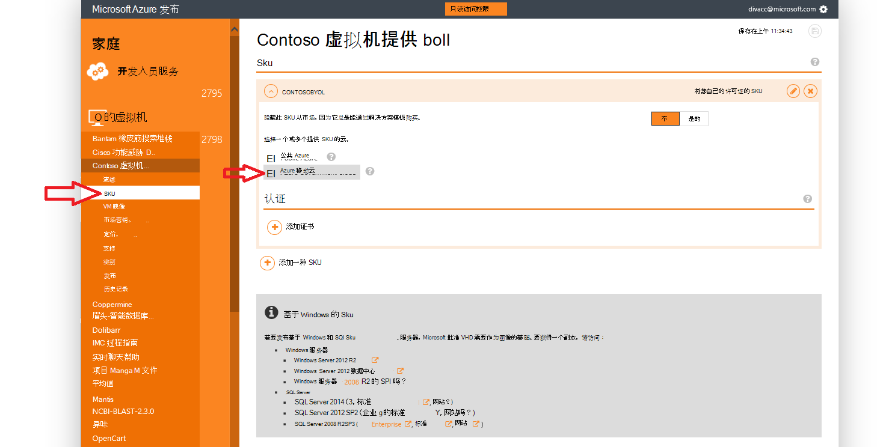
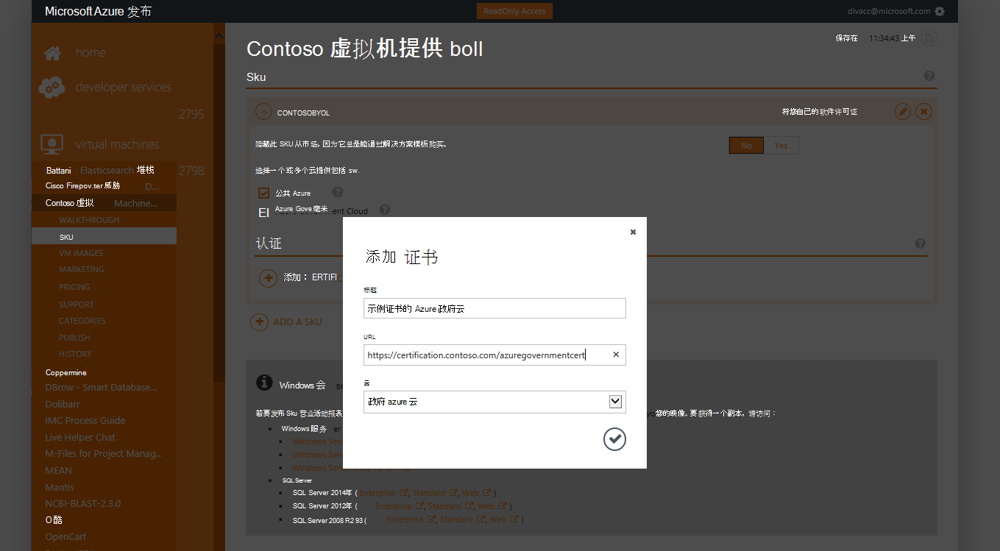
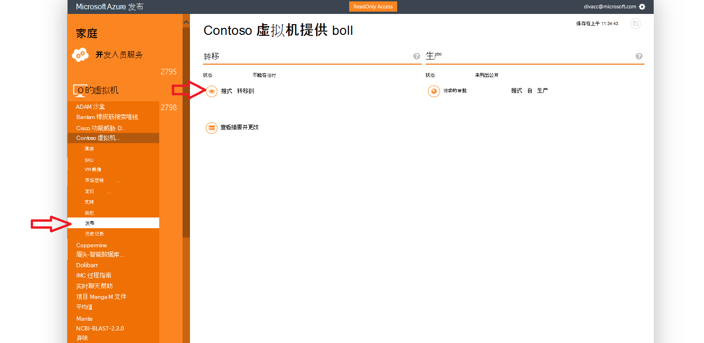
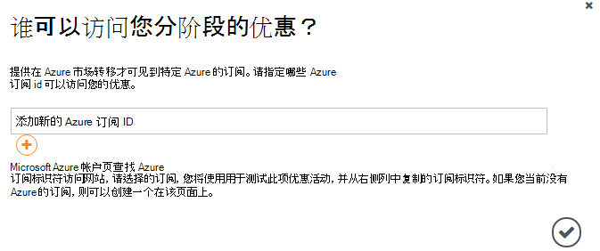
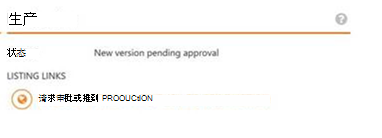

<properties
            pageTitle="Azure 政府文档 |Microsoft Azure"
            description="这为 Azure 政府开发应用程序提供功能和指导的比较。"
            services="Azure-Government"
            cloud="gov"
            documentationCenter=""
            authors="tsingh"
            manager="asimm"
            editor=""/>
 
<tags    ms.service="multiple"
            ms.devlang="na"
            ms.topic="article"
            ms.tgt_pltfrm="na"
            ms.workload="azure-government"
            ms.date="10/20/2016"
            ms.author="zakramer;tsingh;divacc"/> 

# Azure 政府市场
对于那些希望将您提供的内容发布到 Azure 市场的政府，发现下面的详细信息。

## 发布
>[AZURE.NOTE] 如果您不是现有的 Azure 认证市场合作伙伴，请完成步骤[这里](../marketplace-publishing/marketplace-publishing-getting-started.md)之前。

### 第 1 步  
登录到[https://publish.windowsazure.com](https://publish.windowsazure.com)

### 第 2 步
单击您想要发布的报价

### 第 3 步
单击**SKU** ，单击 Azure 政府云框

>[AZURE.NOTE] 仅将您自己的许可证 (BYOL) Sku 都受支持。  此选项不可用于即付即用 (PayG) 的 Sku。

### 第 4 步
单击 + 添加证书链接，将链接添加到您的服务的任何证书。

### 第 5 步
申请中 Microsoft Azure 政府云的试用帐户使您能够发布门户中测试映像︰ [https://azuregov.microsoft.com/trial/azuregovtrial](https://azuregov.microsoft.com/trial/azuregovtrial)

作为合作伙伴，是美国联邦、 州、 局部或部族的实体进行验证和确认，将通过电子邮件提供者的资格。  将提供您试用帐户内为 3-5 个工作日。

### 第 6 步
单击发布，然后单击推到暂存。 

系统将提示您输入有权分阶段提供的白名单预订。 输入您新收购的 Azure 政府试用帐户订阅 ID。

### 第 7 步
一旦成功转移此项优惠活动，可以登录到[https://portal.azure.us](https://portal.azure.us)使用 Azure 政府试用帐户来测试您的图像。

### 第 8 步
一旦有验证映像使用试用订阅，可以使此项优惠活动实况通过单击发布和请求批准进入生产。 

## 下一步行动

有关的补充信息和更新，订阅[Microsoft Azure 的政府博客](https://blogs.msdn.microsoft.com/azuregov/)。
