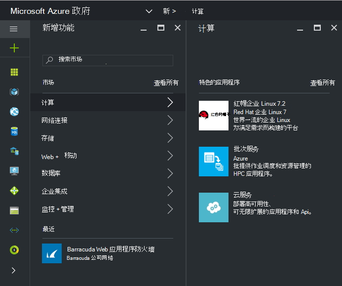
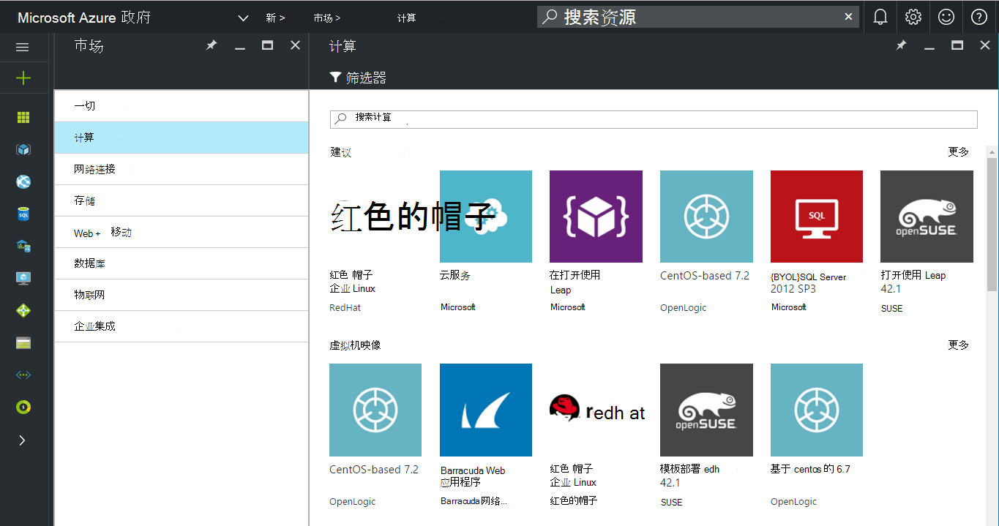
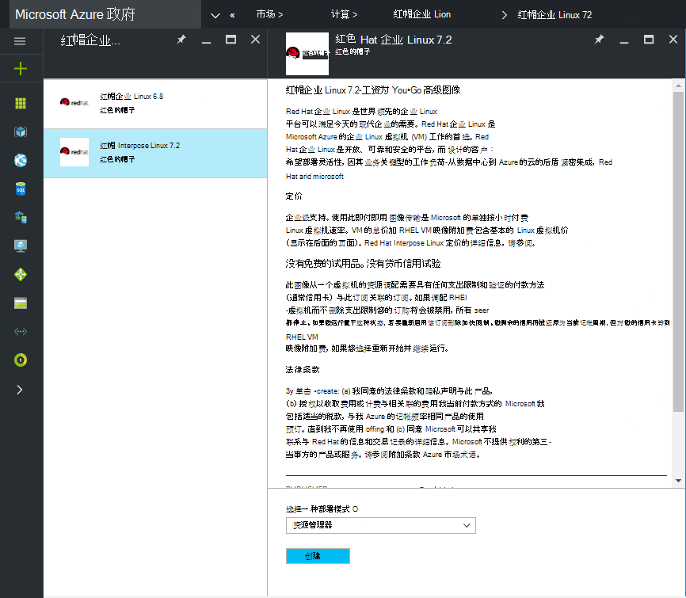
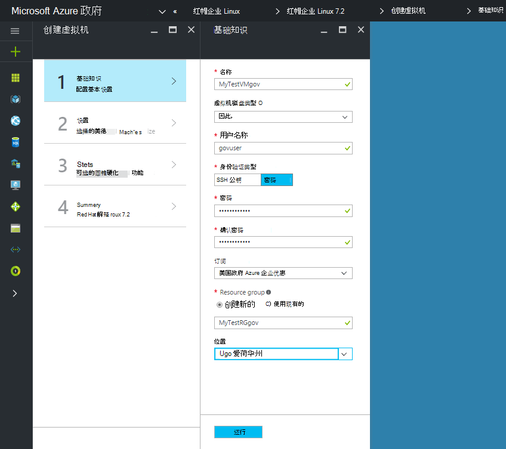
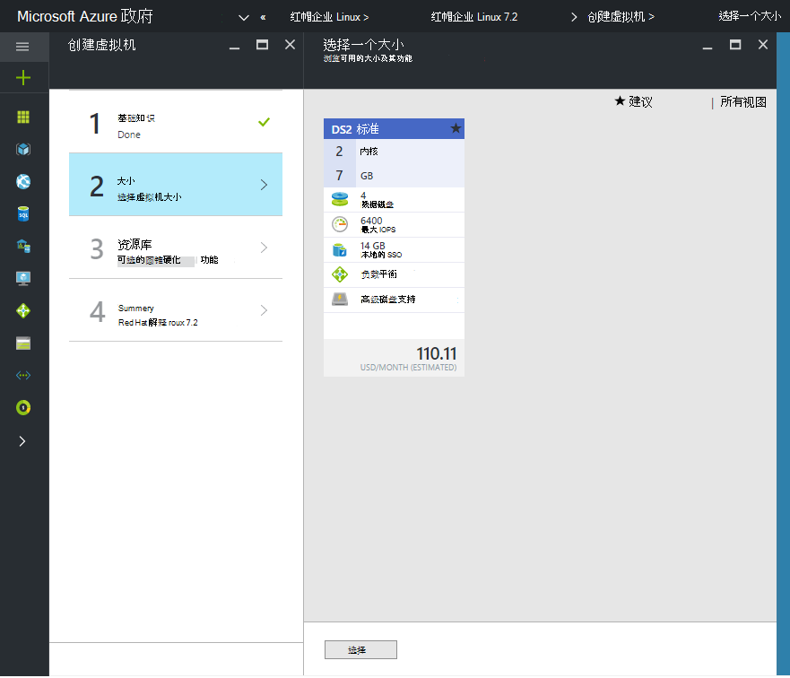

 <properties
    pageTitle="Azure 政府文档 |Microsoft Azure"
    description="这为 Azure 政府开发应用程序提供功能和指导的比较。"
    services="Azure-Government"
    cloud="gov"
    documentationCenter=""
    authors="VybavaRamadoss"
    manager="asimm"
    editor=""/>

<tags   ms.service="multiple"
    ms.devlang="na"
    ms.topic="article"
    ms.tgt_pltfrm="na"
    ms.workload="azure-government"
    ms.date="10/20/2016"
    ms.author="zakramer;vybavar"/>

# 对于政府的 azure 市场
Azure 市场是可用的 Azure 政府与图像从我们的市场上出版的最新列表。 

## 变体
在政府使用 Azure 市场时，下面是一些注意事项︰

- 仅将您自己的许可证 (BYOL) 图像不可用。 您不能访问任何需要通过 Azure 市场采购交易记录的图像
- 只有一个子集的图像是目前公共市场相比。 您可以找到可用的图像列表[在此处](../azure-government-image-gallery.md) 
- 设置图像之前, 企业管理员必须启用 Azure 订购的市场采购
  - 登录到门户作为企业管理员
  - 导航到*管理*
  - 在*注册详细信息*下单击*Azure 市场*行项旁边的铅笔图标
  - 根据需要切换*启用/禁用*
  - 单击*保存*

>[AZURE.NOTE] 如果您有兴趣使图像可用在 Azure 政府请参阅[合作伙伴服务指南](documentation-government-manage-marketplace-partners.md)的详细信息。

### 第 1 步
启动市场

  

### 第 2 步
浏览以找到正确的不同产品。

市场发布服务器提供一份认证作为一部分的产品说明，以帮助您做出正确的选择。 

### 第 3 步
选择 product\image

### 第 4 步
启动创建流并输入所需的参数以进行部署

>[AZURE.NOTE] 在位置下拉列表，只有 Azure 政府位置是可见

### 第 5 步
查看定价

### 第 6 步
完成所有步骤，并单击确定以启动资源调配过程

## 下一步行动

有关的补充信息和更新，订阅[Microsoft Azure 的政府博客](https://blogs.msdn.microsoft.com/azuregov/)。
