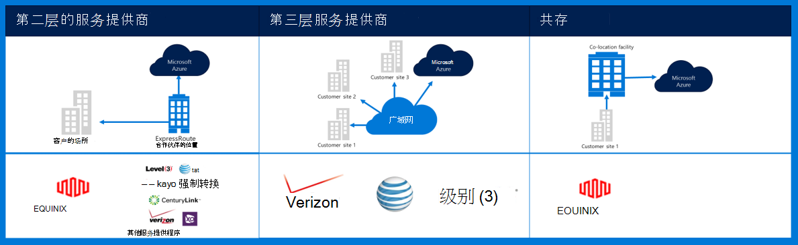
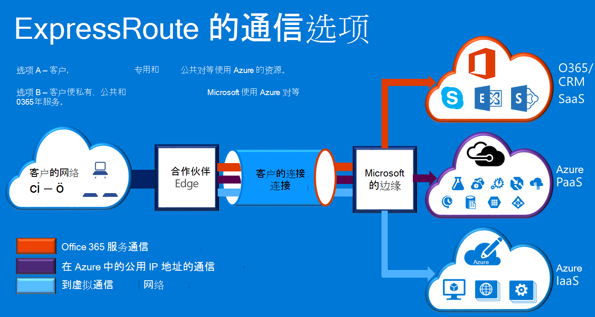

<properties
    pageTitle="Azure 的 Governmenmt 文档 |Microsoft Azure"
    description="这提供了比较的功能和电子政府的专用连接指南"
    services="Azure-Government"
    cloud="gov" 
    documentationCenter=""
    authors="ryansoc"
    manager="zakramer"
    editor=""/>

<tags
    ms.service="multiple"
    ms.devlang="na"
    ms.topic="article"
    ms.tgt_pltfrm="na"
    ms.workload="azure-government"
    ms.date="09/28/2016"
    ms.author="ryansoc"/>

#  Azure 的政府网络

##  ExpressRoute （专用连接）

ExpressRoute 是在 Azure 政府正式提供。 （包括合作伙伴和对等的位置） 的详细信息，请参阅<a href="https://azure.microsoft.com/en-us/documentation/services/expressroute/">ExpressRoute 公共文档</a>。

###  变体

ExpressRoute 是在 Azure 政府正式上市 (GA)。 

- 政府客户通过专用的 Azure 政府 (Gov) ExpressRoute (ER) 连接连接到一个物理上独立的容量

- Azure Gov 提供了增强的可用性和耐久性，通过利用多个地区对位于至少相隔 500 英里 

- 默认情况下所有 Azure Gov ER 连接情况配置的主动-主动冗余的暴冲的支持，并且提供最多 10 个 G 电路容量 （最小为 50 MB）

- Azure Gov ER 位置为客户和 Azure Gov 冗余地理区域提供优化的路径 （最短跃、 低延迟、 高性能等）

- 未使用 Azure Gov ER 专用连接、 遍历或依赖于互联网

- Azure Gov 物理和逻辑基础结构被物理专用中分离出来，并限制对美国人的访问

- Microsoft 拥有和操作 Azure Gov 区域和 Azure Gov ER 满足之间的所有光纤基础结构-我的位置

- Azure Gov 紧急提供到 Microsoft Azure，O365 和 CRM 云服务的连接

### 注意事项

有提供到 Azure 政府专用网络连接的两个基本服务︰ VPN （站点到站点的典型组织） 和 ExpressRoute。

Azure ExpressRoute 用于创建政府 Azure 数据中心和内部部署基础结构，间或也存在环境中的专用连接。 ExpressRoute 连接不会通过公共互联网 — — 它们提供更多的可靠性、 更快的速度和低延迟时间比典型的互联网连接。 在某些情况下，使用 ExpressRoute 连接来传输数据之间在部署系统和 Azure 产生重大成本效益。   

与 ExpressRoute，建立连接到 Azure 在 ExpressRoute 位置 （如 Exchange 提供设施中） 或直接连接到 Azure 从现有 WAN 网络 （例如，多协议标签交换 (MPLS) VPN，网络服务提供商提供）。

    

为网络服务以支持 Azure 政府客户应用程序和解决方案，强烈建议，实现 ExpressRoute （专用连接） 来连接到 Azure 政府。 如果使用 VPN 连接，则要考虑以下事项︰

- 客户应该联系其授权官员/机构来确定是否需要专用的连接或其他安全连接机制，并确定要考虑任何其他限制。

- 客户应决定是否要求站点到站点 VPN 经过专用连接区域。

- 客户应许可的专用连接访问提供商获取 MPLS 电路或 VPN。

利用专用连接性体系结构的所有客户应都验证适当的实现，是建立并维护客户连接到网关网络/互联网 (GN / I) 的 Azure 政府边缘路由器的分界点。 同样，您的组织必须为 Azure 政府建立您的内部环境和网关的网络/客户 (GN/C) 边缘路由器的分界点之间的网络连接。

## 下一步行动

为补充信息和更新请订阅<a href="https://blogs.msdn.microsoft.com/azuregov/">Microsoft Azure 的政府博客。</a>
